# 尝试 & 遇到的困难 #

## 静态跟踪源代码 ##


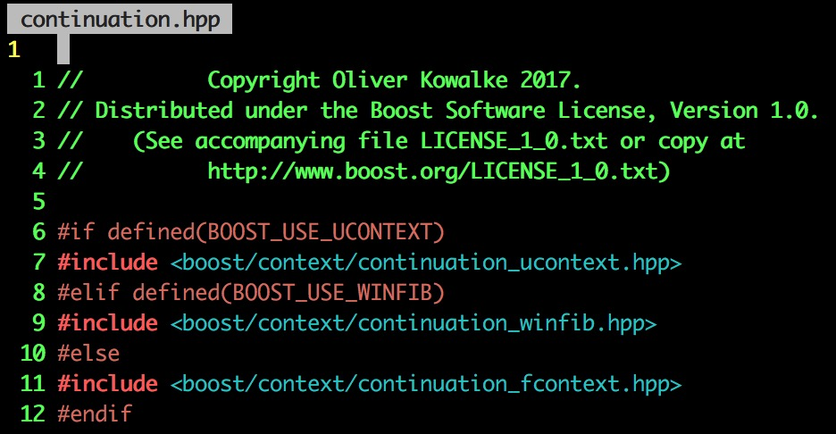

如果打开continuation_fcontext.hpp，会看到一个很关键的函数：

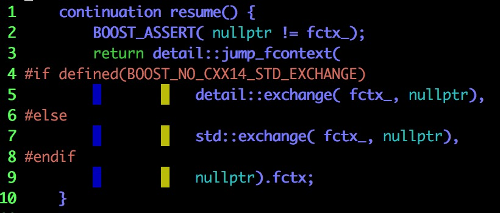

很激动对不对，以为自己找到了入口？！

天真啦，猜猜看你找不找得到`jump_fcontext`函数？

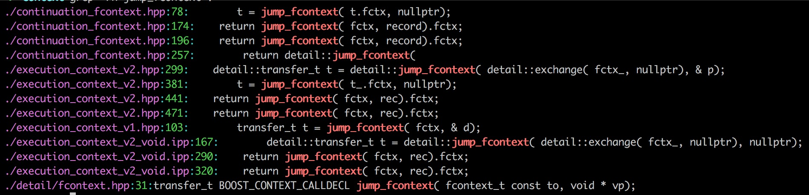

唯一一个看上去像是实现的文件是fcontext.hpp（猜猜看能发现什么？！）

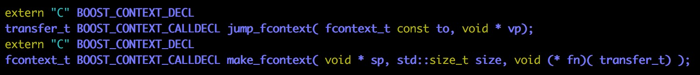

没戏！

## 看汇编代码？ ##

### gcc ###

```shell
gcc -S boost_test.cpp -o boost_test.s
```

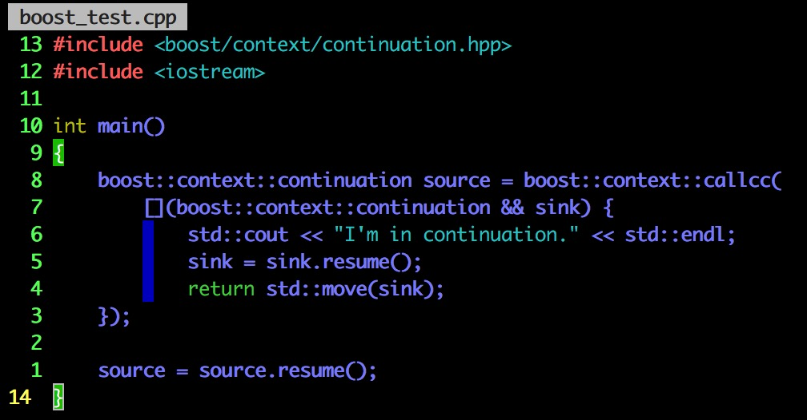

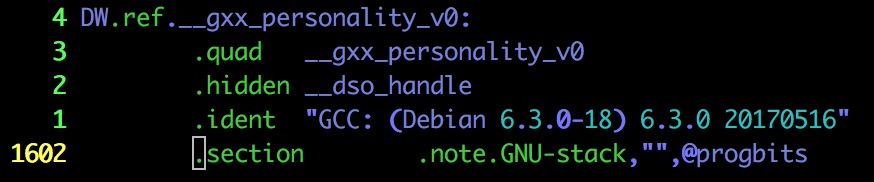

1602！（我怎么看！😢哭泣😢到晕厥😷）

尝试搜索jump_fcontext，就看到这个东西：

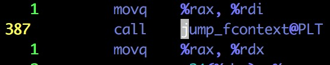


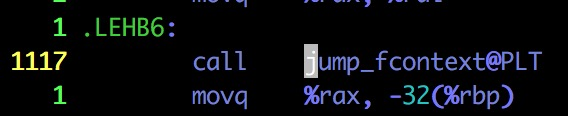

并看不到实现

### objdump ###

objdump -D a.out > boost_test.s

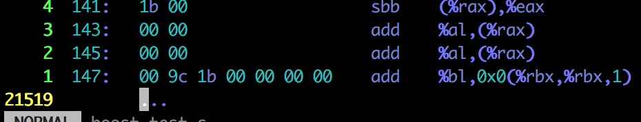

仿佛在逗我笑（呵呵呵）

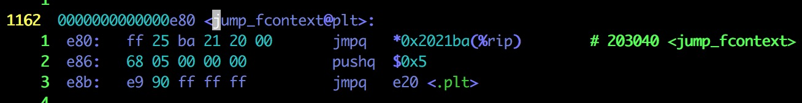

### @plt ###

It's a way to get code fixups (adjusting addresses based on where the code sits in virtual memory) without having to maintain a separate copy of the code for each process. The PLT is the procedure linkage table, one of the structures which makes dynamic loading and linking easier to use.

> 不同进程共享代码
>
> 一份物理内存的代码被映射到不同的虚拟内存中

`printf@plt` is actually a small stub which (eventually) calls the real `printf` function.

This real function may be mapped into *any* location in a given process (virtual address space) as can the code that calls it.

So, in order to allow proper code sharing of calling code (left side below), you don't want to apply any fixups to it directly since that will restrict where it can be located in *other* processes.

The `PLT` is a smaller *process-specific* area at a reliably-calculated-at-runtime address that *isn't*shared between processes so any given process can change it however it wants to.

In other words, examine the following diagram which shows both your code and the library code mapped to different virtual addresses in two processes:

```shell
         Mapped to: 0x1234     0x9000     0x8888
        +-----------------+ +----------+ +----------+
        |                 | | Private  | |          |
ProcA   |                 | |  PLT/GOT | |          |
        |                 | |   area   | |          |
        | Shared          | +----------+ | Shared   |
========|  application    |==============|  library |==
        |   code          | +----------+ |   code   |
        |                 | | Private  | |          |
ProcB   |                 | |  PLT/GOT | |          |
        |                 | |   area   | |          |
        +-----------------+ +----------+ +----------+
         Mapped to: 0x2020     0x9000     0x6666
```

This particular example shows a simple case where the PLT maps to a fixed location. In your scenario, it's located relative to the current program counter as evidenced by your program-counter-relative lookup:

```assembly
<printf@plt+0>: jmpq  *0x2004c2(%rip)  ; 0x600860 <_GOT_+24>
```

Basically, the original way in which shared code was made meant it they had to be loaded at the same memory location in the virtual address space of every process that used it. Either that or it couldn't be shared, since the act of fixing up the *single* shared copy for one process would totally stuff up another process where it was mapped to a different location.

By using position independent code, along with the PLT and a global offset table (GOT), the *first*call to a function `printf@plt` (in the PLT) is a multi-stage operation, in which:

+ you call `printf@plt` in the PLT.
+ it calls the GOT version (via pointer) which *initially* points back to some set-up code in the PLT.
+ this set-up code loads the relevant shared library if not yet done, then *modifies* the GOT so that subsequent calls directly to the real `printf` rather than the set-up code.

On subsequent calls, because the GOT has been modified, the multi-stage approach is simplified:

+ you call `printf@plt` in the PLT.
+ it calls the GOT version (via pointer) which points to the *real* `printf`.

[What does @plt mean here?](https://stackoverflow.com/questions/5469274/what-does-plt-mean-here)

### 能不能静态链接？ ###

```shell
g++ -std=c++11 -g -Wall boost_test.cpp -lboost_coroutine -lboost_context -lboost_system -lboost_thread -lpthread -static -static-libgcc -static-libstdc++
objdump -D a.out > boost_test.s
```

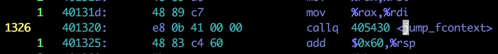

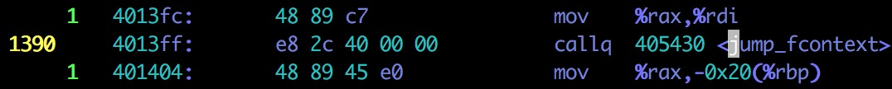


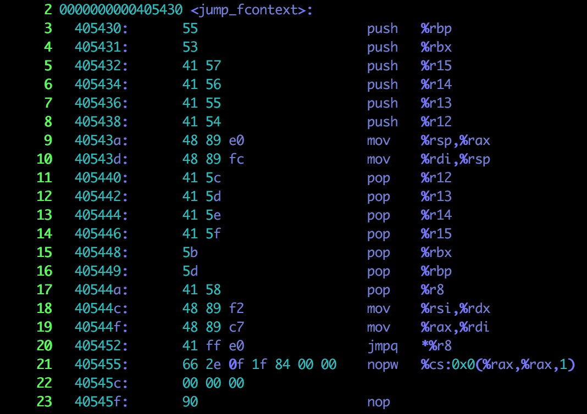

搜索`jump_fcontext`出来的就是这四张图的代码

代码看上去也不是很多，可以尝试解读一波

首先，我们需要知道出现的每个寄存器的用途，还有是调用者保存寄存器还是被调用者保存寄存器：

+ rbp／rbx／r12／r13／r14／r15：通用寄存器，调用者保存寄存器
+ rsp：栈顶指针寄存器
+ rax：函数返回值寄存器
+ rdi／rsi／rdx／rcx／r8／r9：函数参数，依次对应第一个参数／第二个参数……
+ cs：代码段寄存器

还需要弄清楚mov指令的方向：从左边到右边

jmpq指令在干什么：寻址更加复杂的jmp指令（到一个表里找直接跳转的地址，类似于switch的语句会被翻译成这个指令）

nop-X指令在干什么：什么不干，负责对齐（当然执行的时候负责把程序计数器加1／2／……）


现在我们可以分析`jump_fcontext`的代码了（当然看了很久没完全看懂）

+ 保存调用者保存寄存器
+ 切换栈
+ 恢复调用者保存寄存器
+ 控制流转移

### _ZN5boost7context12continuation6resumeEv ###

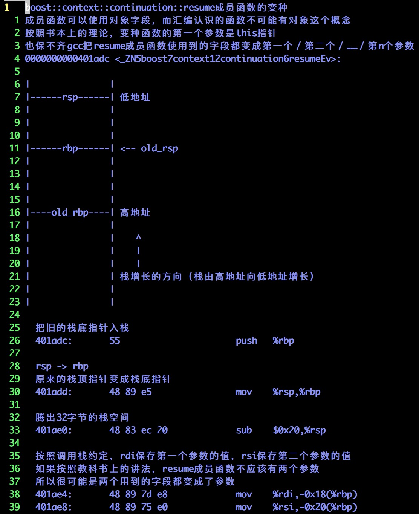

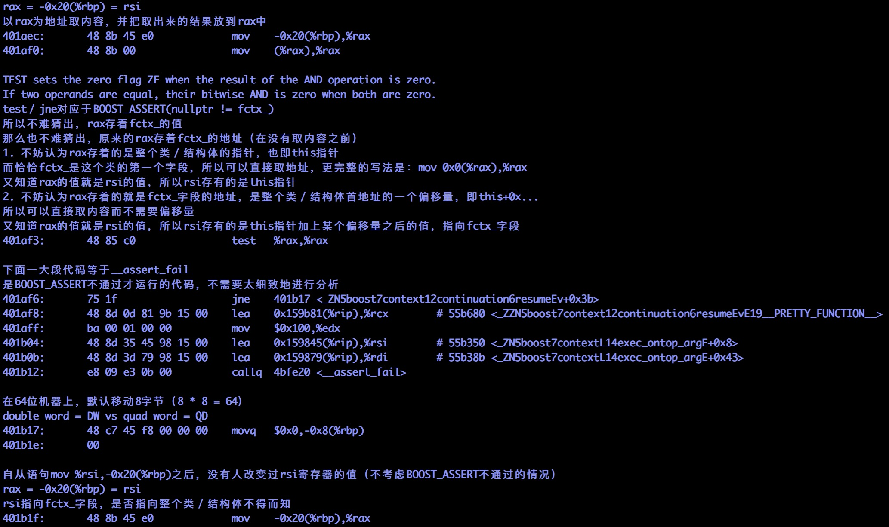

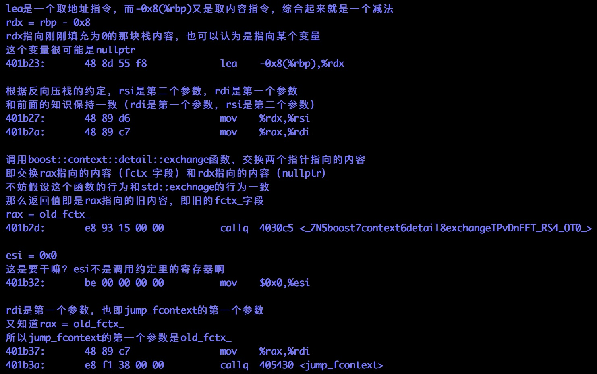

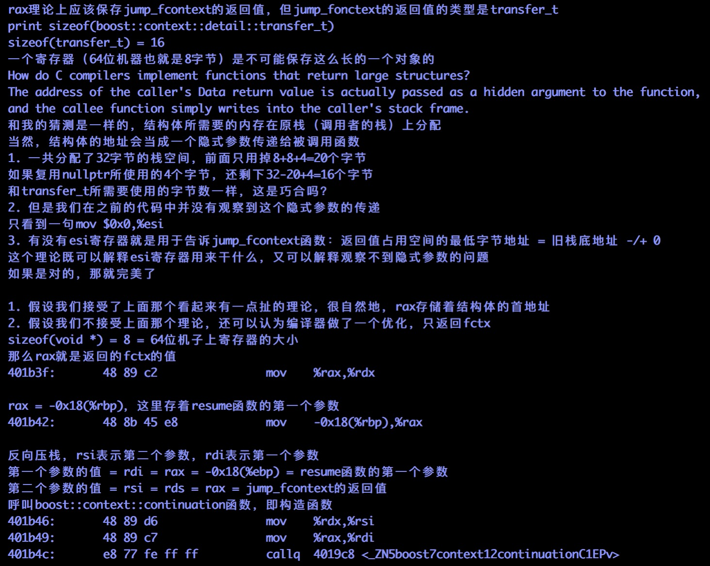

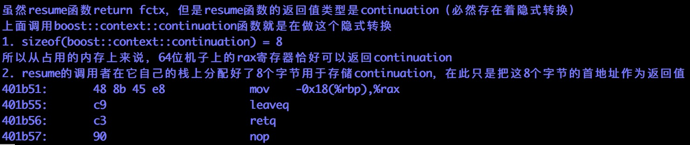

```assembly
boost::context::continuation::resume成员函数的变种
成员函数可以使用对象字段，而汇编认识的函数不可能有对象这个概念
按照书本上的理论，变种函数的第一个参数是this指针
也保不齐gcc把resume成员函数使用到的字段都变成第一个／第二个／……／第n个参数
0000000000401adc <_ZN5boost7context12continuation6resumeEv>:

|		|
|------rsp------| 低地址
|		|
|		|
|		|
|------rbp------| <-- old_rsp
|		|
|		|
|		|
|		|
|----old_rbp----| 高地址
|		|
|		|    ^
|		|    |
|		|    |
|		| 栈增长的方向（栈由高地址向低地址增长）
|		|
|		|

  把旧的栈底指针入栈
  401adc:	55                   	push   %rbp

  rsp -> rbp
  原来的栈顶指针变成栈底指针
  401add:	48 89 e5             	mov    %rsp,%rbp

  腾出32字节的栈空间
  401ae0:	48 83 ec 20          	sub    $0x20,%rsp

  按照调用栈约定，rdi保存第一个参数的值，rsi保存第二个参数的值
  如果按照教科书上的讲法，resume成员函数不应该有两个参数
  所以很可能是两个用到的字段都变成了参数
  401ae4:	48 89 7d e8          	mov    %rdi,-0x18(%rbp)
  401ae8:	48 89 75 e0          	mov    %rsi,-0x20(%rbp)

  rax = -0x20(%rbp) = rsi
  以rax为地址取内容，并把取出来的结果放到rax中
  401aec:	48 8b 45 e0          	mov    -0x20(%rbp),%rax
  401af0:	48 8b 00             	mov    (%rax),%rax

  TEST sets the zero flag ZF when the result of the AND operation is zero.
  If two operands are equal, their bitwise AND is zero when both are zero.
  test／jne对应于BOOST_ASSERT(nullptr != fctx_)
  所以不难猜出，rax存着fctx_的值
  那么也不难猜出，原来的rax存着fctx_的地址（在没有取内容之前）
  1. 不妨认为rax存着的是整个类／结构体的指针，也即this指针
  而恰恰fctx_是这个类的第一个字段，所以可以直接取地址，更完整的写法是：mov 0x0(%rax),%rax
  又知道rax的值就是rsi的值，所以rsi存有的是this指针
  2. 不妨认为rax存着的就是fctx_字段的地址，是整个类／结构体首地址的一个偏移量，即this+0x...
  所以可以直接取内容而不需要偏移量
  又知道rax的值就是rsi的值，所以rsi存有的是this指针加上某个偏移量之后的值，指向fctx_字段
  401af3:	48 85 c0             	test   %rax,%rax

  下面一大段代码等于__assert_fail
  是BOOST_ASSERT不通过才运行的代码，不需要太细致地进行分析
  401af6:	75 1f                	jne    401b17 <_ZN5boost7context12continuation6resumeEv+0x3b>
  401af8:	48 8d 0d 81 9b 15 00 	lea    0x159b81(%rip),%rcx        # 55b680 <_ZZN5boost7context12continuation6resumeEvE19__PRETTY_FUNCTION__>
  401aff:	ba 00 01 00 00       	mov    $0x100,%edx
  401b04:	48 8d 35 45 98 15 00 	lea    0x159845(%rip),%rsi        # 55b350 <_ZN5boost7contextL14exec_ontop_argE+0x8>
  401b0b:	48 8d 3d 79 98 15 00 	lea    0x159879(%rip),%rdi        # 55b38b <_ZN5boost7contextL14exec_ontop_argE+0x43>
  401b12:	e8 09 e3 0b 00       	callq  4bfe20 <__assert_fail>

  在64位机器上，默认移动8字节（8 * 8 = 64）
  double word = DW vs quad word = QD
  401b17:	48 c7 45 f8 00 00 00 	movq   $0x0,-0x8(%rbp)
  401b1e:	00 

  自从语句mov %rsi,-0x20(%rbp)之后，没有人改变过rsi寄存器的值（不考虑BOOST_ASSERT不通过的情况）
  rax = -0x20(%rbp) = rsi
  rsi指向fctx_字段，是否指向整个类／结构体不得而知
  401b1f:	48 8b 45 e0          	mov    -0x20(%rbp),%rax

  lea是一个取地址指令，而-0x8(%rbp)又是取内容指令，综合起来就是一个减法
  rdx = rbp - 0x8
  rdx指向刚刚填充为0的那块栈内容，也可以认为是指向某个变量
  这个变量很可能是nullptr
  401b23:	48 8d 55 f8          	lea    -0x8(%rbp),%rdx

  根据反向压栈的约定，rsi是第二个参数，rdi是第一个参数
  和前面的知识保持一致（rdi是第一个参数，rsi是第二个参数）
  401b27:	48 89 d6             	mov    %rdx,%rsi
  401b2a:	48 89 c7             	mov    %rax,%rdi

  调用boost::context::detail::exchange函数，交换两个指针指向的内容
  即交换rax指向的内容（fctx_字段）和rdx指向的内容（nullptr）
  不妨假设这个函数的行为和std::exchnage的行为一致
  那么返回值即是rax指向的旧内容，即旧的fctx_字段
  rax = old_fctx_
  401b2d:	e8 93 15 00 00       	callq  4030c5 <_ZN5boost7context6detail8exchangeIPvDnEET_RS4_OT0_>

  esi = 0x0
  这是要干嘛？esi不是调用约定里的寄存器啊
  401b32:	be 00 00 00 00       	mov    $0x0,%esi

  rdi是第一个参数，也即jump_fcontext的第一个参数
  又知道rax = old_fctx_
  所以jump_fcontext的第一个参数是old_fctx_
  401b37:	48 89 c7             	mov    %rax,%rdi
  401b3a:	e8 f1 38 00 00       	callq  405430 <jump_fcontext>

  rax理论上应该保存jump_fcontext的返回值，但jump_fonctext的返回值的类型是transfer_t
  print sizeof(boost::context::detail::transfer_t)
  sizeof(transfer_t) = 16
  一个寄存器（64位机器也就是8字节）是不可能保存这么长的一个对象的
  How do C compilers implement functions that return large structures?
  The address of the caller's Data return value is actually passed as a hidden argument to the function,
  and the callee function simply writes into the caller's stack frame.
  和我的猜测是一样的，结构体所需要的内存在原栈（调用者的栈）上分配
  当然，结构体的地址会当成一个隐式参数传递给被调用函数
  1. 一共分配了32字节的栈空间，前面只用掉8+8+4=20个字节
  如果复用nullptr所使用的4个字节，还剩下32-20+4=16个字节
  和transfer_t所需要使用的字节数一样，这是巧合吗？
  2. 但是我们在之前的代码中并没有观察到这个隐式参数的传递
  只看到一句mov $0x0,%esi
  3. 有没有esi寄存器就是用于告诉jump_fcontext函数：返回值占用空间的最低字节地址 = 旧栈底地址 -/+ 0
  这个理论既可以解释esi寄存器用来干什么，又可以解释观察不到隐式参数的问题
  如果是对的，那就完美了

  1. 假设我们接受了上面那个看起来有一点扯的理论，很自然地，rax存储着结构体的首地址
  2. 假设我们不接受上面那个理论，还可以认为编译器做了一个优化，只返回fctx
  sizeof(void *) = 8 = 64位机子上寄存器的大小
  那么rax就是返回的fctx的值
  401b3f:	48 89 c2             	mov    %rax,%rdx

  rax = -0x18(%rbp)，这里存着resume函数的第一个参数
  401b42:	48 8b 45 e8          	mov    -0x18(%rbp),%rax

  反向压栈，rsi表示第二个参数，rdi表示第一个参数
  第一个参数的值 = rdi = rax = -0x18(%ebp) = resume函数的第一个参数
  第二个参数的值 = rsi = rds = rax = jump_fcontext的返回值
  呼叫boost::context::continuation函数，即构造函数
  401b46:	48 89 d6             	mov    %rdx,%rsi
  401b49:	48 89 c7             	mov    %rax,%rdi
  401b4c:	e8 77 fe ff ff       	callq  4019c8 <_ZN5boost7context12continuationC1EPv>

  虽然resume函数return fctx，但是resume函数的返回值类型是continuation（必然存在着隐式转换）
  上面调用boost::context::continuation函数就是在做这个隐式转换
  1. sizeof(boost::context::continuation) = 8
  所以从占用的内存上来说，64位机子上的rax寄存器恰好可以返回continuation
  2. resume的调用者在它自己的栈上分配好了8个字节用于存储continuation，在此只是把这8个字节的首地址作为返回值
  401b51:	48 8b 45 e8          	mov    -0x18(%rbp),%rax
  401b55:	c9                   	leaveq 
  401b56:	c3                   	retq   
  401b57:	90                   	nop
```

这里面还有很多的猜测，待会用gdb看一看

## 动态跟踪？ ##

