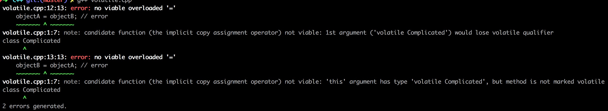

 # volatile 关键字能够阻止编译器对变量的优化 #

## 变量在后续代码中未被引用 ##

```c++
void exchange1()
{
    volatile int a;
    a = 1;
}

void exchange2()
{
    int a;
    a = 1;
}
```

```shell
g++ -S -O2 volatile.cpp -o volatile.s
```

```assembly
.LFB0:
	.cfi_startproc
	movl	$1, -4(%rsp)
	ret
	.cfi_endproc

.LFB1:
	.cfi_startproc
	rep ret
	.cfi_endproc
```

## 变量在后续代码中被引用 ##

### 变量长度小于等于寄存器长度 ###

```cpp
int exchange1(int x)
{
    volatile int a;
    a = 1;
    a = a + x;
    return a;
}

int exchange2(int x)
{
    int a;
    a = 1;
    a = a + x;
    return a;
}
```

```assembly
_Z9exchange1i:
.LFB0:
	.cfi_startproc
	# step 1. a = 1
	# 直接把值写入内存而不是写入寄存器
	movl	$1, -4(%rsp)
	# step 2. a = a + x
	# %edi 是函数参数的值
	# 加法运算完成后将值“立马”写入内存而不做缓存
	# “立马”写入内存并不能解决并发问题
	movl	-4(%rsp), %eax
	addl	%eax, %edi
	movl	%edi, -4(%rsp)
	# step 3. return a
	movl	-4(%rsp), %eax
	ret
	.cfi_endproc
```

```assembly
.LFB1:
	.cfi_startproc
	# leal just computes the address of the operand,
	# it does not actually dereference it.
	# %eax = %edi + 1
	# 变量 a 已被优化掉
	leal	1(%rdi), %eax
	ret
	.cfi_endproc
```

### 变量长度大于寄存器长度 ###

```bash
dpkg --print-architecture
# amd64
apt-get install g++-multilib libc6-dev-i386
g++ -S -O2 -m32 volatile.cpp -o volatile.s
```

```c++
uint64_t exchange1()
{
    volatile uint64_t a = 0;
    return a;
}

uint64_t exchange2()
{
    uint64_t a = 0;
    return a;
}
```

```assembly
.LFB0:
	.cfi_startproc
	subl	$20, %esp
	.cfi_def_cfa_offset 24
	# step1. 对其中32位写内存
	movl	$0, 8(%esp)
	# step2. 写另外32位写内存
	movl	$0, 12(%esp)
	movl	8(%esp), %eax
	movl	12(%esp), %edx
	addl	$20, %esp
	.cfi_def_cfa_offset 4
	ret
	.cfi_endproc
```

对于变量长度大于寄存器长度的情况，volatile 关键字不能保证两点：

1. 无数据竞争
2. 无中间状态

### 非基本类型变量 ###

```shell
struct Complicated
{
    uint64_t a;
    uint64_t b;
    uint64_t c;
};

void exchange()
{
    volatile Complicated complicated;
    complicated.a = 0;
    complicated.c = 0;
}
```

```assembly
.LFB0:
	.cfi_startproc
	# complicated.a = 0;
	movq	$0, -40(%rsp)
	# complicated.c = 0;
	# 40 - 24 = 16 = 8 * 2
	movq	$0, -24(%rsp)
	ret
	.cfi_endproc
```

对于非基本类型变量，volatile 关键字的作用可以认为是对其中的每一个变量加上 volatile 修饰符

但是并没有保证整个变量不出现中间状态

# volatile 关键字参与类型检查 #

```c++
class Complicated
{
    public:
        void f() volatile {}
        void g() {}
};

int main()
{
    Complicated objectA;
    objectA.f(); // okay
    objectA.g(); // okay
    volatile Complicated objectB;
    objectB.f(); // okay
    objectB.g(); // error
}
```

```cpp
class Complicated
{
    public:
        void f() volatile {}
        void g() {}
};

int main()
{
    Complicated objectA;
    volatile Complicated objectB;
    objectA = objectB; // error
    objectB = objectA; // error
}
```



volatile 与 const 一样：

1. 检查方法调用
2. 作为类型修饰符参与类型检查
3. Marking a member function `volatile` is like marking it `const`; it means that the receiver object is treated as though it were declared as a `volatile T*`. Consequentially, any reference to `x` or `y`will be treated as a `volatile` read in the member function. Moreover, a `volatile` object can only call `volatile` member functions.

