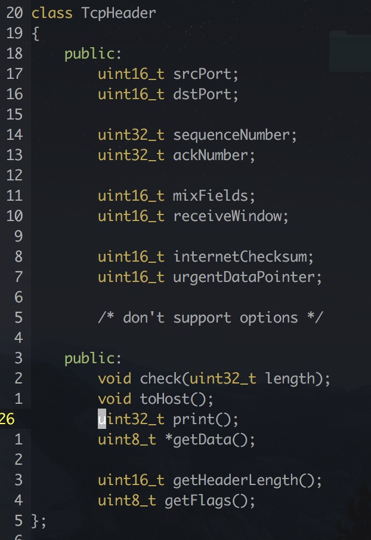
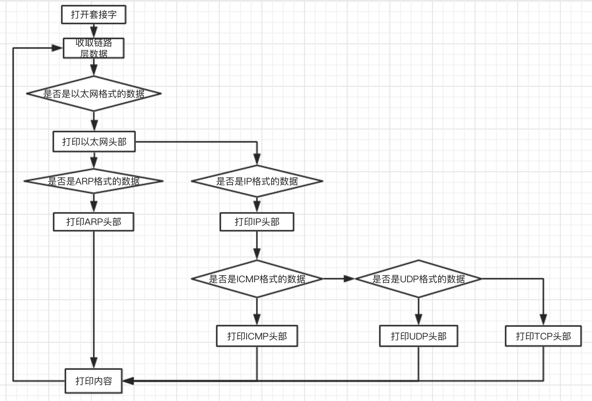

## 实验目的 ##

实现类似于`tshark`或者`wireshark`的抓包程序

## 数据结构说明 ##

### mac ###

### arp ###

### ip ###

### icmp ###

### udp ###

### tcp ###

## 配置文件说明 ##

测试环境依赖于`Docker`以及两个镜像

`run.sh`中包含测试所需的命令

## 程序设计的思路以及运行流程 ##

1. 打开套接字
2. 监听到的数据
3. 打印以太网头部
4. 判断是否是`IP`数据，是则跳转到7
5. 打印`ARP`头部
6. 打印剩余的内容，跳转到2
7. 打印`IP`头部
8. 判断是否是`ICMP`数据，否则跳转10
9. 打印`ICMP`头部
10. 打印剩余的内容，跳转到2
11. 判断是否是`UDP`数据，否则跳转13
12. 打印`UDP`头部
13. 打印剩余的内容，跳转到2
14. 打印`TCP`头部，跳转到2

## 运行结果截图 ##

## 相关参考资料 ##

[linux/arp.c at master · spotify/linux · GitHub](https://github.com/spotify/linux/blob/master/net/ipv4/arp.c)

[ip.h File Reference](https://github.com/spotify/linux/blob/master/net/ipv4/arp.c)

[linux/udp.c at master · torvalds/linux · GitHub](https://github.com/torvalds/linux/blob/master/net/ipv4/udp.c)

[linux/tcp.h at master · torvalds/linux · GitHub](https://github.com/torvalds/linux/blob/master/include/net/tcp.h)

## 对比样例程序 ##

所有的头部类都参考书本以及`Linux`的部分代码，仅仅是字段布局，没有参考任何处理函数

## 代码个人创新以及思考 ##

封装杂乱的`API`，把拿到数据之后的处理统一为三步：

1. `toHost`
2. `check`
3. `print`

本程序直接在同一个线程中收取数据并解析，可能导致性能问题：应该采用一对多的线程模型

实验没有采用虚拟机而是直接使用`Docker`：

1. 虚拟化带来的资源消耗较低
2. 过程可以脚本化，自动化程度较高