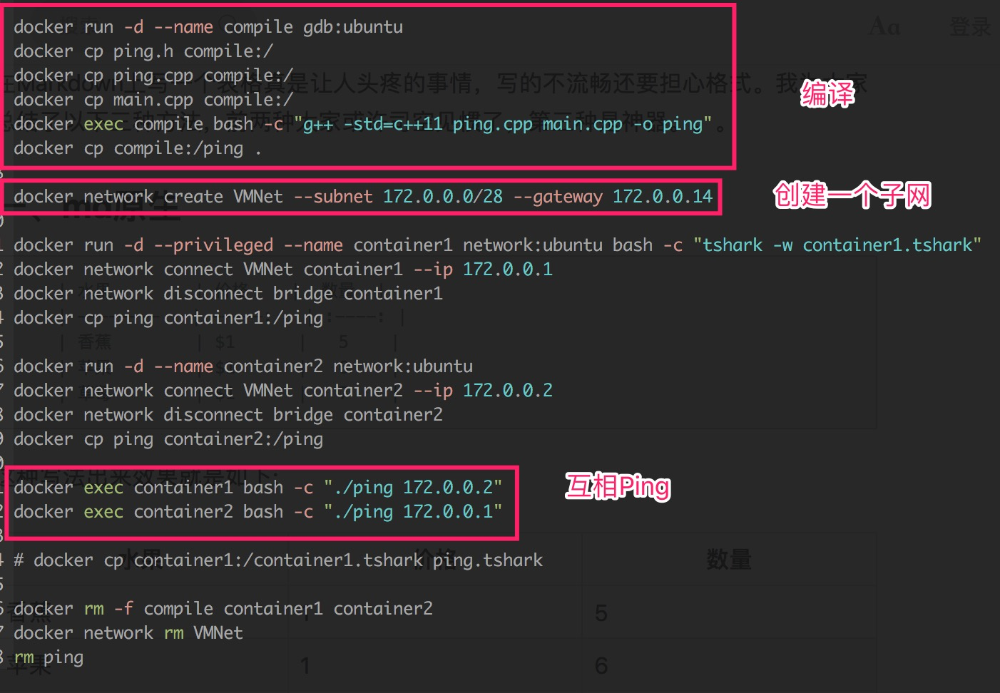
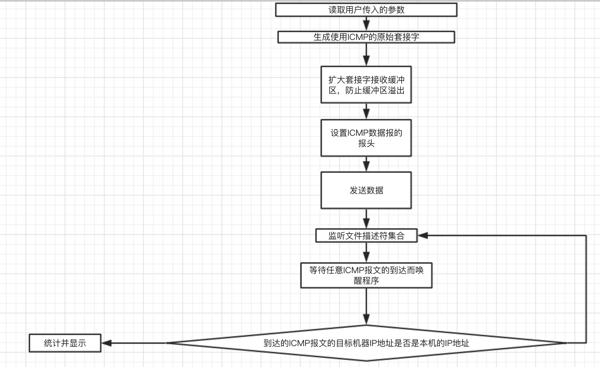
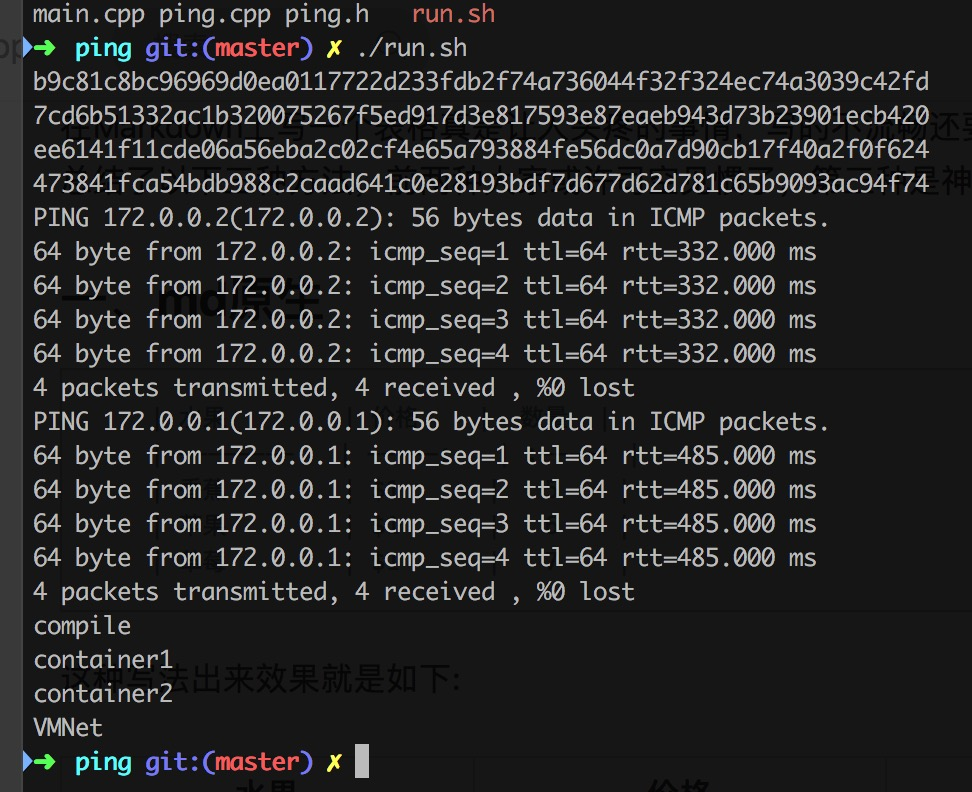

## 数据结构说明 ##

### IpHeader ###

```c++
/* POD */
class IpHeader
{
    public:
        /* BYTE_ORDER == BIG_ENDIAN */
        unsigned headerLength:4;
        unsigned version:4;

        uint8_t typeOfService;
        uint16_t datagramLength;
        uint16_t identifier;
        unsigned flags:3;
        unsigned fragmentationOffset:13;

        uint8_t timeToLive;
        uint8_t upperLayerProtocol;
        uint16_t headerChecksum;

        uint32_t srcIpAddress;
        uint32_t dstIpAddress;

        /* 不支持options */

    public:
        int getHeaderLength();
        bool isIcmp();
        uint8_t *getData();
        bool check();
};
```

这是`IP`数据包的头部数据结构，可以往内填充相关字段或者把收到的`Buffer`转换成该类型

### IcmpHeader ###

```c++
class IcmpHeader
{
    public:
        uint8_t type;
        uint8_t code;
        uint16_t checksum;
        union
        {
            struct
            {
                uint16_t id;
                uint16_t sequence;
            };
            uint32_t gateway;
            struct
            {
                uint16_t unused;
                uint16_t mtu;
            };
        };

    public:
        bool check(int length);
        uint8_t *getData();
};
```

同理，这是`ICMP`数据报的头部数据结构

### Ping ###

```c++
class Ping
{
    private:
        char m_sendpacket[PACKET_SIZE];
        char m_recvpacket[PACKET_SIZE];
        int m_maxPacketSize;
        int m_sockfd;
        int m_datalen;
        int m_nsend;
        int m_nreceived;
        int m_icmp_seq;
        struct sockaddr_in m_dest_addr;
        struct sockaddr_in m_from_addr;
        pid_t m_pid;

    public:
        Ping();
        bool ping(std::string host, PingResult &pingResult);
        bool ping(std::string host, int count, PingResult& pingResult);

    private:
        uint16_t getChecksum(uint16_t *addr, int len);
        int packIcmp(int pack_no, IcmpHeader *icmp);
        bool unpackIcmp(char *buf,int len, struct IcmpEchoReply *icmpEchoReply);
        struct timeval tvSub(struct timeval timeval1,struct timeval timval2);
        bool getsockaddr(const char * hostOrIp, sockaddr_in* sockaddr);
        bool sendPacket();
        bool recvPacket(PingResult &pingResult);
};
```

封装发送和接受数据报的相关操作，主函数主要负责调用该类的接口

## 配置文件说明 ##

测试环境依赖于`Docker`及两个相关的`images`

在两个镜像准备好之后，`./run.sh`则可看到运行结果



两个镜像的准备过程如下：

```bash
docker build -t gdb:ubuntu -f gdb.ubuntu.dockerfile .
docker build -t network:ubuntu -f network.ubuntu.dockerfile .
```

## 程序设计的思路及运行流程 ##

1. 读取用户传入的参数
2. 生成使用`ICMP`的原始套接字
3. 扩大套接字接收缓冲区，防止缓冲区溢出
4. 设置`ICMP`数据报的报头
5. 发送数据
6. 监听文件描述符集合
7. 等待任意`ICMP`报文的到达而唤醒程序
8. 根据`IP`地址过滤`ICMP`报文
9. 统计并显示



## 运行结果截图 ##



## 相关参考资料 ##

[ip.h Source File](http://www.cse.scu.edu/~dclark/am_256_graph_theory/linux_2_6_stack/linux_2ip_8h-source.html)

[linux/icmp.h at master · torvalds/linux · GitHub](https://github.com/torvalds/linux/blob/master/include/uapi/linux/icmp.h)

[The Ping Page](http://www.ping127001.com/pingpage/ping.text)

## 对比样例程序 ##

头部类的布局方式部分参考`Linux`的对应文件，但处理函数没有参考

## 代码创新 ##

封装杂乱的`API`

使用`epoll`

使用`Docker`作为实验软件：

1. 更低的资源消耗
2. 更快的启动速度
3. 更高的自动化（全部脚本化）