# 实验任务 #

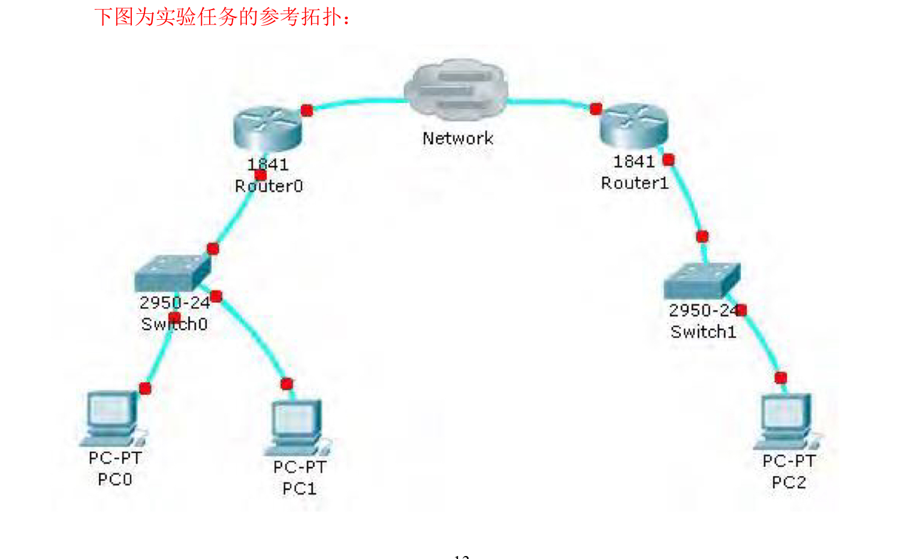

# 实验过程 #

## 查看当前Docker网络的状态 ##

```shell
docker network ls
```

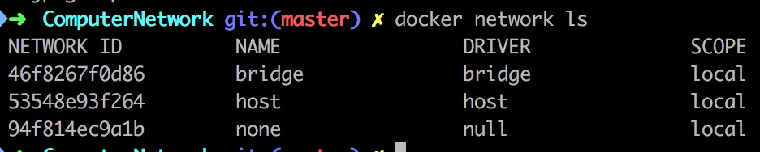

```shell
docker network inspect host
```

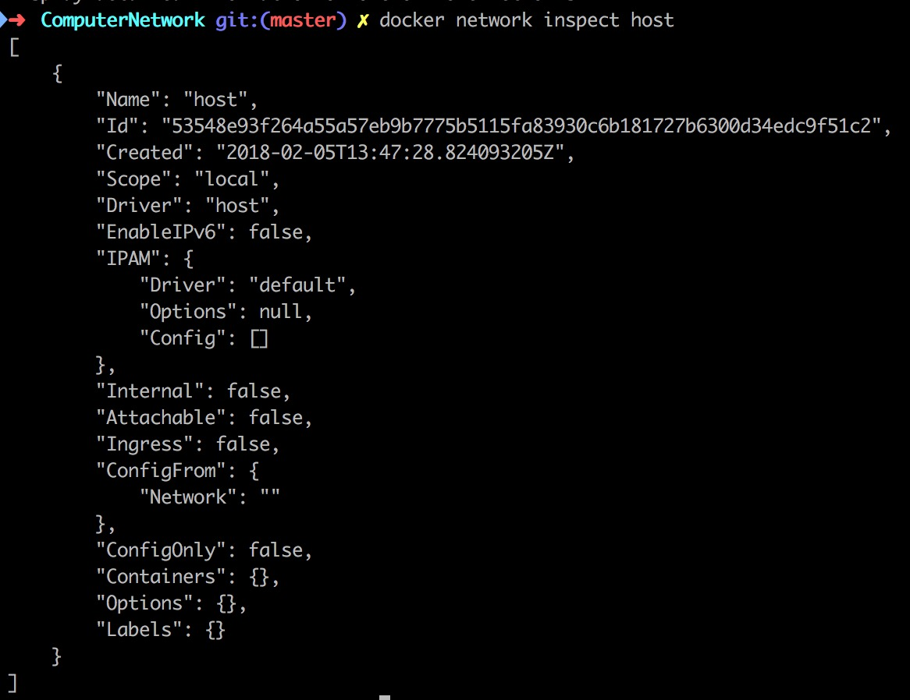

## 创建一个简单的拓扑结构 ##

### 创建一个简单的子网 ###

```shell
docker network create --subnet=172.20.0.0/30 vmnet1
docker network ls
docker network inspect vmnet1
```

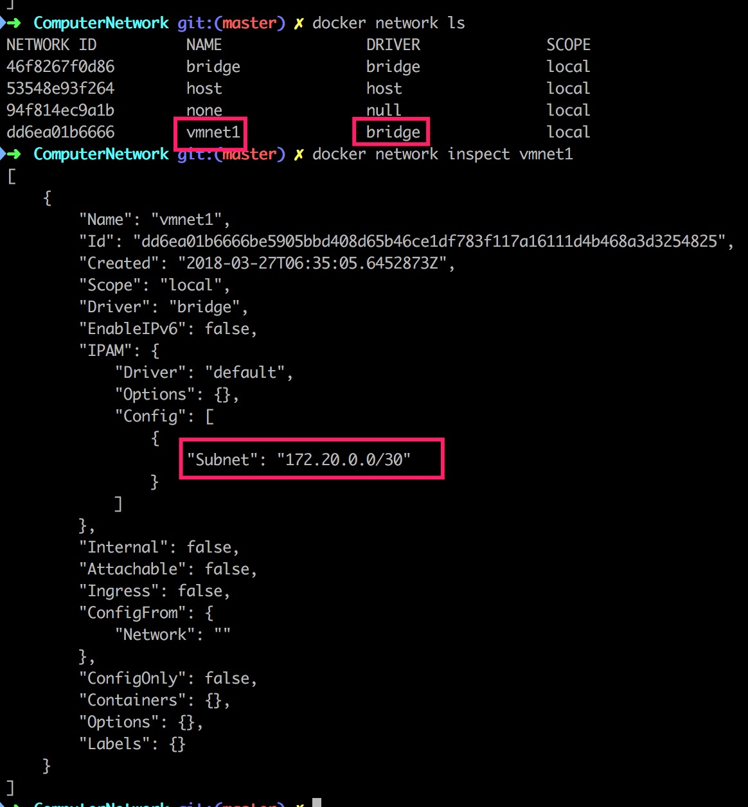

### 添加两个容器到机器中去 ###

#### 创建容器时指定网络 ####

```shell
docker run -t -i --name container10 --net vmnet1 debian:latest /bin/bash
// 在容器内执行该命令
ip address
```

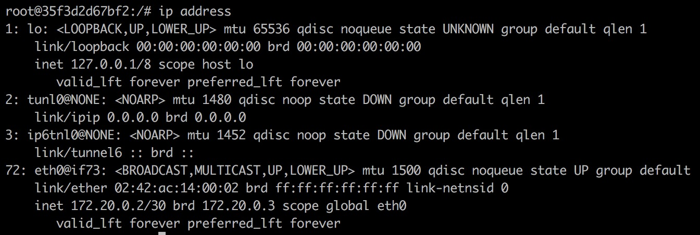

```shell
// 退出容器
exit
// 在主机内执行该命令
docker rm container10
```

#### 创建容器时指定IP地址 ####

```shell
docker run -t -i --name container10 --net vmnet1 --ip 172.20.0.2 debian:latest /bin/bash
ip addr show eth0 | grep "inet\b" | awk '{print $2}' | cut -d/ -f1
```

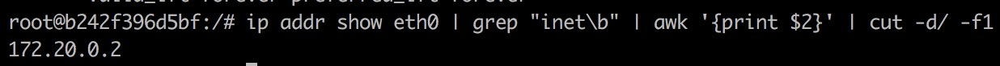

```shell
hostname -i
exit
docker rm container10
```

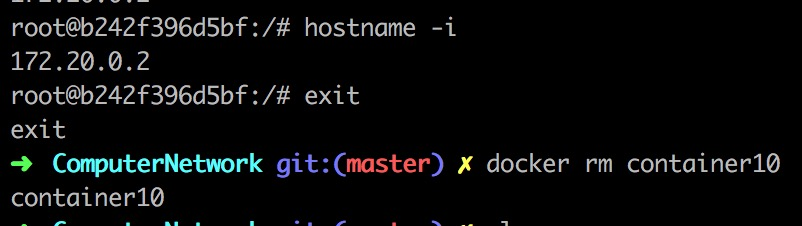

#### 先创建容器再指定子网 ####

```shell
docker run -t -i --name container10 debian:latest /bin/bash
// 退出容器
exit
docker network connect vmnet1 container10
// 移除默认的网络
docker network disconnect bridge container10
// 查看容器状况
docker inspect container10
```

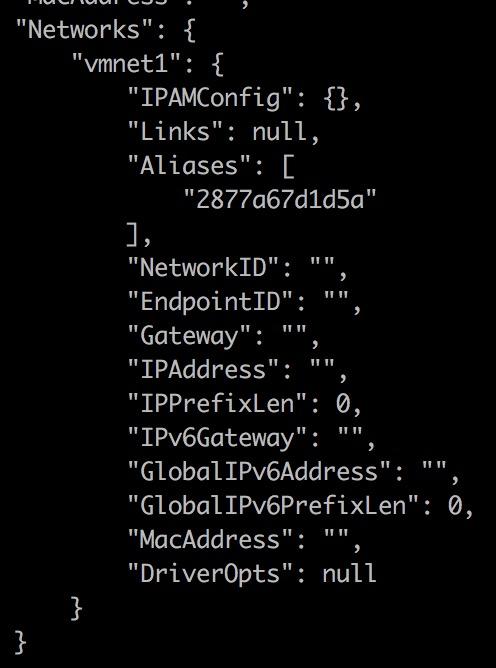

```shell
// 进入容器
docker start -a -i container10
// 查看容器IP地址
hostname -i
// 退出容器
exit
```

#### 创建另一个容器 ####

我们需要把容器`container10`启动起来（让容器`container10`占住一个`IP`地址）

```shell
docker start -a -i container10
// detach
```

然后再尝试创建一个容器

```shell
docker run -t -i --name container11 --net vmnet1 debian:latest /bin/bash
```

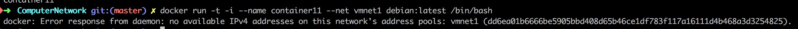

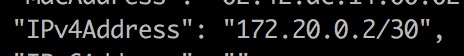

我们明明有四个空闲的`IP`地址，为什么才分配一个就告诉我们用完了？

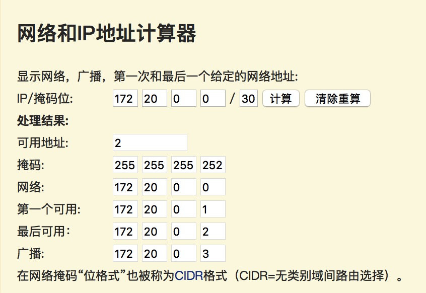

我猜测：`172.20.0.1`被`gateway`所使用，也就是说命令`docker network create --subnet=172.20.0.0/30 vmnet1`相当于`docker network create --subnet=172.20.0.0/30 --gateway=172.20.0.1 vmnet1`

所以`172.20.0.1`不能被我们创建的容器`container11`使用，现在唯一的办法就是重新创建网络和相应的容器

```shell
docker rm -f container10 container11
docker network rm vmnet1

docker network create --subnet=172.20.0.0/28 --gateway=172.20.0.1 vmnet1
docker run -t -i --name container10 --net vmnet1 --ip 172.20.0.2 debian:latest /bin/bash
// detach
docker run -t -i --name container11 --net vmnet1 --ip 172.20.0.3 debian:latest /bin/bash
// detach

docker network inspect vmnet1
```

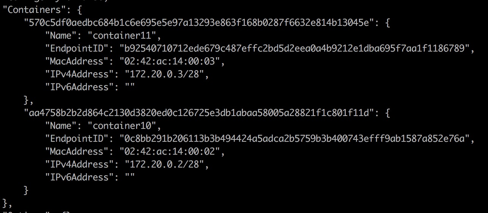

#### 两个容器的第一次通信 ####

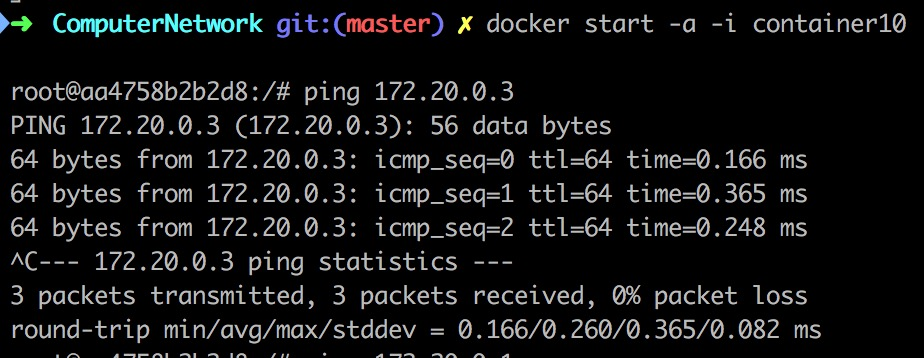

## tshark image ##

直接运行`docker pull opennsm/tshark`以获取对应的镜像，我把[Dockerfile](https://hub.docker.com/r/opennsm/tshark/~/dockerfile/)也贴在这个地方：

```dockerfile
# Tshark 1.99.5
#
# VERSION               1
# NOTES:
# You must have libtool 1.4 or later installed to compile Wireshark
# docker run --cap-add net_raw --cap-add net_admin -it opennsm/tshark:1.99.5 tshark -i eth0
FROM      opennsm/debian
MAINTAINER Jon Schipp <jonschipp@gmail.com>

# Metadata
LABEL organization=opennsm
LABEL program=tshark

# Specify container username e.g. training, demo
ENV VIRTUSER opennsm
# Specify program
ENV PROG wireshark
# Specify source extension
ENV EXT tar.bz2
# Specify Tshark version to download and install
ENV VERS 1.99.5
# Specific Libtool to download and install
ENV LIBTOOL libtool-2.4.2
# Install directory
ENV PREFIX /opt
# Path should include prefix
ENV PATH /usr/local/sbin:/usr/local/bin:/usr/sbin:/usr/bin:/sbin:/bin:$PREFIX/bin

# Install dependencies
RUN apt-get update -qq
RUN apt-get install -yq build-essential autoconf automake libtool bison flex \
  libpcap-dev libglib2.0-dev libgeoip-dev libkrb5-dev libgnutls28-dev \
  libgcrypt-dev libcap-dev libsbc-dev libsmi-dev libc-ares-dev --no-install-recommends
RUN  wget --no-check-certificate https://ftp.gnu.org/gnu/libtool/$LIBTOOL.tar.gz
RUN tar zxf $LIBTOOL.tar.gz && cd $LIBTOOL && ./configure && make && make install

# Compile and install libpcap
USER $VIRTUSER
WORKDIR /home/$VIRTUSER
RUN wget --no-check-certificate https://www.wireshark.org/download/src/all-versions/$PROG-$VERS.$EXT
RUN tar -jxf $PROG-$VERS.$EXT
WORKDIR /home/$VIRTUSER/$PROG-$VERS
RUN ./autogen.sh && ./configure --disable-wireshark --enable-profile-build --prefix=/opt \
 CFLAGS="-I/usr/include/glib-2.0 -I/usr/lib/x86_64-linux-gnu/glib-2.0/include" && \
 make CFLAGS="-fPIC -I/usr/include/glib-2.0 -I/usr/lib/x86_64-linux-gnu/glib-2.0/include"
USER root
RUN make install
RUN chmod u+s $PREFIX/bin/dumpcap

# Cleanup
RUN rm -rf /home/$VIRTUSER/$PROG-$VERS
RUN rm -rf /root/$LIBTOOL*

# Environment
WORKDIR /home/$VIRTUSER
USER opennsm
```

### 创建一个简单的路由器 ###

首先，我们需要创建另外两个简单的子网：

```shell
docker network create --subnet=172.21.0.0/28 --gateway=172.21.0.1 vmnet2
docker network create --subnet=172.22.0.0/28 --gateway=172.22.0.2 networkBetweenRouters
docker network ls
```

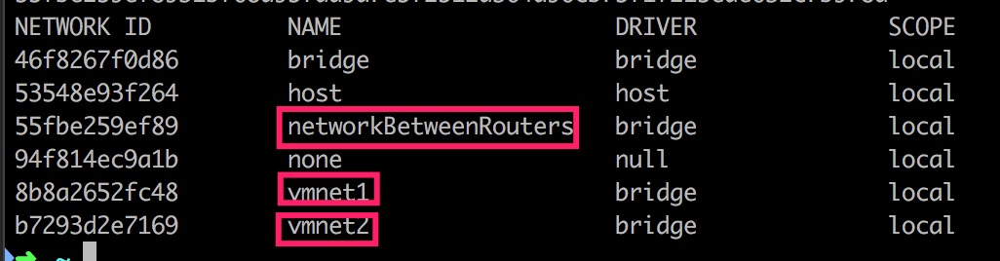

再让我们创建一个容器，并为它添加两块网卡：

```shell
docker run -t -i --name router1 debian:latest /bin/bash
// detach
docker network connect vmnet1 router1
docker network connect networkBetweenRouters router1
```

```shell
docker inspect router1
```

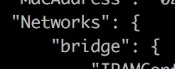

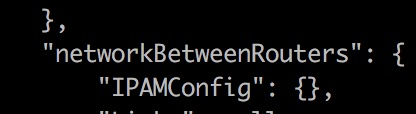

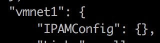

我们不是忘记去掉`bridge`网络，而是需要用这个网络下载一些软件

```shell
docker start -a -i router1
apt-get update
apt-get install -y iptables
hostname -i
// detach
```

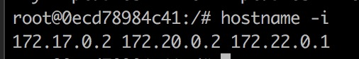

显然`router1`分别接入`vmnet1` / `networkBetweenRouters` / `bridge`这三个网络

现在让我们把`router1`的`bridge`网络给断掉：

```shell
docker network disconnect bridge router1
```

### 测试路由器是否连通 ###

```shell
docker start -a -i container11
ping 172.22.0.2
// detach
```

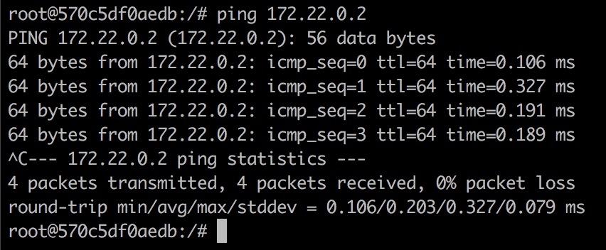

BINGO!!!

### 创建一个奇怪的镜像 ###

为什么需要这个奇怪的镜像呢？因为有一些奇怪的软件不允许以超级用户的身份执行：

1. `tshark`
2. `ping -I`

```shell
FROM debian:latest

ADD sources.list /etc/apt/sources.list
RUN apt-get update
RUN apt-get -y install sudo

RUN useradd -m docker && echo "docker:docker" | chpasswd && adduser docker sudo

USER docker
```

```shell
docker build -t sudo:debian
```

### 配置转发表 ###

```shell
docker rm -f router1
docker run -t -i --privileged --name router1 sudo:debian /bin/bash
// detach
docker network connect vmnet1 router1 --ip 172.20.0.6
docker network connect networkBetweenRouters router1 --ip 172.22.0.6
docker network disconnect bridge router1
```

```shell
docker start -a -i router1
// 查看默认的转发表
ip route
```

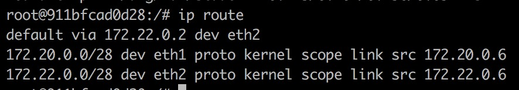

```shell
// 查看是否允许转发
cat /proc/sys/net/ipv4/ip_forward
```

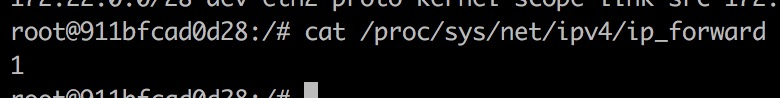

```shell
ip route add 172.22.0.0/28 via 172.20.0.6 dev eth0
```

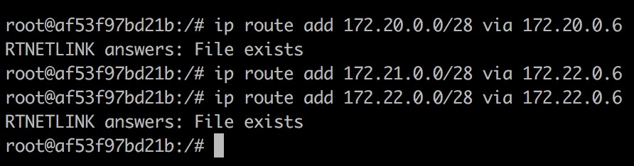

