# Exploring Your Cluster #

## The REST API ##

Now that we have our node (and cluster) up and running, the next step is to understand how to communicate with it. Fortunately, Elasticsearch provides a very comprehensive and powerful REST API that you can use to interact with your cluster. Among the few things that can be done with the API are as follows:

+ Check your cluster, node, and index health, status, and statistics
+ Administer your cluster, node, and index data and metadata
+ Perform CRUD (Create, Read, Update, and Delete) and search operations against your indexes
+ Execute advanced search operations such as paging, sorting, filtering, scripting, aggregations, and many others

## Cluster Health ##

Let’s start with a basic health check, which we can use to see how our cluster is doing. We’ll be using curl to do this but you can use any tool that allows you to make HTTP/REST calls. Let’s assume that we are still on the same node where we started Elasticsearch on and open another command shell window.

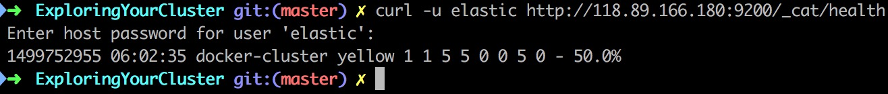

在关掉验证之后（参考Install.md）


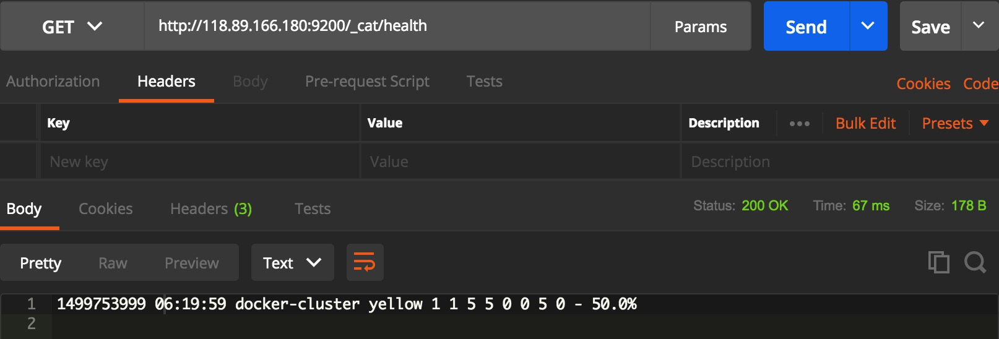

Whenever we ask for the cluster health, we either get green, yellow, or red. Green means everything is good (cluster is fully functional), yellow means all data is available but some replicas are not yet allocated (cluster is fully functional), and red means some data is not available for whatever reason. Note that even if a cluster is red, it still is partially functional (i.e. it will continue to serve search requests from the available shards) but you will likely need to fix it ASAP since you have missing data.

> 绿色是全部节点健康，黄色是备份节点没有足够的控件去分配（但是功能正常）
>
> 是时候申请一台内存比较大的云主机
>
> 即使是红色也只是丢失部分数据

Also from the above response, we can see a total of 1 node and that we have 0 shards since we have no data in it yet. Note that since we are using the default cluster name (elasticsearch) and since Elasticsearch uses unicast network discovery by default to find other nodes on the same machine, it is possible that you could accidentally start up more than one node on your computer and have them all join a single cluster. In this scenario, you may see more than 1 node in the above response.

> 有可能看到不止一个节点

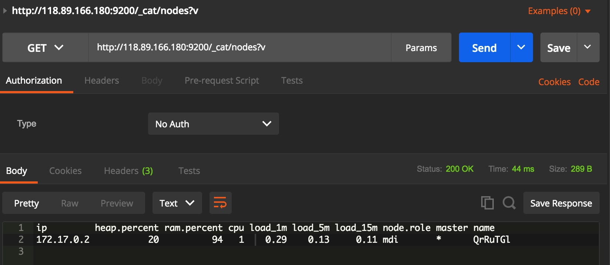

可以看到内存很不乐观，2G内存的机子撑不住ElasticSearch

## List All Indices ##

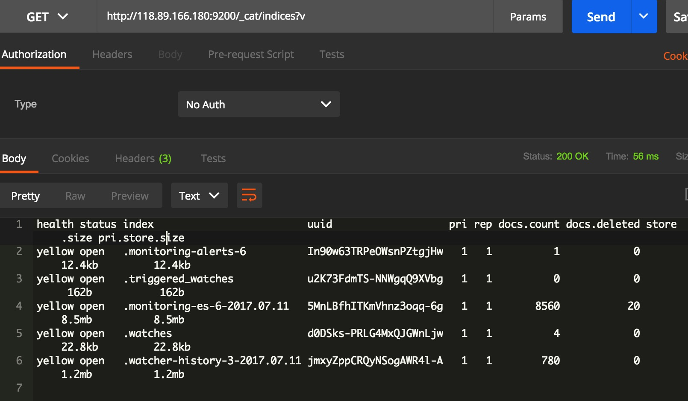

我也不知道里面为什么会有数据，我也很无奈（那又怎么办？）

## Create an Index ##

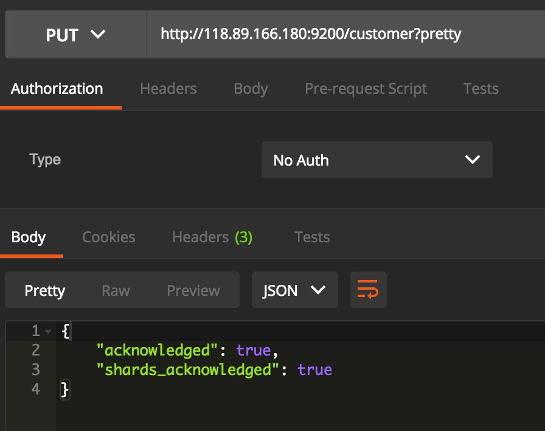

请求方法是PUT方法，路径是`/新创建的Indice?pretty`

The first command creates the index named "customer" using the PUT verb. We simply append pretty to the end of the call to tell it to pretty-print the JSON response (if any).

> pretty告诉服务器，请给我一个好看一点的JSON

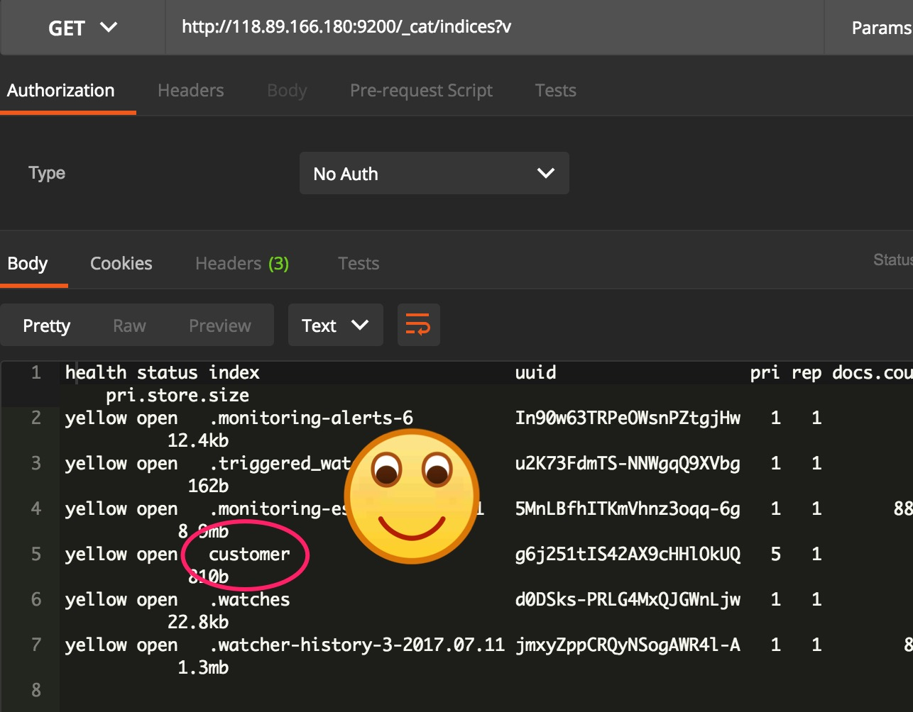

You might also notice that the customer index has a yellow health tagged to it. Recall from our previous discussion that yellow means that some replicas are not (yet) allocated. The reason this happens for this index is because Elasticsearch by default created one replica for this index. Since we only have one node running at the moment, that one replica cannot yet be allocated (for high availability) until a later point in time when another node joins the cluster. Once that replica gets allocated onto a second node, the health status for this index will turn to green.

> 例子也碰到了这个问题，因为它的集群也只有一个节点，所以没办法备份，导致数据的健康状态是yellow
>
> 它之前集群的状态是green只是因为集群内没有数据罢了

## Index and Query a Document ##

Let’s now put something into our customer index. Remember previously that in order to index a document, we must tell Elasticsearch which type in the index it should go to.

> 还记得两级分类吗？输入数据的时候要告诉服务器数据属于的Indice／Type

Let’s now put something into our customer index. Remember previously that in order to index a document, we must tell Elasticsearch which type in the index it should go to.

Let’s index a simple customer document into the customer index, "external" type, with an ID of 1 as follows:

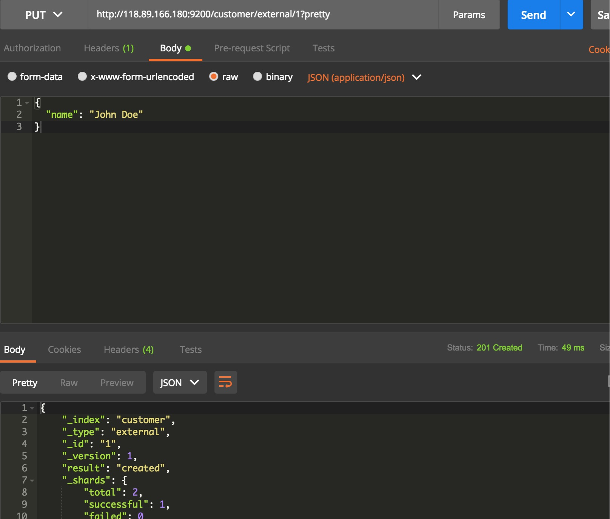

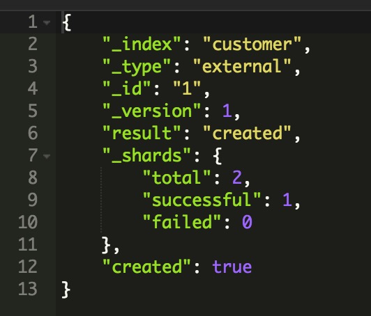

请把Body设置成JSON格式

From the above, we can see that a new customer document was successfully created inside the customer index and the external type. The document also has an internal id of 1 which we specified at index time.

> 在上面的请求中，我们带上了_id，这在实际应用中是不现实的
>
> _id…...呵呵呵，这一定是MongoDB的开发人员取的名字
>
> 接下来，按照MongoDB的套路，应该会说如果不带_id，我们会用算法随机生成一个，算法考虑了时间／进程id等

It is important to note that Elasticsearch does not require you to explicitly create an index first before you can index documents into it. In the previous example, Elasticsearch will automatically create the customer index if it didn’t already exist beforehand.

> 这个套路深得我心，我们来实验一下

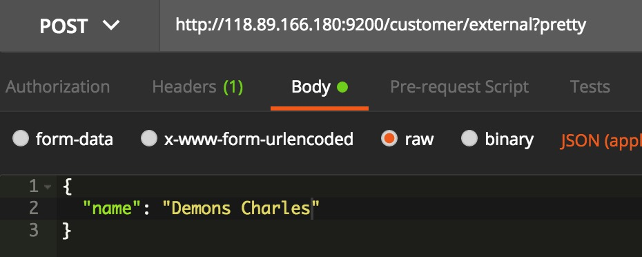

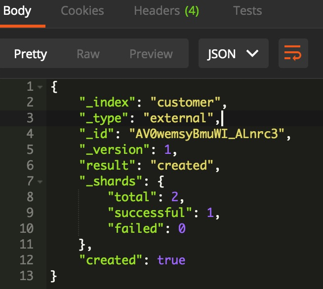

注意要把PUT方法改成POST方法，然后不需要带上id

注意返回的JSON中告诉了我们生成的id是多少

Let’s now retrieve that document that we just indexed:

```http
http://118.89.166.180:9200/customer/external/AV0wemsyBmuWI_ALnrc3?pretty
```

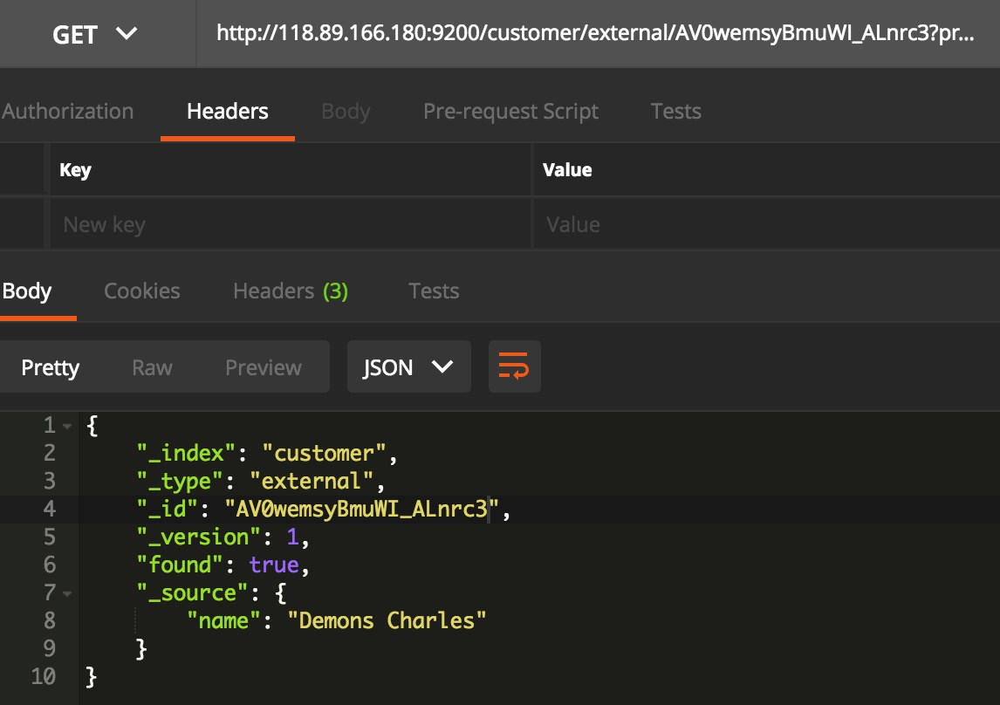

Nothing out of the ordinary here other than a field, found, stating that we found a document with the requested ID 1 and another field, _source, which returns the full JSON document that we indexed from the previous step.

> 会包含一些元信息

## Delete an Index ##

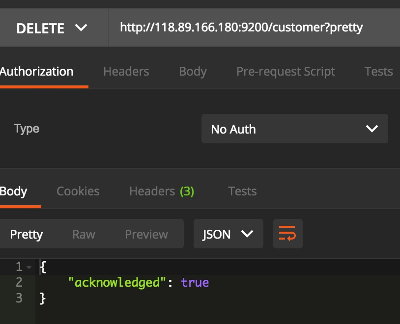

如果你访问一下`GET /_cat/indices?v`，会看到customer Indice已经被删除了

Before we move on, let’s take a closer look again at some of the API commands that we have learned so far:

> 复习复习

```http
PUT /customer
PUT /customer/external/1
{
  "name": "John Doe"
}
GET /customer/external/1
DELETE /customer
```

If we study the above commands carefully, we can actually see a pattern of how we access data in Elasticsearch. That pattern can be summarized as follows:

```http
<REST Verb> /<Index>/<Type>/<ID>
```

> 总结出来的模式很关键
>
> 按照这个模式，document的删除／更新也不难自己写出来

This REST access pattern is so pervasive throughout all the API commands that if you can simply remember it, you will have a good head start at mastering Elasticsearch.

## Modifying Your Data ##

Elasticsearch provides data manipulation and search capabilities in near real time. By default, you can expect a one second delay (refresh interval) from the time you index/update/delete your data until the time that it appears in your search results. This is an important distinction from other platforms like SQL wherein data is immediately available after a transaction is completed.

> 对于NRT我只有一句呵呵可以说，原来比其它产品差也可以找一个看上去这么高端的词语
>
> 搞得我一开始看到它还以为是ElasticSearch的优势

### Indexing/Replacing Documents ###

We’ve previously seen how we can index a single document. Let’s recall that command again:

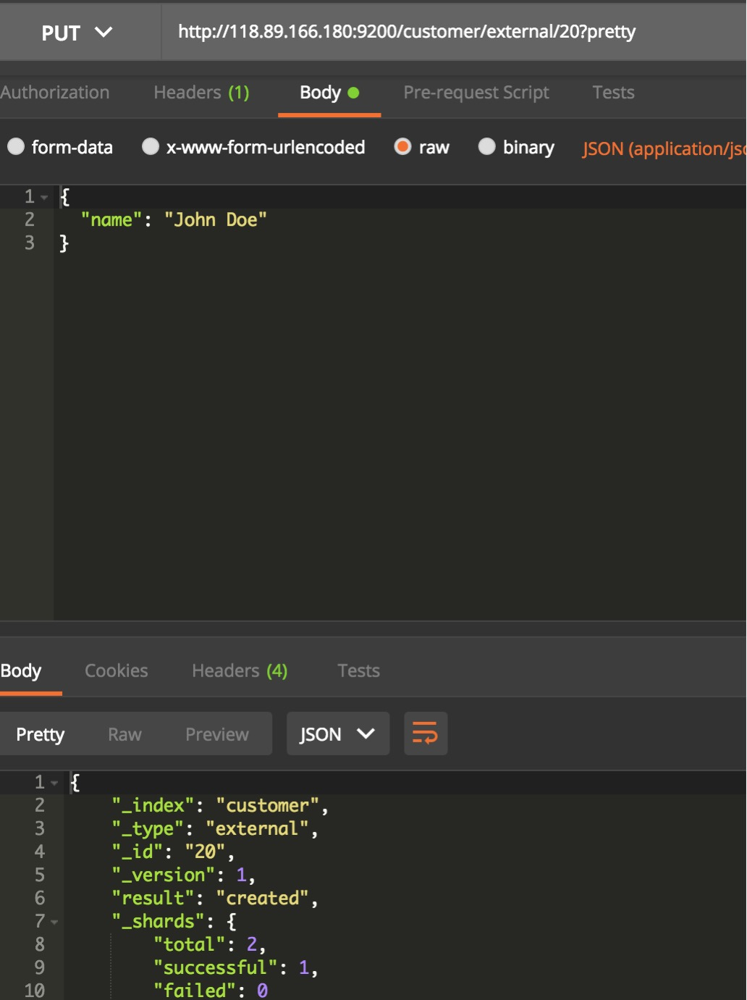

Again, the above will index the specified document into the customer index, external type, with the ID of 1. If we then executed the above command again with a different (or same) document, Elasticsearch will replace (i.e. reindex) a new document on top of the existing one with the ID of 1:

> 我们的`id`是20，因为我喜欢和他的套路不一样😊

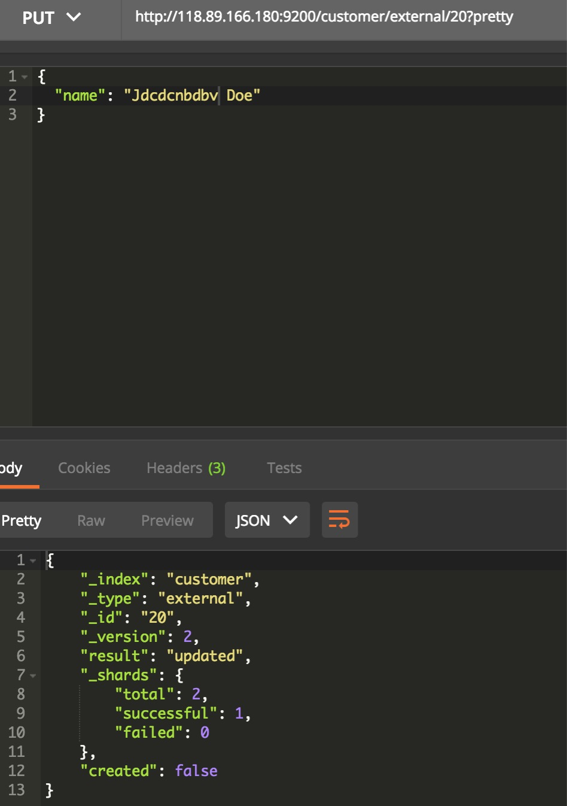

同样的请求，再请求一次就是update

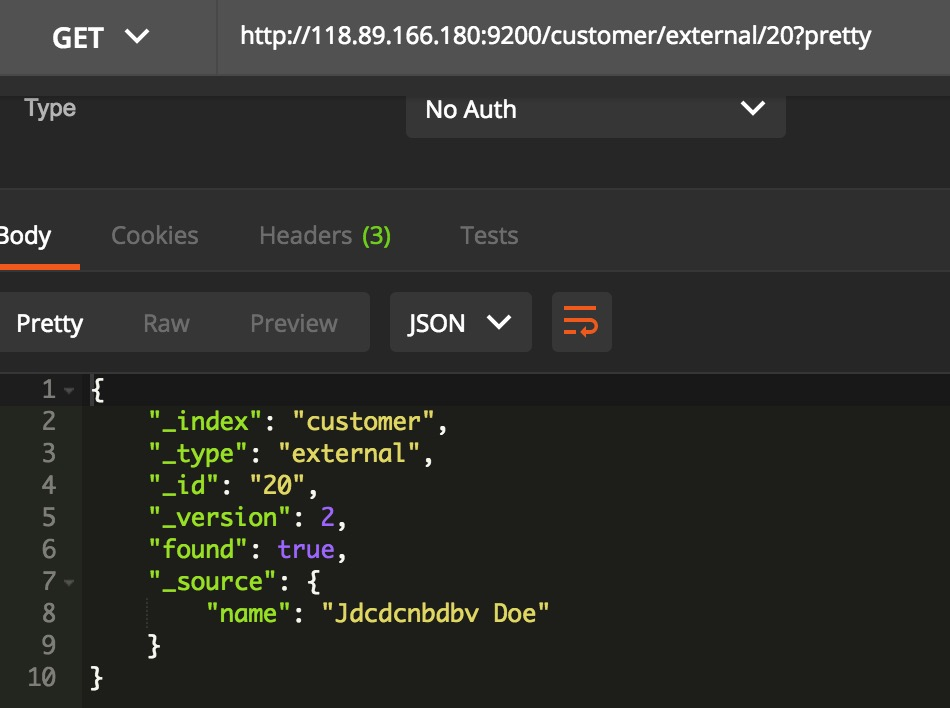

可以看到数据已经更新了

When indexing, the ID part is optional. If not specified, Elasticsearch will generate a random ID and then use it to index the document. The actual ID Elasticsearch generates (or whatever we specified explicitly in the previous examples) is returned as part of the index API call.

> 无`id`数据插入在前面演示过了

## Updating Documents ##

下面我们有请批操作出场

In addition to being able to index and replace documents, we can also update documents. Note though that Elasticsearch does not actually do in-place updates under the hood. Whenever we do an update, Elasticsearch deletes the old document and then indexes a new document with the update applied to it in one shot.

> update = delete + insert
>
> 函数式编程语言风格？

This example shows how to update our previous document (ID of 1) by changing the name field to "Jane Doe" and at the same time add an age field to it:

```http
POST /customer/external/1/_update?pretty
{
  "doc": { "name": "Jane Doe", "age": 20 }
}
```

这个变得有一点点奇怪，动词出现于路径之中，而且body也有一点点奇怪

Updates can also be performed by using simple scripts. This example uses a script to increment the age by 5:

```http
POST /customer/external/1/_update?pretty
{
  "script" : "ctx._source.age += 5"
}
```

In the above example, ctx._source refers to the current source document that is about to be updated.

> 很稳，还支持脚本修改

Note that as of this writing, updates can only be performed on a single document at a time. In the future, Elasticsearch might provide the ability to update multiple documents given a query condition (like an SQL UPDATE-WHERE statement).

> 我错了，这里还没有讲到批操作，只是一种更高级的update
>
> 我比较关心的问题：是否支持升级特定的域？

## Deleting Documents ##

```shell
DELETE /customer/external/2?pretty
```

See the Delete By Query API to delete all documents matching a specific query. It is worth noting that it is much more efficient to delete a whole index instead of deleting all documents with the Delete By Query AP

> 有更加高级的方法
>
> 十分怀疑ElasticSearch背后的男人是MongoDB（(｡ì _ í｡)）

## Batch Processing ##

provides the ability to perform any of the above operations in batches using the _bulk API. This functionality is important in that it provides a very efficient mechanism to do multiple operations as fast as possible with as few network roundtrips as possible.

> `_bulk`，兄弟👬，你们名字都一毛一样的么？

As a quick example, the following call indexes two documents (ID 1 - John Doe and ID 2 - Jane Doe) in one bulk operation:

```http
POST /customer/external/_bulk?pretty
{"index":{"_id":"1"}}
{"name": "John Doe" }
{"index":{"_id":"2"}}
{"name": "Jane Doe" }
```

> 这个API设计的没有MongoDB的好

This example updates the first document (ID of 1) and then deletes the second document (ID of 2) in one bulk operation:

```http
POST /customer/external/_bulk?pretty
{"update":{"_id":"1"}}
{"doc": { "name": "John Doe becomes Jane Doe" } }
{"delete":{"_id":"2"}}
```

Note above that for the delete action, there is no corresponding source document after it since deletes only require the ID of the document to be deleted.

> 这种一带一的东西看起来很奇怪
>
> 还不如把需要的参数放到同一个map里

The Bulk API does not fail due to failures in one of the actions. If a single action fails for whatever reason, it will continue to process the remainder of the actions after it. When the bulk API returns, it will provide a status for each action (in the same order it was sent in) so that you can check if a specific action failed or not.

> 看来是并行执行

## Exploring Your Data ##

### Sample Dataset ###

```shell
curl -H "Content-Type: application/json" -XPOST '118.89.166.180:9200/bank/account/_bulk?pretty&refresh' --data-binary "@accounts.json"
```

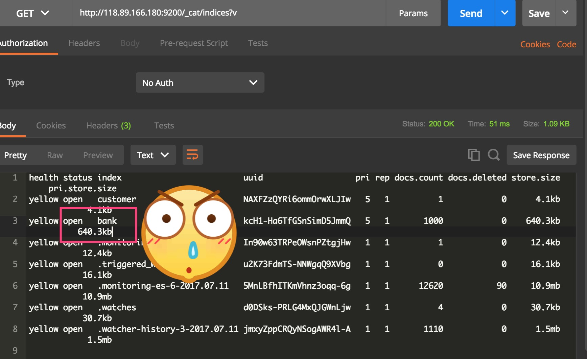

Which means that we just successfully bulk indexed 1000 documents into the bank index (under the account type).

> 1000个数据已经成功导入

## The Search API ##

Now let’s start with some simple searches. There are two basic ways to run searches: one is by sending search parameters through the REST request URI and the other by sending them through the REST request body. The request body method allows you to be more expressive and also to define your searches in a more readable JSON format. We’ll try one example of the request URI method but for the remainder of this tutorial, we will exclusively be using the request body method.

> 用body会更加具有可读性

The REST API for search is accessible from the _search endpoint. This example returns all documents in the bank index:

```http
GET /bank/_search?q=*&sort=account_number:asc&pretty
```

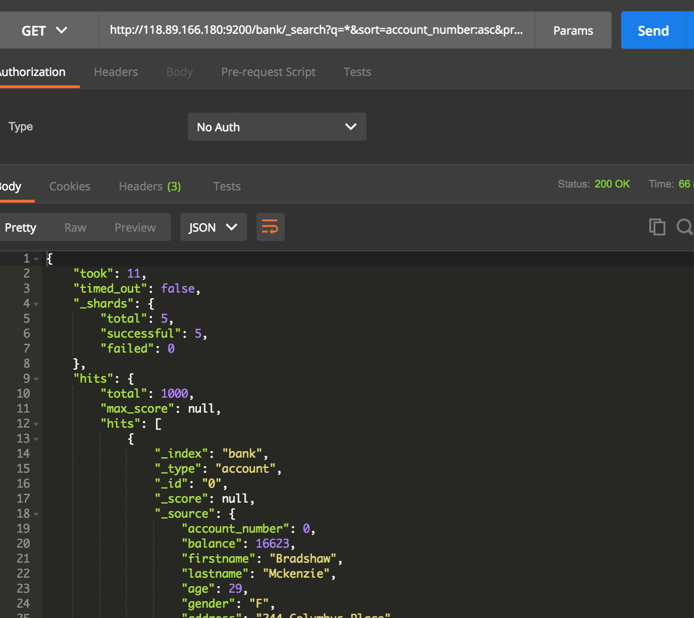

这使用url传递参数，不具备很好的可读性，我们不会很详细地去解析这个url

Let’s first dissect the search call. We are searching (_search endpoint) in the bank index, and the q=* parameter instructs Elasticsearch to match all documents in the index. The sort=account_number:asc parameter indicates to sort the results using the account_number field of each document in an ascending order. The pretty parameter, again, just tells Elasticsearch to return pretty-printed JSON results.

As for the response, we see the following parts:

+ took – time in milliseconds for Elasticsearch to execute the search

  > 耗时

+ timed_out – tells us if the search timed out or not

  > 查询是否超时

+ _shards – tells us how many shards were searched, as well as a count of the successful/failed searched shards

  > 有多少个shard参与本次查询

+ hits – search results

+ hits.total – total number of documents matching our search criteria

+ hits.hits – actual array of search results (defaults to first 10 documents)

+ hits.sort - sort key for results (missing if sorting by score)

Here is the same exact search above using the alternative request body method:

```http
GET /bank/_search
{
  "query": { "match_all": {} },
  "sort": [
    { "account_number": "asc" }
  ]
}
```

> 有一种MongoDB的味道
>
> 实际实验发现，用POST方法也可以请求到相同的结果

The difference here is that instead of passing q=* in the URI, we POST a JSON-style query request body to the _search API. We’ll discuss this JSON query in the next section.

It is important to understand that once you get your search results back, Elasticsearch is completely done with the request and does not maintain any kind of server-side resources or open cursors into your results. This is in stark contrast to many other platforms such as SQL wherein you may initially get a partial subset of your query results up-front and then you have to continuously go back to the server if you want to fetch (or page through) the rest of the results using some kind of stateful server-side cursor.

> 服务端没有状态是一件好事，不过问题在于比如我想加载前100个怎么办？加载前100个的分页要我自己做吗？

## Introducing the Query Language ##

Elasticsearch provides a JSON-style domain-specific language that you can use to execute queries. This is referred to as the Query DSL. The query language is quite comprehensive and can be intimidating at first glance but the best way to actually learn it is to start with a few basic examples.

> 不幸的消息，查询语言很复杂
>
> 希望它和MongoDB的查询语言类似

Going back to our last example, we executed this query:

```http
GET /bank/_search
{
  "query": { "match_all": {} }
}
```

Dissecting the above, the query part tells us what our query definition is and the match_all part is simply the type of query that we want to run. The match_all query is simply a search for all documents in the specified index.

In addition to the query parameter, we also can pass other parameters to influence the search results. In the example in the section above we passed in sort, here we pass in size:

```http
GET /bank/_search
{
  "query": { "match_all": {} },
  "size": 1
}
```

Note that if size is not specified, it defaults to 10.

This example does a match_all and returns documents 11 through 20:

```http
GET /bank/_search
{
  "query": { "match_all": {} },
  "from": 10,
  "size": 10
}
```

> 可以这个很方便，不过如果没有缓存（服务器无状态），这样做会不会影响效率？

The from parameter (0-based) specifies which document index to start from and the size parameter specifies how many documents to return starting at the from parameter. This feature is useful when implementing paging of search results. Note that if from is not specified, it defaults to 0.

This example does a match_all and sorts the results by account balance in descending order and returns the top 10 (default size) documents.

```http
GET /bank/_search
{
  "query": { "match_all": {} },
  "sort": { "balance": { "order": "desc" } }
}
```

## Executing Searches ##

