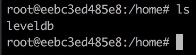

```shell
docker run -t -i --name leveldb debian /bin/bash
apt-get update && apt-get install -y vim && apt-get install -y git
git clone https://github.com/google/leveldb.git
mv leveldb home
cd home
ls
```




startup.cpp

```cpp
#include <iostream>
#include "leveldb/db.h"

int main()
{
    leveldb::DB* db;
    leveldb::Options options;
    options.create_if_missing = true; // 如果没有则创建

    leveldb::Status status = leveldb::DB::Open(options, "/home/test/test_leveldb/testdb", &db);

    std::string key = "key123";
    std::string value = "value123";

    status = db->Put(leveldb::WriteOptions(), key, value);
    assert(status.ok());

    std::string value1;
    status = db->Get(leveldb::ReadOptions(), key, &value1);
    assert(status.ok());

    std::cout << "get, key1:" << key << " value1:" << value1 << std::endl;
    std::string key1 = "key456";
    status = db->Put(leveldb::WriteOptions(), key1, value1);
    assert(status.ok());

    status = db->Delete(leveldb::WriteOptions(), key1);
    assert(status.ok());


    delete db;
    return 0;
}
```

```shell
apt-get install -y make g++
cd /home/leveldb
make && make all
```

