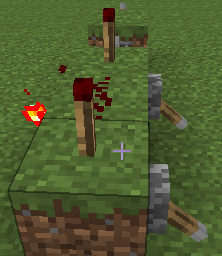
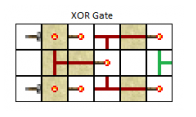

# 红石中继器的基本作用 #

## 延长信号 ##

红石电路的型号只有15格，中间放上红石中继器可以帮助信号传递得更远

1（很亮）….15（很暗） + 红石中继器 + 16（很亮）...

## 延时 ##

信号的传递会慢0.1-0.4秒

## 锁存器 ##

两个红石中继器可以互相锁住对方的状态，比如先关闭竖着的红石中继器的拉杆（使得竖着的红石中继器处于关闭状态），然后为横着的红石中继器选择任意一个状态（打开或者关闭），最后打开竖着的红石中继器的拉杆，会发现横着的红石中继器的状态被锁住了（无论如何改变其对应的拉杆，都不能再次改变它的状态）

## 二极管 ##

信号的通过具备方向性

# 逻辑门 #

## 预备知识 ##

如果拉杆处于打开状态，红石会处于打开状态（亮着），从这个角度来所，拉杆具备红石火把的功能

同时注意到拉杆向下代表打开状态（正对着方块放置拉杆时）

如果拉杆处于打开状态，会抑制红石火把（也就是使得红石火把处于关闭状态）

注意到此时拉杆向上，是关闭状态，红石火把处于打开状态

如果我们使得拉杆向下，那么红石火把会处于关闭状态

## 与门 ##

只有当两个开关都处于打开状态时，两个处于方块顶部的红石火把才会处于关闭状态

从而中间的红石处于关闭状态，不会去抑制处于中间方块侧面的红石火把（也就是输出端）

如果任何一个开关处于关闭状态，那么至少一个顶部的红石火把处于打开状态，从而红石也处于打开状态

进而抑制作为输出端的红石火把

红石也能起到抑制红石火把的作用？这些抑制规则真是有趣

## 或门 ##

或门其实挺简单的，记得放红石而不是红石火把

不要走进“一切都用抑制规则”的思维误区

## 非门 ##

前面的预备知识中其实已经提到了非门（灵魂小画手），这里放张实物图

## 与非门 ##

与非门／与门十分相似

与门只有当所有开关都打开的时候才输出1，与非门是只有当所有开关都打开的时候才输出0

因此与非门的构造也很简单，只要把输出端的红石火把换成红石即可（把抑制作用换成相反的激活作用）

## 或非门 ##

或非门／或门十分相似

类似地，我们也可以很简单地构造出或非门

只有当两个开关都处于关闭状态（也就是向上）时，输出端才输出1（也就是亮着）

## 异或门 ##

经过试验，符合异或门的定义（有且只有一个输入为1的时候输出才为1）

但是实现原理好像又一点复杂，我现在还不能解释（突然想通了）

分类讨论：

+ 两个开关都处于打开状态

  

  从后往前看：两个开关都处于打开状态，于是两个红石火把都被抑制（处于关闭状态），导致前面的红石处于关闭状态；凸字形前边的那个红石火把因为没有受到抑制而处于打开状态，两边的红石受到它的影响处于打开状态，进而抑制更前面的两个红石火把的状态，导致输出0

+ 两个开关都处于关闭状态

  

  这个就更好分析了，两边的红石火把都没有被抑制，一直沿着红石往前传递，直到抑制最前面的两个红石火把；最前面的两个红石火把都被抑制，故输出端为0

+ 一个开关处于打开状态，一个开关处于关闭状态

  唯一要注意的就是凸字形的两侧（而不是最前端）的红石火把

  这两把红石火把对于输出端有重要影响

  注意到这个细节之后，异或门输出1的情况很容易分析

## 同或门 ##

有且仅有一个输入端是1的时候，输出端才为0

感觉在数字电路里这个门用得也不是很多吧，所以也就不实现了