# Aggregation #

Aggregation operations process data records and return computed results. Aggregation operations group values from multiple `documents` together, and can perform a variety of operations on the grouped data to return a single result. `MongoDB` provides three ways to perform aggregation: the aggregation pipeline, the map-reduce function, and single purpose aggregation methods.

> Aggregation就是对数据库内的数据进行处理
>
> `MongoDB`提供了两种处理模型（它们都是高度可定制化的）和一种满足简单需求的处理方式

## Aggregation Pipeline ##

`MongoDB`’s aggregation framework is modeled on the concept of **data processing pipelines**. `Documents` enter a multi-stage pipeline that transforms the ``documents` into an aggregated result.

> `MongoDB`的数据处理框架是立足于数据处理流水线的，是一个多阶段的过程

The most basic pipeline stages provide **filters** that operate like queries and **document transformations** that modify the form of the output `document`.

> 最基本的阶段：如何吧数据选出来，如何把数据转换成更好处理的形式

Other pipeline operations provide tools for **grouping** and **sorting** `documents` by specific field or fields as well as tools for **aggregating the contents of arrays**, including arrays of `documents`. In addition, pipeline stages can use operators for tasks such as **calculating the average** or **concatenating a string**.

> 第二个阶段：如何吧数据分组，对分组过的数据做什么处理
>
> 如果在这个阶段不支持用户提交自定义的函数的话，这种模型的自由度还是欠缺的，好处可能是效率会更高（限制用户操作的可能性，对剩下的可能性进行特定的优化）

The pipeline provides efficient data aggregation using native operations within `MongoDB`, and is the preferred method for data aggregation in `MongoDB`.

> 看来我的猜测是对的，这种数据处理模型不支持用户自定义操作
>
> 而自带的操作都很贴近于`MongoDB`的原生操作，所以效率会很高

The aggregation pipeline can operate on a **sharded** `collection`.

> 共享`collection`？意思是可以从多张表中选取数据？

The aggregation pipeline can use indexes to improve its performance during some of its stages.

> 在某些阶段可以用索引提升处理性能，这种高级话题我现在还是不参与了

In addition, the aggregation pipeline has an internal optimization phase.

> 相信自带的性能优化器该有多棒棒🍭

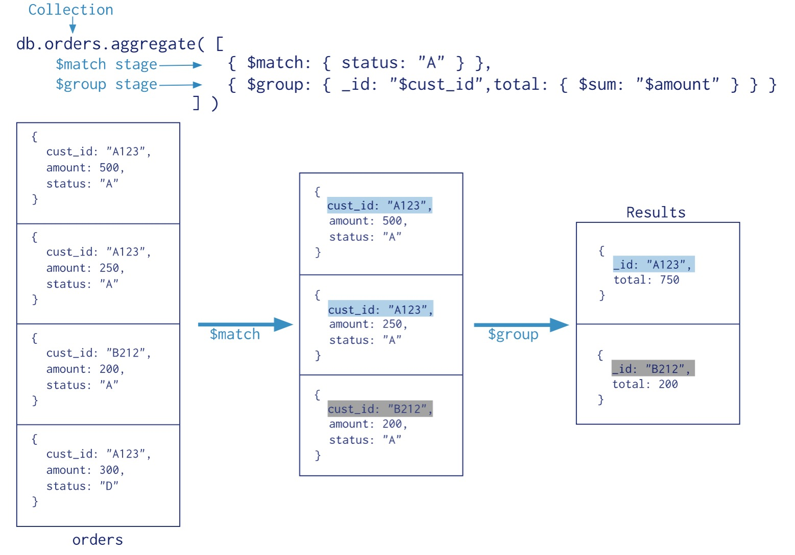

## Map-Reduce ##

`MongoDB` also provides map-reduce operations to perform aggregation.

> Hadoop采用的数据处理模型，现在几乎成为一种数据处理框架的标准
>
> 话说，`MongoDB`的数据库集群架构会不会和Hadoop的架构是一样的？

In general, map-reduce operations have two phases: a map stage that processes each `document` and emits one or more objects for each input `document`, and reduce phase that combines the output of the map operation.

> 分为两个阶段：map（把`document`转换成对象），reduce（归约对象）

Optionally, map-reduce can have a finalize stage to make final modifications to the result.

> 可以额外地拥有一个阶段（finalize）去对结果做最终的修改

Like other aggregation operations, map-reduce can specify a query condition to select the input `documents` as well as sort and limit the results.

Map-reduce uses custom JavaScript functions to perform the map and reduce operations, as well as the optional finalize operation. While the custom JavaScript provide great flexibility compared to the aggregation pipeline, in general, map-reduce is less efficient and more complex than the aggregation pipeline.

> 用性能换自由度
>
> 建议如果能用Aggregation Pipeline解决的都用Aggregation Pipeline解决，部分轻型请求可以用Map-Reduce，其他计算量很大的操作请把数据取出来在客户端操作

Map-reduce can operate on a **sharded** `collection`. Map reduce operations can also output to a **sharded** `collection`.

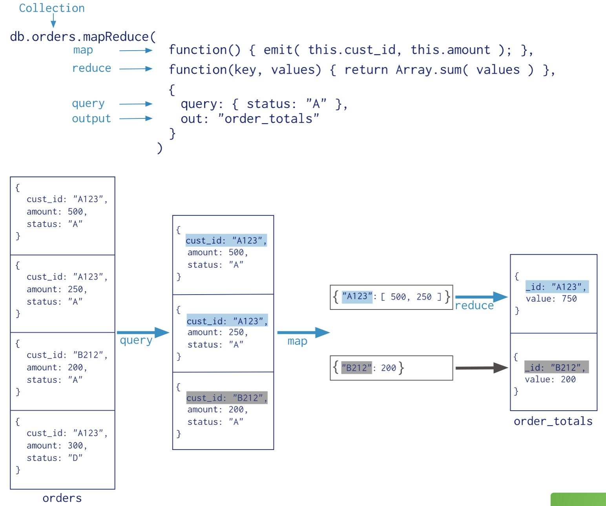


## Single Purpose Aggregation Operations ##

`MongoDB` also provides **db.collection.count()** and **db.collection.distinct()**.

All of these operations aggregate `documents` from a **single** `collection`.

While these operations provide simple access to common aggregation processes, they lack the flexibility and capabilities of the aggregation pipeline and map-reduce.

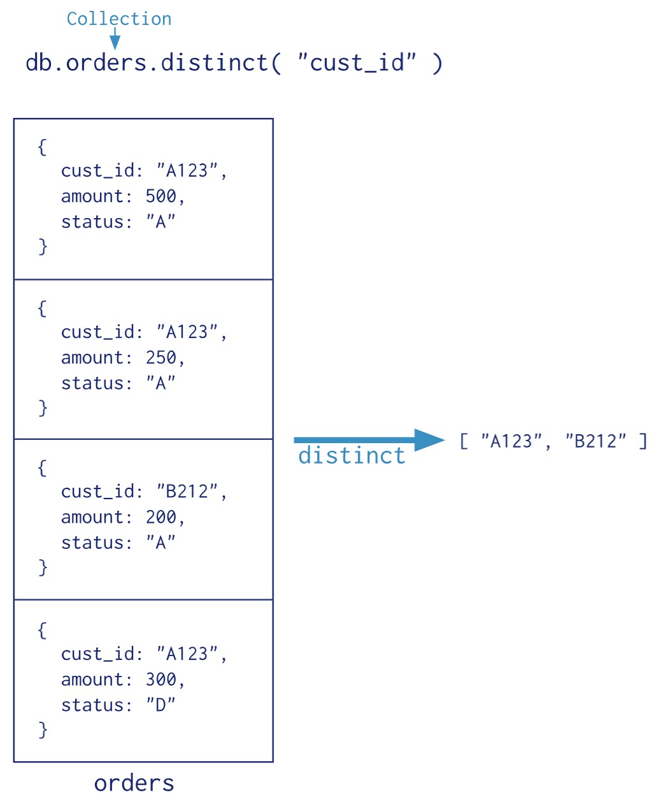

## Additional Features and Behaviors ##

## Additional Resources ##

# Aggregation Pipeline #

# Map-Reduce #

Map-reduce is a data processing paradigm for condensing large volumes of data into useful aggregated results. For map-reduce operations, `MongoDB` provides the **mapReduce** database command.

> Map-reduce是一种数据处理的通用范式

Consider the following map-reduce operation:

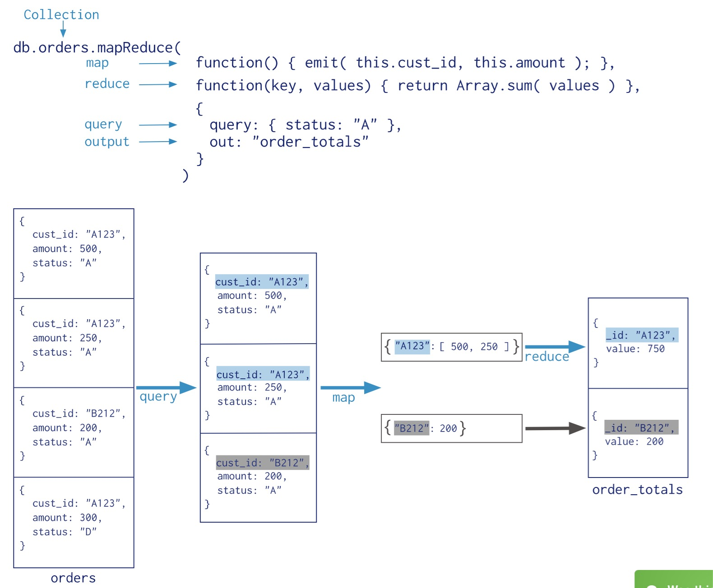

In this map-reduce operation, `MongoDB` applies the map phase to each input `document` (i.e. the `documents` in the `collection` that match the query condition). The map function emits key-value pairs. For those keys that have multiple values, `MongoDB` applies the reduce phase, which collects and condenses the aggregated data. `MongoDB` then stores the results in a `collection`. Optionally, the output of the reduce function may pass through a finalize function to further condense or process the results of the aggregation.

> 第一个阶段负责发射名值对（一个名对应于一个值），如果综合之后，一个名对应多个值，则进入下一个阶段
>
> map-reduce之后可以有一个可选的阶段，决定怎么利用得到的结果；默认的处理方式是把这些结果存储到另一个表

All map-reduce functions in `MongoDB` are JavaScript and run within the mongod process. Map-reduce operations take the `documents` of a single `collection` as the input and can perform any arbitrary sorting and limiting before beginning the map stage. mapReduce can return the results of a map-reduce operation as a `document`, or may write the results to `collections`. The input and the output `collections` may be sharded.

> map-reduce发生在服务器
>
> 这不是废话吗，如果发生在客户端我干嘛不直接把数据取回来自己慢慢改？？

## Map-Reduce JavaScript Functions ##

In `MongoDB`, map-reduce operations use custom JavaScript functions to map, or associate, values to a key. If a key has multiple values mapped to it, the operation reduces the values for the key to a single object.

The use of custom JavaScript functions provide flexibility to map-reduce operations. For instance, when processing a `document`, the map function can create more than one key and value mapping or no mapping. Map-reduce operations can also use a custom JavaScript function to make final modifications to the results at the end of the map and reduce operation, such as perform additional calculations.

> 很多是重复之前的东西（好气啊！！！废话怎么这么多！！你们的文档时复制粘贴写出来的吗！！）
>
> 强调一下自由度

## Map-Reduce Behavior ##

In `MongoDB`, the map-reduce operation can write results to a `collection` or return the results inline. If you write map-reduce output to a `collection`, you can perform subsequent map-reduce operations on the same input `collection` that merge replace, merge, or reduce new results with previous results. See mapReduce and Perform Incremental Map-Reduce for details and examples.

> map-reduce的结果有多种用途，可以是重新写回数据库，也可以是直接返回
>
> 如果直接写回数据库，还可以再次进行map-reduce

When returning the results of a map reduce operation inline, the result `documents` must be within the BSON Document Size limit, which is currently 16 megabytes. For additional information on limits and restrictions on map-reduce operations, see the mapReduce reference page.

> 仍然有大小限制

`MongoDB` supports map-reduce operations on sharded `collections`. Map-reduce operations can also output the results to a sharded `collection`. See Map-Reduce and Sharded Collections.

> map-reduce可以用于shard `collections`

Views do not support map-reduce operations.

> 视图不支持map-reduce操作

## Do it ##


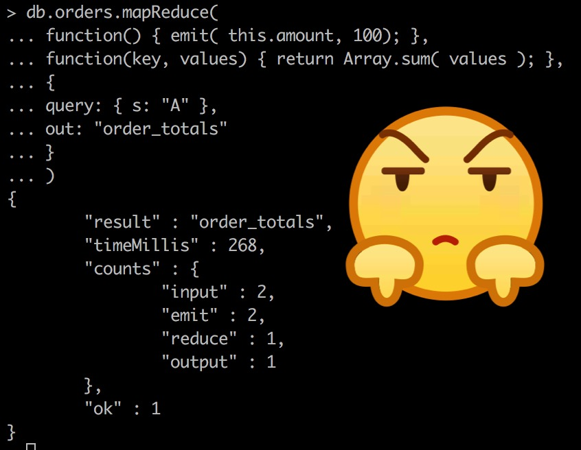

猜猜结果到哪里去了？

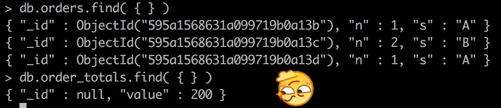

到这里还没有结束，可以看到结果只出现了200，而没有出现期望中的1+2，再试试看：

正确的做法是多次调用emit函数，而不是在一次emit函数调用中尝试发送多个key-value对

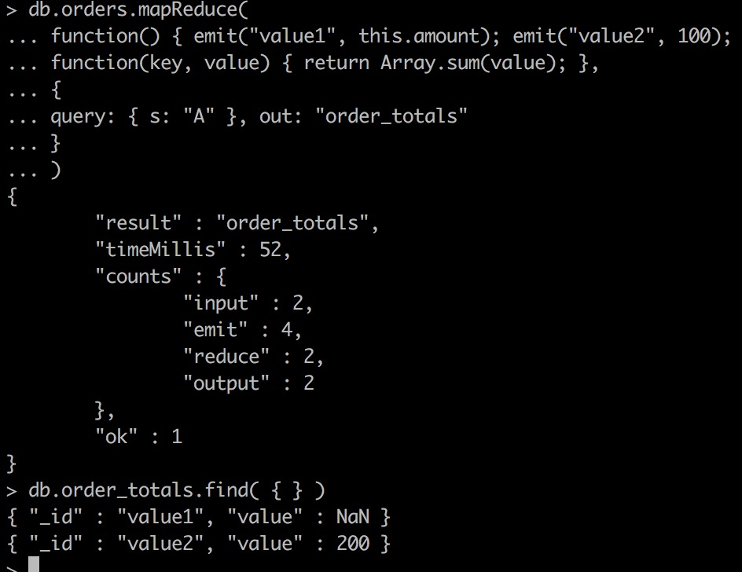

但这个例子还有一个不符合期待的地方，value1还是没有输出1+2=3，而是输出了NaN


原来是字段名看错了，而且结果也不是1+2，而是1+1=2

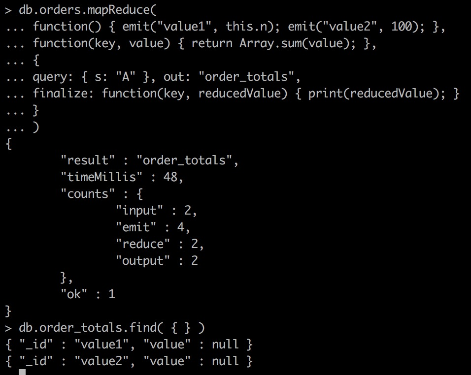

如你所见，finalize不支持副作用，它的正确用法是改变reducedValue并返回

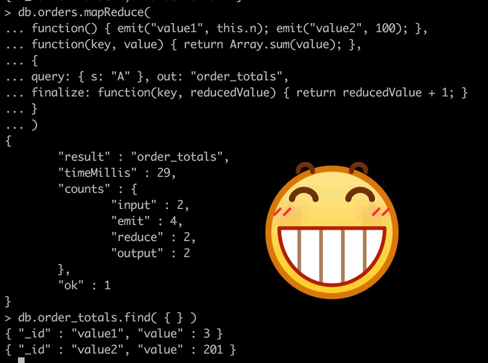

这才是正确的用法

## Map-Reduce and Sharded Collections ##

在这里首先要弄清楚什么是数据库切分（sharing）

 Sharding的基本思想就要把一个数据库切分成多个部分放到不同的数据库(server)上，从而缓解单一数据库的性能问题。不太严格的讲，对于海量数据的数据库，如果是因为表多而数据多，这时候适合使用垂直切分，即把关系紧密（比如同一模块）的表切分出来放在一个server上。如果表并不多，但每张表的数据非常多，这时候适合水平切分，即把表的数据按某种规则（比如按ID散列）切分到多个数据库(server)上。当然，现实中更多是这两种情况混杂在一起，这时候需要根据实际情况做出选择，也可能会综合使用垂直与水平切分，从而将原有数据库切分成类似矩阵一样可以无限扩充的数据库(server)阵列。下面分别详细地介绍一下垂直切分和水平切分：

+ 垂直切分的最大特点就是规则简单，实施也更为方便，尤其适合各业务之间的耦合度非常低，相互影响很小，业务逻辑非常清晰的系统。在这种系统中，可以很容易做到将不同业务模块所使用的表分拆到不同的数据库中。根据不同的表来进行拆分，对应用程序的影响也更小，拆分规则也会比较简单清晰。

  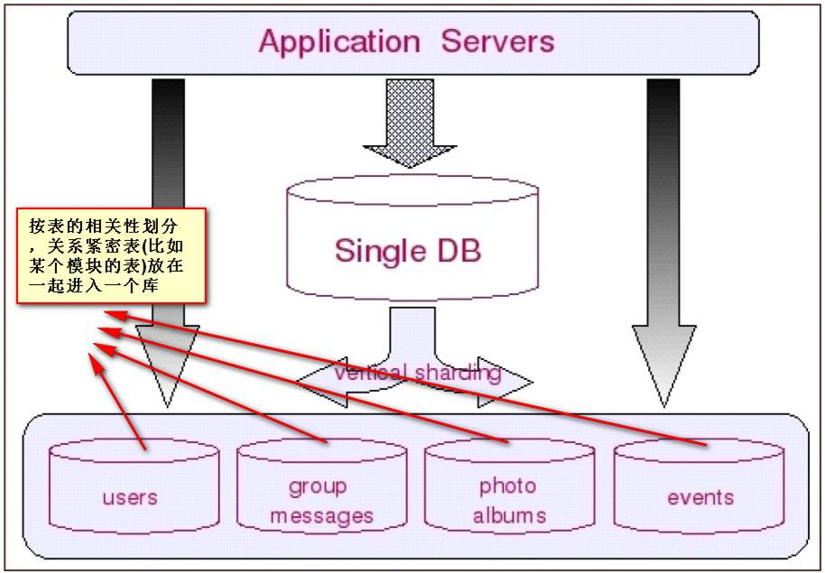

+ 水平切分于垂直切分相比，相对来说稍微复杂一些。因为要将同一个表中的不同数据拆分到不同的数据库中，对于应用程序来说，拆分规则本身就较根据表名来拆分更为复杂，后期的数据维护也会更为复杂一些。

  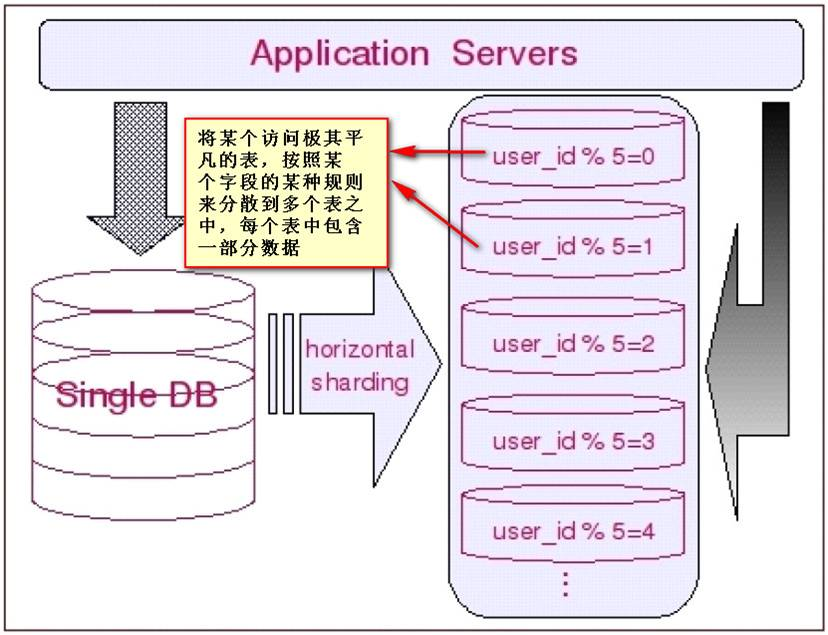

让我们从普遍的情况来考虑数据的切分：一方面，一个库的所有表通常不可能由某一张表全部串联起来，这句话暗含的意思是，水平切分几乎都是针对一小搓一小搓（实际上就是垂直切分出来的块）关系紧密的表进行的，而不可能是针对所有表进行的。另一方面，一些负载非常高的系统，即使仅仅只是单个表都无法通过单台数据库主机来承担其负载，这意味着单单是垂直切分也不能完全解决问明。因此多数系统会将垂直切分和水平切分联合使用，先对系统做垂直切分，再针对每一小搓表的情况选择性地做水平切分，从而将整个数据库切分成一个分布式矩阵。

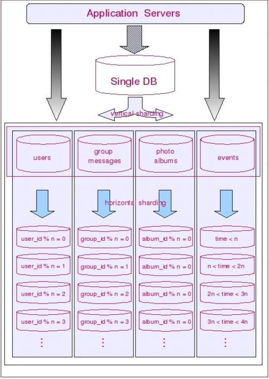

对于map-reduce来说，它的输入可能来自多个切分过的数据库，它的输出也可能去往多个切分过的数据库

Map-reduce supports operations on sharded `collections`, both as an input and as an output. This section describes the behaviors of mapReduce specific to sharded `collections`.

### Sharded Collection as Input ###

When using sharded collection as the input for a map-reduce operation, mongos will automatically dispatch the map-reduce job to each shard in parallel. There is no special option required. mongos will wait for jobs on all shards to finish.

> 当你使用切分的表作为输入的时候，mongos会自动把任务派发给这些表，然后回收它们的处理结果
>
> 但是你要告诉我怎么把多个表作为输入啊！！！要不然我怎么实验！！

### Sharded Collection as Output ###

If the **out** field for mapReduce has the sharded value, `MongoDB` shards the output collection using the **_id** field as the shard key.

> 自动用**_id**哈希？有意思，水平切分

To output to a sharded collection:

+ If the output `collection` does not exist, `MongoDB` creates and shards the `collection` on the _id field.

+ For a new or an empty sharded `collection`, `MongoDB` uses the results of the first stage of the map-reduce operation to create the **initial chunks** distributed among the shards.

  > 为什么第一阶段的结果就拿出来存储？

+ mongos dispatches, in parallel, a map-reduce post-processing job to every shard that owns a chunk. During the post-processing, each shard will pull the results for its own chunks from the other shards, run the final reduce/finalize, and write locally to the output collection.

  > 这个想法非常机智，把第一阶段的结果分别存储于不同的表之中（一般来说这些表是放在不同的机器上的），然后给每个机器派发任务，并行执行以提高效率
  >
  > 最后每个表都收集一下其他表的结果，写回到本地（这个本地就是自己这张表）

## Map Reduce Concurrency ##

The map-reduce operation is composed of many tasks, including reads from the input `collection`, executions of the map function, executions of the reduce function, writes to a temporary `collection` during processing, and writes to the output `collection`.

> 注意到`MongoDB`用一个temporary表存储第一阶段的结果

During the operation, map-reduce takes the following locks:

> 我们都知道，并行都需要锁区保证关键点的先后顺序

+ The read phase takes a read lock. It yields every 100 `documents`.
+ The insert into the temporary `collection` takes a write lock for a single write.
+ If the output `collection` does not exist, the creation of the output `collection` takes a write lock.
+ If the output `collection` exists, then the output actions (i.e. merge, replace, reduce) take a write lock. This write lock is global, and blocks all operations on the mongod instance.

The final write lock during post-processing makes the results appear atomically. However, output actions **merge** and **reduce** may take minutes to process. For the merge and reduce, the **nonAtomic** flag is available, which releases the lock between writing each output `document`. See the **db.collection.mapReduce()** reference for more information.

> 最后一个锁是全局的，它的存在是为了保证写入的原子性
>
> 不过有些任务耗时太长，可以适当折中，即保证每个`document`的原子性而放弃整个结果的原子性
>
> 以获得在`documents`写入间隔获得写入其它数据的机会

## Perform Incremental Map-Reduce ##

这一小节要解决的问题是：如果做完一次map-reduce，又来了新的数据怎么办？总不至于把整张表的数据都从新算一遍吧？

类似于增量学习

解决两个问题：

+ 如何识别新来的数据，或者说，怎么知道上次处理过这个数据？
+ 是否需要融合旧的结果和新的结果？如果需要，怎么融合？

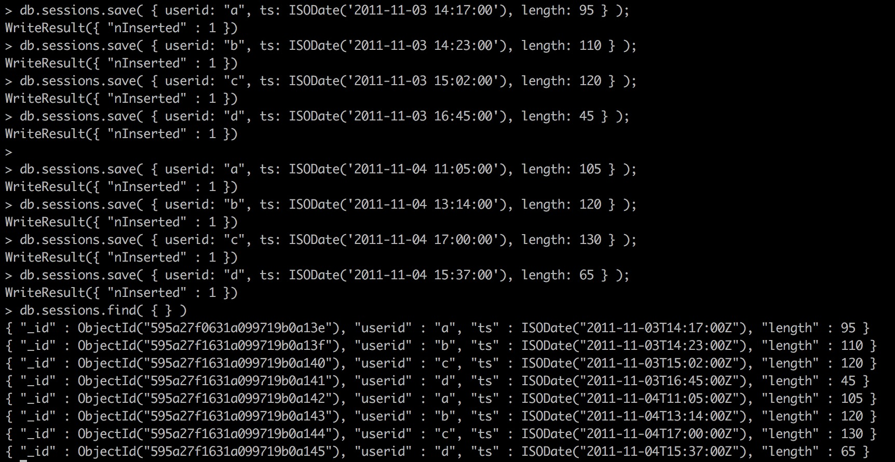

```javascript
var mapFunction = function() {
                      var key = this.userid;
                      var value = {
                                    userid: this.userid,
                                    total_time: this.length,
                                    count: 1,
                                    avg_time: 0
                                   };

                      emit( key, value );
                  };
```

```javascript
var reduceFunction = function(key, values) {

                        var reducedObject = {
                                              userid: key,
                                              total_time: 0,
                                              count:0,
                                              avg_time:0
                                            };

                        values.forEach( function(value) {
                                              reducedObject.total_time += value.total_time;
                                              reducedObject.count += value.count;
                                        }
                                      );
                        return reducedObject;
                     };
```

```javascript
var finalizeFunction = function (key, reducedValue) {

                          if (reducedValue.count > 0)
                              reducedValue.avg_time = reducedValue.total_time / reducedValue.count;

                          return reducedValue;
                       };
```

```javascript
db.sessions.mapReduce( mapFunction,
                       reduceFunction,
                       {
                         out: "session_stat",
                         finalize: finalizeFunction
                       }
                     )
```

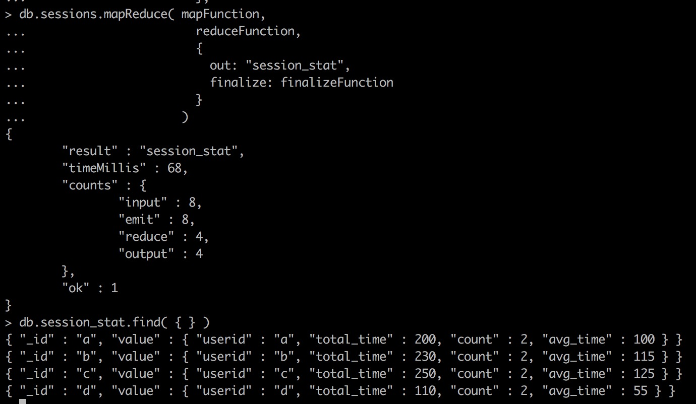

新数据来了：

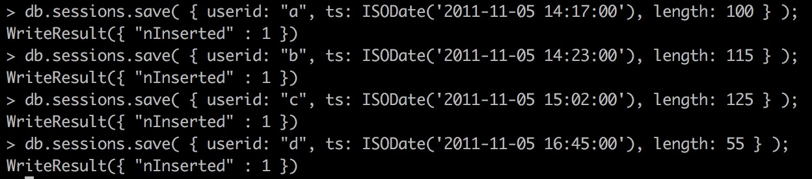

```javascript
db.sessions.mapReduce( mapFunction,
                       reduceFunction,
                       {
                         query: { ts: { $gt: ISODate('2011-11-05 00:00:00') } },
                         out: { reduce: "session_stat" },
                         finalize: finalizeFunction
                       }
                     );
```

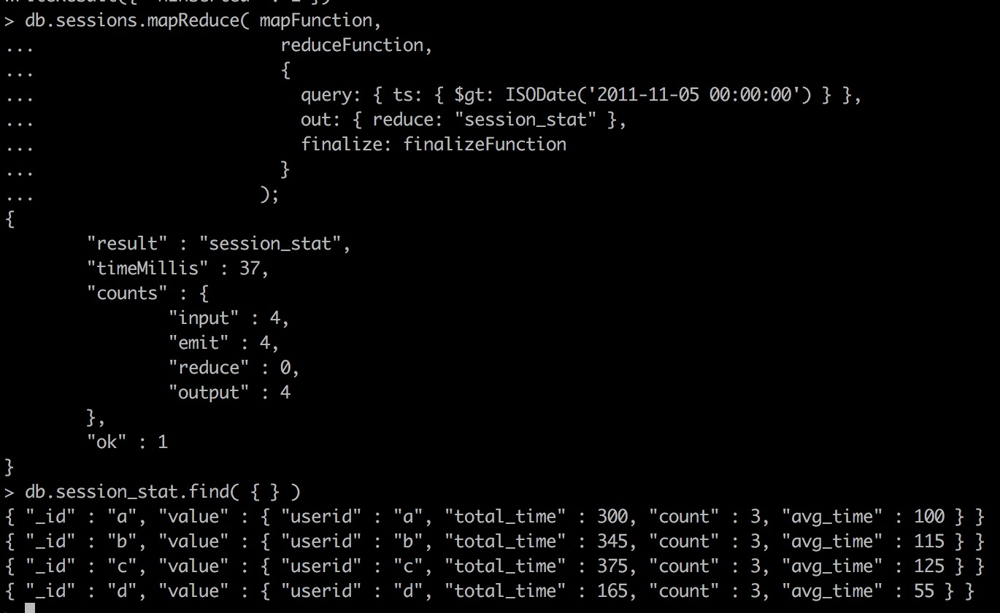

> 注意out属性中的reduce关键字

## Troubleshoot the Map Function ##

