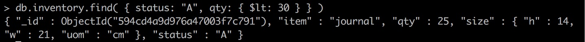
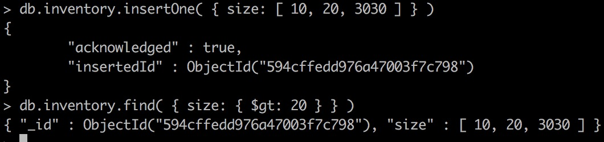
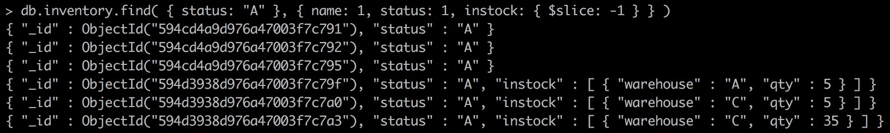
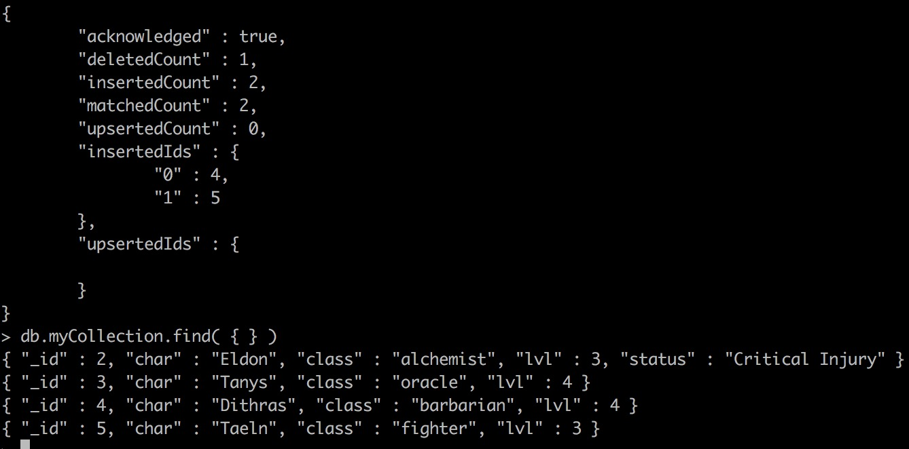

# MongoDB CRUD Operations #

CRUD operations create, read, update, and delete `documents`.

> CRUD就是传统数据库的基本操作

## Create Operations ##

Create or insert operations add new `documents` to a `collection`.

> 创建／插入操作会在`collection`中添加一个新的`document`

If the `collection` does not currently exist, insert operations will create the `collection`.

> 如果连`collection`都不存在，插入操作会创建这个`collection`

`MongoDB` provides the following methods to insert `documents` into a `collection`:

> `MongoDB`提供以下几个方法去插入`document`

+ db.collection.insertOne()
+ db.collection.insertMany()

In `MongoDB`, insert operations target a single `collection`.

> 插入操作的目标是单个`collection`，也就是说同时插入多个`collection`是不可行的

All write operations in MongoDB are `atomic` on the level of a single `document`.

> 在`document`层次的写入操作是原子性的
>
> `MongoDB`能不能保证几个写入操作是原子性的？比如写入多个`document`或者向多个`collection`写入？
>
> 这种组合原子操作使之成为原子操作的能力十分重要


## Read Operations ##

Read operations retrieves `documents` from a `collection`; i.e. queries a `collection` for `documents`.

> 读操作的目的是从`collection`中取出`document`，对于数据库来说，读操作就是查询操作

`MongoDB` provides the following methods to read documents from a `collection`:

> 查询操作在前面已经有意无意地提到过很多次

+ db.collection.find()


> 我还是想说，如果不支持用户传入闭包指定查询条件，`MongoDB`的查询方法的适用性有限

## Update Operations ##

Update operations modify existing `documents` in a `collection`. MongoDB provides the following methods to update `documents` of a `collection`:

> 修改操作一定要支持部分属性的升级

+ db.collection.updateOne()
+ db.collection.updateMany()
+ db.collection.replaceOne()

In `MongoDB`, update operations target a single `collection`. All write operations in `MongoDB` are atomic on the level of a single `document`.

> 同样，升级操作也保证`document`层次的原子性，也就是说，不可能一个属性升级成功了，而另一个属性升级失败了

You can specify criteria, or filters, that identify the documents to update. These filters use the same syntax as read operations.

> 升级操作甚至允许用条件选定需要升级的`document`


如果filter条件未空，则选择第一个`document`


事实上，如果条件不为空但是却选中多个`document`，仍然是升级第一个`document`

**updateOne**值得详细研究，尤其是其参数

猜想，**updateMany()**方法就是升级所有选中的`document`


自然，**replaceMany**方法就是替换掉整个`document`，而不是对属性值替换

## Delete Operations ##

Delete operations remove `documents` from a `collection`.

`MongoDB` provides the following methods to delete `documents` of a `collection`:

+ db.collection.deleteOne()
+ db.collection.deleteMany()

In `MongoDB`, delete operations target a single `collection`. All write operations in `MongoDB` are atomic on the level of a single `document`.

> 同样提供原子性保证

You can specify criteria, or filters, that identify the `documents` to remove. These filters use the same syntax as read operations.


## Bulk Write ##

`MongoDB` provides the ability to perform write operations in bulk. For details, see Bulk Write Operations.

> 大概就是把写操作组合在一起，减少通信的次数
>
> 有没有对这些绑在一起的写操作提供原子性呢？（始终关心）

# Insert Documents #

If the collection does not currently exist, insert operations will create the collection.

> 哎呀，又来……

## Insert a Single Document ##

**db.collection.insertOne()** inserts a single `document` into a `collection`.

> 单个`document`的插入

The following example inserts a new `document` into the **inventory** `collection`.

If the document does not specify an **_id** field, MongoDB adds the **_id** field with an **ObjectId** value to the new `document`.

> 如果在插入的时候确实**_id**域，则自动生成
>
> `_id`作为主键，十分重要
>
> 一般的应用不要去干涉`_id`的生成过程

```javascript
db.inventory.insertOne(
   { item: "canvas", qty: 100, tags: ["cotton"], size: { h: 28, w: 35.5, uom: "cm" } }
)
```

**insertOne()** returns a `document` that includes the newly inserted `document`’s **_id** field value.

## Insert Multiple Documents ##

**db.collection.insertMany()** can insert multiple `documents` into a `collection`. Pass an array of `documents` to the method.

```javascript
db.inventory.insertMany([
   { item: "journal", qty: 25, tags: ["blank", "red"], size: { h: 14, w: 21, uom: "cm" } },
   { item: "mat", qty: 85, tags: ["gray"], size: { h: 27.9, w: 35.5, uom: "cm" } },
   { item: "mousepad", qty: 25, tags: ["gel", "blue"], size: { h: 19, w: 22.85, uom: "cm" } }
])
```

## Insert Behavior ##

### Collection Creation ###

If the `collection` does not currently exist, insert operations will create the `collection`.

> 额……，😂

### _id Field ###

In `MongoDB`, each `document` stored in a `collection` requires a unique **_id** field that acts as a primary key. If an inserted `document` omits the **_id** field, the `MongoDB` driver automatically generates an **ObjectId** for the **_id** field.

> 主键，自动生成

This also applies to `documents` inserted through update operations with upsert: true.

### Atomicity ###

All write operations in `MongoDB` are atomic on the level of a single `document`.

> `document`层次的原子性保证
>
> 我关心的是原子操作的组合

### Write Acknowledgement ###

With write concerns, you can specify the level of acknowledgement requested from `MongoDB` for write operations.

> 感情这就是个预告？？(｡ì _ í｡)

## Insert Methods ##

`MongoDB` provides the following methods for inserting `documents` into a `collection`:

+ db.collection.insertOne()

+ db.collection.insertMany()

+ db.collection.insert()

  > 可以插入一个也可以插入多个，是上面两个函数的自动选择版本？

+ **db.collection.update()** when used with the **upsert: true** option.

+ **db.collection.updateOne()** when used with the **upsert: true** option.

+ **db.collection.updateMany()** when used with the **upsert: true** option.

+ **db.collection.findAndModify()** when used with the **upsert: true** option.

+ **db.collection.findOneAndUpdate()** when used with the **upsert: true** option.

+ **db.collection.findOneAndReplace()** when used with the **upsert: true** option.

+ **db.collection.save()**.

+ **db.collection.bulkWrite()**.

# Query Documents #

This page provides examples of query operations using the **db.collection.find()** method in the mongo shell. The examples on this page use the **inventory** `collection`.

准备工作如下：


## Select All Documents in a Collection ##

To select all `documents` in the `collection`, pass an empty `document` as the query filter parameter to the find method. The query filter parameter determines the select criteria:

> 如果想查找所有的`Document`，只要使得查找条件未空即可

```javascript
db.inventory.find( {} )
```

These operation corresponds to the following SQL statement:

```sql
SELECT * FROM inventory
```

别人是先学关系型数据库，我是先学非关系型数据库( ̀⌄ ́)

## Specify Equality Condition ##

To specify equality conditions, use \<field>:\<value> expressions in the query filter `document`:

> 使用等于条件是十分简单的

```javascript
{ <field1>: <value1>, ... }
```

The following example selects from the **inventory** `collection` all `documents` where the status equals **"D"**:


This operation corresponds to the following SQL statement:

```sql
SELECT * FROM inventory WHERE status = "D"
```

相比之下，我还是更喜欢命令式编程语言风格的查询语句，不太喜欢SQL的声明查询语句

## Specify Conditions Using Query Operators ##

A query filter `document` can use the **query operators** to specify conditions in the following form:

```javascript
{ <field1>: { <operator1>: <value1> }, ... }
```

重点来了，联合查找等都会在下面讲到

The following example retrieves all `documents` from the **inventory** `collection` where status equals either **"A"** or **"D"**:


Although you can express this query using the **or operator**, use the **in operator** rather than the **or operator** when performing equality checks on the same field.

> 虽然**in**操作符可以用**or**操作符代替，但是在这种我用于同一个域的情况下，还是用**in**比较好
>
> 从这两个单词的含义中也可以推测：**in**是指在某几个值中可以选择特定的一个，**or**指不同条件满足其中一个即可
>
> 虽然都可以达到相同的效果，但是思维不一样

The operation corresponds to the following SQL statement:

```sql
SELECT * FROM inventory WHERE status in ("A", "D")
```

### Specify AND Conditions ###

A compound query can specify conditions for more than one field in the `collection`’s `documents`.

> 一个复杂的查询可能是组合的，也就是说要求多个属性满足某些条件

Implicitly, a logical **AND** conjunction connects the clauses of a compound query so that the query selects the `documents` in the `collection` that match all the conditions.

> 可以看出来，`MongoDB`的查询条件是默认采用**AND**操作符的
>
> 当你在一个`document`中同时写上多个条件的时候，就是隐式地采取**AND**操作符

tips: 在mongo shell中输入**cls**可以清屏



The operation corresponds to the following SQL statement:

```sql
SELECT * FROM inventory WHERE status = "A" AND qty < 30
```

### Specify OR Conditions ###

Using the **$or** operator, you can specify a compound query that joins each clause with a logical OR conjunction so that the query selects the `documents` in the collection that match at least one condition.


**and**与**or**的比较

The operation corresponds to the following SQL statement:

```sql
SELECT * FROM inventory WHERE status = "A" OR qty < 30
```

### Specify AND as well as OR Conditions ###

```javascript
db.inventory.find( {
     status: "A",
     $or: [ { qty: { $lt: 30 } }, { item: /^p/ } ]
} )
```

```sql
SELECT * FROM inventory WHERE status = "A" AND ( qty < 30 OR item LIKE "p%")
```

## Additional Methods ##

The following methods can also read `documents` from a `collection`:

+ db.collection.findOne
+ In aggregation pipeline, the **$match** pipeline stage provides access to `MongoDB` queries.

## Query on Embedded/Nested Documents ##

This page provides examples of query operations on embedded/nested `documents` using the **db.collection.find()** method in the mongo shell.

> 查找条件是关于嵌套`document`的

### Match an Embedded/Nested Document ###


Equality matches on the whole embedded `document` require an exact match of the specified \<value> `document`, including the field order.

> 利用等于进行查找是需要满足顺序条件的

比如说，把顺序调换一下，就查找不到任何`document`


### Query on Nested Field ###

To specify a query condition on fields in an embedded/nested `document`, use the dot notation (**"field.nestedField"**).

> 如果匹配条件不是等于，那么就有一点麻烦
>
> 使用点操作符

#### Specify Equality Match on a Nested Field ####

The following example selects all `documents` where the field **uom** nested in the **size** field equals **"in"**:

```javascript
db.inventory.find( { "size.uom": "in" } )
```

#### Specify Match using Query Operator ####

A query filter `document` can use the **query operators** to specify conditions in the following form:

```javascript
{ <field1>: { <operator1>: <value1> }, ... }
```

The following query uses the less than operator (**$lt**) on the field **h** embedded in the **size** field:

```javascript
db.inventory.find( { "size.h": { $lt: 15 } } )
```

#### Specify AND Condition ####

```javascript
db.inventory.find( { "size.h": { $lt: 15 }, "size.uom": "in", status: "D" } )
```

与操作符是默认的，不需要专门加上去，当然显式使用与操作符也没错

## Query an Array ##

This page provides examples of query operations on array fields using the **db.collection.find()** method in the mongo shell.

### Match an Array ###

To specify equality condition on an array, use the query `document` { \<field>: \<value> } where \<value> is the exact array to match, including the order of the elements.

The following example queries for all documents where the **field** tags value is an array with **exactly** two elements, **"red"** and **"blank"**, in the specified order:


数组默认是全部匹配的，也就是上面提到的**"exactly"**，从例子中可以看到，部分是不能匹配的，乱序也是不能匹配的

如果希望乱序／部分也能够匹配：


### Query an Array for an Element ###

To query if the array field contains at least **one** element with the specified value, use the filter { \<field>: \<value> } where \<value> is the element value.


现在我们有两种部分匹配的查找办法

To specify conditions on the elements in the array field, use **query operators** in the query filter `document`:

> （这个很重要）对数组中的元素如何进行条件限定？

```javascript
{ <array field>: { <operator1>: <value1>, ... } }
```



至少一个元素大于20

### Specify Multiple Conditions for Array Elements ###

When specifying compound conditions on array elements, you can specify the query such that either a single array element meets these condition or any combination of array elements meets the conditions.

> 对于数组的多条件限制，存在两种情况：
>
> 要求某一个特定的元素满足所有的条件
>
> 允许元素A满足一个条件，元素B满足另一个条件，元素C满足另一个条件等等

#### Query an Array with Compound Filter Conditions on the Array Elements ####

The following example queries for documents where the **dim_cm** array contains elements that in some combination satisfy the query conditions; e.g., one element can satisfy the greater than 15 condition and another element can satisfy the less than 20 condition, or a single element can satisfy both:

> 下面这个例子对应的是第二种情况，允许不同的元素分别满足不同的条件

```javascript
db.inventory.find( { dim_cm: { $gt: 15, $lt: 20 } } )
```

#### Query for an Array Element that Meets Multiple Criteria ####

Use **$elemMatch** operator to specify multiple criteria on the elements of an array such that at least **one** array element satisfies **all** the specified criteria.

The following example queries for documents where the dim_cm array contains at least one element that is both greater than (**\$gt**) 22 and less than (**\$lt**) 30:

```javascript
db.inventory.find( { dim_cm: { $elemMatch: { $gt: 22, $lt: 30 } } } )
```

#### Query for an Element by the Array Index Position ####

Using the **dot notation**, you can specify query conditions for an element at a particular index or position of the array. The array uses zero-based indexing.

```javascript
db.inventory.find( { "dim_cm.1": { $gt: 25 } } )
```

#### Query an Array by Array Length ####

Use the **$size** operator to query for arrays by number of elements. For example, the following selects documents where the array tags has 3 elements.

```javascript
db.inventory.find( { "tags": { $size: 3 } } )
```

## Query an Array of Embedded Documents ##

This page provides examples of query operations on an array of nested `documents` using the **db.collection.find()** method in the mongo shell.

> 数组的元素是`document`，如何查询呢？
>
> 这几乎是最复杂的一种情况
>
> document中含有数组通过点操作符就可以解决

The examples on this page use the **inventory** `collection`. To populate the **inventory** `collection`, run the following:


### Query for a Document Nested in an Array ###

The following examples selects all `documents` where an element in the **instock** array matches the specified `document`:


就从上面两个例子来看，数组的元素是基本类型还是`document`不太影响，一样用

Equality matches on the whole embedded/nested `document` require an **exact** match of the specified `document`, including the field **order**.

> 不过涉及到`document`，就要求全部字段匹配，甚至包括字段顺序

For example, the following query does not match any `documents` in the **inventory** `collection`:


### Specify a Query Condition on a Field in an Array of Documents ###

#### Use the Array Index to Query for a Field in the Embedded Document ####

Using the **dot notation**, you can specify query conditions for field in a `document` at a particular index or position of the array. The array uses zero-based indexing.

> 用点操作符就指定了固定的元素，然后就和查询普通`document`没什么区别，这我也能想到

The following example selects all `documents` where the **instock** array has as its first element a `document` that contains the field **qty** whose value is less than or equal to 20:

```javascript
db.inventory.find( { 'instock.0.qty': { $lte: 20 } } )
```

#### Specify a Query Condition on a Field Embedded in an Array of Documents ####

If you do not know the index position of the `document` nested in the array, concatenate the name of the array field, with a dot (***.***) and the name of the field in the nested `document`.

> 这就很机智了，如果你不知道具体的下标，可以省略下标

The following example selects all `documents` where the **instock** array has **at least one** embedded `document` that contains the field **qty** whose value is less than or equal to 20:


### Specify Multiple Conditions for Array of Documents ###

还是两种情况：

1. 允许多个元素分别满足其中一个或多个条件
2. 至少一个元素满足所有条件

When specifying conditions on more than one field nested in an array of `documents`, you can specify the query such that either a single `document` meets these condition or any combination of `documents `(including a single `document`) in the array meets the conditions.

> 还是我之前的那个意思
>
> 我猜测还是用arrayName.fieldName来选择未知的元素，然后结合前面的方法完成这两个目标

#### A Single Nested Document Meets Multiple Query Conditions on Nested Fields ####

Use **$elemMatch** operator to specify multiple criteria on an array of embedded `documents` such that **at least one** embedded `document` satisfies all the specified criteria.

The following example queries for `documents` where the **instock** array has **at least one** embedded `document` that contains both the field **qty** equal to 5 and the field **warehouse** equal to A:

> 下面的例子就是第二种情况：至少一个元素满足所有条件


注意允许乱序

The following example queries for `documents` where the **instock** array has at least one embedded `document` that contains the field **qty** that is greater than 10 and less than or equal to 20:

```javascript
db.inventory.find( { "instock": { $elemMatch: { qty: { $gt: 10, $lte: 20 } } } } )
```

#### Combination of Elements Satisfies the Criteria ####

If the compound query conditions on an array field do not use the **$elemMatch** operator, the query selects those `documents` whose array contains any combination of elements that satisfies the conditions.

> 这是前面提到的第一种情况
>
> 什么都不干的默认结果就是这个

For example, the following query matches `documents` where **any** `document` nested in the **instock** array has the **qty** field greater than 10 and any `document` (but **not necessarily** the same embedded `document`) in the array has the **qty** field less than or equal to 20:

```javascript
db.inventory.find( { "instock.qty": { $gt: 10,  $lte: 20 } } )
```


The following example queries for `documents` where the **instock** array has at least one embedded `document` that contains the field **qty** equal to 5 and at least one embedded `document` (but **not necessarily** the same embedded `document`) that contains the field **warehouse** equal to A:

> 注意不必要时同一个内嵌`document`

```javascript
db.inventory.find( { "instock.qty": 5, "instock.warehouse": "A" } )
```

## Project Fields to Return from Query ##

By default, queries in `MongoDB` return all fields in matching `documents`. To limit the amount of data that `MongoDB` sends to applications, you can include a **projection** `document` to specify or restrict fields to return.

> 默认来说，`MongoDB`会返回选中的文档的所有域，但也许不是所有域应用都需要，这样会浪费流量
>
> 因此我们可以在查询的时候说明我们要哪些域

This page provides examples of query operations with **projection** using the **db.collection.find()** method in the mongo shell. The examples on this page use the **inventory** `collection`. To populate the **inventory** `collection`, run the following:


### Return All Fields in Matching Documents ###

If you do not specify a **projection** `document`, the **db.collection.find()** method returns all fields in the matching `documents`.

> 我也不明白这个用于选定域的`document`为什么被称为**projection**？

The following example returns all fields from all `documents` in the **inventory** `collection` where the **status** equals "A":

```javascript
db.inventory.find( { status: "A" } )
```

The operation corresponds to the following SQL statement:

```sql
SELECT * from inventory WHERE status = "A"
```

### Return the Specified Fields and the _id Field Only ###

A projection can explicitly include several fields by setting the **\<field>** to **1** in the projection `document`. The following operation returns all `documents` that match the query. In the result set, only the **item**, **status** and, by default, the **_id** fields return in the matching `documents`.


这看来**\<field>**的值只有是0和不是0的区别，换句话来说，这就是一个伪装成整数类型值的Boolean类型值

The operation corresponds to the following SQL statement:

```sql
SELECT _id, item, status from inventory WHERE status = "A"
```

### Suppress _id Field ###

You can remove the **_id** field from the results by setting its exclusion **\<field>** to **0** in the projection, as in the following example:

> 看来这真的是一个波尔值啊（咩咩咩🐑）


我果然是对的（嘻嘻😁）

The operation corresponds to the following SQL statement:

```sql
SELECT item, status from inventory WHERE status = "A"
```

### Return All But the Excluded Fields ###

Instead of listing the fields to return in the matching `document`, you can use a projection to exclude specific fields. The following example which returns all fields except for the **status** and the **instock** fields in the matching `documents`:

> 如果猜的是对的，把要屏蔽的属性设置为0即可


With the exception of the **_id** field, you cannot combine inclusion and exclusion statements in projection `documents`.

> 主键**_id**总是有特权的，无论是在输入时还是在输出时

### Return Specific Fields in Embedded Documents ###

You can return specific fields in an embedded `document`. Use the dot notation to refer to the embedded field and set to **1** in the projection `document`.

The following example returns: the **_id** field (returned by default), **item** field, **status** field, and the **uom** field in the **size** `document`; the **uom** field remains embedded in the **size** `documen`t.


可以看到size属性中只返回了uom属性的值

组合点操作符去处理内嵌`document`是一件意料之中的事情

不得不所，`MongoDB`的查询语言设计得挺好的

### Suppress Specific Fields in Embedded Documents ###

You can suppress specific fields in an embedded `document`. Use the dot notation to refer to the embedded field in the projection `document` and set to **0**.


注意包含和去除是不能混合的：


### Projection on Embedded Documents in an Array ###

Use dot notation to project specific fields inside `documents` embedded in an array.


我还以为是选定某一个下标的元素呢（😂）

不过选定数组中的`document`的某个属性也挺有用的，用的方法也合情合理，还是用点操作符


显然，它把下标当成了属性名字，那请问怎么指定选中数组中的某个元素呢？

### Project Specific Array Elements in the Returned Array ###

For fields that contain arrays, `MongoDB` provides the following projection operators: **\$elemMatch**, **\$slice**, and **\$**.

> 诶，我提出了一个好问题？还是我和文档的原作者心有灵犀？

The following example uses the **\$slice** projection operator to return just the last element in the **instock** array.



**$elemMatch**, **\$slice**, and **\$** are the **only** way to project specific elements to include in the returned array. 

> 唯一方式，稳

For instance, you **cannot** project specific array elements using the array index; e.g. **{ "instock.0": 1 }** projection will not project the array with the first element.

> 还顺便打了我之前的脸，很稳

话说**\$elemMatch**和**\$**怎么用来着？

## Query for Null or Missing Fields ##

Different query operators in `MongoDB` treat **null** values differently.

> 不同的查询方法对**null**的处理方法很不一样
>
> 这个**null**指的是query `document`中的**null**？

This page provides examples of operations that query for **null** values using the **db.collection.find()** method in the mongo shell.

准备工作：


### Equality Filter ###

The **{ item : null }** query matches `documents` that either contain the item field whose value is **null** **or** that do **not** contain the item field.

> 如果查询文档中的某个属性的属性值为空，会匹配该属性值为空的文档或者不具备该属性的文档

For example, the following query returns both `documents`:


### Type Check ###

The **{ item : { $type: 10 } }** query matches `documents` that contains the **item** field whose value is **null** **only**; i.e. the value of the item field is of BSON Type Null (i.e. 10) :

> 10到底是什么意思？


感情10是类型标号？每个数字代表一个类型？

那请问插入的时候写的是null，`MongoDB`凭什么认定这个域是什么类型？

The query returns only the `document` where the **item** field has a **null** value.

### Existence Check ###

The **{ item : { $exists: false } }** query matches `documents` that **do not** contain the item field:


The query returns only the `document` that does not contain the **item** field.

## Iterate a Cursor in the mongo Shell ##

The **db.collection.find()** method returns a **cursor**. To access the `documents`, you need to iterate the cursor. However, in the mongo shell, if the returned cursor is not assigned to a variable using the var keyword, then the cursor is automatically iterated up to 20 times to print up to the first 20 documents in the results.

> 迭代器与自动迭代的那些事.txt

The following examples describe ways to manually iterate the cursor to access the `documents` or to use the **iterator index**.

### Manually Iterate the Cursor ###

In the mongo shell, when you assign the cursor returned from the **find()** method to a variable using the **var** keyword, the cursor does not automatically iterate.

> 只要记录下迭代器，就不会自动迭代


两种遍历方式，一种是类似于Java的迭代方式，一种是forEach

### Iterator Index ###

In the mongo shell, you can use the **toArray()** method to iterate the cursor and return the `documents` in an array, as in the following:

```javascript
var myCursor = db.inventory.find( { type: 2 } );
var documentArray = myCursor.toArray();
var myDocument = documentArray[3];
```

The **toArray()** method loads into **RAM** all `documents` returned by the cursor; the **toArray()** method exhausts the cursor.

> 这个方法请适当使用
>
> 需要使用的情况包括：需要反复按照下标访问某一元素

Additionally, some drivers provide access to the `documents` by using an index on the cursor (i.e. **cursor[index]**). This is a **shortcut** for first calling the **toArray()** method and then using an index on the resulting array.

> **cursor[index]**这种看上去很方便的寻址方式代价并不小
>
> 不要被它简洁的语法骗了，更不要滥用这个方法
>
> 显然，对迭代器本身建立数组是一种更加节省的办法，为什么不采用这个作为默认实现？

 

感情把迭代器添加进数组的结果就是把`document`添加进数组啊

那忽略我“以迭代器作为元素，建立数组”的想法

那其他语言是否一样呢？

The **myCursor[1]** is equivalent to the following example:

```javascript
myCursor.toArray() [1];
```

### Cursor Behaviors ###

#### Closure of Inactive Cursors ####

By default, the server will automatically close the cursor after 10 minutes of inactivity, or if client has exhausted the cursor.

> 默认地，服务器会自动回收过期的迭代器

```javascript
var myCursor = db.users.find().noCursorTimeout();
```

After setting the **noCursorTimeout** option, you must either close the cursor manually with **cursor.close()** or by exhausting the cursor’s results.

> 如果服务器不自动回收超过一定时间不活跃的迭代器，你需要通过调用特定的方法或者是使得迭代器所指向的资源失效来回收迭代器

#### Cursor Isolation ####

As a cursor returns `documents`, other operations may interleave with the query. For the MMAPv1 storage engine, intervening write operations on a `document` may result in a cursor that returns a `document` more than once if that `document` has changed. To handle this situation, see the information on snapshot mode.

> 我们知道，在查询完成之后返回一个迭代器
>
> 返回迭代器和取出某个特定的结果之间是有时间间隔的
>
> 这里面就会有写操作带来的冲突问题（因为返回的是迭代器而不是拷贝）
>
> 处理这个问题是极其复杂的，要了解引擎碰到这种情况的处理结果，也要尽量在应用程序这个层次上避免这种情况

#### Cursor Batches ####

The `MongoDB` server returns the query results in **batches**. The amount of data in the **batch** will not exceed the maximum `BSON` `document` size. To override the default size of the **batch**, see **batchSize()** and **limit()**.

> 这个说的是对单个`document`有大小限制？
>
> 一般来所，设计良好的数据库不会发生这个问题
>
> 对于`JSON`数据库来说，不要反悔一颗很大的子树就可以了

Operations of type **find()**, **aggregate()**, **listIndexes**, and **listCollections** return a maximum of 16 megabytes per batch. **batchSize()** can enforce a smaller limit, but not a larger one.

> 还是相同的大小限制？看来16MB很合理嘛

**find()** and **aggregate()** operations have an initial batch size of **101** `documents` by default. Subsequent **getMore** operations issued against the resulting cursor have no default batch size, so they are limited only by the 16 megabyte message size.

> 你在逗我？返回的是迭代器为什么还有批次这个说法？

For queries that include a sort operation without an index, the server must load **all** the `documents` in memory to perform the sort before returning any results.

> 因为可能的排序操作？那这么说，只要排序用迭代器就毫无意义？反正数据都已经在内存里了？

As you iterate through the cursor and reach the end of the returned batch, if there are more results, **cursor.next()** will perform a **getMore** operation to retrieve the next batch. To see how many `documents` remain in the batch as you iterate the cursor, you can use the **objsLeftInBatch()** method, as in the following example:

> 总结一下，虽然用了迭代器，但是不知道什么原因，迭代器所指向的数据仍然是按照一定的批次大小返回的
>
> 这对用户来说没有什么影响，因为**cursor.next()**操作会自动加载更多的批次
>
> 最后，对于有排序需求的`document`，这个批次的作用就没有了，所有的数据一次载入内存
>
> 所以`collection`的大小很关键

```javascript
var myCursor = db.inventory.find();

var myFirstDocument = myCursor.hasNext() ? myCursor.next() : null;

myCursor.objsLeftInBatch();
```

### Cursor Information ###

The **db.serverStatus()** method returns a `document` that includes a **metrics** field. The **metrics** field contains a **metrics.cursor** field with the following information:

+ number of timed out cursors since the last server restart
+ number of open cursors with the option **DBQuery.Option.noTimeout** set to prevent timeout after a period of inactivity
+ number of “pinned” open cursors
+ total number of open cursors


# Update Documents #

This page provides examples of how to update `documents` in using the following methods in the mongo shell:

+ db.collection.updateOne(\<filter>, \<update>, \<options>)
+ db.collection.updateMany(\<filter>, \<update>, \<options>)
+ db.collection.replaceOne(\<filter>, \<replacement>, \<options>)

准备工作：


```javascript
db.inventory.insertMany( [
   { item: "canvas", qty: 100, size: { h: 28, w: 35.5, uom: "cm" }, status: "A" },
   { item: "journal", qty: 25, size: { h: 14, w: 21, uom: "cm" }, status: "A" },
   { item: "mat", qty: 85, size: { h: 27.9, w: 35.5, uom: "cm" }, status: "A" },
   { item: "mousepad", qty: 25, size: { h: 19, w: 22.85, uom: "cm" }, status: "P" },
   { item: "notebook", qty: 50, size: { h: 8.5, w: 11, uom: "in" }, status: "P" },
   { item: "paper", qty: 100, size: { h: 8.5, w: 11, uom: "in" }, status: "D" },
   { item: "planner", qty: 75, size: { h: 22.85, w: 30, uom: "cm" }, status: "D" },
   { item: "postcard", qty: 45, size: { h: 10, w: 15.25, uom: "cm" }, status: "A" },
   { item: "sketchbook", qty: 80, size: { h: 14, w: 21, uom: "cm" }, status: "A" },
   { item: "sketch pad", qty: 95, size: { h: 22.85, w: 30.5, uom: "cm" }, status: "A" }
]);
```

## Update Documents in a Collection ##

To update a `document`, `MongoDB` provides **update operators**, such as **$set**, to modify field values.

> 可以好好关注一下**update operators**

To use the **update operators**, pass to the update methods an update `document` of the form:

```javascript
{
  <update operator>: { <field1>: <value1>, ... },
  <update operator>: { <field2>: <value2>, ... },
  ...
}
```

Some **update operators**, such as **$set**, will create the field if the field does not exist.

> 有一些升级操作符，会导致原本不存在的域被创建

能不能升级操作符嵌套升级操作符？或者针对不同的域采用不同的策略？

### Update a Single Document ###


The update operation:

+ uses the **$set** operator to update the value of the **size.uom** field to "cm" and the value of the **status** field to "P",
+ uses the **\$currentDate** operator to update the value of the **lastModified** field to the current date. If **lastModified** field does not exist, **\$currentDate** will create the field. See **\$currentDate** for details.

### Update Multiple Documents ###

The following example uses the **db.collection.updateMany()** method on the **inventory** `collection` to update all `documents` where **qty** is less than 50:

```javascript
db.inventory.updateMany(
   { "qty": { $lt: 50 } },
   {
     $set: { "size.uom": "in", status: "P" },
     $currentDate: { lastModified: true }
   }
)
```

## Replace a Document ##

To replace the **entire** content of a `document` **except** for the `_id` field, pass an entirely new `document` as the second argument to **db.collection.replaceOne()**.

> relpace操作会替换整个`document`，除了**_id**域

When replacing a `document`, the replacement `document` must consist of **only** field/value pairs.

> 因为是替换操作，自然不存在升级方式的问题，所以不需要任何升级操作符

The replacement `document` can have **different** fields from the original `document`. In the replacement `document`, you can omit the **_id** field since the **_id** field is immutable; however, if you do include the **_id** field, it must have the **same** value as the current value.

> 替换操作当然允许不一样的域，这不是关系型数据库
>
> **_id**的不变性

```javascript
db.inventory.replaceOne(
   { item: "paper" },
   { item: "paper", instock: [ { warehouse: "A", qty: 60 }, { warehouse: "B", qty: 40 } ] }
)
```

## Behavior ##

+ Atomicity

  All write operations in `MongoDB` are atomic on the level of a single `document`. For more information on `MongoDB` and atomicity, see Atomicity and Transactions.

  > `MongoDB`中的所有写操作在`document`层次上都是原子性的

+ **_id** Field

  Once set, you cannot update the value of the **_id** field nor can you replace an existing `document` with a replacement `document` that has a different **_id** field value.

  > 主键的特殊性之一：不能够被替换

+ `Document` Size

  When performing update operations that increase the `document` size beyond the allocated space for that document, the update operation relocates the document on disk.

  为了高性能，`MongoDB`在记录能够使用的空间上有限制

+ Field Order

  `MongoDB` preserves the order of the `document` fields following write operations except for the following cases:

  + The **_id** field is always the first field in the `document`.

    > 主键特殊性之二：永远是第一位

  + Updates that include **renaming** of field names may result in the reordering of fields in the `document`.

    > 如果重命名某个域可能导致字段的重新排序

+ **Upsert** Option

  If **updateOne()**, **updateMany()**, or **replaceOne()** includes **upsert : true** and **no** `documents` match the specified filter, then the operation **creates** a new `document` and **inserts** it. If there are matching `documents`, then the operation modifies or replaces the matching `document` or `documents`.

  > 如果添加**upsert : true**选项，那么上述几个对象的行为就是：
  >
  > 找到则修改，找不到则插入

## Update Methods ##


The following methods can also update documents from a collection:

+ db.collection.findOneAndReplace()
+ db.collection.findOneAndUpdate()
+ db.collection.findAndModify()
+ db.collection.save()
+ db.collection.bulkWrite()

# Delete Documents #

This page provides examples of **delete** operations using the following methods in the mongo shell:

> 先介绍一些待会会用到的两个方法

+ db.collection.deleteMany()
+ db.collection.deleteOne()

照旧先上准备工作：

```javascript
db.inventory.insertMany( [
   { item: "journal", qty: 25, size: { h: 14, w: 21, uom: "cm" }, status: "A" },
   { item: "notebook", qty: 50, size: { h: 8.5, w: 11, uom: "in" }, status: "P" },
   { item: "paper", qty: 100, size: { h: 8.5, w: 11, uom: "in" }, status: "D" },
   { item: "planner", qty: 75, size: { h: 22.85, w: 30, uom: "cm" }, status: "D" },
   { item: "postcard", qty: 45, size: { h: 10, w: 15.25, uom: "cm" }, status: "A" },
]);
```

## Delete All Documents ##

```javascript
db.inventory.deleteMany({})
```

如果阅读了前面的文档，那么这句话应该不难理解

The method returns a `document` with the **status** of the operation.

> 返回一个带有操作状态的`document`

## Delete All Documents that Match a Condition ##

You can specify criteria, or filters, that identify the `documents` to delete. The filters use the same syntax as read operations.

```javascript
{ <field1>: { <operator1>: <value1> }, ... }
```

> 我只想说，删除操作里的条件`document`和读写操作里的条件`document`是一样的

```javascript
db.inventory.deleteMany({ status : "A" })
```

删除所有的状态为A的`docuement`

## Remove Only One Document that Matches a Condition ##

To delete **at most** a single `document` that matches a specified filter (even though multiple `documents` may match the specified filter) use the **db.collection.deleteOne()** method.

> 这真的没有什么好说的，利用前面的指示都可以推导出来
>
> Find/Update/Remove + Many/One
>
> 从两个维度去理解6种方法，再加上一些零零散散的诸如Replace之类的方法
>
> 对基本的CRUD操作就有基本的认知

## Delete Behavior ##

+ Indexes

  Delete operations do not drop indexes, even if deleting all `documents` from a collection.

  > 没看懂，囧（😳）
  >
  > 该详细的只有一句话，哎……

+ Atomicity

  原文我都不想放了，也不想翻译了……

## Delete Methods ##


The following methods can also delete documents from a collection:

+ db.collection.findOneAndDelete()

  findOneAndDelete() provides a sort option. The option allows for the deletion of the first `document` sorted by the specified order.

  > 支持排序是亮点

+ db.collection.findAndModify()

  db.collection.findAndModify() provides a sort option. The option allows for the deletion of the first `document `sorted by the specified order.

+ db.collection.bulkWrite()

# Bulk Write Operations #

在正式地看文档和翻译文档之前，我还是要大吼一声：批操作具备原子性吗？

## Overview ##

`MongoDB` provides clients the ability to perform write operations in **bulk**. Bulk write operations affect a **single** `collection`. 

> 一个对使用者不太好的消息：bulk write operations是针对一个`collection`的

`MongoDB` allows applications to determine **the acceptable level of acknowledgement** required for bulk write operations.

> 接下来重点理解什么是**the acceptable level of acknowledgement**？

The **db.collection.bulkWrite()** method provides the ability to perform bulk **insert**, **update**, and **remove** operations.

> 虽然这个方法的名字里带write，但是不仅仅支持写，还支持增／改

`MongoDB` also supports bulk insert through the **db.collection.insertMany()**.

> insert操作具有一个update/delete操作不具备的性质：它不需要指定条件`document`
>
> 所以，你可以认为**insertMany**方法是一种批量操作
>
> 但是，相应的**updateMany**/**deleteMany**却不是批量操作，虽然它们的方法名中带有**Many**

## Ordered vs Unordered Operations ##

Bulk write operations can be either **ordered** or **unordered**.

> 应该无序写入会快一点？
>
> 有序写入对于批操作来说是非常重要的，Firebase默认支持有序写入

With an ordered list of operations, `MongoDB` executes the operations serially. 

> 有序写入自然是序列式执行

If an error occurs during the processing of one of the write operations, `MongoDB` will return without processing any **remaining** write operations in the list.

> 如果中间某一个操作导致了错误，整个批操作立即停止并且返回
>
> 是不是会返回一个整型数告诉客户端处理到第几个操作时遇到了问题？

With an unordered list of operations, `MongoDB` can execute the operations in parallel, but this behavior is not guaranteed.

> 果然无序的批操作处理起来会快一点，都并行了难道不会快？

If an error occurs during the processing of one of the write operations, `MongoDB` will continue to process remaining write operations in the list.

> 如果出错，会继续执行
>
> 是不是用一个数组或者列表告诉用户哪些操作失败了？

Executing an ordered list of operations on a sharded collection will generally be slower than executing an unordered list since with an ordered list, each operation must wait for the previous operation to finish.

> 废话，序列总是比并发慢

By default, **bulkWrite()** performs **ordered** operations. To specify unordered write operations, set **ordered : false** in the options document.

> 默认是有序，可以设置成无序

## bulkWrite() Methods ##

**bulkWrite()** supports the following write operations:

+ insertOne

  insertMany不在此列的原因很明显，它本身就是批操作

+ updateOne

+ updateMany

+ replaceOne

+ deleteOne

+ deleteMany

Each write operation is passed to **bulkWrite()** as a `document` in an array.

每一个被支持的操作（这里不说写操作，写操作在本语境下有两重意思：改变`collection`的操作／插入操作），都用`document`的形式传给**bulkWrite()**方法

For example, the following performs multiple write operations:




关键代码如下：

```javascript
try {
   db.characters.bulkWrite(
      [
         { insertOne :
            {
               "document" :
               {
                  "_id" : 4, "char" : "Dithras", "class" : "barbarian", "lvl" : 4
               }
            }
         },
         { insertOne :
            {
               "document" :
               {
                  "_id" : 5, "char" : "Taeln", "class" : "fighter", "lvl" : 3
               }
            }
         },
         { updateOne :
            {
               "filter" : { "char" : "Eldon" },
               "update" : { $set : { "status" : "Critical Injury" } }
            }
         },
         { deleteOne :
            { "filter" : { "char" : "Brisbane"} }
         },
         { replaceOne :
            {
               "filter" : { "char" : "Meldane" },
               "replacement" : { "char" : "Tanys", "class" : "oracle", "lvl" : 4 }
            }
         }
      ]
   );
}
catch (e) {
   print(e);
}
```

为了弄懂**bulkWrite**的用法，我写了一些等价的示例：


站在API设计者的角度上来说，**bulkWrite**的用法是很简单的：

1. **bulkWrite**设计的目的是组合各种操作，所以会沿用**updateOne**等方法
2. 为了辨识这些操作，用它们的名字作为key最好不过
3. 那么参数怎么办呢？有两种选择：数组（按照原本的顺序）／集合（添加上该参数的名字）
4. `MongoDB`选择用集合，好处是可以打乱顺序，坏处是`MongoDB`本身的API少见按名传参，都是按顺序传参，造成不统一

## Strategies for Bulk Inserts to a Sharded Collection ##

Large bulk insert operations, including initial data inserts or routine data import, can affect **sharded cluster** performance.

> 大的批操作会影响共享集群的性能，所以需要额外做一些处理
>
> 我很好奇在这里共享集群的定义是什么

For bulk inserts, consider the following strategies:

### Pre-Split the Collection ###

If the sharded `collection` is empty, then the `collection` has only one initial chunk, which resides on a single shard. `MongoDB` must then take time to receive data, create splits, and distribute the split chunks to the available shards. To avoid this performance cost, you can pre-split the `collection`, as described in Split Chunks in a Sharded Cluster.

> 这部分的内容都等到了解什么是共享集群之后再说
>
> `MongoDB`声称自己天生支持水平向扩展，和这个共享集群有关系吗？

### Unordered Writes to mongos ###

### Avoid Monotonic Throttling ###

# SQL to MongoDB Mapping Chart #

这一节内容是为熟悉关系型数据库的用户准备的，告诉你关系型数据库的那些东西可以直接对应到`MongoDB`

但对我来说，就显得有些鸡肋

## Terminology and Concepts ##

## Executables ##

## Examples ##

## Additional Resources ##

# Read Concern #

# Write Concern #

# MongoDB CRUD Concepts #

## Atomicity and Transactions ##

## Read Isolation, Consistency, and Recency ##

## Distributed Queries ##

## Distributed Write Operations ##

## Perform Two Phase Commits ##

## Linearizable Reads via findAndModify ##

## Query Plans ##

## Query Optimization ##

### Evaluate Performance of Current Operations ###

### Optimize Query Performance ###

### Write Operation Performance ###

### Explain Results ###

## Analyze Query Performance ##

## Tailable Cursors ##
