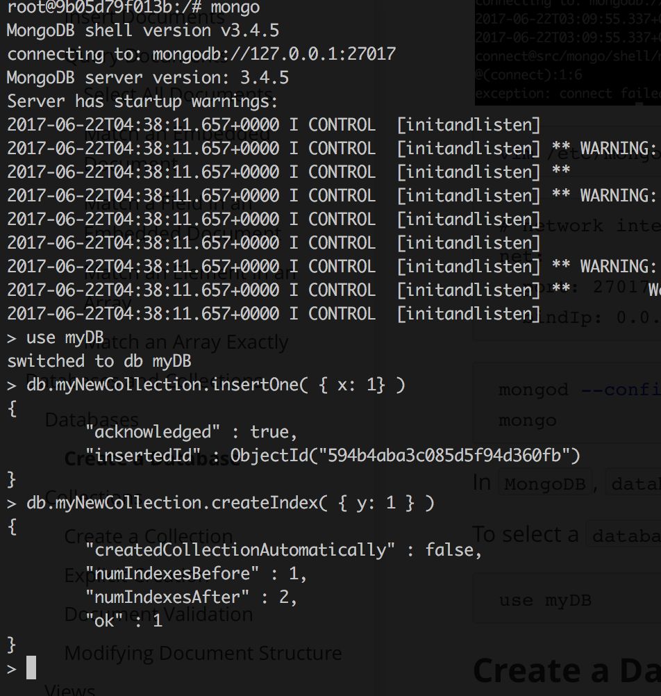
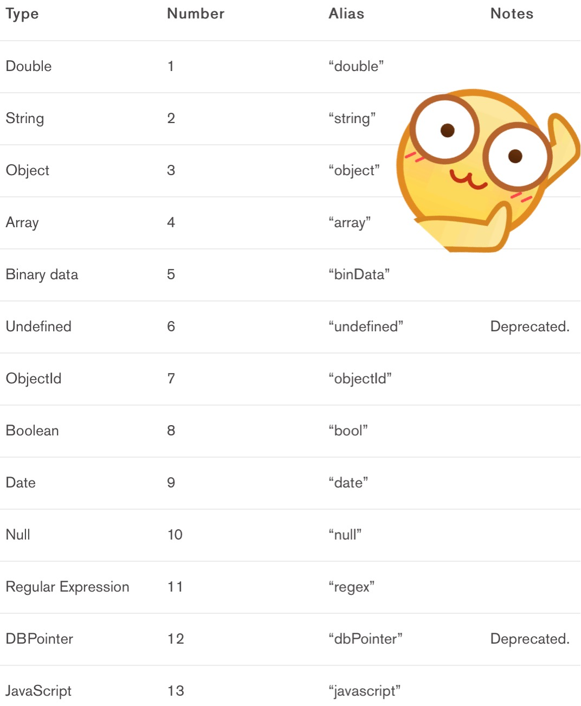

# Introduction #

`MongoDB` is an open-source `document` database that provides high performance, high availability, and automatic scaling.

> `MongoDB`是一个开源的文档式数据库，承诺提供高性能／高可用性／自动伸缩（能结合`Docker`然后自动生成销毁容器就更加完美）

## Document Database ##

A record in `MongoDB` is a `document`, which is a data structure composed of field and value pairs. `MongoDB` `documents` are similar to `JSON` objects. The values of fields may include other `documents`, arrays, and arrays of `documents`.

> `MongoDB`中的`document`就是记录
>
> 换言之，`document`就是表项，也和`JSON`对象很相视
>
> 键值对中的值可以是常见的类型（整数／字符串等），也可以是数组，还可以是另一个`document`


The advantages of using `documents` are:

+ `Documents` (i.e. objects) correspond to native data types in many programming languages.

  > `Documents`与编程语言的对象具有非常明显的一一对应关系
  >
  > 省掉`ORM`

+ Embedded `documents` and arrays reduce need for expensive joins.

  > 支持`JSON`树使得表关联的需要被降低

+ Dynamic schema supports fluent polymorphism.

  > 动态规则支持流体多态
  >
  > 什么是动态规则？
  >
  > 什么是流体多态？

## Key features ##

### High Performance ###

`MongoDB` provides high performance data persistence. In particular,

> `MongoDB`提供高性能的数据持久化，特别是：

+ Support for embedded data models reduces I/O activity on database system.

  > 支持内嵌的数据模型以减少IO请求的次数

+ Indexes support faster queries and can include keys from embedded `documents` and arrays.

### Rich Query Language ###

`MongoDB` supports a rich query language to support read and write operations (CRUD) as well as:

+ Data Aggregation
+ Text Search and Geospatial Queries.

# Getting Started #

`MongoDB Atlas` is a cloud-hosted service for provisioning, running, monitoring, and maintaining `MongoDB` deployments. It is a fast, easy, and free way to get started with `MongoDB`. To install and run `MongoDB` locally, see Install `MongoDB`.

> `MongoDB Atlas`是一种云数据存储服务，是收费的，显然我是不会去用的
>
> 那么，动手搭建一个`MongoDB`服务吧

## Install MongoDB ##

```dockerfile
FROM ubuntu:16.04
MAINTAINER demons 837940593@qq.com

ADD sources.list /etc/apt/sources.list
RUN apt-key adv --keyserver hkp://keyserver.ubuntu.com:80 --recv 0C49F3730359A14518585931BC711F9BA15703C6
RUN echo "deb [ arch=amd64,arm64 ] http://repo.mongodb.org/apt/ubuntu xenial/mongodb-org/3.4 multiverse" \
    | tee /etc/apt/sources.list.d/mongodb-org-3.4.list
RUN apt-get update

RUN apt-get install -y mongodb-org

# ENTRYPOINT service mongod start
```

因为众所周知的原因，需要把`MongoDB`仓库换成阿里云提供的仓库（在此感谢马云爸爸）

```dockerfile
RUN echo "deb http://mirrors.aliyun.com/mongodb/apt/ubuntu xenial/mongodb-org/3.4 multiverse" \
    | tee /etc/apt/sources.list.d/mongodb-org-3.4.list
```

```text
deb http://mirrors.163.com/ubuntu/ wily main restricted universe multiverse
deb http://mirrors.163.com/ubuntu/ wily-security main restricted universe multiverse
deb http://mirrors.163.com/ubuntu/ wily-updates main restricted universe multiverse
deb http://mirrors.163.com/ubuntu/ wily-proposed main restricted universe multiverse
deb http://mirrors.163.com/ubuntu/ wily-backports main restricted universe multiverse
deb-src http://mirrors.163.com/ubuntu/ wily main restricted universe multiverse
deb-src http://mirrors.163.com/ubuntu/ wily-security main restricted universe multiverse
deb-src http://mirrors.163.com/ubuntu/ wily-updates main restricted universe multiverse
deb-src http://mirrors.163.com/ubuntu/ wily-proposed main restricted universe multiverse
deb-src http://mirrors.163.com/ubuntu/ wily-backports main restricted universe multiverse
```

```shell
docker build -t mongodb .
```

## Use Atlas ##

## Documents and Collections ##

`MongoDB` stores data as `BSON` `documents` (binary represenatation of JSON) in `collections`. `MongoDB` `databases` hold `collections` of `documents`.

> `MongoDB` 以`BSON`的形式存储数据
>
> `database` 包含多个`collection`，`collection`包含多个`document`

### Insert Documents ###

`db.collection.insertMany()` can insert multiple `documents` into a `collection`. Pass an array of `documents` to the method.

> `db.collection.insertMany()`可以插入多个`document`
>
> 该方法接受一个数组作为参数

The following example inserts new `documents` into the `inventory` `collection`:

```javascript
db.inventory.insertMany([
   // MongoDB adds the _id field with an ObjectId if _id is not present
   { item: "journal", qty: 25, status: "A",
       size: { h: 14, w: 21, uom: "cm" }, tags: [ "blank", "red" ] },
   { item: "notebook", qty: 50, status: "A",
       size: { h: 8.5, w: 11, uom: "in" }, tags: [ "red", "blank" ] },
   { item: "paper", qty: 100, status: "D",
       size: { h: 8.5, w: 11, uom: "in" }, tags: [ "red", "blank", "plain" ] },
   { item: "planner", qty: 75, status: "D",
       size: { h: 22.85, w: 30, uom: "cm" }, tags: [ "blank", "red" ] },
   { item: "postcard", qty: 45, status: "A",
       size: { h: 10, w: 15.25, uom: "cm" }, tags: [ "blue" ] }
]);
```

`insertMany()` returns a `document` that includes the newly inserted `documents` _id field values. 

Use `db.collection.insertOne()` to insert a single `document`.

> 如果只需要插入一个`document`，使用`db.collection.insertOne()`方法

### Query Documents ###

#### Select All Documents ####

To select all `documents` in the `collection`, pass an empty `document` as the query filter `document` to the `db.collection.find()` method:

> 通过给`db.collection.find()`方法传入一个空`document`作为参数来选择`collection`中的所有`document`

```javascript
db.inventory.find( {} )
```

To query for `documents` that match specific equality conditions, pass the `find()` method a query filter `document` with the `<field>: <value>` of the desired `documents`. The following example selects from the `inventory` `collection` all `documents` where the `status` equals `"D"`:

> 如果需要查找某一项属性等于某个值的`document`，可以相应的传入键值对集合

```javascript
db.inventory.find( { status: "D" } )
```

#### Match an Embedded Document ####

Equality matches on the whole embedded `document` require an *exact* match of the specified `<value>` `document`, including the field order. For example, the following query selects all `documents` where the field `size` equals the `document` `{ h: 14, w: 21, uom: "cm" }`:

> 如果需要匹配属性中的属性，也出人意料地合理／简单
>
> 只需要在查询集合中嵌套查询集合即可

```javascript
db.inventory.find( { size: { h: 14, w: 21, uom: "cm" } } )
```

#### Match a Field in an Embedded Document ####

The following example selects all `documents` where the field `uom` nested in the `size` field equals the string value `"in"`:

> 这可以认为是Match an Embedded Document在一种特殊情况下的语法糖

```javascript
db.inventory.find( { "size.uom": "in" } )
```

#### Match an Element in an Array ####

The following example queries for all `documents` where `tags` is an array that contains the string `"red"` as one of its elements:

```javascript
db.inventory.find( { tags: "red" } )
```

#### Match an Array Exactly ####

The following example queries for all `documents` where the field `tags` value is an array with exactly two elements, `"red"` and `"blank"`, in the specified order:

> 注意顺序都是需要一样的

```javascript
db.inventory.find( { tags: ["red", "blank"] } )
```

# Databases and Collections #

`MongoDB` stores `BSON` `documents`, i.e. data records, in `collections`; the `collections` in `databases`.


## Databases ##

由于使用`Docker`，不具备localhost，所以直接启动`Mongo`会导致错误


```shell
vim /etc/mongod.conf
```

```text
# network interfaces
net:
  port: 27017
  bindIp: 0.0.0.0
```

```shell
mongod --config /etc/mongod.conf &
mongo
```

In `MongoDB`, `databases` hold `collections` of `documents`.

To select a `database` to use, in the mongo shell, issue the use `<db>` statement, as in the following example:

```shell
use myDB
```

### Create a Database ###

If a `database` does not exist, `MongoDB` creates the `database` when you first store data for that `database`. As such, you can switch to a non-existent `database` and perform the following operation in the mongo shell:

```shell
use myNewDB
db.myNewCollection1.insertOne( { x: 1 } )
```

> 如果数据库不存在，在插入第一个`collection`的时候就会自动创建
>
> 还可以看出，如果`collection`不存在，插入第一个`document`的时候也会自动创建

The `insertOne()` operation creates both the `database` `myNewDB` and the `collection` `myNewCollection1` if they do not already exist.

## Collections ##

`MongoDB` stores `documents` in `collections`. `Collections` are analogous to tables in relational databases.

> 不再说`database`／`collection`／`document`三个概念

### Create a Collection ###

If a `collection` does not exist, `MongoDB` creates the `collection` when you first store data for that `collection`.

```shell
db.myNewCollection2.insertOne( { x: 1 } )
db.myNewCollection3.createIndex( { y: 1 } )
```

Both the `insertOne()` and the `createIndex()` operations create their respective `collection` if they do not already exist.



### Explicit Creation ###

`MongoDB` provides the `db.createCollection()` method to explicitly create a `collection` with various options, such as setting the maximum size or the documentation validation rules. If you are not specifying these options, you do not need to explicitly create the `collection` since MongoDB creates new `collections` when you first store data for the collections.

> `MongoDB`提供`db.createCollection()`方法去显式创建一个`collection`
>
> 这个方法接受很多描述这个`collection`性质的参数，如果不需要使用这个参数，就不需要使用这个方法

### Document Validation ###

By default, a `collection` does not require its `documents` to have the same schema; i.e. the `documents` in a single `collection` do not need to have the same set of fields and the data type for a field can differ across `documents` within a `collection`.

> 即为数据添加验证规则

### Modifying Document Structure ###

To change the structure of the `documents` in a `collection`, such as add new fields, remove existing fields, or change the field values to a new type, update the `documents` to the new structure.

## Views ##

Starting in version 3.4, `MongoDB` adds support for creating read-only `views` from existing `collections` or other `views`.

> 这是从传统关系型数据库中借鉴的概念吗？
>
> 是数据的一种表现形式？

### Create View ###

To create or define a `view`, `MongoDB` 3.4 introduces:

+ the `viewOn` and `pipeline` options to the existing `create` command (and `db.createCollection` helper)

  ```shell
  db.runCommand( { create: <view>, viewOn: <source>, pipeline: <pipeline> } )
  ```

  or if specifying a default `collation` for the view:

  ```shell
  db.runCommand( { create: <view>, viewOn: <source>, pipeline: <pipeline>, collation: <collation> } )
  ```


+ a new mongo shell helper `db.createView()`

  ```shell
  db.createView(<view>, <source>, <pipeline>, <collation> )
  ```

### Behavior ###

+ Read only（只读）

+ Index Use and Sort Operations

  + Views use indexes of the underlying collection.

    > 类似于迭代器的概念？或者是MPL中的视图概念？
    >
    > 反正是一种效率优于拷贝的实现？

  + You cannot specify a `$natural` sort on a view.

+ Projection Restrictions

+ Immutable Name

+ View Creation

+ Sharded View

+ Views and Collation

+ Public View Definition

### Drop a view ###

To remove a view, use the `db.collection.drop()` method on the view.

## Capped Collections ##

# Documents #

`MongoDB` stores data records as `BSON` `documents`. `BSON` is a binary representation of `JSON` `documents`, though it contains more data types than `JSON`.


## Document Structure ##

`MongoDB` `documents` are composed of field-and-value pairs and have the following structure:

> `MongoDB` `documents`是有键值对构成的

```javascript
{
   field1: value1,
   field2: value2,
   field3: value3,
   ...
   fieldN: valueN
}
```

The value of a field can be any of the `BSON` data types, including other `documents`, arrays, and arrays of `documents`.

> 值的类型可以是基本数据类型，也可以是数组，`document`

For example, the following `document` contains values of varying types:

```javascript
var mydoc = {
               _id: ObjectId("5099803df3f4948bd2f98391"),
               name: { first: "Alan", last: "Turing" },
               birth: new Date('Jun 23, 1912'),
               death: new Date('Jun 07, 1954'),
               contribs: [ "Turing machine", "Turing test", "Turingery" ],
               views : NumberLong(1250000)
            }
```

The above fields have the following data types:

+ `_id` holds an `ObjectId`.
+ `name` holds an embedded `document` that contains the fields first and last.
+ `birth` and `death` hold values of the `Date` type.
+ `contribs` holds an array of strings.
+ `views` holds a value of the NumberLong type.

上面的例子出现了`ObjectId`／字符串／时间／数组／`document`

### Field Names ###

Field names are strings.

> 域名是字符串

`Documents` have the following restrictions on field names:

> `document`对于域名有一下限制：

+ The field name `_id` is reserved for use as a primary key; its value must be unique in the `collection`, is immutable, and may be of any type other than an array.

  > `_id`是`MongoDB`事先保留的域名，作为这个`document`的主键，自然要具备主键的性质（比如说唯一性）
  >
  > 它可以是除了数组以外的其它类型

+ The field names cannot start with the dollar sign ($) character.

  > 域名不能以美元符号开头
  >
  > 美元符号好像作为了`MongoDB`的保留字符，有特殊的用途
  >
  > 类似的做法很常见，有些编程语言甚至规定大写字母开头的都是类型名，小写字母开头的是对象名

+ The field names cannot contain the dot (.) character.

  > 类似地，域名中也不能包含点

+ The field names cannot contain the null character.

  > 域名不能是空字符串

`BSON` `documents` may have more than one field with the same name.

> `BSON` `documents`允许字段名重复，这很让人惊讶

Most `MongoDB` interfaces, however, represent `MongoDB` with a structure (e.g. a hash table) that does not support duplicate field names. If you need to manipulate `documents` that have more than one field with the same name, see the driver documentation for your driver.

> 不过大多数`MongoDB`的接口都不允许重复的字段（这个比较正常）
>
> 如果需要支持重名字段，需要自己写driver

Some `documents` created by internal `MongoDB` processes may have duplicate fields, but no `MongoDB` process will ever add duplicate fields to an existing user `document`.

### Field Value Limit ###

## Dot Notation ##

`MongoDB` uses the dot notation to access the elements of an array and to access the fields of an embedded `document`.

> `MongoDB`中的点操作符有两个作用：从数组中取元素／从`document`中取元素

### Arrays ###

To specify or access an element of an array by the zero-based index position, concatenate the array name with the dot (.) and zero-based index position, and enclose in quotes:

> 不出意外，索引是从0开始计数的
>
> 不过取元素的句子要包含在一对双引号之中，这就是语法噪音了

```javascript
"<array>.<index>"
```

For example, given the following field in a `document`:

```javascript
{
   ...
   contribs: [ "Turing machine", "Turing test", "Turingery" ],
   ...
}
```

To specify the third element in the `contribs` array, use the dot notation `"contribs.2"`.

### Embedded Documents ###

To specify or access a field of an embedded `document` with dot notation, concatenate the embedded `document` name with the dot (.) and the field name, and enclose in quotes:

```javascript
"<embedded document>.<field>"
```

For example, given the following field in a `document`:

```javascript
{
   ...
   name: { first: "Alan", last: "Turing" },
   contact: { phone: { type: "cell", number: "111-222-3333" } },
   ...
}
```

+ To specify the field named `last` in the `name` field, use the dot notation `"name.last"`.
+ To specify the `number` in the `phone` document in the `contact` field, use the dot notation `"contact.phone.number"`.

和数组类型类似

可以认为数组也是一种特殊的`document`，不过它的域名是默认且特殊的（从0开始递增）

越来越多的语言采用上面那种看法，甚至允许数组索引的自定义，从而消除集合与数组的区别

## Document Limitations ##

### Document Size Limit ###

The maximum `BSON` `document` size is 16 megabytes.

> 单个`document`的大小不能超过16MB

The maximum `document` size helps ensure that a single `document` cannot use excessive amount of RAM or, during transmission, excessive amount of bandwidth.

> 这个大小限制使得单个文档可以很容易地被放进到内存中
>
> 而且如果客户端请求整个文档，也不会带来过大的带宽消耗

 To store `documents` larger than the maximum size, `MongoDB` provides the GridFS API.

### Document Field Order ###

`MongoDB` preserves the order of the `document` fields following write operations except for the following cases:

> `MongoDB`能够保留记录字段的写入顺序，除非发生以下几种情况：

+ The `_id` field is always the first field in the document.

  > `_id`字段永远是第一个字段

+ Updates that include renaming of field names may result in the reordering of fields in the document.

  > 某个没看懂的操作（喵喵喵🐱）引发了字段的排序

### The _id Field ###

In `MongoDB`, each `document` stored in a `collection` requires a unique `_id` field that acts as a primary key. If an inserted `document` omits the `_id` field, the `MongoDB` driver automatically generates an `ObjectId` for the` _id` field.

> 主键是不可缺失的，而且`MongoDB`规定了它是`_id`
>
> 所以如果插入语句省略了`_id`，会有driver负责生成
>
> 我就喜欢driver负责生成`_id`这件事，要不类似于`Firebase`的生成key的服务做起来也很头疼

This also applies to `documents` inserted through update operations with upsert: true.

The `_id` field has the following behavior and constraints:

+ By default, `MongoDB` creates a unique index on the `_id` field during the creation of a `collection`.
+ The `_id` field is always the first field in the `documents`. If the server receives a `document` that does not have the `_id` field first, then the server will move the field to the beginning.
+ The `_id` field may contain values of any `BSON` data type, other than an array.

这三条都是前面说过的，不再赘述

The following are common options for storing values for _id:

> 如果不采取自动生成的策略，可以采用以下值填充`_id`

+ Use an `ObjectId`.
+ Use a natural unique identifier, if available. This saves space and avoids an additional index.
+ Generate an auto-incrementing number.
+ Generate a UUID in your application code. For a more efficient storage of the UUID values in the collection and in the _id index, store the UUID as a value of the BSON BinData type.
  Index keys that are of the BinData type are more efficiently stored in the index if:
  + the binary subtype value is in the range of 0-7 or 128-135, and
  + the length of the byte array is: 0, 1, 2, 3, 4, 5, 6, 7, 8, 10, 12, 14, 16, 20, 24, or 32.
+ Use your driver’s BSON UUID facility to generate UUIDs. Be aware that driver implementations may implement UUID serialization and deserialization logic differently, which may not be fully compatible with other drivers. See your driver documentation for information concerning UUID interoperability.

## Other Uses of the Document Structure ##

In addition to defining data records,` MongoDB` uses the `document` structure throughout, including but not limited to: query filters, update specifications `documents`, and index specification `documents`.

> `document`除了用于定义记录，还可以用于查询／升级等

#### Query Filter Documents ####

Query filter `documents` specify the conditions that determine which records to select for read, update, and delete operations.

> `document`用于指定查找条件，这个在前面也有提到过

You can use `<field>:<value>` expressions to specify the equality condition and query operator expressions.

```javascript
{
  <field1>: <value1>,
  <field2>: { <operator>: <value> },
  ...
}
```

#### Update Specification Documents ####

Update specification `documents` use update operators to specify the data modifications to perform on specific fields during an `db.collection.update()` operation.

```javascript
{
  <operator1>: { <field1>: <value1>, ... },
  <operator2>: { <field2>: <value2>, ... },
  ...
}
```

#### Index Specification Documents ####

Index specifications `document` define the field to index and the index type:

```javascript
{ <field1>: <type1>, <field2>: <type2>, ...  }
```

## Additional Resources ##

Thinking in Documents: Part 1

# BSON Type #

`BSON` is a binary serialization format used to store `documents` and make remote procedure calls in `MongoDB`.

`BSON` supports the following data types as values in `documents`. Each data type has a corresponding number and string alias that can be used with the `$type` operator to query documents by `BSON` type.

> 还可以按类型查询？



剩下的类型去BSON官网查询

#### ObjectId ####

ObjectIds are small, likely unique, fast to generate, and ordered. ObjectId values consists of 12-bytes, where the first four bytes are a timestamp that reflect the ObjectId’s creation, specifically:

+ a 4-byte value representing the seconds since the Unix epoch,
+ a 3-byte machine identifier,
+ a 2-byte process id, and
+ a 3-byte counter, starting with a random value.

作为普通用户，理解成永不重复的自动生成的key就可以了

In `MongoDB`, each `document` stored in a `collection` requires a unique `_id` field that acts as a primary key. If an inserted `document` omits the `_id` field, the `MongoDB` driver automatically generates an `ObjectId` for the `_id` field.

> `MongoDB`自动生成的`_id`就是`ObjectId`，莫名开心

This also applies to `documents` inserted through update operations with upsert: true.

`MongoDB` clients should add an `_id` field with a unique `ObjectId`. Using `ObjectIds` for the `_id` field provides the following additional benefits:

> 用`ObjectId`还可以带来一些好处：

+ in the mongo shell, you can access the creation time of the `ObjectId`, using the `ObjectId.getTimestamp()` method.

  > 可以通过`ObjectId`获取创建时间
  >
  > 这也自然引出下一个好处

+ sorting on an `_id` field that stores `ObjectId` values is roughly equivalent to sorting by creation time.

  > 对`ObjectId`排序大致等于对创建时间排序

  The relationship between the order of `ObjectId` values and generation time is not strict within a single second. If multiple systems, or multiple processes or threads on a single system generate values, within a single second; `ObjectId` values do not represent a strict insertion order. Clock skew between clients can also result in non-strict ordering even for values because client drivers generate `ObjectId` values.

  > 但如果要求精确，不能用`ObjectId`代替创建时间进行排序

#### String ####

`BSON` strings are UTF-8. In general, drivers for each programming language convert from the language’s string format to UTF-8 when serializing and deserializing `BSON`. This makes it possible to store most international characters in BSON strings with ease.

> 国际化存储是可行的
`
In addition, MongoDB `$regex` queries support UTF-8 in the regex string.

> 正则表达式也支持UTF-8

#### Timestamps ####

#### Date ####

# Comparison/Sort Order #

# MongoDB Extended JSON #

