# The mongo Shell #

## Introduction ##

The mongo shell is an interactive JavaScript interface to `MongoDB`. You can use the mongo shell to query and update data as well as perform administrative operations.

> mongo shell是用于操控`MongoDB`的一种界面

## Start the mongo Shell ##

启动mongo之前需要现启动mongod

mongod在启动之时要指定配置文件（如果mongod处在Docker环境中）

```javascript
mongod --config /etc/mongod.conf &
```

### .mongorc.js File ###

When starting, mongo checks the user’s HOME directory for a JavaScript file named .mongorc.js. If found, mongo interprets the content of **.mongorc.js** before displaying the prompt for the first time

> 在启动mongo之后，在显示提示语之前，mongod会执行一个名为.mongorc.js的文件

If you use the shell to evaluate a JavaScript file or expression, either by using the **—eval** option on the command line or by specifying a .js file to mongo, mongo will read the **.mongorc.js** file **after** the JavaScript has finished processing.

> 用**—eval**可以指定需要在**.mongorc.js**执行之前执行的文件

You can prevent **.mongorc.js** from being loaded by using the **—norc** option.

> 还可以用**\-norc**避免**.mongorc.js**文件的执行

## Working with the mongo Shell ##

To display the `database` you are using, type db:

```javascript
db
```

The operation should return **test**, which is the default database.


To switch `databases`, issue the use <db> helper, as in the following example:

```javascript
use <database>
```

To list the available databases, use the helper **show dbs**. See also **db.getSiblingDB()** method to access a different `database` from the current `database` without switching your current `database` context (i.e. db).

> **show dbs**可以展示当前所有的数据库
>
> **db.getSiblingDB()**用于切换数据库)


You can switch to non-existing `databases`. When you first store data in the `database`, such as by creating a `collection`, `MongoDB` creates the `database`. For example, the following creates both the `database` **myNewDatabase** and the `collection` **myCollection** during the **insertOne()** operation:

> 切换到不存在的数据库，在为第一个`collection`插入第一条`document`的时候，`MongoDB`会自动创建数据库和`collection`，这个之前提到过很多次了

```javascript
use myNewDatabase
db.myCollection.insertOne( { x: 1 } );
```

The **db.myCollection.insertOne()** is one of the methods available in the mongo shell.

+ **db** refers to the current database.

  > 注意，**db**不是指某个具体的数据库的名字，而是字符串**db**

+ **myCollection** is the name of the collection.

If the mongo shell does not accept the name of the `collection`, for instance if the name contains a space, hyphen, or starts with a number, you can use an alternate syntax to refer to the `collection`, as in the following:

> 如果shell不接受某个字符串直接作为数据库的名字，可以采取其它办法：

```javascript
db["3test"].find()
db.getCollection("3test").find()
```

此时用诸如`3test.find()`的语句是不行的

The mongo shell prompt has a limit of 4095 codepoints for each line. If you enter a line with more than 4095 codepoints, the shell will truncate it.

> 对输入长度有限制，超过则截断

### Format Printed Results ###

The **db.collection.find()** method returns a **cursor** to the results; however, in the mongo shell, if the returned **cursor** is not assigned to a variable using the var keyword, then the **cursor** is automatically iterated up to 20 times to print up to the first 20 `documents` that match the query. The mongo shell will prompt **Type it** to iterate another 20 times.

> **db.collection.find()**方法的返回值是一个迭代器
>
> 如果这个迭代器没有被保存到变量中，mongo shell会自动迭代20次，打印结果
>
> 然后提示**Type it**去打印另外20个结果

To format the printed result, you can add the **.pretty()** to the operation, as in the following:

> 那么，为使得查询结果看起来更加舒服，可以添加**.pretty()**方法

```javascript
db.myCollection.find().pretty()
```

In addition, you can use the following explicit print methods in the mongo shell:

> 除此之外，还可以使用以下打印方法：

+ **print()** to print without formatting
+ **print(tojson(\<obj>))** to print with` JSON` formatting and equivalent to **printjson()**
+ **printjson()** to print with `JSON` formatting and equivalent to **print(tojson(\<obj>))**

### Multi-line Operations in the mongo Shell ##

If you end a line with an open parenthesis (**'('**), an open brace (**'{'**), or an open bracket (**'['**), then the subsequent lines start with ellipsis (**"..."**) until you enter the corresponding closing parenthesis (**')'**), the closing brace (**'}'**) or the closing bracket (**']'**). The mongo shell waits for the closing parenthesis, closing brace, or the closing bracket before evaluating the code, as in the following example:

> 自动辨别是否需要多行输入

```javascript
> if ( x > 0 ) {
... count++;
... print (x);
... }
```

You can exit the line continuation mode if you enter two blank lines, as in the following example:

```javascript
> if (x > 0
...
...
>
```

## Tab Completion and Other Keyboard Shortcuts ##

The mongo shell supports keyboard shortcuts. For example,

+ Use the up/down arrow keys to scroll through command history. See **.dbshell** documentation for more information on the **.dbshell** file.

  > 可以查阅历史命令

+ Use **\<Tab>** to autocomplete or to list the completion possibilities.

  > 可以自动补全

## Exit the Shell ##

To exit the shell, type **quit()** or use the **\<Ctrl-C>** shortcut.

# Configure the mongo Shell #

## Customize the Prompt ##

You may modify the content of the prompt by setting the variable **prompt** in the mongo shell.

> prompt变量是REPL前面的提示语，我们可以用过修改**prompt**变量修改前面的提示语

 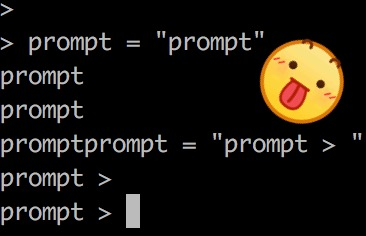

The **prompt** variable can hold strings as well as JavaScript code. If **prompt** holds a function that returns a string, mongo can display dynamic information in each prompt.

> **prompt**可能是某一个字符串（就像上面展示的那样），也可以是某个函数

You can add the logic for the prompt in the **.mongorc.js** file to set the prompt each time you start up the mongo shell.

> 可以把关于提示语的逻辑写到**.mongorc.js**文件中去

### Customize Prompt to Display Number of Operations ###

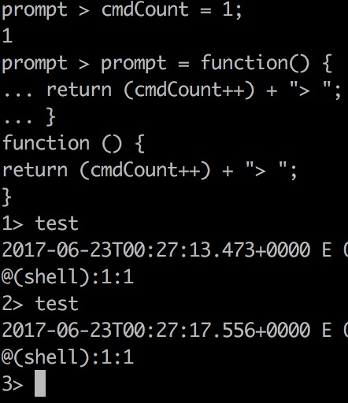

### Customize Prompt to Display Database and Hostname ###

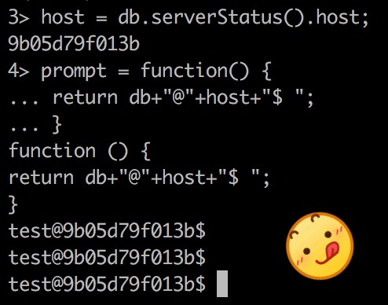

### Customize Prompt to Display Up Time and Document Count ###

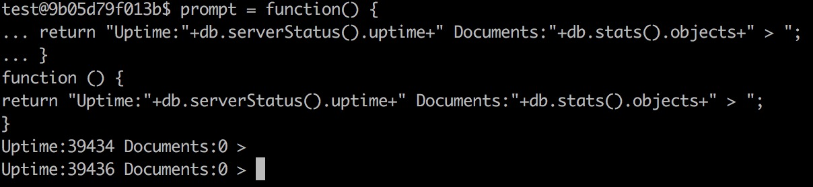

## Use an External Editor in the mongo Shell ##

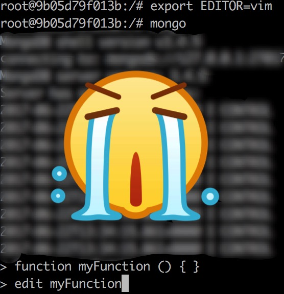

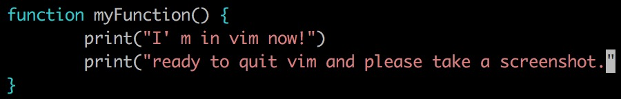

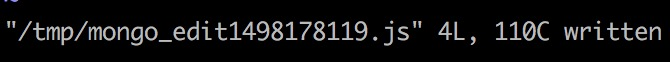

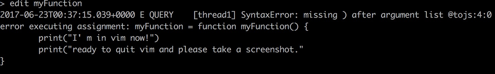

As mongo shell interprets code edited in an external editor, it may modify code in functions, depending on the JavaScript compiler. For mongo may convert 1+1 to 2 or remove comments. The actual changes affect only the appearance of the code and will vary based on the version of JavaScript used but will not affect the semantics of the code.

> 大体意思就是说，服务器端的js代码现在有编译器了，有编译这一个步骤了
>
> 它会对从编辑器输入的代码做一些优化，优化完可能和源代码长得不一样
>
> 提醒用户不要怕，优化保证了代码的语义不变

## Change the mongo Shell Batch Size ##

The **db.collection.find()** method is the JavaScript method to retrieve `documents` from a `collection`. The **db.collection.find()** method returns a **cursor** to the results; however, in the mongo shell, if the returned cursor is not assigned to a variable using the **var** keyword, then the **cursor** is automatically iterated up to 20 times to print up to the first 20 `documents` that match the query. The mongo shell will prompt **Type it** to iterate another 20 times.

> 这个之前说过，就是关于返回迭代器（`MongoDB`称为**cursor），如果未保存，自动迭代20次
>
> 估计是可以改变20这个数字

You can set the **DBQuery.shellBatchSize** attribute to change the number of ·documents· from the default value of 20, as in the following example which sets it to 10:

```javascript
DBQuery.shellBatchSize = 10;
```

# Access the mongo Shell Help #

## Command Line Help ##

```javascript
mongo --help
```

## Shell Help ##

To see the list of help, in the mongo shell, type **help**:

```javascript
To see the list of help, in the mongo shell, type help:
```

## Database Help ##

```javascript
show dbs
db.help()
db.someMethodName
db.updateUser
```

## Collection Help ##

```javascript
show collections
db.myCollection.help()
db.myCollection.someMethodName
db.myCollection.save
```

## Cursor Help ##

```javascript
db.myCollection.find().help()
db.myCollection.find().someMethodName
db.myCollection.find().toArray
```

## Wrapper Object Help ##

To get a list of th).toArraye wrapper classes available in the mongo shell, such as **BinData()**, type **help misc** in the mongo shell:

```javascript
help misc
```

# Write Scripts for the mongo Shell #

You can write scripts for the mongo shell in JavaScript that manipulate data in `MongoDB` or perform administrative operation.

> REPL环境是用来熟悉某种编程语言的，无法用在生产环境中
>
> 用在生产环境的都必然是可以执行的脚本或者代码

This tutorial provides an introduction to writing JavaScript that uses the mongo shell to access `MongoDB`.

## Opening New Connections ##

From the mongo shell or from a JavaScript file, you can instantiate database connections using the **Mongo()** constructor:

> 在脚本中打开一个类似于mongo shell的instance的方式是用**Mongo()**构造器

```javascript
new Mongo()
new Mongo(<host>)
new Mongo(<host:port>)
```

Consider the following example that instantiates a new connection to the `MongoDB` instance running on localhost on the default port and sets the global db variable to **myDatabase** using the **getDB()** method:

```javascript
conn = new Mongo();
db = conn.getDB("myDatabase");
```

上面的代码应该和在mongo shell中输入use myDatabase效果是一样的

If connecting to a `MongoDB` instance that enforces access control, you can use the **db.auth()** method to authenticate.

> 如果需要验证，可以使用**db.auth()**方法

Additionally, you can use the **connect()** method to connect to the `MongoDB` instance. The following example connects to the `MongoDB` instance that is running on localhost with the non-default port 27020 and set the global db variable:

> 一锅端了

```javascript
db = connect("localhost:27020/myDatabase");
```

## Differences Between Interactive and Scripted mongo ##

When writing scripts for the mongo shell, consider the following:

+ To set the **db** global variable, use the **getDB()** method or the **connect()** method. You can assign the `database` reference to a variable other than db.

  > 设置全局变量**db**的方法
  >
  > 也可以自己新建变量代替**db**

+ You cannot use any shell helper (e.g. **use \<dbname>**, **show dbs**, etc.) inside the JavaScript file because they are not valid JavaScript.

  The following table maps the most common mongo shell helpers to their JavaScript equivalents.

  > 有人写脚本还用帮助命令？帮助显示出来给谁看？？喵喵喵？

  |      Shell Helpers       |          JavaScript Equivalents          |
  | :----------------------: | :--------------------------------------: |
  | show dbs, show databases |     db.adminCommand('listDatabases')     |
  |        use \<db>         |      db = db.getSiblingDB('\<db>')       |
  |     show collections     |         db.getCollectionNames()          |
  |        show users        |              db.getUsers()               |
  |        show roles        |  db.getRoles({showBuiltinRoles: true})   |
  |   show log \<logname>    | db.adminCommand({ 'getLog' : '\<logname>' }) |
  |        show logs         |   db.adminCommand({ 'getLog' : '\*' })   |
  |            it            |              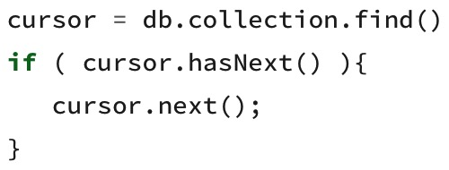               |

+ In interactive mode, mongo prints the results of operations including the content of all cursors. In scripts, either use the JavaScript **print()** function or the mongo specific **printjson()** function which returns formatted JSON.

  ```javascript
  cursor = db.collection.find();
  while ( cursor.hasNext() ) {
     printjson( cursor.next() );
  }
  ```

## Scripting ##

```javascript
mongo test --eval "printjson(db.getCollectionNames())"
mongo localhost:27017/test myjsfile.js
load("myjstest.js")
load("scripts/myjstest.js")
load("/data/db/scripts/myjstest.js")
```

# Data Types in the mongo Shell #

`MongoDB` `BSON` provides support for additional data types than `JSON`. Drivers provide native support for these data types in host languages and the mongo shell also provides several helper classes to support the use of these data types in the mongo JavaScript shell. 

> `BSON`提供了更多的类型，`MongoDB`支持了这些类型
>
> 我觉得唯一有用的就是时间类型和`ObjectId`

## Types ##

### Date ###

The mongo shell provides various methods to return the date, either as a string or as a **Date** object:

> mongo shell提供了不止一种方法去返回日期

+ **Date()** method which returns the current date as a string.
+ **new Date()** constructor which returns a **Date** object using the **ISODate()** wrapper.
+ **ISODate()** constructor which returns a Date object using the **ISODate()** wrapper.

Internally, **Date** objects are stored as a 64 bit integer representing the number of milliseconds since the Unix epoch (Jan 1, 1970), which results in a representable date range of about 290 millions years into the past and future.

> 前面说过，不再赘述

#### Return Date as a String ####

To return the date as a string, use the **Date()** method, as in the following example:

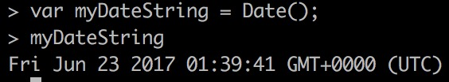

#### Return Date ####

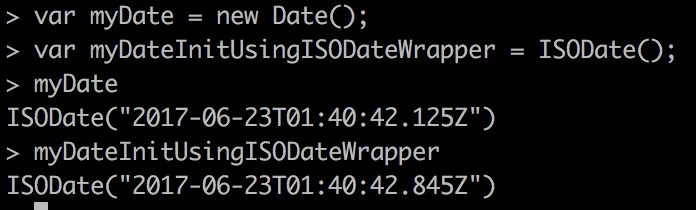

### ObjectId ###

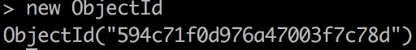

### NumberLong ###

The mongo shell treats all numbers as floating-point values by default. The mongo shell provides the **NumberLong()** wrapper to handle 64-bit integers.

> 用于保存大数

```javascript
NumberLong("2090845886852")
```

```javascript
db.collection.insertOne( { _id: 10, calc: NumberLong("2090845886852") } )
db.collection.updateOne( { _id: 10 },
                      { $set:  { calc: NumberLong("2555555000000") } } )
db.collection.updateOne( { _id: 10 },
                      { $inc: { calc: NumberLong(5) } } )
```

这些不怎么会用上，先忽略

忽略的内容海包括：NumberInt／NumberDecimal

## Check Types in the mongo Shell ##

**instanceof** returns a boolean to test if a value is an instance of some type.

**typeof** returns the type of a field.

# mongo Shell Quick Reference #
