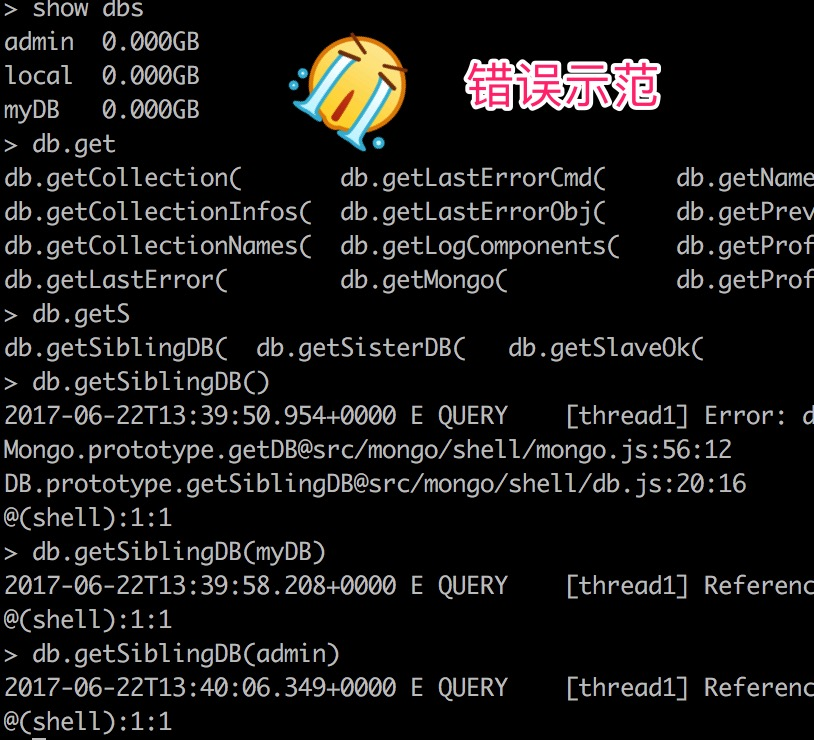

# The mongo Shell #

## Introduction ##

The mongo shell is an interactive JavaScript interface to `MongoDB`. You can use the mongo shell to query and update data as well as perform administrative operations.

> mongo shell是用于操控`MongoDB`的一种界面

## Start the mongo Shell ##

启动mongo之前需要现启动mongod

mongod在启动之时要指定配置文件（如果mongod处在Docker环境中）

```javascript
mongod --config /etc/mongod.conf &
```

### .mongorc.js File ###

When starting, mongo checks the user’s HOME directory for a JavaScript file named .mongorc.js. If found, mongo interprets the content of **.mongorc.js** before displaying the prompt for the first time

> 在启动mongo之后，在显示提示语之前，mongod会执行一个名为.mongorc.js的文件

If you use the shell to evaluate a JavaScript file or expression, either by using the **—eval** option on the command line or by specifying a .js file to mongo, mongo will read the **.mongorc.js** file **after** the JavaScript has finished processing.

> 用**—eval**可以指定需要在**.mongorc.js**执行之前执行的文件

You can prevent **.mongorc.js** from being loaded by using the **—norc** option.

> 还可以用**-norc**避免**.mongorc.js**文件的执行

## Working with the mongo Shell ##

To display the `database` you are using, type db:

```javascript
db
```

The operation should return **test**, which is the default database.


To switch `databases`, issue the use <db> helper, as in the following example:

```javascript
use <database>
```

To list the available databases, use the helper **show dbs**. See also **db.getSiblingDB()** method to access a different `database` from the current `database` without switching your current `database` context (i.e. db).

> **show dbs**可以展示当前所有的数据库
>
> **db.getSiblingDB()**用于切换数据库)



You can switch to non-existing `databases`. When you first store data in the `database`, such as by creating a `collection`, `MongoDB` creates the `database`. For example, the following creates both the `database` **myNewDatabase** and the `collection` **myCollection** during the **insertOne()** operation:

> 切换到不存在的数据库，在为第一个`collection`插入第一条`document`的时候，`MongoDB`会自动创建数据库和`collection`，这个之前提到过很多次了

```javascript
use myNewDatabase
db.myCollection.insertOne( { x: 1 } );
```

The **db.myCollection.insertOne()** is one of the methods available in the mongo shell.

+ **db** refers to the current database.

  > 注意，**db**不是指某个具体的数据库的名字，而是字符串**db**

+ **myCollection** is the name of the collection.

If the mongo shell does not accept the name of the `collection`, for instance if the name contains a space, hyphen, or starts with a number, you can use an alternate syntax to refer to the `collection`, as in the following:

> 如果shell不接受某个字符串直接作为数据库的名字，可以采取其它办法：

```javascript
db["3test"].find()
db.getCollection("3test").find()
```

此时用诸如`3test.find()`的语句是不行的

The mongo shell prompt has a limit of 4095 codepoints for each line. If you enter a line with more than 4095 codepoints, the shell will truncate it.

> 对输入长度有限制，超过则截断

### Format Printed Results ###

The **db.collection.find()** method returns a **cursor** to the results; however, in the mongo shell, if the returned **cursor** is not assigned to a variable using the var keyword, then the **cursor** is automatically iterated up to 20 times to print up to the first 20 documents that match the query. The mongo shell will prompt **Type it** to iterate another 20 times.

> **db.collection.find()**方法的返回值是一个迭代器
>
> 如果这个迭代器没有被保存到变量中，mongo shell会自动迭代20次，打印结果
>
> 然后提示**Type it**去打印另外20个结果

To format the printed result, you can add the **.pretty()** to the operation, as in the following:

> 那么，为使得查询结果看起来更加舒服，可以添加**.pretty()**方法

```javascript
db.myCollection.find().pretty()
```

In addition, you can use the following explicit print methods in the mongo shell:

> 除此之外，还可以使用以下打印方法：

+ **print()** to print without formatting
+ **print(tojson(\<obj>))** to print with` JSON` formatting and equivalent to **printjson()**
+ **printjson()** to print with `JSON` formatting and equivalent to **print(tojson(\<obj>))**

### Multi-line Operations in the mongo Shell ##

If you end a line with an open parenthesis (**'('**), an open brace (**'{'**), or an open bracket (**'['**), then the subsequent lines start with ellipsis (**"..."**) until you enter the corresponding closing parenthesis (**')'**), the closing brace (**'}'**) or the closing bracket (**']'**). The mongo shell waits for the closing parenthesis, closing brace, or the closing bracket before evaluating the code, as in the following example:

> 自动辨别是否需要多行输入

```javascript
> if ( x > 0 ) {
... count++;
... print (x);
... }
```

You can exit the line continuation mode if you enter two blank lines, as in the following example:

```javascript
> if (x > 0
...
...
>
```

## Tab Completion and Other Keyboard Shortcuts ##

The mongo shell supports keyboard shortcuts. For example,


## Exit the Shell ##

# Configure the mongo Shell #

# Access the mongo Shell Help #

# Write Scripts for the mongo Shell #

# Data Types in the mongo Shell #

# mongo Shell Quick Reference #
