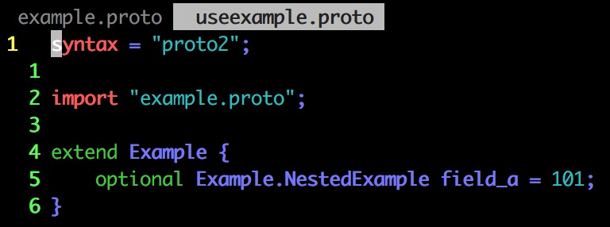
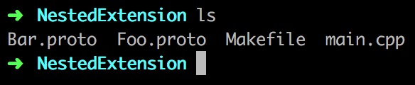

# Trivial Things #


# Updating A Message Type #

# Import & Extensions #




The protocol compiler searches for imported files in a set of directories specified on the protocol compiler command line using the `-I`/`--proto_path` flag. If no flag was given, it looks in the directory in which the compiler was invoked. In general you should set the `--proto_path` flag to the root of your project and use fully qualified names for all imports.

> 有选项可以指定寻找路径

通过extension增加的字段，访问API有一点不一样：

```c++
Example example;
example.SetExtension(field_a, ...);
```

Similarly, the `Example` class defines templated accessors `HasExtension()`, `ClearExtension()`, `GetExtension()`, `MutableExtension()`, and `AddExtension()`. All have semantics matching the corresponding generated accessors for a normal field. For more information about working with extensions, see the generated code reference for your chosen language.

> 六个模板方法

Note that extensions can be of any field type, including message types, but cannot be oneofs or maps.

# Nested Extensions #




三个文件，可以正常编译运行

可是你不觉得很奇怪吗？Bar与Foo是什么关系？为什么内嵌扩展可以这么写？


Foo.pb.h 146


不能继续往下跟，慢慢就跟到protobuf里面，违背了我理解用法的意图


只能猜测Foo类里面有这个字段，不过作用域是Baz里

This is a common source of confusion: Declaring an extend block nested inside a message type does not imply any relationship between the outer type and the extended type. In particular, the above example does not mean that Baz is any sort of subclass of Foo. All it means is that the symbol bar is declared inside the scope of Baz; it's simply a static member.

> 静态字段
>
> 两个类没有任何关系

# OneOf #

```protobuf
message SampleMessage {
  oneof test_oneof {
     string name = 4;
     SubMessage sub_message = 9;
  }
}
```

```c++
SampleMessage message;
message.set_name("name");
CHECK(message.has_name());
message.mutable_sub_message();   // Will clear name field.
CHECK(!message.has_name());
```

+ Extensions are not supported for oneof.

+ A oneof cannot be `repeated`.（不可重复）

+ Reflection APIs work for oneof fields.（反射）

+ If you're using C++, make sure your code doesn't cause memory crashes. The following sample code will crash because `sub_message` was already deleted by calling the `set_name()` method.

  ```c++
  SampleMessage message;
  SubMessage* sub_message = message.mutable_sub_message();
  message.set_name("name");      // Will delete sub_message
  sub_message->set_...           // Crashes here
  ```

+ Again in C++, if you `Swap()` two messages with oneofs, each message will end up with the other’s oneof case: in the example below, `msg1` will have a `sub_message` and `msg2` will have a `name`.

  ```c++
  SampleMessage msg1;
  msg1.set_name("name");
  SampleMessage msg2;
  msg2.mutable_sub_message();
  msg1.swap(&msg2);
  CHECK(msg1.has_sub_message());
  CHECK(msg2.has_name());
  ```

# Maps #

```protobuf
map<key_type, value_type> map_field = N;
```

+ Extensions are not supported for maps.
+ Maps cannot be `repeated`, `optional`, or `required`.
+ Wire format ordering and map iteration ordering of map values is undefined, so you cannot rely on your map items being in a particular order.
+ When generating text format for a `.proto`, maps are sorted by key. Numeric keys are sorted numerically.
+ When parsing from the wire or when merging, if there are duplicate map keys the last key seen is used. When parsing a map from text format, parsing may fail if there are duplicate keys.

