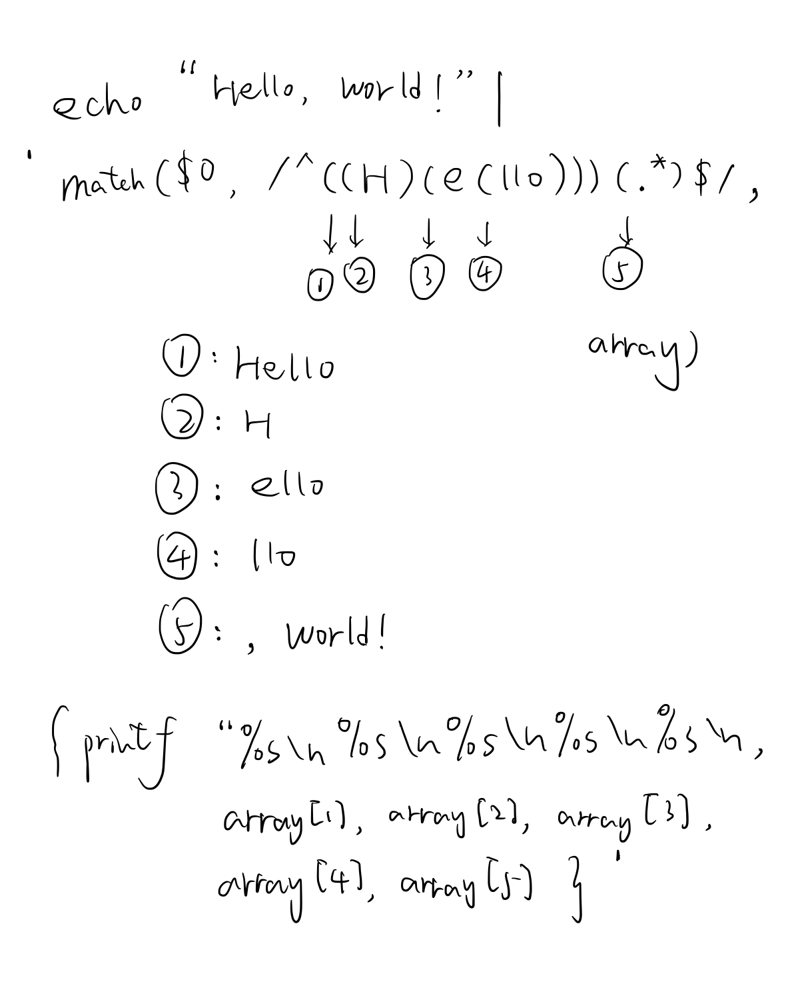

# 正则表达式分类 #

1. 基本的正则表达式（ Basic Regular Expression ）
2. 扩展的正则表达式（ Extended Regular Expression ）
3. Perl 的正则表达式（ Perl Regular Expression ）

awk 支持扩展的正则表达式，扩展的正则表达式也是语法糖较多且各种工具支持较好的一种正则表达式

# Getting Started #

> The basic function of `awk` is to search files for lines (or other units of text) that contain certain patterns.
>
> When a line matches one of the patterns, `awk` performs specified actions on that line.
>
> `awk` continues to process input lines in this way until it reaches the end of the input files.

1. awk 命令搜索文件的基本单位是：行、其它单位
2. awk 在搜索到匹配模式的行之后对该行执行特定的动作
3. 直到搜索至文件结尾

```shell
pattern { action }
pattern { action }
...
```

```shell
awk 'program' input-file1 input-file2
awk -f program-file input-file1 input-file2
```

## Shell Quoting Issues ##

```shell
# null string
# empty string

# double quotes
echo ""
# single quotes
echo ''
```

1. Quoted items can be concatenated with nonquoted items as well as with other quoted items. The shell turns everything into one argument for the command.

   ```shell
   export string="double-quotes "spaces' single-quotes'
   echo $string
   # double-quotes spaces single-quotes
   ```

2. Preceding any single character with a backslash (‘\’) quotes that character. The shell removes the backslash and passes the quoted character on to the command.

   ```shell
   # 转义
   export string="double-quotes: "\"
   echo $string
   # double-quotes: "
   ```

3. Single quotes protect everything between the opening and closing quotes. The shell does no interpretation of the quoted text, passing it on verbatim to the command. It is *impossible* to embed a single quote inside single-quoted text.

   单引号之间的内容不会做任何处理，包括变量引入和转义字符

   因为单引号内的内容不会做转义，所以诸如`'\''`的字符串是不能表达单引号的

   ```shell
   export string='"'
   echo $string
   # "
   
   export string='${dontexistvariable}'
   echo $string
   # ${dontexistvariable}
   
   export string="${dontexistvariable}"
   echo $string
   # 没有任何输出
   ```

4. Double quotes protect most things between the opening and closing quotes. The shell does at least variable and command substitution on the quoted text. Different shells may do additional kinds of processing on double-quoted text.

   双引号之间的内容会做一些额外的处理，至少包括：变量和命令的替换

   应该还包括：转义字符的处理

   另外：不同的命令可能还会对双引号内的内容做进一步的处理

   ```shell
   # 单引号是通过 \47 而不是 ' 表达的
   awk 'BEGIN { print "Don\47t Panic!" }'
   # 感叹号是否需要转义是一件很头疼的事情
   awk "BEGIN { print \"Don't Panic\!\" }"
   ```

5. Null strings are removed when they occur as part of a non-null command-line argument, while explicit null objects are kept.

   当空字符串单独出现作为参数的时候，他会得到保留；当空字符串与其它命令紧挨着的时候，会被删除

   本质上是因为 shell 会对连在一起的（无空格间隔的）无引号内容、单引号内容和双引号内容进行连接

   ```shell
   echo 'Hello' | grep 'Hello'
   # Hello
   echo 'Hello' | grep'Hello'
   # bash: grepHello: command not found
   echo 'Hello' | grep ''
   # Hello
   echo 'Hello' | grep''
   # Usage: grep [OPTION]... PATTERN [FILE]...
   # Try 'grep --help' for more information.
   ```

混用单引号和双引号会十分地困难

```shell
awk 'BEGIN { print "Here is a single quote <'"'"'>" }'
# 在将参数传入 awk 命令之前 shell 都会先做一些处理

1. 'BEGIN { print "Here is a single quote <'
2. "'"
3. '>" }'
经过 shell 处理之后的样子是：
1. BEGIN { print "Here is a single quote <
2. '
3. >" }
再连接到一起就是：
BEGIN { print "Here is a single quote <'>" }
再把处理过后的参数传递给 awk 命令

awk 'BEGIN { print "Here is a single quote <'\''>" }'
# 参数是 'BEGIN { print "Here is a single quote <'\''>" }'
1. 'BEGIN { print "Here is a single quote <'
2. \'
3. '>" }'
经过 shell 处理之后的样子是：
1. BEGIN { print "Here is a single quote <
2. '
3. >" }
再连接到一起就是：
BEGIN { print "Here is a single quote <'>" }

awk "BEGIN { print \"Here is a single quote <'>\" }"
# 参数是 "BEGIN { print \"Here is a single quote <'>\" }"
shell 处理的步骤：
1. 去掉双引号
BEGIN { print \"Here is a single quote <'>\" }
2. 转义
BEGIN { print "Here is a single quote <'>" }

awk 'BEGIN { print "Here is a single quote <\47>" }'
# 输出字符串时会有一次转义
# 利用 \47 躲过之前的检查

awk 'BEGIN { print "Here is a double quote <\42>" }'
# 输出字符串时会有一次转义
# 利用 \42 躲过之前的检查

awk -v sq="'" 'BEGIN { print "Here is a single quote <" sq ">" }'
# 同之前躲过检查的方法一致
# 这是个非常不错的思路
```

## Regular Expressions ##

|   symbol    |                         explanation                          |                            usage                             |                            usage                             |
| :---------: | :----------------------------------------------------------: | :----------------------------------------------------------: | :----------------------------------------------------------: |
|      ^      |                        匹配一行的开头                        |    echo -e "Hello, world!" \| awk '/^Hello/ { print $0 }'    |    echo -e "Hello, world!" \| awk '/^world/ { print $0 }'    |
|      $      |                        匹配一行的结尾                        |   echo -e "Hello, world!" \| awk '/world!$/ { print $0 }'    |    echo -e "Hello, world!" \| awk '/Hello$/ { print $0 }'    |
|     \\<     |                         匹配单词开头                         |    echo "Hello, world!" \| awk '/\\<Hello/ { print $0 }'     |     echo "Hello, world!" \| awk '/\\<ello/ { print $0 }'     |
|     \\>     |                         匹配单词结尾                         |    echo "Hello, world!" \| awk '/Hello\\>/ { print $0 }'     |     echo "Hello, world!" \| awk '/Hell\\>/ { print $0 }'     |
|     \\y     | Matches the empty string at either the beginning or the end of a word (i.e., the word boundary). 空格以及逗号等都会被视为单词边界 |    echo "Hello, world!" \| awk '/Hello,\y/ { print $0 }'     |     echo "Hello, world!" \| awk '/Hell,\y/ { print $0 }'     |
|     \\B     | Matches the empty string that occurs between two word-constituent characters.  '\B' is essentially the opposite of '\y'. 匹配非单词边界，空格以及逗号等都被视为单词边界 |     echo "Hello, world!" \| awk '/Hell\B/ { print $0 }'      |     echo "Hello, world!" \| awk '/Hello\B/ { print $0 }'     |
|      ?      |                       匹配零次或者一次                       |       echo -e "aabbcc" \| awk '/a?b?c?/ { print $0 }'        |        echo -e "abbcc" \| awk '/a?b?c?/ { print $0 }'        |
|      *      |                       匹配零次或者多次                       |      echo -e "aabbcc" \| awk '/a\*b\*c\*/ { print $0 }'      |                                                              |
|      +      |                       匹配一次或者多次                       |       echo -e "aabbcc" \| awk '/a+b+c+/ { print $0 }'        |        echo -e "bbcc" \| awk '/a+b+c+/ { print $0 }'         |
|    {n,m}    | Finally, when '{' and '}' appear in regexp constants in a way that cannot be interpreted as an interval expression (such as /q{a}/), then they stand for themselves. |   echo "aaa" \| awk --re-interval '/a{1,3}/ { print $0 }'    |         echo -e "aaa" \| awk '/a{1,3}/ { print $0 }'         |
|     \|      |                             或者                             | echo -e "Hello, world!" \| awk '/(He\|Go)llo/ { print $0 }'  |                                                              |
|    \[\]     |                             或者                             | echo -e "Hello, world!" \| awk '/\[HIJK\]ello/ { print $0 }' | echo -e "Hello, world!" \| awk '/\[ABCD\]ello/ { print $0 }' |
|    \[^\]    |                       排除其中所有字母                       | echo -e "Hello, world!" \| awk '/\[^ABCD\]ello/ { print $0 }' | echo -e "Hello, world!" \| awk '/\[^HIJK\]ello/ { print $0 }' |
| (x\|y){m,n} | Finally, when '{' and '}' appear in regexp constants in a way that cannot be interpreted as an interval expression (such as /q{a}/), then they stand for themselves. | echo -e "abc" \| awk --re-interval '/(a\|b\|c){1,3}/ { print $0 }' |    echo -e "abc"  \| awk '/(a\|b\|c){1,3}/ { print $0 }'     |
|    match    |                           capture                            | echo -e "Hello, world!" \| awk 'match($0, /Hell/) { print substr($0, RSTART, RLENGTH) }' | echo -e "Hello, world!" \| awk '/Hell/ { print substr($0, RSTART, RLENGTH) }' |
|    match    |   multi-captures 数左括号排序法 起选择作用的括号也参与排序   | echo "Hello, world!" \| awk 'match(\$0, /^((H)(e(llo)))(.*)$/, array) { printf "%s\n%s\n%s\n%s\n%s\n", array[1], array[2], array[3], array[4], array[5] }' | echo "Hello, world!" \| awk 'match($0, /^(H\|K)/, array) { print array[1] }' |
|   [^()()]   |        否定某一个或者几个字符串的出现（存在部分玄学）        |   echo -e "Hello" \| awk '/\[^(AB)(He)\]llo/ { print $0 }'   |  echo -e "Hello" \| awk '/^\[^(AB)(He)\]llo/ { print $0 }'   |
|      ~      |                         如果匹配则……                         |                                                              |                                                              |
|     !~      |                        如果不匹配则……                        |                                                              |                                                              |
|    (...)    | Parentheses are used for grouping in regular expressions, as in arithmetic. They can be used to concatenate regular expressions containing the alternation operator, '\|'. For example, '@(samp\|code)\\\{\[^\}\]+\\\}' matches both ‘@code\{foo\}’ and ‘@samp\{bar\}’. (These are Texinfo formatting control sequences. The '+' is explained further on in this list.) | echo -e \"Hello, world!\" \| awk '/(Hello\|Hi), world!/ \{ print $0 \}' | echo -e "Hello, world!" \| awk '/(Hell\|Hi)ello/ { print $0 }' |

The regular expressions in `awk` are a superset of the POSIX specification for Extended Regular Expressions (EREs). POSIX EREs are based on the regular expressions accepted by the traditional `egrep` utility.

```shell
echo "Hello, world!" | awk 'match($0, /Hell(o)(,)/, array) { print array[1], array[2] }'
# 具备选择作用的做括号也参与 match 的计数
echo "Hello, world!" | awk 'match($0, /Hell(o)(,) (w|g)/, array) { print array[1], array[2], array[3] }'
echo "Hello, world!" | awk 'match($0, /Hell(o)(,) (w|g)/, array) { print array[0] }'
```



## Multiple-Line Records ##

1. awk 处理文本的基本单位是行

2. 涉及多行的匹配在一般情况下是行不通的

3. 更改 awk 处理文本的单位

   1. One technique is to use an unusual character or string to separate records. For example, you could use the formfeed character (written ‘\f’ in `awk`, as in C) to separate them, making each record a page of the file. To do this, just set the variable `RS` to `"\f"` (a string containing the formfeed character). Any other character could equally well be used, as long as it won’t be part of the data in a record.

      ```shell
      # 匹配失败
      echo -e "Hello\nHi" | awk "/Hello\nHi/ { print $1 }"
      # 匹配成功
      echo -e "Hello\nHi" | awk -v RS="\f" "/Hello\nHi/ { print $1 }"
      # 匹配成功但不是期望结果，单引号内没有转义
      # 导致 \n 可能被认为是正则表达式的操作符
      echo -e "Hello\nHi" | awk -v RS="\f" '/Hello\nHi/ { print $1 }'
      ```

      ```shell
      # 输出很奇怪，待解释
      echo -e "Hello\nHi" | awk "{ print $0 }"
      ```

   2. Another technique is to have blank lines separate records. By a special dispensation, an empty string as the value of `RS` indicates that records are separated by one or more blank lines. When `RS` is set to the empty string, each record always ends at the first blank line encountered. The next record doesn’t start until the first nonblank line that follows. No matter how many blank lines appear in a row, they all act as one record separator. (Blank lines must be completely empty; lines that contain only whitespace do not count.)

      ```shell
      echo -e "Hello\nHi" | awk -v RS="" "/Hello\nHi/ { print $1 }"
      # 含空格的行并没有被视为空行，所以匹配成功
      echo -e "Hello\n \nHi" | awk -v RS="" "/Hello\n \nHi/ { print $1 }"
      
      echo -e "Hello\nHi" | awk -v RS="" "match(\$0, /(.+)\n(.+)/, array) { printf \"%s\n%s\\n\", array[2], array[1] }"
      # 交换引入头文件的顺序
      echo -e "#include Hello\n#include Hi" | awk -v RS="" "match(\$0, /(.+)\n(.+)/, array) { printf \"%s\n%s\\n\", array[2], array[1] }"
      ```

   3. You can achieve the same effect as ‘RS = ""’ by assigning the string `"\n\n+"` to `RS`. This regexp matches the newline at the end of the record and one or more blank lines after the record. In addition, a regular expression always matches the longest possible sequence when there is a choice (see [Leftmost Longest](https://www.gnu.org/software/gawk/manual/html_node/Leftmost-Longest.html#Leftmost-Longest)). So, the next record doesn’t start until the first nonblank line that follows—no matter how many blank lines appear in a row, they are considered one record separator.

## Functions #

### String-Manipulation Functions ###

#### gensub(regexp, replacement, how [, target]) ####

1. regexp 的行为同之前介绍的正则表达式一致（新版本的 awk 直接支持 interval 表达式）
2. replacement 支持 match
3. how 如果以字母 g 或者 字母 G 开头，会引起全局替换（类似于 sed 的 g），也可以指定第几个匹配
4. target 的默认值是 $0

```shell
echo "Hello Hi" | awk '{ print gensub(/(.+) (.+)/, "\\2 \\1", "g") }'
# 同样允许一个字符串被捕获多次
echo "Hello Hi" | awk '{ print gensub(/((.+) (.+))/, "\\3 \\2 \\1", "g") }'

# 起到选择作用的做括号也参与 match 的计数
echo "Hello" | awk '{ print gensub(/(H|K)ello/, "\\1", "g") }'
echo "Hello" | awk '{ print gensub(/((H|K))ello/, "\\1\\2", "g")}'
# \3 使越界的
echo "Hello" | awk '{ print gensub(/((H|K))ello/, "\\1\\2\\3", "g")}'
```

```shell
echo "HHHello" | awk '{ print gensub(/H{1,3}ello/, "\\0", "g")}'
# HHHello
echo "HHHello" | awk --re-interval '{ print gensub(/H{1,3}ello/, "\\0", "g")}'
# HHHello
```

```shell
# \0 代表整个被匹配的字符串
echo "Hello" | awk '{ print gensub(/.+/, "\\0", "g") }'
```

```sh
# replacement = 2
# 替换第2个碰到的匹配的字符串
echo "a b c a b c" | awk '{ print gensub(/a/, "AA", 2) }'
# replacement 也可以是字符串
echo "a b c a b c" | awk '{ print gensub(/a/, "AA", "2") }'
# replcaement 不支持数组
echo "a b c a b c" | awk '{ print gensub(/a/, "AA", "1 2") }'
```

#### gsub(regexp, replacement [, target]) ####

gensub 函数的特化版本，`how = "g"`

#### match(string, regexp [, array]) ####

1. The regexp argument may be either a regexp constant (`/…/`) or a string constant (`"…"`). 为了统一，我们不建议使用字符串常量，推荐使用正则表达式常量
2. match 可以不带 array 参数使用，这是输出第一个匹配的字符串的首地址
3. match 函数带 array 参数使用是 awk 的扩展用法，不是所有 awk 都支持

The `array` argument to `match()` is a `gawk` extension. In compatibility mode, using a third argument is a fatal error.

match 函数有两种用法：

```shell
echo "Hello" | awk 'match($0, /H/, array) { print array[0] }'
```

```shell
echo "Hello" | awk '{ \
match($0, /H/, array); \
print array[0] \
}'
```


## Program ##

```shell
#!/bin/awk -f
BEGIN { print "Don't Panic!" }
```


