今天思佳又给我发了一个全新的 Servlet App ，这次要部署到云上以方便测试

# 目录结构 #

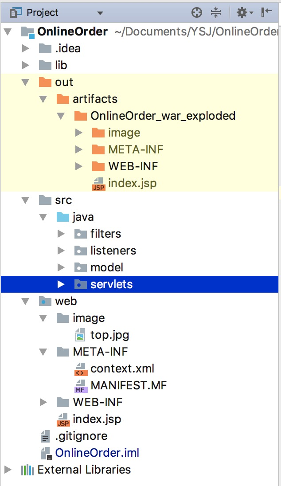

我们需要关注以下几点：

+ `src`文件夹存放源代码
  + `filters`
  + `listeners`
  + `model`
  + `servlets`
+ `web`文件夹存放资源
+ `out`文件夹存放编译之后的结果

# 使用编译好的文件 #

## 启动容器并做一些准备工作 ##

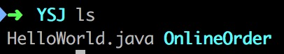

```shell
docker run -t -i -p 8080:8080 --name tomcat tomcat /bin/bash
```

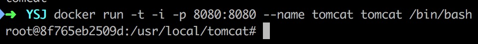

我们不再赘述这个命令的含义，如果有不明白的地方：请查看`LetServletAppRun.md`文件

```shell
cd webapps/ROOT/
rm -r *
ls
```

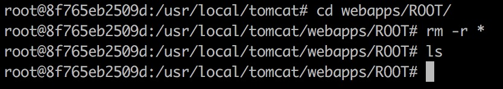

## 从宿主机拷贝文件到容器 ##

从容器中退出来（按下`(control + p) + (control + q)`）

```shell
docker cp OnlineOrder/out/artifacts/OnlineOrder_war_exploded tomcat:/usr/local/tomcat/webapps/ROOT
docker start -a -i tomcat
```

```shell
mv OnlineOrder_war_exploded/* .
ls
```

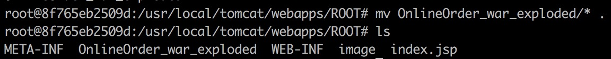

## 启动 Tomcat ##

```shell
../../bin/startup.sh
```

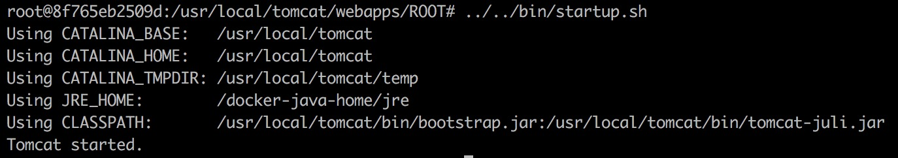

## 测试部署是否成功 ##

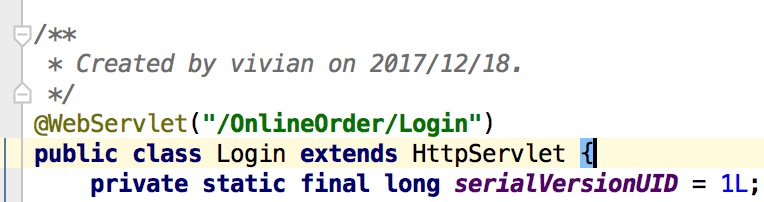

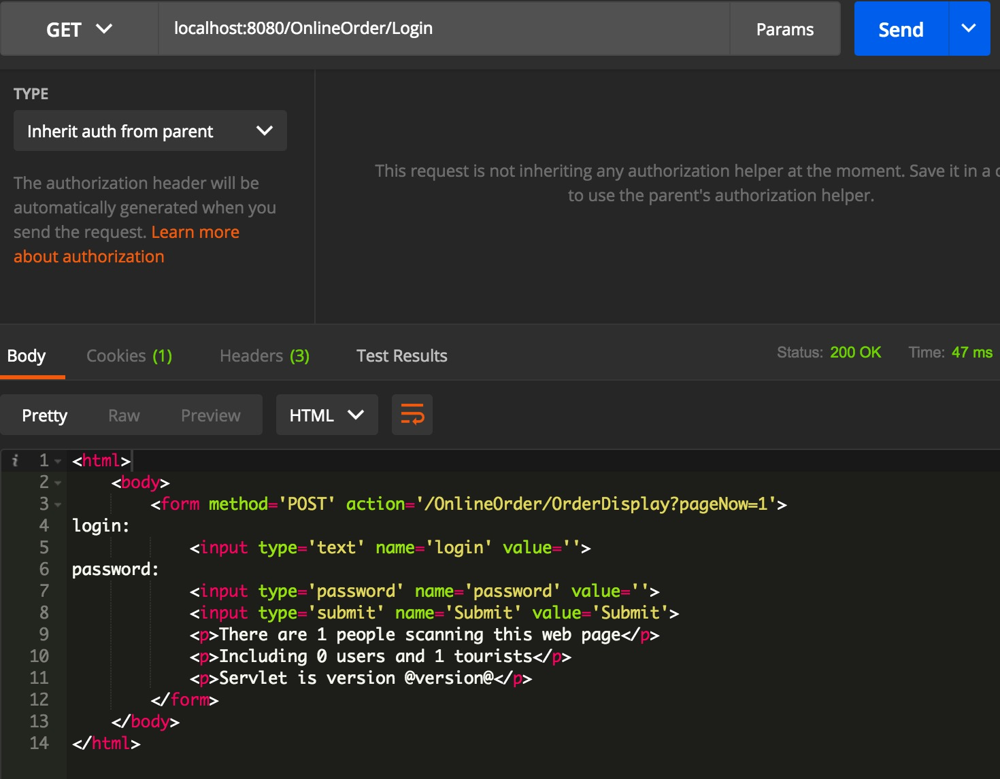

# 放到云主机上 #

总体来说，流程大致和之前的一样，不过多了一个上传文件夹的操作

```shell
scp -r OnlineOrder/out/artifacts/OnlineOrder_war_exploded demons@115.159.199.121:~
```

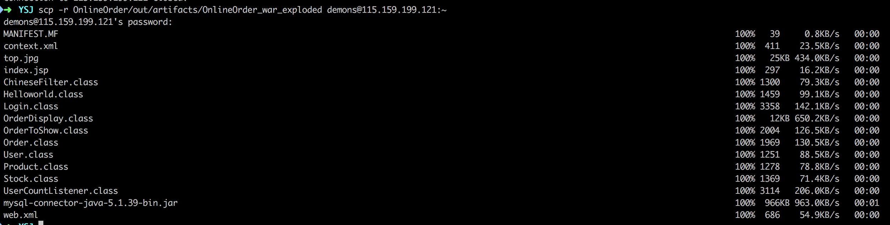

```shell
ssh demons@115.159.199.121
```

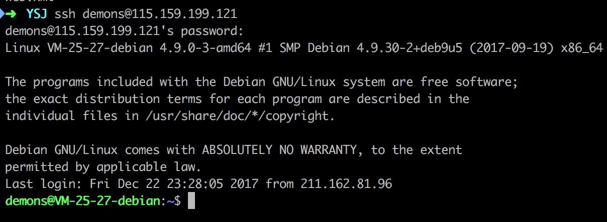

后续步骤略（请参考上一小节）

# 动手编译 #

## 拷贝源文件到容器 ##

```shell
docker cp OnlineOrder tomcat:/usr/local/tomcat/webapps/ROOT
docker start -a -i tomcat
cd OnlineOrder
```

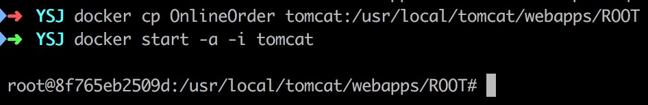

## 编译 ##

```
mkdir -p ../WEB-INF/classes
find src -name "*.java" > sources_list.txt
javac -cp .:/usr/local/tomcat/lib/servlet-api.jar @sources_list.txt -d /usr/local/tomcat/webapps/ROOT/WEB-INF/classes
ls ../WEB-INF/classes/
ls ../WEB-INF/classes/servlets/
```

## 拷贝资源文件 ##

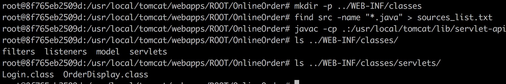

```shell
cp -r web/image ../
cp -r web/META-INF ../
cp -r web/index.jsp ../
ls ../
```

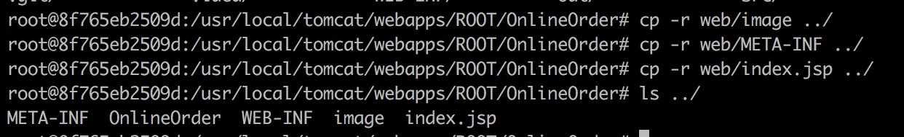

```shell
cp web/WEB-INF/web.xml ../WEB-INF/
ls ../WEB-INF
```

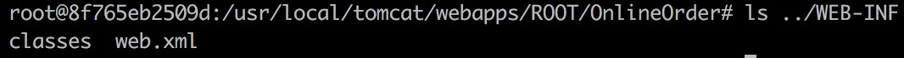

## 重新启动 ##

```shell
../../../bin/shutdown.sh
../../../bin/startup.sh
```

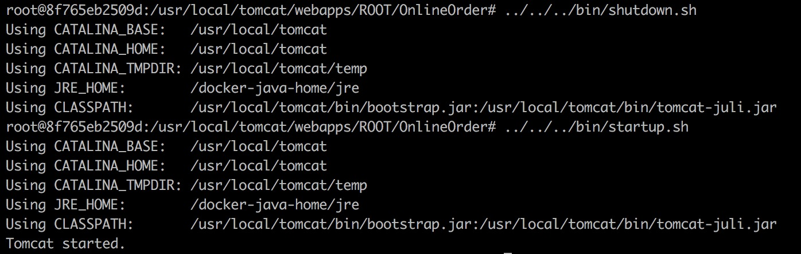

## 测试部署是否成功 ##

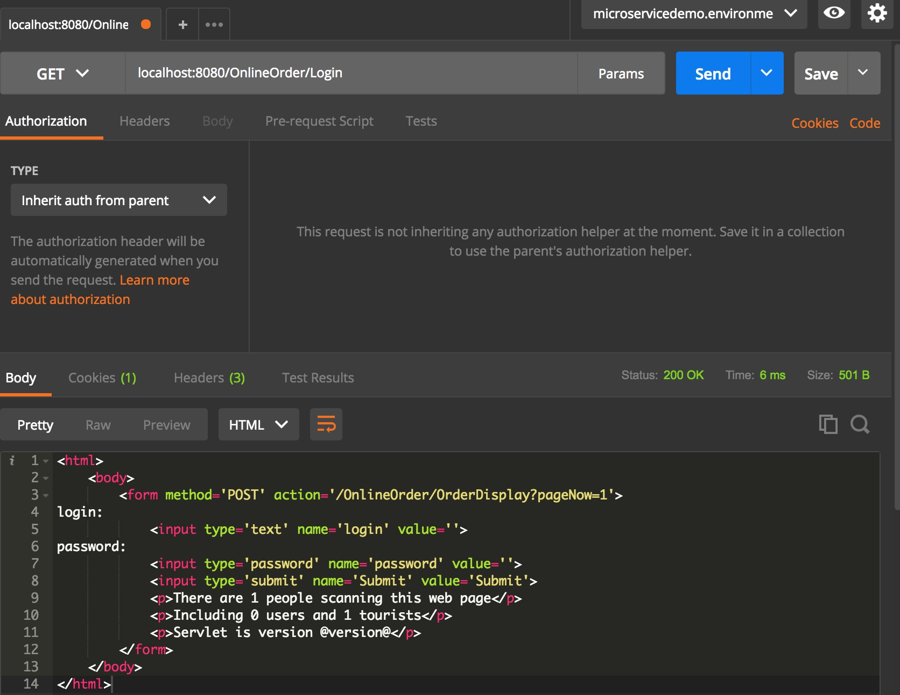

## 对比使用 IntelliJ 编译出来的文件 ##

我们想知道，我们使用命令行编译出来的东西与使用 IntelliJ 编译出来的东西有没有区别呢？

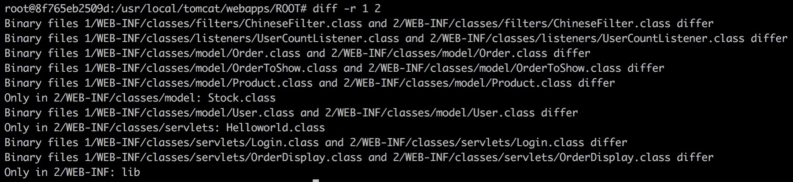

`1`文件夹是使用命令行编译出来的结果

`2`文件夹是使用 IntelliJ 编译出来的结果

主要是二进制文件有差异，很有可能是操作系统不同带来的差异？抑或是编译选项不同带来的差异？

# 写在最后 #

我们不赞同在容器中编译源代码，这样会使得容器的体积变大，也在一定程度上背离了使用容器的目的（我认为，一个容器只能干一件事，要么编译，要么运行）

但我们这样做的主要目的是大揭秘：我们的集成环境（ IntelliJ ）到底帮我们做了什么