在文章的开篇，不得不吐槽一下：亚马逊的界面还真是特别难用，半天找不到在哪里申请实例；且登录非常坑爹

感觉谷歌和亚马逊的云服务平台的操作习惯都和国内的云服务平台极其不一样，以至于要专门写一篇文章来记录如何配置一台实例😂😂😂

在这篇文章之前，我们假设已经完成一下几件事：

1. 申请一个亚马逊云服务的账号
2. 知道如何通过`SSH`登录远程主机


我们的起点是该网站：<https://amazonaws-china.com/cn/>

友情提醒：即使访问亚马逊中国，大量的操作也需要访问其国外服务器，所以需要一颗极其佛系的心

# 亚马逊竞价实例的相关说明 #

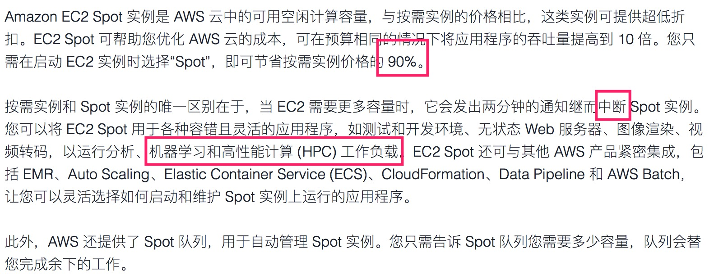

1. 不穷谁用竞价实例？！
2. 要准备好自己的服务器突然被“掐”死了
3. 机器学习是竞价实例的其中一个用途

通常而言，我们很关心其中一点：计算被中断之后如何恢复

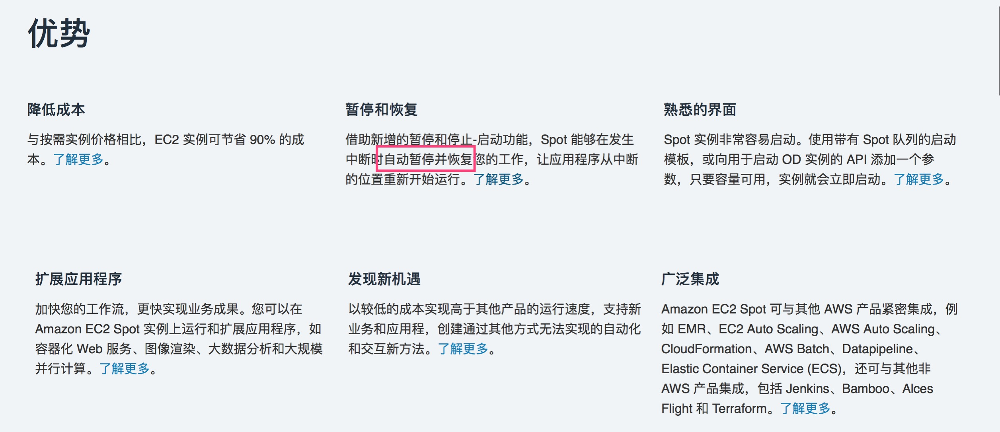

这个就很厉害了不是，完美满足我们的需求

> Demand for Spot Instances can vary significantly from moment to moment, and the availability of Spot Instances can also vary significantly depending on how many unused EC2 instances are available. It is always possible that your Spot Instance will be interrupted. Therefore, you must ensure that your application is prepared for a Spot Instance interruption.

如果使用竞价实例，一定要让你的应用准备好被打断；也就是说，所谓的自动恢复不是无成本的，需要我们对应用进行一定的侵入和改造

## Interruption Behavior ##

> You can specify whether Amazon EC2 should hibernate, stop, or terminate Spot Instances when they are interrupted. 

实例在被打断的时候有三种选择：

+ 休眠（`hibernate`是这个意思吗？喵喵喵？）
+  停止（关机？）
+ 中止实例（也即销毁实例？）

> You can choose the interruption behavior that meets your needs. The default is to terminate Spot Instances when they are interrupted.

你可以选择符合你的需求的策略，默认策略是销毁实例

> To change the interruption behavior, choose an option from Interruption behavior in the console or InstanceInterruptionBehavior in the launch configuration or the launch template.

可以在控制台更改策略（对于我们而言，默认策略足够了）

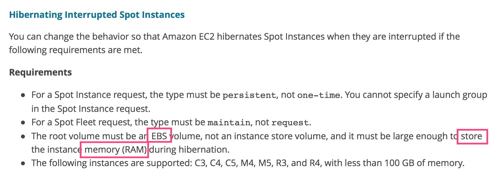

所谓`hibernate`指的是把内存写到硬盘中去，随后再从硬盘中恢复的状态

`hibernate`做的好的话，应用程序是不感知的：相当于进程挂起 + 内存换页

但我们的实例类型不支持挂起，所以也挺遗憾的？

那么，我们需要自行以一定的频率持久化程序运行的状态

## Preparing for Interruptions ##

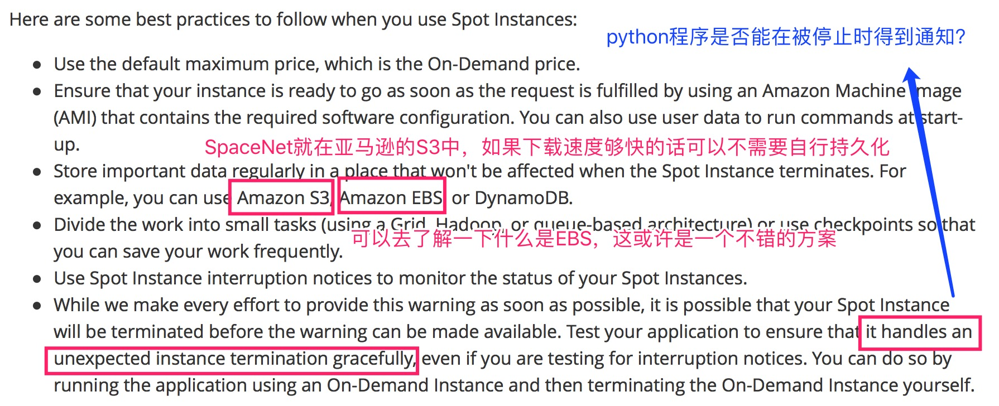

有一个很简单的策略可以采用：

1. 写出在验证集上表现最好的权重并表明轮次
2. 隔10轮写出一次权重

# 申请EBS #

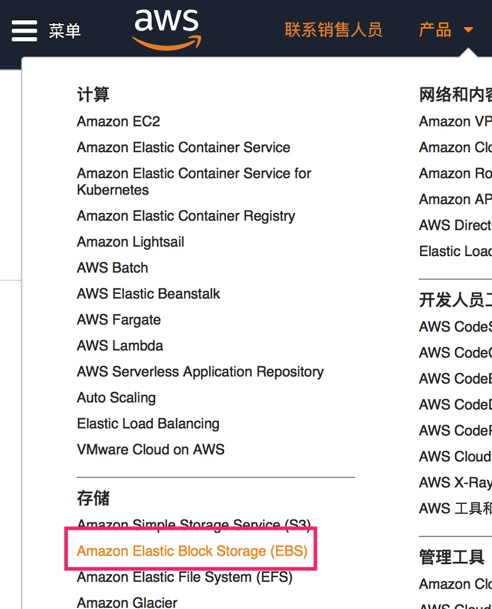

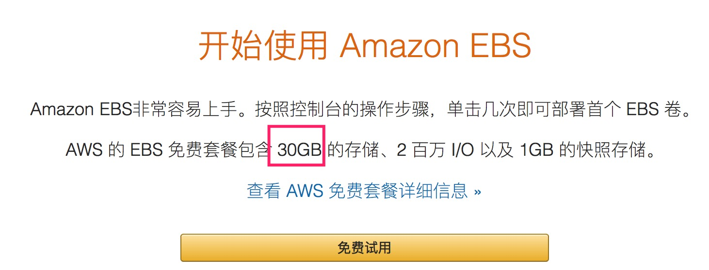

重大利好啊！同学们！还要什么自行车！

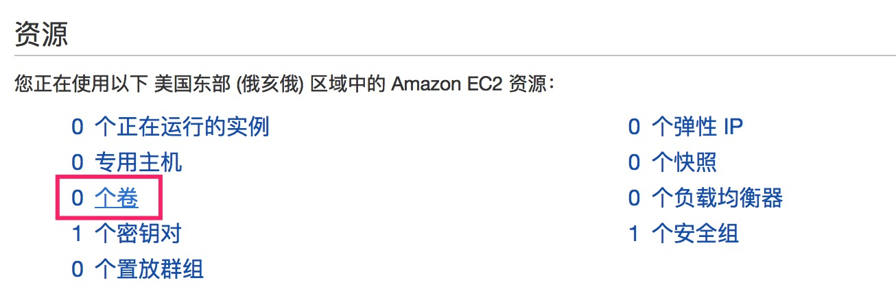

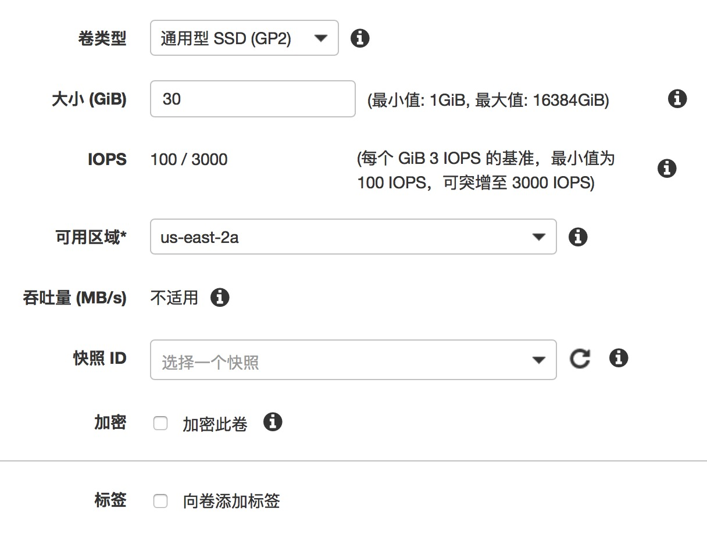

# 申请密钥 #

再次提醒：不要妄图在`aws`中找到如何生成密钥（反正我是愣没找到），直接使用搜索功能：

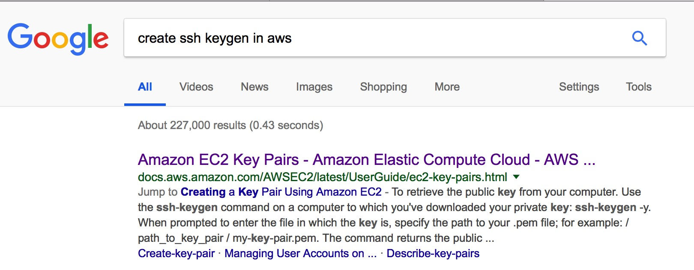

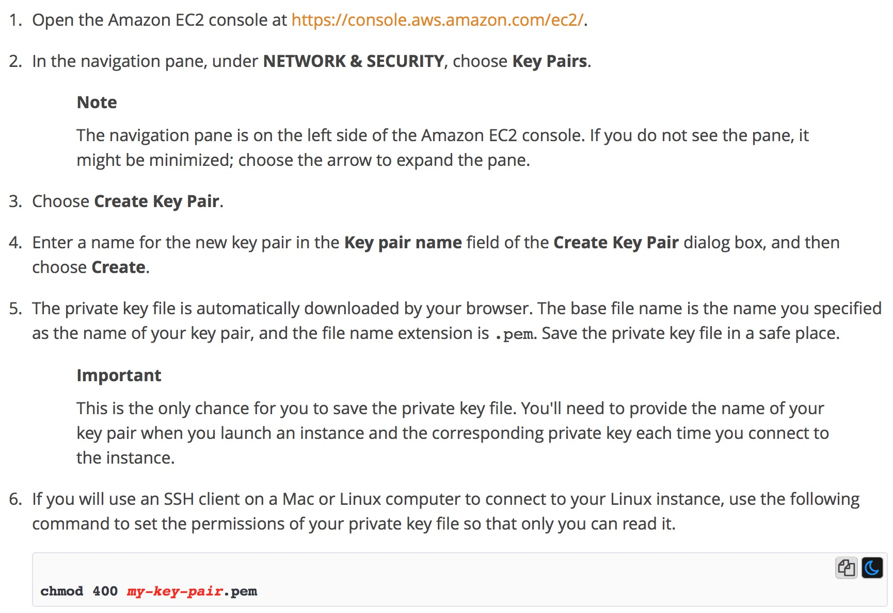

## 访问指定的网站 ##

为什么这一步要单独写呢？因为真的太尼玛慢了啊，我都服了，再佛系也扛不住啊

最终跳转到这个网站：<https://us-east-2.console.aws.amazon.com/ec2/v2/home?region=us-east-2>

## 创建密钥 ##

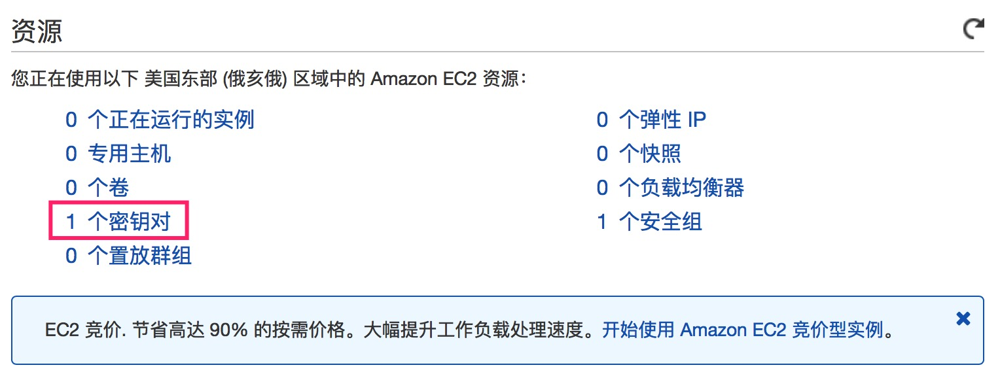

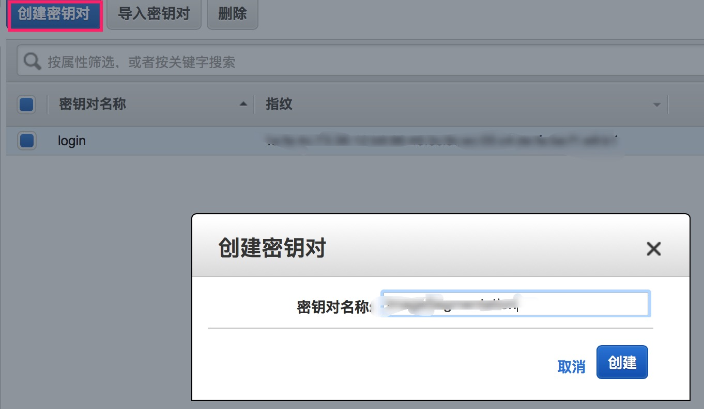

创建完成之后会让我们下载一个文件，注意保存好这个文件，之后会再次用到

# 申请竞价实例 #

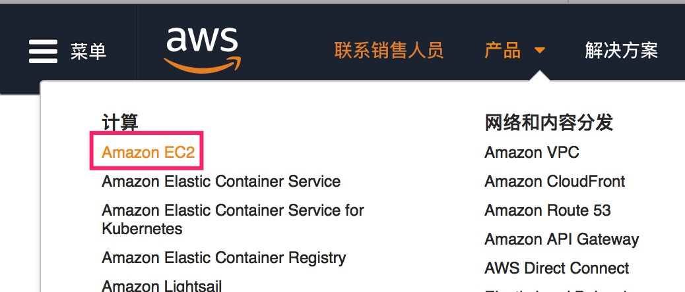

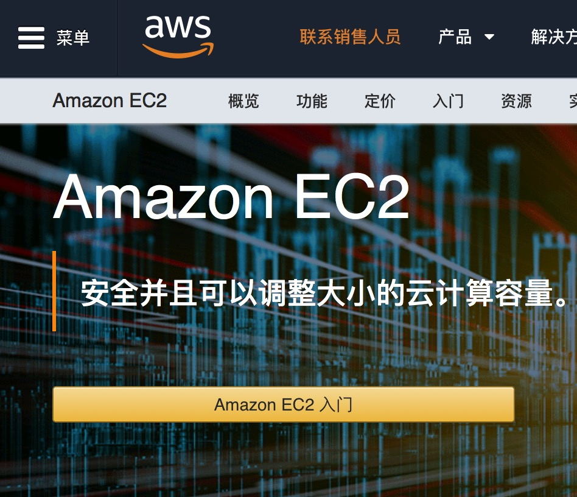

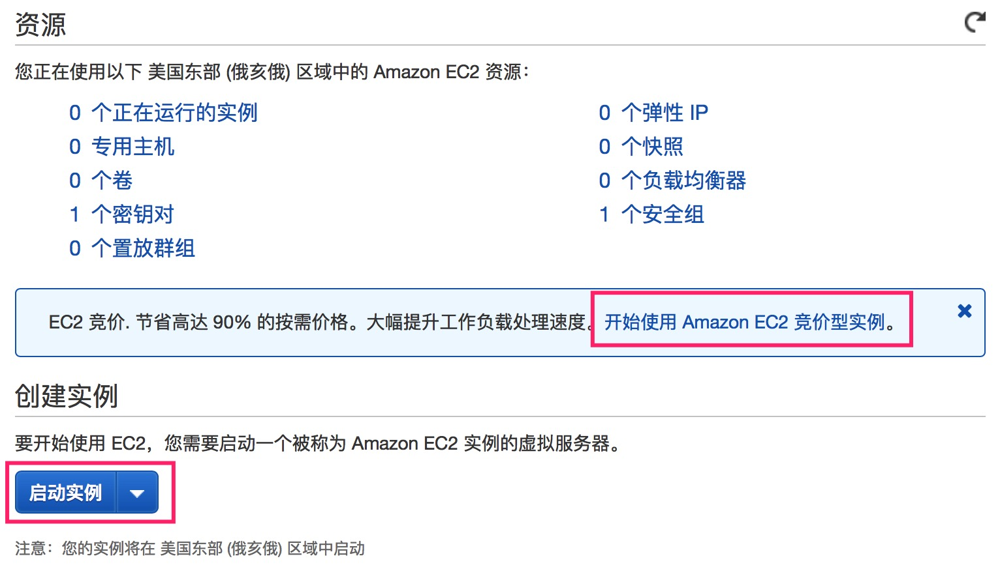

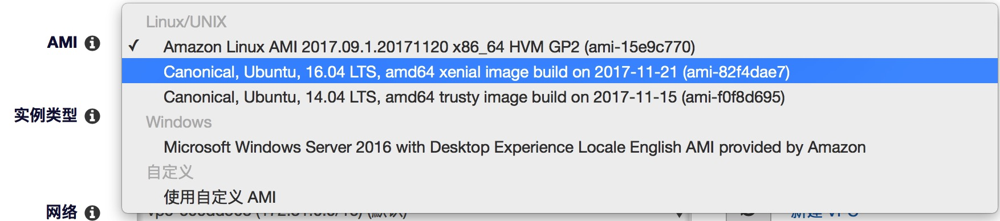

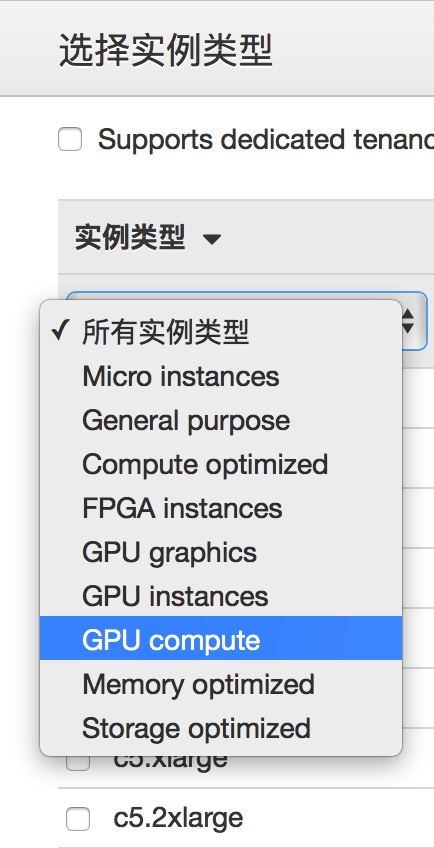

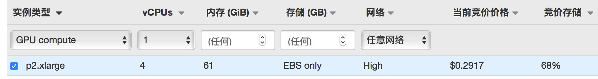

## 突破限制 ##

这里有一个非常坑爹的地方，如果你只按照上面的设置去申请竞价实例的话，会失败

原因是默认限制的竞价实例数是0

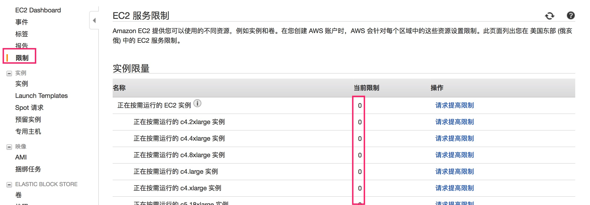

# 通过密钥登录远程主机 #

```shell
chmod 400 ~/Desktop/ImageSegmentation.pem.txt
ssh -i ~/Desktop/ImageSegmentation.pem.txt root@ip_address
```

# 制作镜像 #

