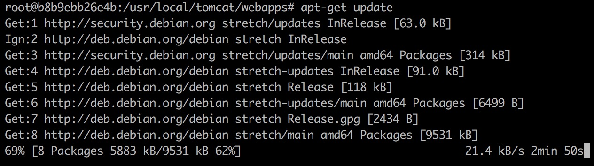

一直在用`spring`框架开发服务器软件，导致今天拿到思佳发给我的项目，都不会运行

一直不太喜欢靠`IntellJ`来运行软件，也不喜欢在自己的电脑上装一些不常用的软件，所以我们会采用`Docker`


如何你没有拉去过这个镜像，看到的输出会和我的不太一样


然后我们用这个镜像运行一个容器，注意在这个地方要做端口映射（否则从容器外面不能访问）


我们一进去就看到`tomcat`的根目录，让我们稍微介绍一下看一看目录结构


我们非常关注三个子文件夹：

+ bin —— 里面有两个脚本，一个启动脚本 & 一个关闭脚本
+ lib —— 里面有一个待会我们会用到的依赖项（servlet-api.jar）
+ webapps —— 我们自己写的软件存放的地方


那么让我们进入`webapps`文件夹


然后创建两个文件夹


现在的目录结构是这样的：

```
tomcat
	webapps
		OnlineOrder
			src
			WEB-INF
				classes
```

两个文件夹分别用于存放代码和编译出来的二进制文件


接着我们要把代码文件拷贝进来，首先需要`control + p + control + q`从容器中退出来，然后使用`docker cp ...`命令把文件拷贝到容器里去


再次返回容器


因为`tomcat`镜像不具备编译代码需要的软件，我们需要下载对应的包

```shell
apt-get update
apt-get install openjdk-8-jdk
```



可能需要一定的时间（特别是如果你在使用校园网的话）


编译相应的文件

```shell
javac -cp .:/usr/local/tomcat/lib/servlet-api.jar /usr/local/tomcat/webapps/OnlineOrder/src/Helloworld.java  -d /usr/local/tomcat/webapps/OnlineOrder/WEB-INF/classes
```


启动`Tomcat`


用`postman`试试看


有没有办法直接访问`localhost:8080`呢？

在`webapps`下有一个`ROOT`子文件夹，我们把`OnlineOrder`文件夹里面的`WEB-INF`文件夹拷贝到`ROOT`文件夹下


然后重新启动`tomcat`（先关掉再启动）


BINGO!!!
