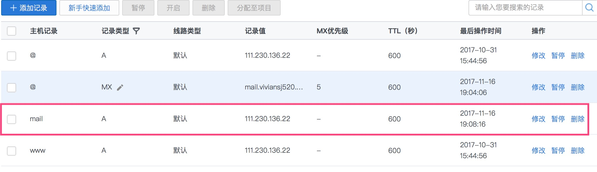

# 概念 #

## SMTP ##

Simple Mail Transfer Protocol (SMTP) is an Internet standard for electronic mail (email) transmission.

> 简单邮件传输协议是互联网电子邮件传输的标准

SMTP communication between mail servers uses TCP port 25.

> 在简单邮件传输协议中，邮件服务器通过25号端口通信
>
> 在五层因特网协议栈中，简单邮件传输协议位于应用层，依赖的运输层协议是TCP协议

Mail clients on the other hand, often submit the outgoing emails to a mail server on port 587.

> 邮件客户端通过587号端口向邮件服务器提交要发送的邮件

Despite being deprecated, mail providers sometimes still permit the use of nonstandard port 465 for this purpose.

> 在非标准情形下，465号端口可以起到和587号端口相同的作用

## SPF ##

Sender Policy Framework = SPF

Sender Policy Framework (SPF) is a simple email-validation system designed to detect email spoofing by providing a mechanism to allow receiving mail exchangers to check that incoming mail from a domain comes from a host authorized by that domain's administrators.

> SPF时一个简单的邮件验证系统，用于抵抗邮件欺骗（发件人的地址是伪造的）
>
> 这个机制允许接受到邮件的exchangers去确认邮件来自于某个被域名所有者授权的主机

The list of authorized sending hosts for a domain is published in the Domain Name System (DNS) records for that domain in the form of a specially formatted TXT record.

> 这个查询机制需要DNS的支持
>
> 域名和授权的主机之前是一对多关系，授权主机列表被DNS呈现为一种特殊的记录


## DKIM ##

DomainKeys Identified Mail = DKIM

DomainKeys Identified Mail (DKIM) is an email authentication method designed to detect email spoofing. It allows the receiver to check that an email claimed to have come from a specific domain was indeed authorized by the owner of that domain.

> DKIM也是一种防止邮件欺骗的手段，也同样需要DNS的支持

In technical terms, DKIM lets a domain associate its name with an email message by affixing a digital signature to it. 

> 在邮件的开头插入一段签名
>
> 接收方通过DNS服务查询到对应域名的公钥之后进行计算（也许用到了非对程加密技术）


## PTR ##

反向域名解析，可以通过发件人的IP地址反向得知域名

用于防止发件人伪造

## MUA ##

Mail User Agent = MUA

用户邮件代理

在我的理解中（不一定准确），MUA是一种运行于用户电脑端的软件，负责把邮件推送到远程的邮件发送服务器上（类似于Mac上的邮件应用）

## MTA ##

Mail Transfer Agent = MTA

邮件传输代理，只负责通过SMTP发送邮件，不负责邮件的存储

## MDA ##

Mail Deliver Agent = MDA

邮件分发代理，负责将接收到的邮件保存在邮件服务器上

## MRA ##

Mail Receive Agent = MRA

邮件接收代理，负责将服务器上的邮件通过IMAP以及POP3传输给客户端（位于服务器上）

## 总结 ##

运行在Demons电脑上的邮件应用 = MUA（发送）+ MUA（接受）

运行在腾讯服务器上的邮件应用 = MSA（收取并保存用户上传的邮件）+ MTA（发送MSA保存的邮件）+ Mail exchanger／MTA（接受另一台邮件服务器发送的邮件）+ MDA（保存从另一台邮件服务器上收到的邮件）+ MRA

在《计算机网络——自顶向下方法》一书中，SMTP在两个场景下用到：

+ 邮件服务器之间的沟通
+ 用户上传邮件到邮件服务器

唯有用户下载邮件不使用SMTP协议，而使用：POP3／IMAP／HTTP

SPF／DKIM／PTR是做一件事情（防止发件人欺骗）的三个手段

# 原理 #

## Mail processing model ##


Email is submitted by a mail client (mail user agent, MUA) to a mail server (mail submission agent, MSA) using SMTP on TCP port 587.

> 邮件客户端通过587号端口向邮件服务器提交需要发送的邮件

Most mailbox providers still allow submission on traditional port 25.

> 大多数邮箱服务提供者也允许在25号端口进行提交

The MSA delivers the mail to its mail transfer agent (mail transfer agent, MTA).

> MSA把邮件传送给它自己的邮件发送代理

Often, these two agents are instances of the same software launched with different options on the same machine.

> 通常来说，这两个代理（MSA／MTA）跑在同一台计算机上，它们甚至是同一个程序／软件的不同实体

Local processing can be done either on a single machine, or split among multiple machines; mail agent processes on one machine can share files, but if processing is on multiple machines, they transfer messages between each other using SMTP, where each machine is configured to use the next machine as a smart host. Each process is an MTA (an SMTP server) in its own right.

> 当然也可以把两个代理放到不同的机器上，甚至是做成分布式的架构（通信使用SMTP）

The boundary MTA uses the Domain name system (DNS) to look up the mail exchanger record (MX record) for the recipient's domain (the part of the email address on the right of @).

> MTA通过DNS服务查询MX记录，把收件人的域名转换成规范主机名
>
> MX记录的键是别名，值是规范主机名

The MX record contains the name of the target host. Based on the target host and other factors, the MTA selects an exchange server: see the article MX record. The MTA connects to the exchange server as an SMTP client.

> 通过查询得到的MX记录包括规范主机名，基于这个信息，MTA可以知道一个交换服务器（exchnage server）
>
> MTA通过SMTP与对方通信

Message transfer can occur in a single connection between two MTAs, or in a series of hops through intermediary systems.

> 信息的传输可能发生在两个MTA之间，也可能发生在一系列很多跳的中间系统之间（比如说路由）

A receiving SMTP server may be the ultimate destination, an intermediate "relay" (that is, it stores and forwards the message) or a "gateway" (that is, it may forward the message using some protocol other than SMTP).

> 收到信息的SMTP服务器有可能是一个终极地点，也有可能是一个跳板
>
> （通过SMTP或者其它协议把信息转发出去）

Each hop is a formal handoff of responsibility for the message, whereby the receiving server must either deliver the message or properly report the failure to do so.

Once the final hop accepts the incoming message, it hands it to a mail delivery agent (MDA) for local delivery.

> 一旦到达最后一跳，MTA会把邮件交给MDA

An MDA saves messages in the relevant mailbox format. As with sending, this reception can be done using one or multiple computers, but in the diagram above the MDA is depicted as one box near the mail exchanger box. An MDA may deliver messages directly to storage, or forward them over a network using SMTP or other protocol such as Local Mail Transfer Protocol (LMTP), a derivative of SMTP designed for this purpose.

> MDA对于收到的邮件有两种基本的处理方式：本地存储／发给其它节点

Once delivered to the local mail server, the mail is stored for batch retrieval by authenticated mail clients (MUAs). Mail is retrieved by end-user applications, called email clients, using Internet Message Access Protocol (IMAP), a protocol that both facilitates access to mail and manages stored mail, or the Post Office Protocol (POP) which typically uses the traditional mbox mail file format or a proprietary system such as Microsoft Exchange/Outlook or Lotus Notes/Domino. Webmail clients may use either method, but the retrieval protocol is often not a formal standard.

> 一旦邮件到达本地邮件服务器，就会等待终端用户取回
>
> 取回时可以使用的协议包括：IMAP／POP

## 电子邮件架构 ##


## 邮件服务器接受收件 ##

假设`yusen@Foxmail.com`发送一封邮件到`yusen@yusengy.info`中：


1. foxmail.com服务器会通过DNS查询到yusengy.info的MX记录，然后找到Postfix所在的服务器所在
2. 邮件通过SMTP协议发送给Postfix
3. Postfix通过MySQL查询，yusengy.info是否是本机需要处理的域名
4. MySQL通过查询返回确认信息给Postfix
5. Postfix得到确认信息，把邮件传送给Dovecot，由Dovecot的LMTP服务来做投递工作
6. Dovecot把邮件的内容保存在对应的路径中

## 用户查收邮件过程 ##


1. MUA向Dovecot请求IMAP连接
2. Dovecot发送自己的SSL证书
3. MUA发送用户的账号密码
4. Dovecot得到账号密码向MySQL查询
5. MySQL返回查询结果
6. 如果账号密码正确，Dovecot读取在该用户路径下的信息
7. 得到最新的邮件以及其他的一些统计信息
8. 通过IMAP协议发送给MUA

## 用户发送邮件的过程 ##


1. MUA请求与Postfix建立SMTP连接
2. Postfix发送SSL证书给MUA
3. MUA发送账号密码给Postfix，请求验证
4. Postfix请求Dovecot验证账号密码
5. Dovecot请求MySQL查询结果
6. MySQL返回查询结果
7. Dovecot返回Postfix账号密码验证结果
8. Postfix返回MUA账号密码验证结果
9. MUA使用SMTP协议发送邮件到Postfix
10. Postfix发送邮件

# 实践 #

## 启动容器 ##

```shell
docker run -t -i --name mail -p 25:25 -p 110:110 -p 143:143 -p 465:465 -p 587:587 -p 993:993 -p 995:995 debian /bin/bash
apt-get update
apt-get install vim
```

## 设置hostname ##

```shell
vim /etc/hostname
```


```shell
vim /etc/hosts
```


现在修改还没有真正生效：


然而退出之后再进入也没有生效，这就很尴尬了（甚至连上次的修改也变得无效）


```shell
docker run -t -i --privileged --name mail -p 25:25 -p 110:110 -p 143:143 -p 465:465 -p 587:587 -p 993:993 -p 995:995 debian /bin/bash
hostname mail.viviansj520.cn
hostname
```

重复以上操作即可

## 添加域名解析 ##


要能够ping通mail.viviansj520.cn有两种办法：

+ 让DNS服务提供商帮我们解析viviansj520.cn，我们自建在该域名下的解析服务器
+ 让DNS服务提供商顺便帮我们解析mail.viviansj520.cn

为了简单，我们采用方案二：


但实际上，我们添加的记录是错误的，MX记录的值是规范主机名





十分钟之后，该修改生效

当然，以上配置没有包含SPF／DKIM等防伪功能所需的记录


# 总结 #

感谢[[YusenMeng](http://www.jianshu.com/u/310946dd5bd0)](http://www.jianshu.com/u/310946dd5bd0)的教程[《从零开始邮件服务器搭建》](http://www.jianshu.com/p/610d9bf0ae8b)

感谢维基百科