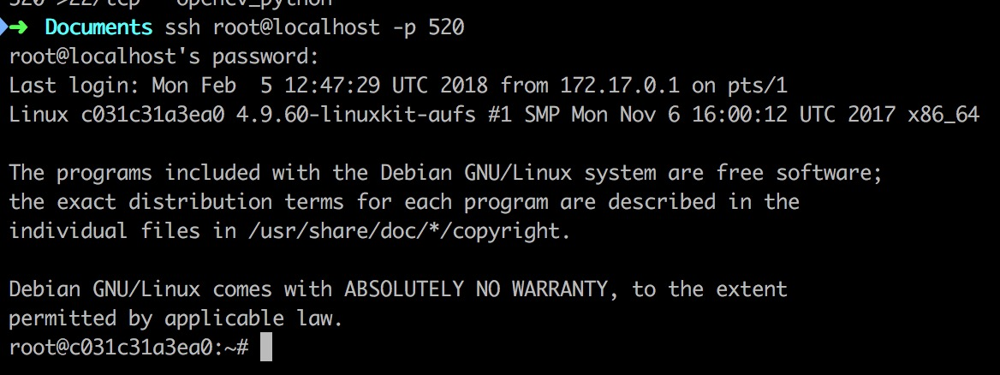

最近思佳迷上了`Python`，然而它的电脑好像中过毒，出现了复杂的环境问题；导致在环境配置上消耗的时间过多（虽然配置环境本来就很消耗时间且很心烦），所以想要解决这个问题

我是`Docker`吹，然鹅一直没有把女朋友带到坑里来实在是一件很遗憾的事情，所以就有了这篇文章

# 拉取镜像 #

上谷歌联合查找三个关键词：

+ `Python`
+ `opencv`
+ `docker image`

跳出来的镜像一抓一大把，选一个星星比较多（看起来比较厉害的）就行了

```shell
docker pull jjanzic/docker-python3-opencv
```


# 运行容器 #

注意两个事情：

+ 数据卷挂载：保证容器内的文件和宿主机上的文件是同步的，我们也懒得管`PyCharm`到底用的是容器内的文件还是宿主机的文件（有兴趣的话可以自行探索）
+ 端口映射：保证`PyCharm`可以通过`SSH`连接到容器

```shell
mkdir tmpData
docker run -t -i --rm -p 520:22 -v tmpData:/data --name opencv_python jjanzic/docker-python3-opencv /bin/bash
docker ps
```


# 让容器支持SSH #

```shell
apt-get install ssh
apt-get install openssh-server
cat /etc/ssh/sshd_config
service ssh restart

mkdir /var/run/sshd
echo 'root:screencast' | chpasswd
sed -i 's/PermitRootLogin prohibit-password/PermitRootLogin yes/' /etc/ssh/sshd_config

# SSH login fix. Otherwise user is kicked off after login
sed 's@session\s*required\s*pam_loginuid.so@session optional pam_loginuid.so@g' -i /etc/pam.d/sshd

export NOTVISIBLE="in users profile"
echo "export VISIBLE=now" >> /etc/profile
service ssh restart
```

（以上命令请在容器内运行）

（按住`control + p + control + q`从容器中“跳出来”，以下命令请在宿主机中运行）

```shell
ssh root@localhost -p 520
# The password is ``screencast``.
# 成功登录？
exit
```

怎么可能成功登录？永远都不可能成功登录的（我是从哪里学到这种骚话的啊）


`DigitalOcean`上的一波强势教学

```shell
# 进入容器
apt-get install vim
vim /etc/ssh/sshd_config
service ssh restart
```

然鹅还是不行（啪啪打脸），接着往下看强势教学：


这一波之后是真的可以了




# 配置集成环境 #


记得保持宿主机和容器的文件同步！所以新建项目的文件夹必须是相应文件夹或者其子文件夹

（然而社区版不支持`SSH`，所以要使用专业版，默默去下了个专业版）


然鹅，报错！


可能是因为我们挂载数据卷的姿势不对

# 重新启动容器 #

```shell
docker rm -f opencv_python
# 在宿主机中进入到tmpData文件夹
# 在宿主机中运行pwd命令获取当前目录的绝对路径
# 然后拷贝一下
docker run -t -i --rm -p 520:22 -v /Users/demons/Documents/tmpData:/Users/demons/Documents/tmpData --name opencv_python jjanzic/docker-python3-opencv /bin/bash
```

然后前面的步骤三《让容器支持SSH》再来一遍即可（说的一点也不浪费时间）

（如果出现`WARNING: REMOTE HOST IDENTIFICATION HAS CHANGED!`的类似错误，相信你知道怎么解决）


# 还剩一点小配置 #

注意到我们在`IDE`中还要配置`Python`在容器中的位置，默认配置是不对的（至少不能使用`Python3`）

不如到容器中找一下`Python`在哪里（`whereis`命令）：


让我们来打印一下使用的`Python`的版本：

```shell
import sys
print(sys.version)
```


配置成功！

# 试试opencv吧 #

```python
import numpy as np
x = np.uint8([250])
y = np.uint8([10])
print(cv2.add(x,y))
```


# 调适可不可以用呢 #


你问我资不资瓷？当然是资瓷啊！

# 表白 #


