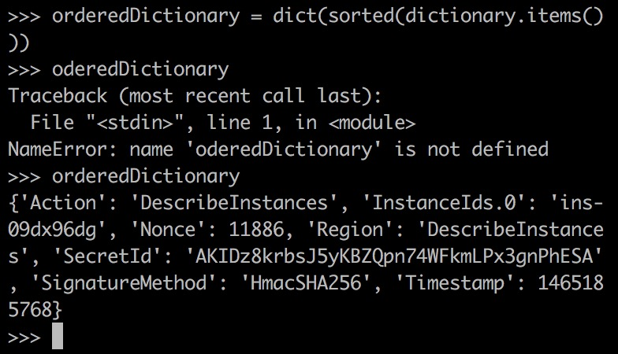
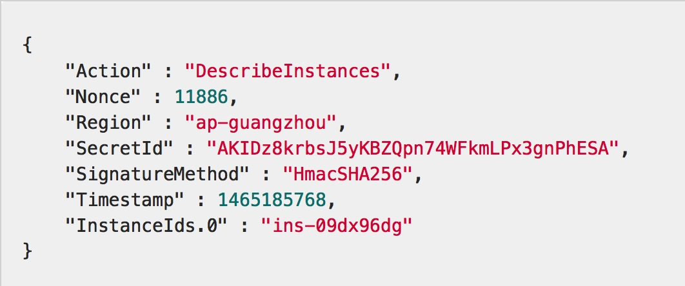

# 启动容器 #

当前`python`的版本是`3.6`


# 创建密钥 #


安全凭证包括`SecretId`和`SecretKey`：

+ `SecretId`用于标识`API`调用者身份
+ `SecretKey`用于加密签名字符串和服务器端验证签名字符串


# 生成签名 #


```python
dictionary = {}
dictionary["Region"] = "DescribeInstances"
dictionary["SecretId"] = "AKIDz8krbsJ5yKBZQpn74WFkmLPx3gnPhESA"
dictionary["Timestamp"] = 1465185768
dictionary["InstanceIds.0"] = "ins-09dx96dg"
dictionary["SignatureMethod"] = "HmacSHA256"
dictionary["Action"] = "DescribeInstances"
dictionary["Nonce"] = 11886
dictionary
```

## 对字典排序 ##

```python
orderedDictionary = dict(sorted(dictionary.items()))
orderedDictionary
```



讲道理，按照字母升序排序应该是上面的结果，而不应该是：



（老哥你告诉我，字母`I`是不是在字母`N`之前）

一定要确认字典的排序是正确的！！！

## 连接字典 ##

```python
def concat(dictionary):
    s = ""
    for key, value in dictionary.items():
        s += key.replace("_", ".")
        s += "="
        s += str(value)
        s += "&"
    s = s[:-1]
	return s
concat(orderedDictionary)
```


## 添加其它信息 ##

签名原文串的拼接规则为：请求方法 + 请求主机 +请求路径 + ? + 请求字符串

```python
def readySignature(dictionary):
    return "GEThttps://tmt.api.qcloud.com/v2/index.php?" + concat(dictionary)
readySignature(orderedDictionary)
```


## 生成签名 ##

```python
import hmac
import hashlib
import base64

def signature(dictionary, secretKey):
    digest = hmac.new(bytes(secretKey, "latin-1"), msg=bytes(readySignature(dictionary), "latin-1"), digestmod=hashlib.sha256).digest()
    signature = base64.b64encode(digest)
    return signature

signature(orderedDictionary, "123")
```


# 发起请求 #

```bash
pip install requests
```

```python
import requests

def translate(sourceText, secretKey):
    payload = set(dictionary)
    payload["Signature"] = signature(orderedDictionary, secretKey)
    payload["source"] = "zh"
    payload["sourceText"] = sourceText
    payload["target"] = "en"
    payload = dict(sorted(payload.items()))
    r = requests.get('https://tmt.api.qcloud.com/v2/index.php', params = payload)
    return r

r = translate("你好", "123")
r.url
r.text
```

# 坑爹的排序问题 #

腾讯云要求的排序非常奇怪（大写字母开头的优先，升序排序），`python`字典的默认排序方法好像做不到这一点

## 能否保持插入顺序 ##

### python 3.6 ###

所谓能否保持插入顺序指的是：读取字典时的顺序是否等于插入字典的顺序

在`python`最新版本`3.6`中，测试结果如下：


显然可以保持顺序，所以我们可以跳过对字典排序这一步，取而代之的是：精心设计字典的插入顺序


可以看到，我们的插入顺序分别是：

1. `Action`
2. `Nonce`
3. `Region`
4. `SecretId`
5. `SignatureMethod`
6. `Timestamp`
7. `source`
8. `sourceText`
9. `target`

那么，在读取时（`concat`函数）也会保持这样的顺序

### python 3.5 ###


惊不惊喜？意不意外？厉不厉害？

在`3.5`这个版本中，居然自动帮我们排序了

所以相同的代码拿到`3.5`下跑会出事（签名无法通过服务器验证）

## 为了保持各版本的通用性？ ##

至少有两条路：

+ 继承`dict`，改写其迭代器行为
+ 用数组代替字典

显然第二种方法比较简单