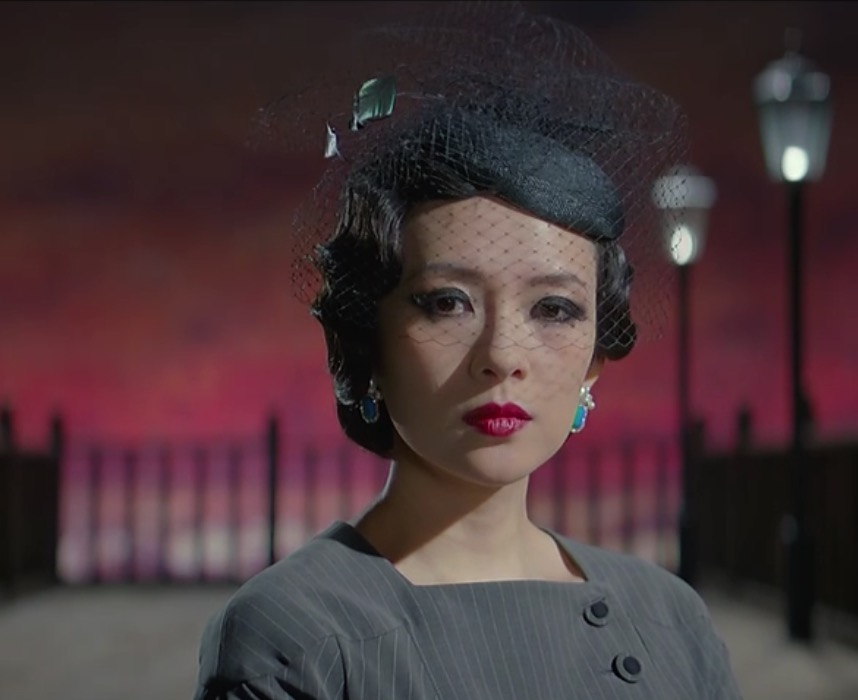
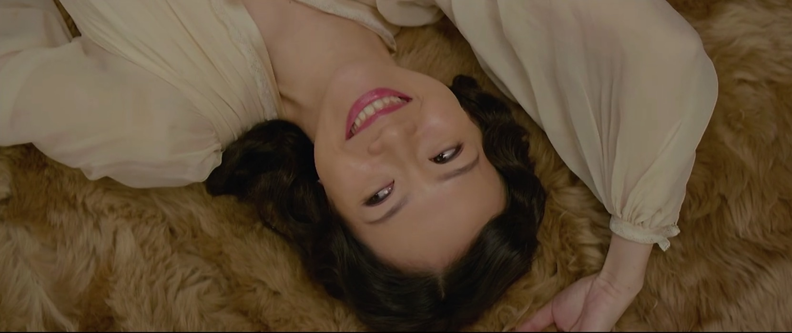
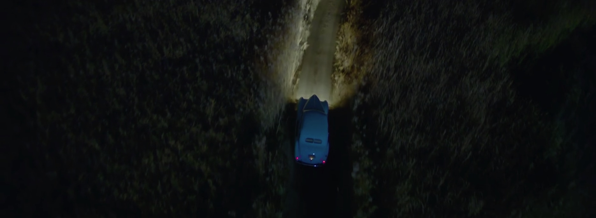
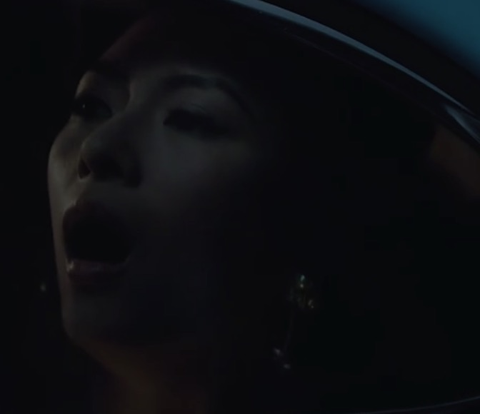
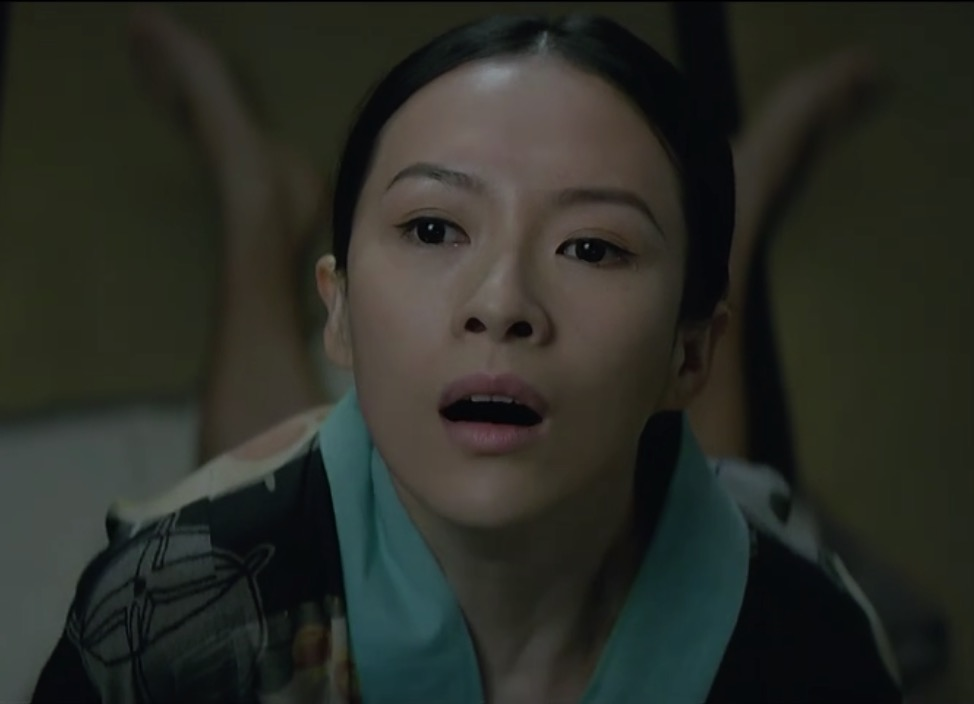
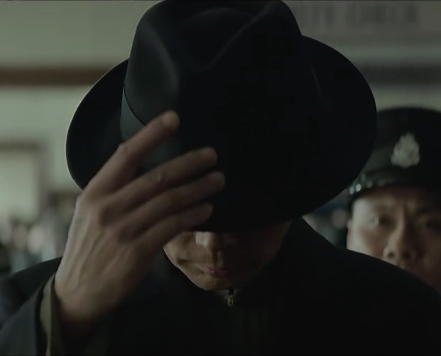

我看透了你所谓的博爱

I've seen through your so-called "universal love"

表面上宽容 博爱

What you show as tolerance and affection

其实不过是自私的自我保护

is nothing but selfishness and self-preservation

以及懒惰 逃避责任

Also laziness and avoiding responsibility

只有博爱才最安全 最省事

Universal love is merely the safest and most convenient name

你躲在博爱的名义之下

for you to hide behind

过着懒惰及自私的小日子

while living your lazy, selfish and petty life

事情就是被你这种人耽误的

Lives are wasted because of men like you

我要的

What I want is

是一个有偏爱 有憎恨的男人

a man who is capable of love and hatred

我不再喜欢你了

I don't love you anymore

再见

Goodbye

你平时这么俗气 这么十三点

You are so vulgar and silly

倾国倾城

Liberty swathes this city of shades

幽影之城被自由笼罩

Like gloves on the wings of a bird

如同双翼被束缚的飞鸟

The silken smoke of the words you spoke

昔言似烟缕雾绡

Still rises where you lay

在你安躺的地方至今萦绕

The pathways were red the lanterns alive

犹记彤光满路 华灯初上

Diamonds adrift in the sky

夜空有钻石闪耀

You're standing here when I close my eyes

我合起眼 就在这里与你相望

This slumber leaves me blind

不过片刻黄粱 梦醒满目昏盲

Take me to Shanghai

带我回上海

Take me to Shanghai

带我去上海

To the town where I belong

回到我的心之所向

The night was mine to set alight

那夜晚由我点燃

My throat was dry, my tongue ashamed

我的喉咙枯涸 我的唇舌凝噎

Of all the words I could not say

只为所有密不可宣的话语

Your eyes were night within the day

你的双眼是白昼里的黑夜

And mine the moon in the flames

而我的事烈焰中的明月

我看见你上了车

I saw you get into the car

你应该去了苏州

You were supposed to go to Suzhou

从苏州再坐火车往北走

and take a train bound north from there

我有时候会想到你

Sometimes I think of you

你应该是在北方

You were supposed to be in the north

