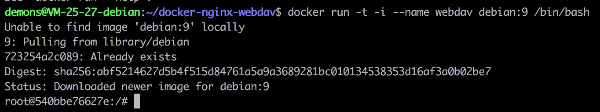

# 什么是`WebDAV` #

# 搭建服务器 #

```shell
docker run -t -i --name webdav debian:9 /bin/bash
```



## 换源 ##

```shell
cat /etc/apt/sources.list
```

```shell
deb http://mirrors.163.com/debian/  stretch main non-free contrib
deb http://mirrors.163.com/debian/  stretch-updates main non-free contrib
deb http://mirrors.163.com/debian/  stretch-backports main non-free contrib
deb-src http://mirrors.163.com/debian/  stretch main non-free contrib
deb-src http://mirrors.163.com/debian/  stretch-updates main non-free contrib
deb-src http://mirrors.163.com/debian/  stretch-backports main non-free contrib
deb http://mirrors.163.com/debian-security/  stretch/updates main non-free contrib
deb-src http://mirrors.163.com/debian-security/  stretch/updates main non-free contrib
```

```shell
cat /etc/apt/sources.list
```


```shell
apt-get update
```

## 安装`NGINX` ##

```shell
apt-get upgrade -y
apt-get install -y nginx
```

## 配置`NGINX` #

```shell
apt-get install -y vim
vim /etc/nginx/conf.d/default.conf
```

```shell
server {
    listen                     443 ssl;
    listen                     [::]:443 ssl default_server;
    server_name                www.viviansj520.cn viviansj520.cn;
    ssl_certificate            /etc/letsencrypt/live/viviansj520.cn.crt;
    ssl_certificate_key        /etc/letsencrypt/live/viviansj520.cn.key;
    ssl_protocols              TLSv1 TLSv1.1 TLSv1.2;
    ssl_ciphers                HIGH:!aNULL:!MD5;
    ssl_prefer_server_ciphers  on;
    
    access_log /dev/stdout;
    error_log /dev/stdout info;

    client_max_body_size 0;
    
    location / {
        create_full_put_path on;
        autoindex on;
        autoindex_exact_size off;
        autoindex_localtime on;
        charset utf-8;

        dav_methods PUT DELETE MKCOL COPY MOVE;
        dav_ext_methods PROPFIND OPTIONS;
        dav_access user:rw group:rw all:rw;

        auth_basic "Restricted";
    	auth_basic_user_file /etc/nginx/htpasswd;

        root /data/;
    }
}
```

```shell
/etc/init.d/nginx restart
```


启动失败（我们的`SSL`证书还没有配置）

## 配置`SSL`证书 ##

```shell
apt-get install -y python-certbot-nginx -t stretch-backports certbot
certbot certonly --standalone -d viviansj520.cn -d www.viviansj520.cn
```


## 修改域名解析记录 ##


```shell
apt-get install -y dnsutils
nslookup www.viviansj520.cn
nslookup viviansj520.cn
```


等待域名解析成功

## 再次生成`SSL`证书 ##

+ 清空`/etc/nginx/conf.d/default.conf`中的所有内容
+ `/etc/init.d/nginx restart`
+ `certbot certonly --standalone -d viviansj520.cn -d www.viviansj520.cn`


也许是我们没有正确配置端口映射的问题

## 重新启动容器 ##

```shell
exit
docker commit webdav newwendav
docker rm webdav
docker run -t -i --name webdav -p 80:80 -p 443:443 newwendav /bin/bash
```

## 再再次生成`SSL`证书 ##


## 再次配置`NGINX` ##

```shell
server {
    listen                     443 ssl;
    listen                     [::]:443 ssl default_server;
    server_name                www.viviansj520.cn viviansj520.cn;
    ssl_certificate            /etc/letsencrypt/live/viviansj520.cn/fullchain.pem;
    ssl_certificate_key        /etc/letsencrypt/live/viviansj520.cn/privkey.pem;
    ssl_protocols              TLSv1 TLSv1.1 TLSv1.2;
    ssl_ciphers                HIGH:!aNULL:!MD5;
    ssl_prefer_server_ciphers  on;
    
    access_log /dev/stdout;
    error_log /dev/stdout info;

    client_max_body_size 0;
    
    location / {
        create_full_put_path on;
        autoindex on;
        autoindex_exact_size off;
        autoindex_localtime on;
        charset utf-8;

        dav_methods PUT DELETE MKCOL COPY MOVE;
        dav_ext_methods PROPFIND OPTIONS;
        dav_access user:rw group:rw all:rw;

        auth_basic "Restricted";
    	auth_basic_user_file /etc/nginx/htpasswd;

        root /data/;
    }
}
```

```shell
/etc/init.d/nginx restart
```


```shell
vim /var/log/nginx/error.log
```


原来是文件不存在（好像我们的路径写错了）


## 重定位 ##

```shell
server {
  listen 80 default_server;
  listen [::]:80 default_server;
  server_name _;
  return 301 https://$host$request_uri;
}
```

```shell
/etc/init.d/nginx restart
```


## 设置密码 ##

```shell
apt-get install -y apache2-utils
htpasswd -bc /etc/nginx/htpasswd username password
```

# 客户端 #


是不是因为服务器缺少相应的文件夹呢？

```shell
mkdir /data
```


机智如我，搞定！

# 使用`Dockerfile` #

[Dockerfile](Docker/Dockerfile)

[webdav.conf](Docker/webdav.conf)

[entrypoint.sh](Docker/entrypoint.sh)

[sources.list](Docker/sources.list)

```shell
docker build -t webdav:latest .
docker run -t -i -p 80:80 -p 443:443 -v ~/mycloud:/data -e USERNAME=username -e PASSWORD=password --name webdav webdav:latest
```

# 替代方案 #

## 证书 ##

太过频繁地申请`SSL`证书把我们的`Let'sEncrypt`搞崩了，所以只能想想其它办法

好在腾讯云也可以帮我们申请证书


下载到服务器上，放到指定的文件夹（查看`NGINX`的配置文件）也可以起到相同的效果

## 文件存储服务 ##


这个文件存储服务的价格极其便宜，比市面上的存储服务要便宜非常多

如果使用文件存储服务，挂载关系大概是这样的：

+ 宿主机的`mycloud`文件夹挂载文件存储
+ 容器使用`mycloud:/data`的数据卷映射