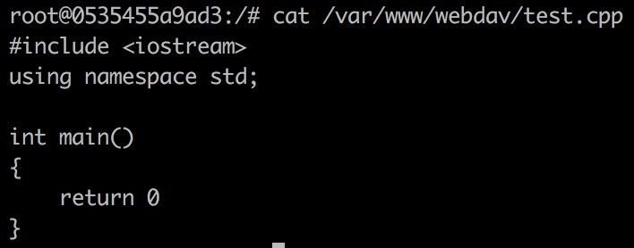

前言

使用`Nginx`搭建的`WebDAV`不支持锁，导致`MacOS`上的`Finder`拒绝对其进行写操作

然而`Nginx`没有为`WebDAV`实现锁功能，所以我们只能换一个软件


# 开始搭建服务器 #

## 一些准备工作 ##

之前使用的`mycloud`文件夹的权限有一点奇怪，我们决定换掉它

```shell
sudo umount mycloud
sudo rm -f -r mycloud
mkdir MyCloud
sudo mount -t nfs -o vers=4 xxx.xxx.xxx.xxx:/ MyCloud
```


请务必确认：不使用超级权限可以在`MyCloud`文件夹下创建和删除文件

```shell
cd MyCloud
touch test.cpp
rm test.cpp
```


## 运行容器 ##

```shell
docker run -t -i -p 80:80 -p 443:443 -v MyCloud:/var/www/webdav debian:9 /bin/bash
```

确认`/var/www/webdav`文件夹存在：


```shell
docker cp sources.list 0535:/etc/apt/sources.list
docker start -a -i 0535
```

## 最简单的`WebDAV`服务器 ##

所谓最简单：

+ 使用`HTTP`连接而不是`HTTPS`连接
+ 没有用户和密码

```shell
apt-get update
apt-get install -y apache2 vim
chown -R www-data:www-data /var/www/
a2enmod dav
a2enmod dav_fs
vim /etc/apache2/sites-available/000-default.conf
```

```shell
DavLockDB /var/www/DavLock
<VirtualHost *:80>
        # The ServerName directive sets the request scheme, hostname and port that
        # the server uses to identify itself. This is used when creating
        # redirection URLs. In the context of virtual hosts, the ServerName
        # specifies what hostname must appear in the request's Host: header to
        # match this virtual host. For the default virtual host (this file) this
        # value is not decisive as it is used as a last resort host regardless.
        # However, you must set it for any further virtual host explicitly.
        #ServerName www.example.com

        ServerAdmin webmaster@localhost
        DocumentRoot /var/www/html

        # Available loglevels: trace8, ..., trace1, debug, info, notice, warn,
        # error, crit, alert, emerg.
        # It is also possible to configure the loglevel for particular
        # modules, e.g.
        #LogLevel info ssl:warn

        ErrorLog ${APACHE_LOG_DIR}/error.log
        CustomLog ${APACHE_LOG_DIR}/access.log combined

        # For most configuration files from conf-available/, which are
        # enabled or disabled at a global level, it is possible to
        # include a line for only one particular virtual host. For example the
        # following line enables the CGI configuration for this host only
        # after it has been globally disabled with "a2disconf".
        #Include conf-available/serve-cgi-bin.conf

        Alias /webdav /var/www/webdav

        <Directory /var/www/webdav>
            DAV On
        </Directory>
</VirtualHost>

# vim: syntax=apache ts=4 sw=4 sts=4 sr noet
```

```shell
service apache2 restart
```


### 用`Finder`试试看 ###


打开自己电脑（非服务器）的终端，输入：

```shell
cd /Volumes/webdav
touch test.cpp
touch test.cpp2
touch test.cpp3
```


### 看看服务器有变化吗 ###


## 加上密码吧 ##

```shell
apt-get install -y apache2-utils
htdigest -c /etc/apache2/users.password webdav username
```

注意把`username`替换成你想要设置的用户名


```shell
vim /etc/apache2/sites-available/000-default.conf
```

```shell
DavLockDB /var/www/DavLock

<VirtualHost *:80>
    ServerAdmin webmaster@localhost
    DocumentRoot /var/www/html

    ErrorLog ${APACHE_LOG_DIR}/error.log
    CustomLog ${APACHE_LOG_DIR}/access.log combined

    Alias /webdav /var/www/webdav

    <Directory /var/www/webdav>
        DAV On
        AuthType Digest
        AuthName "webdav"
        AuthUserFile /etc/apache2/users.password
        Require valid-user
    </Directory>
</VirtualHost>
```

```shell
chown www-data:www-data /etc/apache2/users.password
a2enmod auth_digest
service apache2 restart
```

### 用`Finder`试试看 ###

此时已经需要正确的用户名和密码才能登陆了，让我们来尝试修改一下`test.cpp`


`Finder`没有阻止我们修改`test.cpp`

### 看看服务器有变化吗 ###

```shell
cat /var/www/webdav/test.cpp
```



## 使用`SSL`吧 ##

```shell
a2enmod ssl
service apache2 restart
mkdir /etc/apache2/ssl
// 把证书放到相应的文件夹下
vim /etc/apache2/sites-available/default-ssl.conf
```


```shell
a2ensite default-ssl.conf
service apache2 restart
```


### 出现了一些小问题 ###

不能用`Finder`连接`https://viviansj520.cn/webdav`，却可以用浏览器访问`https://viviansj520.cn`

有可能是两者没有整合在一起

```shell
vim /etc/apache2/sites-available/000-default.conf
```

```shell
DavLockDB /var/www/DavLock

<VirtualHost *:443>
    ServerAdmin webmaster@localhost
    ServerName viviansj520.cn
    ServerAlias www.viviansj520.cn
    DocumentRoot /var/www/html

    SSLEngine on
    SSLCertificateFile  /etc/apache2/ssl/apache.crt
    SSLCertificateKeyFile /etc/apache2/ssl/apache.key

    ErrorLog ${APACHE_LOG_DIR}/error.log
    CustomLog ${APACHE_LOG_DIR}/access.log combined

    Alias /webdav /var/www/webdav

    <Directory /var/www/webdav>
        DAV On
        AuthType Digest
        AuthName "webdav"
        AuthUserFile /etc/apache2/users.password
        Require valid-user
    </Directory>
</VirtualHost>
```

```shell
service apache2 restart
```


直接删除`/etc/apache2/sites-available/default-ssl.conf`导致`Apache`重启失败

于是把`/etc/apache2/sites-available/default-ssl.conf`恢复成之前的模样，稍稍改动`/etc/apache2/sites-available/000-default.conf`


### 用`Finder`试试看吧 ###


BINGO!!!

# 用`Docker`吧 #

```shell
docker build -t webdav .
docker run -t -i -p 443:443 -e USERNAME=837940593 -v ~/MyCloud:/var/www/webdav --restart=always --name webdav webdav
```

更多文件请参考`Docker`文件夹下的文件（把`apache.crt`和`apache.crt`文件替换成自己的）

# 客户端呢 #

## MacOS ##

+ 挂载硬盘
+ 使用端到端加密软件


效果非常棒：

+ 客户端加密，即使服务器不可信也不会影响隐私性
+ 完全可以当成`Finder`中的一个文件夹来使用（除了：删除的文件不会到废纸篓）

## iOS ##

同款软件，且操作更为简单，只需要填写：

+ 服务器地址
+ 用户名
+ 密码

操作十分简单，因此不演示