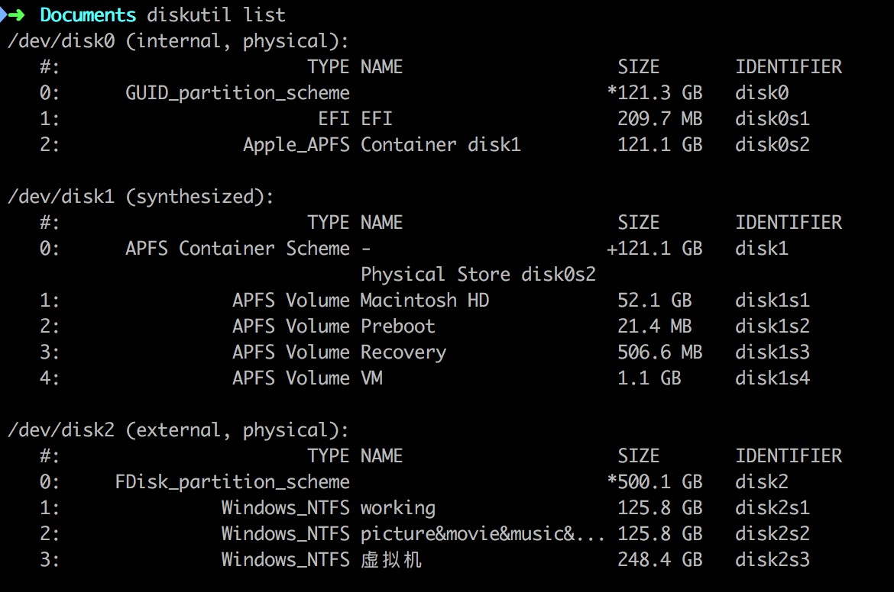
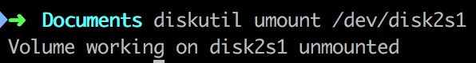
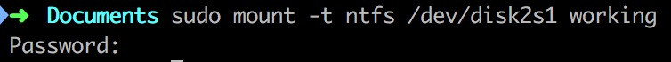
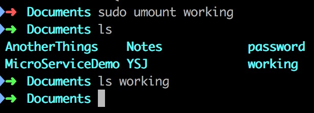
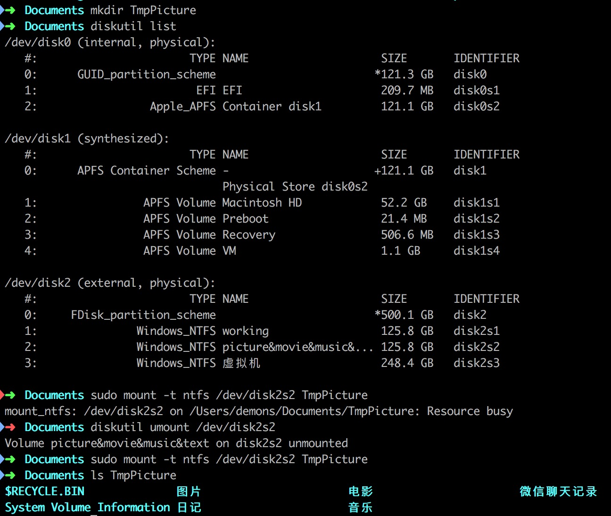
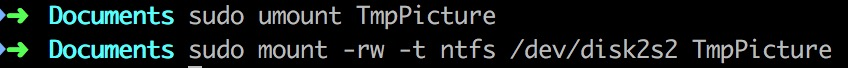

# 第一次尝试 #









# 第二次尝试 #





# 第三次尝试 #

```shell
cd /Volumes
sudo mkdir TmpPictures
diskutil list
diskutil unmount /dev/disk2s2
sudo mount -w -t ntfs -o rw,nobrowse /dev/disk2s2 /Volumes/TmpPictures
open TmpPictures
```

