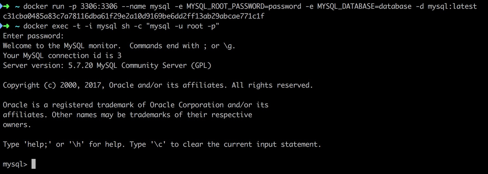
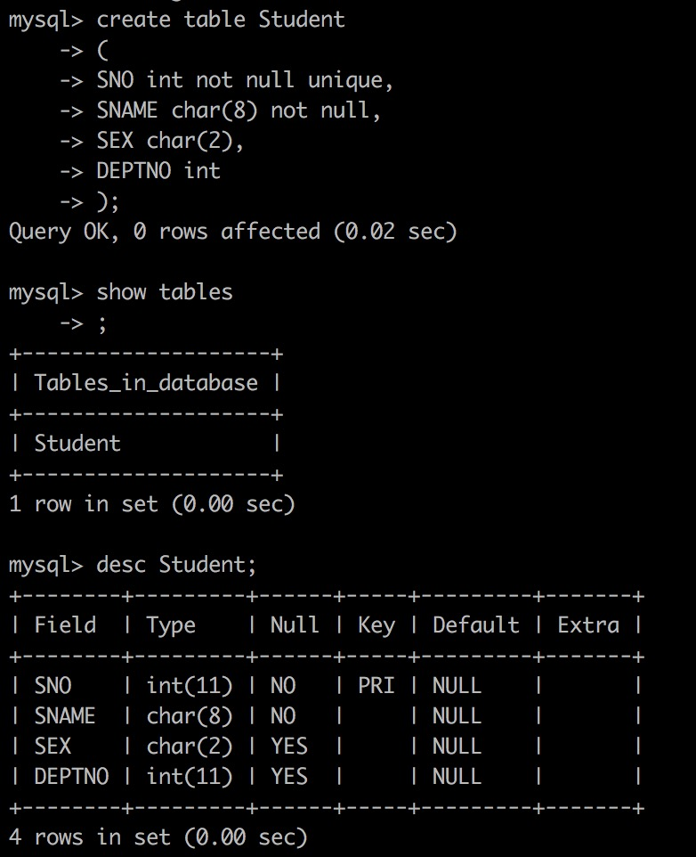

# 环境 #

```shell
docker run -p 3306:3306 --name mysql -e MYSQL_ROOT_PASSWORD=password -e MYSQL_DATABASE=database -d mysql:latest
docker exec -t -i mysql sh -c "mysql -u root -p"
```



```mysql
use database;
```


# 使用SQL语句建立基本表 #

## Student ##

```mysql
create table Student
(
  SNO int not null unique,
  SNAME char(8) not null,
  SEX char(2),
  DEPTNO int
);
show tables;
desc Student;
```



## Course ##

```mysql
create table Course
(
  CNO int not null,
  CNAME char(20),
  TNO int not null,
  CREDIT int,
  primary key(CNO, TNO)
);
desc Course;
```


## SC ##

```mysql
create table SC
(
  SNO int not null,
  CNO int not null,
  GRADE int,
  primary key(SNO, CNO)
);
desc SC;
```


## Teacher ##

```mysql
create table Teacher
(
  TNO int not null unique,
  TNAME char(8) not null,
  DEPTNo int
);
```


## Dept ##

```mysql
create table Dept
(
  DEPTNO int not null unique,
  DNAME char(20)
);
desc Dept;
```


# 使用SQL语句修改基本表 #

## 加入AGE属性 ##

```mysql
alter table `Student` add column AGE smallint after SEX;
desc Student;
```


## 更改AGE属性 ##

```mysql
alter table `Student` modify AGE int;
desc Student;
```


# 使用SQL语句插入数据 #

## Student ##

```mysql
alter table `Student` modify AGE int after DEPTNO;
desc Student;
```


```mysql
// 之前有误插入的数据
delete from Student;
insert into Student values(1001, "miaomiao", "m", 10, 20);
insert into Student values(1002, "wangwang", "f", 10, 21);
insert into Student values(1003, "miemie", "m", 10, 21);
insert into Student values(1004, "moumou", "f", 20, 21);
insert into Student values(1005, "guagua", "m", 20, 22);
insert into Student values(1006, "gaga", "f", 20, 22);
insert into Student values(1007, "guguda", "f", 30, 20);
select * from Student;
```


## 支持中文 ##

```shell
docker exec mysql sh -c "echo \"LANG=zh_CN.UTF-8\" >> ~/.bashrc"
docker exec mysql sh -c "echo \"LANGUAGE=zh_CN.UTF-8\" >> ~/.bashrc"
docker exec mysql sh -c "cat ~/.bashrc"
```


```shell
docker exec mysql bash -c "source ~/.bashrc"
docker exec mysql sh -c "locale"
```

```shell
docker exec -it mysql bash
apt-get update
apt-get install locales
dpkg-reconfigure locales
export LANG='zh_CN.UTF-8'
export LC_ALL='zh_CN.UTF-8'
```


## Course ##

```shell
docker exec -t -i mysql sh -c "export LANG='zh_CN.UTF-8' && export LC_ALL='zh_CN.UTF-8' && mysql -u root -p"
```

```mysql
set names utf8;
alter table `Course` convert to character set utf8;
delete from Course;
insert into Course values(1, "数据结构", 101, 4);
insert into Course values(2, "数据库", 102, 4);
insert into Course values(3, "离散数学", 103, 4);
insert into Course values(4, "C语言程序设计", 101, 2);
insert into Course values(5, "高等量子力学", 105, 3);
select * from Course;
```


## SC ##

```mysql
insert into SC values(1001, 1, 80);
insert into SC values(1001, 2, 85);
insert into SC values(1001, 3, 78);
insert into SC values(1002, 1, 72);
insert into SC values(1002, 2, 82);
insert into SC values(1002, 3, 86);
insert into SC values(1003, 1, 92);
insert into SC values(1003, 3, 90);
insert into SC values(1004, 1, 87);
insert into SC values(1004, 4, 90);
insert into SC values(1005, 1, 85);
insert into SC values(1005, 4, 92);
insert into SC values(1006, 5, 99);
insert into SC values(1006, 2, 100);
insert into SC values(1007, 1, 80);
insert into SC values(1007, 3, 91);
select * from SC;
```


## Teacher ##

```mysql
alter table `Teacher` convert to character set utf8;
insert into Teacher values(101, "张小天", 10);
insert into Teacher values(102, "胡小伟", 10);
insert into Teacher values(103, "黄程", 10);
insert into Teacher values(104, "郭冰", 20);
insert into Teacher values(105, "钱祺", 30);
select * from Teacher;
```


## Dept ##

```mysql
alter table `Dept` convert to character set utf8;
insert into Dept values(10, "计算机");
insert into Dept values(20, "信管");
insert into Dept values(30, "物理");
select * from Dept;
```


# 单表查询 #

## 查询所有女生的学生信息 ##

```mysql
select * from Student where SEX = "f";
```


## 查询成绩在80到89之间的所有学生的选课记录，查询结果按成绩的升序排列 ##

```shell
select SNO, SNAME, GRADE from Student natural join SC where GRADE >= 80 and GRADE <= 89 order by GRADE;
```


## 查询各个系的学生人数 ##

```mysql
select DEPTNO, count(*) from Student group by DEPTNO;
```


```mysql
select * from Dept natural join (select DEPTNO, count(*) from Student group by DEPTNO) NewTable;
```


```mysql
select DNAME, RANDOMSUM from (select * from Dept natural join (select DEPTNO, count(*) RANDOMSUM from Student group by DEPTNO) NewTable) NewNewTable;
```


# 连接查询 #

## 查询在计算机方向总学分不足5分的学生姓名 ##

```sql
select SNO, sum(CREDIT) SUMCREDIT from Student natural join SC natural join Course natural join Dept where DNAME = "计算机" group by SNO;
```


```sql
select SNO
from (select SNO, sum(CREDIT) SUMCREDIT from Student natural join SC natural join Course natural join Dept where DNAME = "计算机" group by SNO) NewTable
where SUMCREDIT >= 5;
```


```mysql
select SNAME
from Student
where SNO not in
(
  select SNO
  from
  (
    select SNO, sum(CREDIT) SUMCREDIT
    from Student natural join SC natural join Course natural join Dept
    where DNAME = "计算机"
    group by SNO
  ) NewTable
  where SUMCREDIT >= 5
);
```


## 查询各门课程取得最高成绩的学生姓名及其成绩 ##

```shell
select SNAME, max(GRADE) from SC natural join Student group by SNO;
```


## 查询选修了1007学生选课的全部课程的学生学号 ##

```sql
select distinct SNO from SC TABLEA where not exists
(
  select CNO 
  from (select CNO from Student natural join SC where SNO = 1007) TABLEB 
  where not exists
  (
    select * from SC TABLEC where TABLEC.SNO = TABLEA.SNO and TABLEC.CNO = TABLEB.CNO
  )
);
```


## 查询没有选修任何1006学生选修的课程的学生姓名 ##

```sql
select distinct SNAME from Student
where SNAME not in
(
  select distinct SNAME from Student natural join SC
  where CNO in
  (
    select CNO from SC where SNO = 1006
  )
);
```


# 修改数据 && 删除数据 #

## 将数据结构课的学生成绩全部加2分 ##

```mysql
select GRADE, CNAME from SC natural join Course;
update SC
set GRADE = GRADE + 2
where CNO in
(
  select CNO
  from Course 
  where CNAME = "数据结构"
);
select GRADE, CNAME from SC natural join Course;
```


## 删除成绩不足80分的所有女生的选课记录 ##

```mysql
delete from SC
where SNO in
(
  select SNO from Student where SEX = "f"
) AND GRADE <= 80;
```


# 视图操作 #

## 在Student表上为计算机系的学生记录建立一个视图CS_STUDENT ##

```mysql
create view CS_STUDENT as
select *
from Student
where DEPTNO in
(
  select DEPTNO from Dept where DNAME = "计算机"
);
select * from CS_STUDENT;
```


## 删除视图CS_STUDENT ##

```sql
drop view CS_STUDENT;
select * from SC_STUDENT;
```


# 删除基本表 #

```mysql
show tables;
drop table Student;
drop table Course;
drop table SC;
drop table Teacher;
drop table Dept;
show tables;
```


# 困难及解决办法 #

+ 关系代数的除法和SQL语句之间比较难找到对应关系
+ 难以弄懂 exists / in 的区别
+ 不支持中文输入