# 实验环境 #

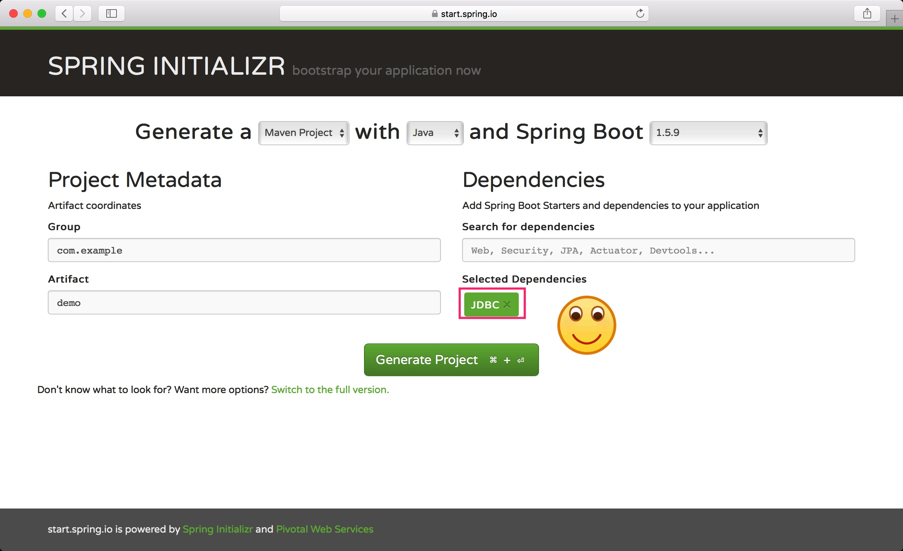

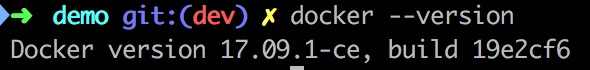

# 实验过程 #

```java
public class DemoApplication {

    private static void withoutJdbcTemplate(DataSource dataSource) throws SQLException {
        Connection connection = dataSource.getConnection();
        Statement statement = connection.createStatement();
        ResultSet resultSet = statement.executeQuery("SELECT * FROM  NUMS");
        while (resultSet.next()) {
            String str = "[ " + resultSet.toString() + " ]";
            str += "[ x: " + resultSet.getInt(1) + ", ";
            str += "y: " + resultSet.getInt(2) + " ]";
            System.out.println(str);
        }
        connection.close();
    }

    private static void simpleDataSourceWithoutJdbcTemplate(ApplicationContext context) throws SQLException {
        DataSource dataSource = context.getBean("dataSource", DataSource.class);
        withoutJdbcTemplate(dataSource);
    }

    private static void dbcpDataSourceWithoutJdbcTemplate(ApplicationContext context) throws SQLException {
        DataSource dataSource = context.getBean("dbcpDataSource", DataSource.class);
        withoutJdbcTemplate(dataSource);
    }

    private static void printTwoNumbers(List<TwoNumber> twoNumbers) {
        for (TwoNumber twoNumber : twoNumbers) {
            System.out.println(twoNumber);
        }
    }

    private static void simpleDataSourceWithJdbcTemplate(ApplicationContext context) throws SQLException {
        JdbcTemplate jdbcTemplate = context.getBean("jdbcTemplate", JdbcTemplate.class);
        jdbcTemplate.execute("DROP TABLE IF EXISTS NUMS");
        jdbcTemplate.execute("CREATE TABLE NUMS (X INT, Y INT)");

        jdbcTemplate.execute("INSERT INTO NUMS VALUES (1, 1)");
        jdbcTemplate.execute("INSERT INTO NUMS VALUES (2, 2)");
        jdbcTemplate.execute("INSERT INTO NUMS VALUES (3, 3)");

        List<TwoNumber> twoNumbers = jdbcTemplate.query("SELECT * FROM NUMS", new TwoNumberRowMapper());
        printTwoNumbers(twoNumbers);

        jdbcTemplate.update("DELETE FROM NUMS WHERE X = 1");
        printTwoNumbers(twoNumbers);

        jdbcTemplate.update("UPDATE NUMS SET X = X + 10");
        twoNumbers = jdbcTemplate.query("SELECT * FROM NUMS", new TwoNumberRowMapper());
        printTwoNumbers(twoNumbers);
    }

    private static void dbcpDataSourceWithJdbcTemplate(ApplicationContext context) throws SQLException {
        JdbcTemplate jdbcTemplate = context.getBean("dbcpJdbcTemplate", JdbcTemplate.class);
        List<TwoNumber> twoNumbers = jdbcTemplate.query("SELECT * FROM NUMS", new TwoNumberRowMapper());
        printTwoNumbers(twoNumbers);
    }

    private static void connectTwoThousands(DataSource dataSource) throws SQLException {
        // for (Integer i = 0; i < 2000; i++) {
            // dataSource.getConnection().close();
        // }
        ArrayList<Thread> threads = new ArrayList<>(4);
        for (Integer i = 0; i < 4; i++) {
            threads.add(new Thread(new Runnable() {
                @Override
                public void run() {
                    for (Integer j = 0; j < 500; j++) {
                        try {
                            dataSource.getConnection().close();
                        } catch (SQLException e) {
                            e.printStackTrace();
                        }
                    }
                }
            }));
        }
        for (Integer i = 0; i < 4; i++) {
            threads.get(i).start();
        }
        for (Integer i = 0; i < 4; i++) {
            try {
                threads.get(i).join();
            } catch (InterruptedException e) {
                e.printStackTrace();
            }
        }
    }

    private static Long memoryUsed(DataSource dataSource) throws SQLException {
        Runtime rt = Runtime.getRuntime();
        for (Integer i = 0; i < 3; i++) rt.gc();
        // long startTotalMemory = rt.totalMemory();
        long startFreeMemory = rt.freeMemory();
        connectTwoThousands(dataSource);
        for (Integer i = 0; i < 3; i++) rt.gc();
        return rt.freeMemory() - startFreeMemory;
    }

    private static Long timeUsed(DataSource dataSource) throws SQLException {
        long startTime = System.currentTimeMillis();
        connectTwoThousands(dataSource);
        long stopTime = System.currentTimeMillis();
        long elapsedTime = stopTime - startTime;
        return elapsedTime;
    }

    private static void compareDataSource(ApplicationContext context) throws SQLException {
        DataSource dataSource = context.getBean("dataSource", DataSource.class);
        DataSource dbcpDataSource = context.getBean("dbcpDataSource", DataSource.class);
        System.out.println("TIME: " + timeUsed(dataSource) * 1.0 / timeUsed(dbcpDataSource));
        System.out.println("Memory Allocated: " + memoryUsed(dataSource) * 1.0 / memoryUsed(dbcpDataSource));
    }

    public static void main(String[] args) throws Exception {
        ClassPathXmlApplicationContext context = new ClassPathXmlApplicationContext("bean.xml");
        try {
            simpleDataSourceWithJdbcTemplate(context);
            dbcpDataSourceWithJdbcTemplate(context);
            simpleDataSourceWithoutJdbcTemplate(context);
            dbcpDataSourceWithoutJdbcTemplate(context);
            compareDataSource(context);
        } finally {
            context.close();
        }

        SpringApplication.run(DemoApplication.class, args);
    }

}
```

核心代码如上所示，函数名基本能够说明所在做的事情

运行的命令：

```shell
docker run -p 3306:3306 --name mysql -e MYSQL_ROOT_PASSWORD=password -e MYSQL_DATABASE=database -d mysql:latest
mvn spring-boot:run > test
```

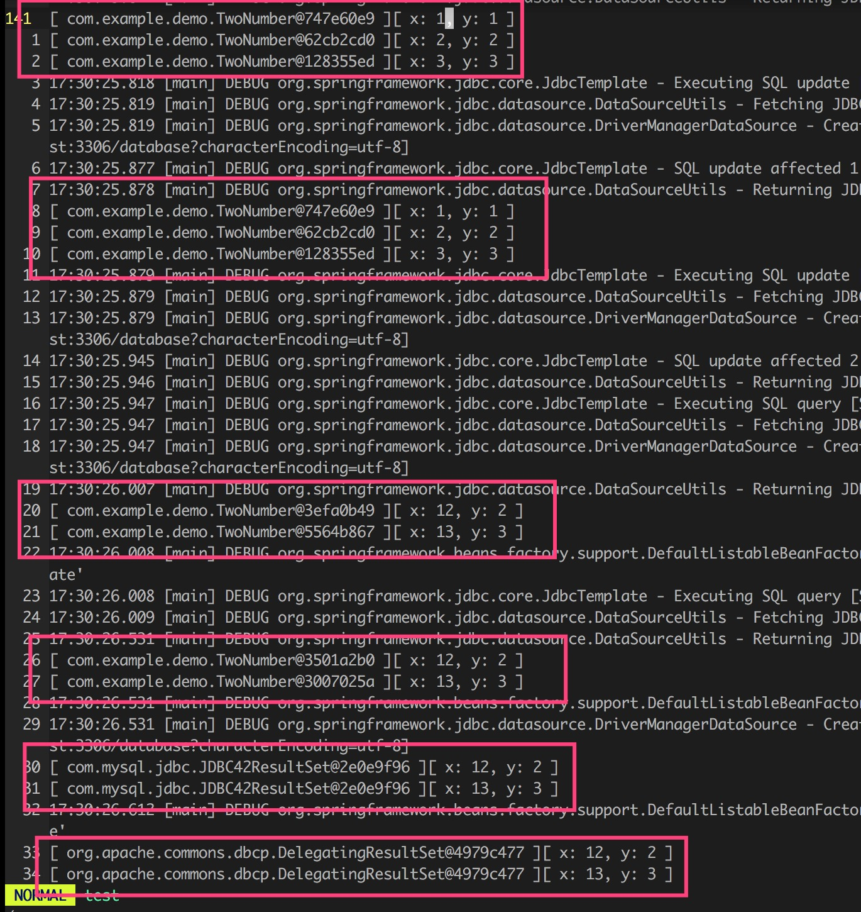

# 遇到的困难 #

## application.yaml ##

`application.yaml`无用但不能删除，删除就报错

是因为`spring-boot`的原因，在下面解决了这个问题

## 两个`DataSource` ##


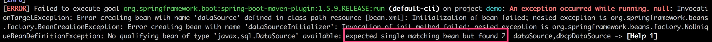

`spring-boot`帮我们做了太多我们不需要的事情，所以我们把它去掉


去掉之后就不报错了，因为它没有帮我们自动配置数据库的连接等

# 性能测量 #

## 单线程 ##

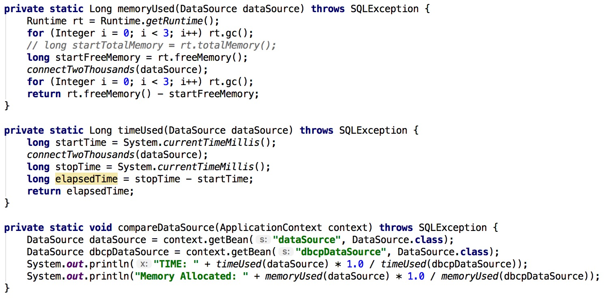

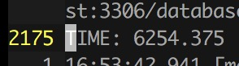

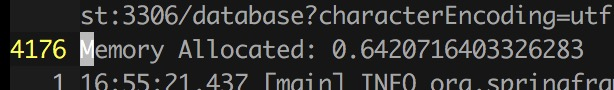

默认配置下的直接连接模式比连接池模式化了6000多倍的时间，连接池模式拥有巨大的性能优势

但直接连接模式比连接池模式使用的内存更少，这也在意料之中

## 多线程 ##

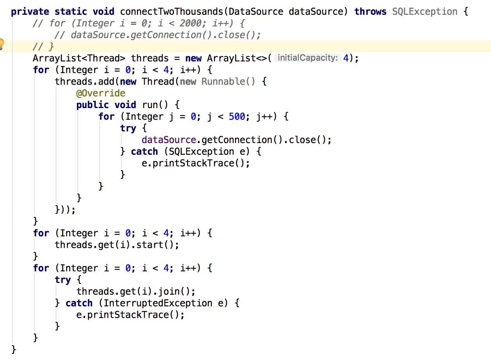

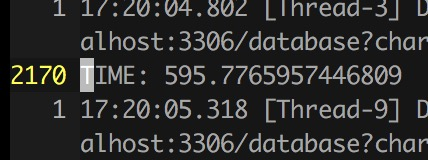

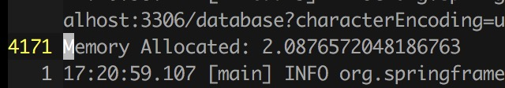

改成多线程模式，同样完成2000次连接与关闭操作：时间差距小了大约12倍，申请的内存总量差距扩大到约3倍

总体来说，多线程确实能降低时间（特别是这种并行度特别高的程序），但会花费更多内存；连接池模式在省内存和省时间方面做出了比较好的取舍

## 改变连接池的默认设置 ##

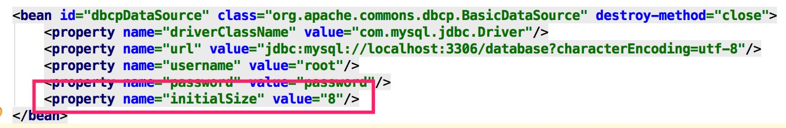

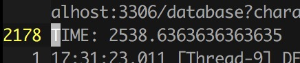

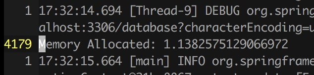

把连接池的大小改大（初始值是1.2）会导致：

+ 速度变快
+ 内存消耗变多

符合我们的直觉，连接池模式就是在用空间换时间

# 参考文献及致谢 #

`google`相关搜索结果