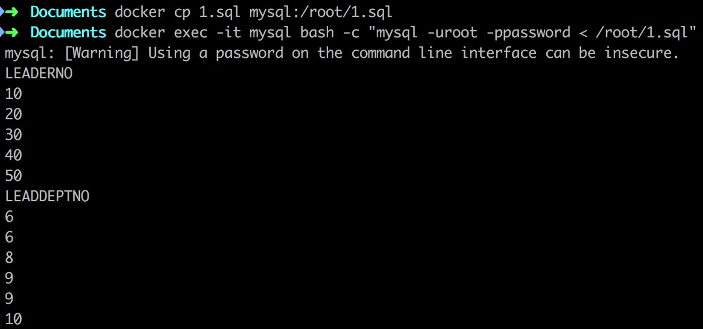
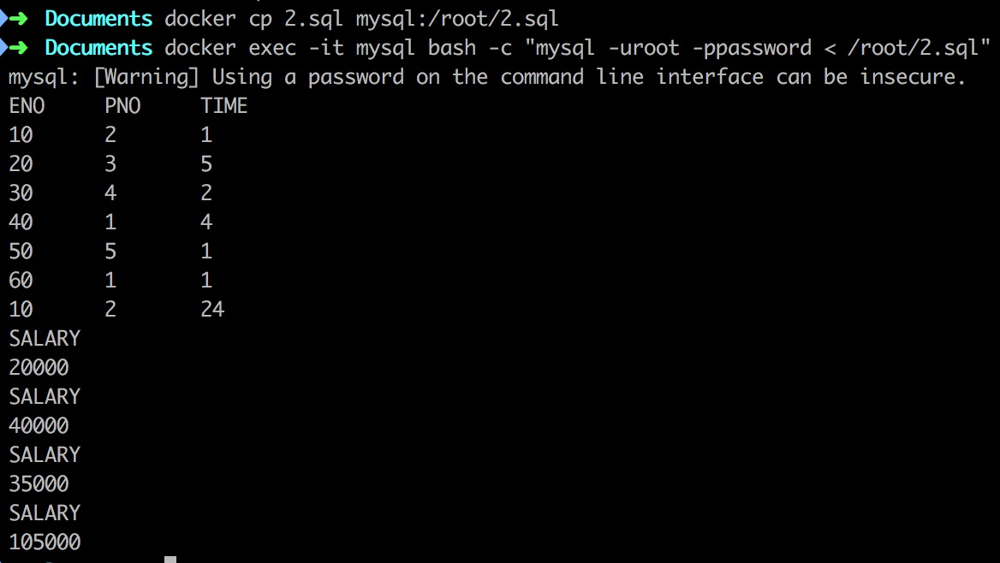
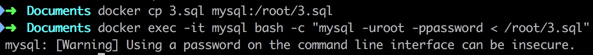
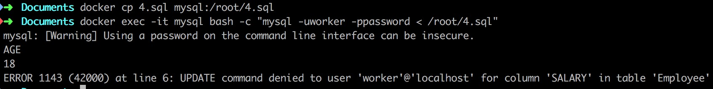

# 环境 #

```shell
docker run -p 3306:3306 --name mysql -e MYSQL_ROOT_PASSWORD=password -e MYSQL_DATABASE=database -d mysql:latest
```

# 创建表 & 插入数据 & 添加约束 & 升级主键 #

```mysql
use database;

create table Employee
(
  ENAME varchar(20) not null,
  ENO int not null unique,
  AGE smallint not null,
  SALARY int not null,
  DEPTNO int not null
);

create table Dept
(
  DNAME varchar(20) not null,
  DEPTNO int not null unique,
  LEADERNO int not null,
  foreign key (LEADERNO) references Employee(ENO) on update cascade
);

create table Project
(
  PNAME varchar(20) not null,
  PNO int not null unique,
  LEADDEPTNO int not null,
  foreign key (LEADDEPTNO) references Dept(DEPTNO) on update cascade
);

create table Work
(
  ENO int not null,
  PNO int not null,
  TIME int not null,
  foreign key (ENO) references Employee(ENO) on update cascade,
  foreign key (PNO) references Project(PNO) on update cascade
);

insert into Employee values("Duncan", 1, 18, 35000, 1);
insert into Employee values("Parker", 2, 19, 21000, 3);
insert into Employee values("Ginobili", 3, 17, 15000, 4);
insert into Employee values("Leonard", 4, 15, 19000, 2);
insert into Employee values("Nowitzki", 5, 21, 28000, 5);
insert into Employee values("Curry", 6, 19, 20000, 3);
insert into Employee values("Green", 7, 18, 16000, 4);
insert into Employee values("Aldridge", 8, 22, 22000, 5);

insert into Dept values("C", 1, 1);
insert into Dept values("PG", 3, 2);
insert into Dept values("SG", 4, 3);
insert into Dept values("SF", 2, 4);
insert into Dept values("PF", 5, 5);

insert into Project values("DefeatHeat", 1, 1);
insert into Project values("DefeatWarrior", 2, 1);
insert into Project values("DefeatCavalier", 3, 3);
insert into Project values("DefeatThunder", 4, 4);
insert into Project values("DefeatSun", 5, 5);
insert into Project values("DefeatRocket", 6, 4);

insert into Work values(1, 2, 1);
insert into Work values(2, 3, 5);
insert into Work values(3, 4, 2);
insert into Work values(4, 1, 4);
insert into Work values(5, 5, 1);
insert into Work values(6, 1, 1);

alter table Employee add constraint c1 foreign key (DEPTNO) references Dept(DEPTNO) on update cascade;
alter table Employee add constraint c2 check (SALARY >= 10000);
alter table Employee add constraint c3 check (SALARY <= 80000);
alter table Employee add constraint c4 check (AGE <= 50);
alter table Employee add constraint c5 check (AGE >= 15);
alter table Dept add constraint c6 check (DNAME = "C" || DEPT = "PG" || DEPT = "SG" || DEPT = "SF" || DEPT = "PF");

update Employee set ENO = ENO * 10;
select LEADERNO from Dept;

update Dept set DEPTNO = DEPTNO + 5;
select LEADDEPTNO from Project;
```

```shell
docker cp 1.sql mysql:/root/1.sql
docker exec -it mysql bash -c "mysql -uroot -ppassword < /root/1.sql"
```



# 违反约束的升级操作 #

```mysql
use database;

delete from Dept
where DEPTNO in
(
  select distinct LEADDEPTNO from Project
);

update Work set PNO = 200 where PNO = 5;
update Dept set DNAME = "SS" where DNAME = "PG";
delete from Employee;
delete from Dept;
```

```shell
docker exec -it mysql sh -c "mysql -uroot -p"
```


在这里有一个修改成功了，这是我们所不希望的

约束`c6`好像没有起到我们希望它起的作用

# 添加触发器 #

```mysql
use database;

delimiter //
create trigger t1 
before insert on Work
for each row
begin
  if NEW.TIME > 24 then
    set NEW.TIME = 24;
  end if;
end;//
delimiter ;

insert into Work values(10, 2, 30);
select * from Work;

delimiter //
create trigger t2
after insert on Work
for each row
begin
  if NEW.ENO in (select distinct LEADERNO from Dept) then
    update Employee set SALARY = SALARY * 3 where Employee.ENO = NEW.ENO;
  else
    update Employee set SALARY = SALARY * 2 where Employee.ENO = NEW.ENO;
  end if;
end;//
delimiter ;

select SALARY from Employee where ENO = 60;
insert into Work values(60, 2, 2);
select SALARY from Employee where ENO = 60;

select SALARY from Employee where ENO = 10;
insert into Work values(10, 2, 2);
select SALARY from Employee where ENO = 10;
```

```shell
docker cp 2.sql mysql:/root/2.sql
docker exec -it mysql bash -c "mysql -uroot -ppassword < /root/2.sql"
```



# 创建用户 & 销毁用户 #

```sql
create user worker@localhost identified by "password";
grant select on database.Employee to worker@localhost;
grant update (AGE) on database.Employee to worker@localhost;
```

```shell
docker cp 3.sql mysql:/root/3.sql
docker exec -it mysql bash -c "mysql -uroot -ppassword < /root/3.sql"
```



```mysql
use database;

update Employee set AGE = 18;
select distinct AGE from Employee;

update Employee set SALARY = 50000;
```

```shell
docker cp 4.sql mysql:/root/4.sql
docker exec -it mysql bash -c "mysql -uworker -ppassword < /root/4.sql"
```



# 困难 & 解决办法 #

约束`c6`没有按照设想的那样起作用，暂时没有找到原因，所以也没有解决