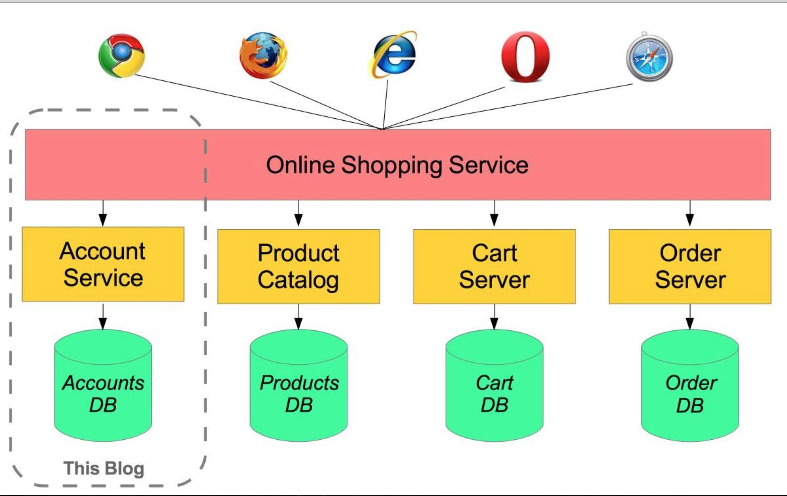
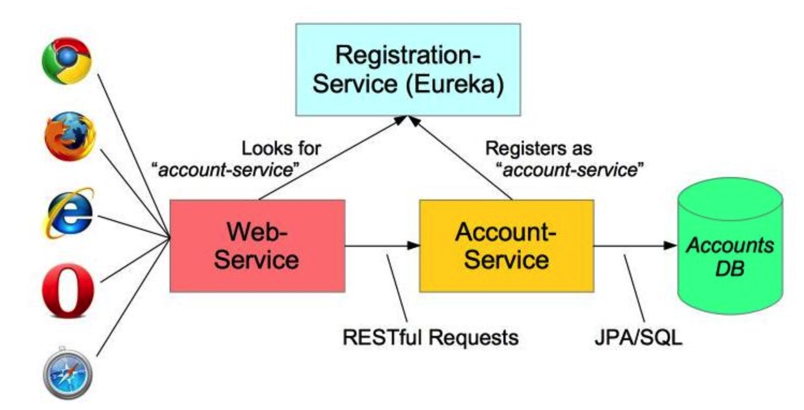
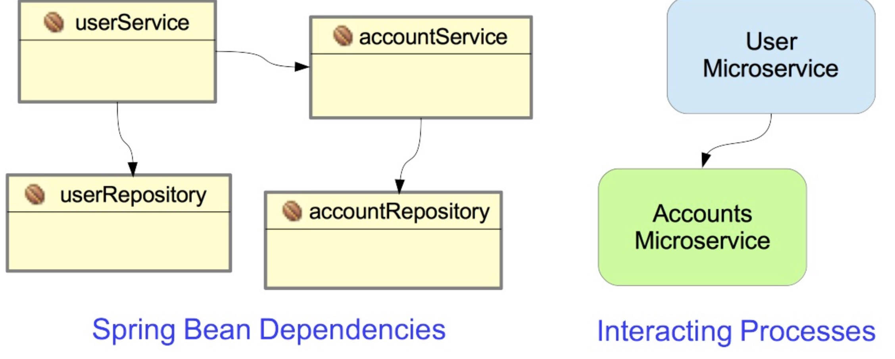

# Microservices with Spring #

A simple example of setting up a microservices system using Spring, Spring Boot and Spring Cloud.

Microservices allow large systems to be built up from a number of collaborating components.

> 微服务的核心思想是将一个大的软件系统拆分成相对独立的几个组件（也叫服务），服务具有相对独立性
>
> 微服务的好处：运行时可根据需求动态调节服务的多少，调节的单位从以前的整个软件变成了某个组件；开发时各小组具有独立性；组件进一步解耦，使得组件的替换变得容易很多

It does at the process level what Spring has always done at the component level: loosely coupled processes instead of loosely coupled components.

> 解耦进程替代解耦组件

For example imagine an online shop with separate microservices for user-accounts, product-catalog order-processing and shopping carts:

> 想象一下一个电商服务可以分解成几个微服务：用户账户的管理／产品分类／订单管理／购物车



Inevitably there are a number of moving parts that you have to setup and configure to build such a system. How to get them working together is not obvious - you need to have good familiarity with Spring Boot since Spring Cloud leverages it heavily, several Netflix or other OSS projects are required and, of course, there is some Spring configuration “magic”!

> 微服务的难点是怎么把几个微服务组合在一起
>
> 这需要我们对Spring本身的理解，还需要借助Netflix开发的软件（用于微服务之间互相发现）等



上面的架构图提醒我们三点：

1. 进程／线程间通信变成网络通信
2. 请求分发功能原本是依赖于Spring框架去做的，是隐式的／无须程序员干预的，变成显式的／需要程序员干预的
3. Eureka提供微服务之间互相发现的功能，类似于P2P／Hadoop中的名服务

In this article I aim to clarify how things work by building the simplest possible system step-by-step. Therefore, I will only implement a small part of the big system - the user account service.

> 很好，一步一步来，不过只实现其中一个微服务
>
> 不过也没有关系，重要的是这些微服务如何一起工作，其它的使用旧知识就足够了
>
> 而且我马上有两个项目就会用到微服务

The Web-Application will make requests to the Account-Service microservice using a RESTful API. We will also need to add a discovery service – so the other processes can find each other.

> 而且，无状态豆RESTful对微服务欧莫名友好，根本不需要考虑session之类的共享
>
> 不过，所有的水平向扩展都需要解决数据库如何扩展的问题，尤其是关系型数据库，水平向扩展让人头疼

## Follow-Up 1: Other Resources ##

This article only discusses a minimal system. For more information, you might like to read Josh Long’s blog article **Microservice Registration and Discovery with Spring Cloud and Netflix’s Eureka** which shows running a complete microservice system on Cloud Foundry.

## Follow Up 2: SpringOne Platform 2016 ##

Book your place at SpringOne2 Platform in Las Vegas, USA soon - simply the best opportunity to find out first hand all that’s going on and to provide direct feedback. The name has changed, from Spring One, to reflect the growth of Spring in platform services (such as the Spring Cloud projects)

> 这个广告真是……猝不及防……

## Service Registration ##

When you have multiple processes working together they need to find each other. If you have ever used Java’s RMI mechanism you may recall that it relied on a central registry so that RMI processes could find each other. Microservices has the same requirement.

> 不管是进程还是微服务，都需要通过一种途径进行互相发现

The developers at Netflix had this problem when building their systems and created a registration server called Eureka (“I have found it” in Greek). Fortunately for us, they made their discovery server open-source and Spring has incorporated into Spring Cloud, making it even easier to run up a Eureka server.

> Eureka这个名字好，“我发现”听上去就很牛逼的样子

Here is the complete discovery-server application:

```java
@SpringBootApplication
@EnableEurekaServer
public class ServiceRegistrationServer {

  public static void main(String[] args) {
    // Tell Boot to look for registration-server.yml
    System.setProperty("spring.config.name", "registration-server");
    SpringApplication.run(ServiceRegistrationServer.class, args);
  }
}
```

如果需要配置，说明Eureka或者Spring Boot的工作还没有做到家

理论上来说，Eureka只需要接受到某个请求说：我是某某微服务和一个验证token，Eureka就应该进行登记工作（IP地址就是请求的IP，名字就是“某某微服务”）

It really is that simple!

> 虽然这个配置项可能很简单，但是再简单也是一个配置项

Spring Cloud is built on Spring Boot and utilizes parent and starter POMs. The important parts of the POM are:

> 需要安装一些依赖项：

```xml
<parent>
    <groupId>org.springframework.cloud</groupId>
    <artifactId>spring-cloud-starter-parent</artifactId>
    <version>_Brixton_.RELEASE</version>  <!-- Name of release train -->
</parent>
<dependencies>
    <dependency>
        <!-- Setup Spring Boot -->
        <groupId>org.springframework.boot</groupId>
        <artifactId>spring-boot-starter</artifactId>
    </dependency>

    <dependency>
        <!-- Setup Spring MVC & REST, use Embedded Tomcat -->
        <groupId>org.springframework.boot</groupId>
        <artifactId>spring-boot-starter-web</artifactId>
    </dependency>

    <dependency>
        <!-- Spring Cloud starter -->
        <groupId>org.springframework.cloud</groupId>
        <artifactId>spring-cloud-starter</artifactId>
    </dependency>

    <dependency>
        <!-- Eureka for service registration -->
        <groupId>org.springframework.cloud</groupId>
        <artifactId>spring-cloud-starter-eureka-server</artifactId>
    </dependency>
</dependencies>
```

By default Spring Boot applications look for an `application.properties` or `application.yml` file for configuration. By setting the **spring.config.name property** we can tell Spring Boot to look for a different file - useful if you have **multiple** Spring Boot applications in the same project - as I will do shortly.

> 这种操作很厉害，原来不会丢失原本的配置文件啊

This application looks for `registration-server.properties` or `registration-server.yml`. Here is the relevant configuration from `registration-server.yml`:

```properties
# Configure this Discovery Server
eureka:
  instance:
    hostname: localhost
  client:  # Not a client, don't register with yourself
    registerWithEureka: false
    fetchRegistry: false

server:
  port: 1111   # HTTP (Tomcat) port
```

By default Eureka runs on port 8761, but here we will use port 1111 instead. Also by including the registration code in my process I might be a server or a client. The configuration specifies that I am not a client and stops the server process trying to register with itself.

> 错怪Eureka，这些配置是很简单且必须的

Spring Cloud also supports Consul as an alternative to Eureka. You start the Consul Agent (its registration server) using a script and then clients use it to find their microservices.

> 不过还可以用Consul替代Eureka

## Creating a Microservice: Account-Service ##

A microservice is a stand-alone process that handles a well-defined requirement.

When configuring applications with Spring we emphasize Loose Coupling and Tight Cohesion, These are not new concepts (Larry Constantine is credited with first defining these in the late 1960s - reference) but now we are applying them, not to interacting components (Spring Beans), but to interacting processes.

> 高内聚松耦合都喊了多少年了……，说明很重要，嗯……
>
> 原先解耦的方式是组件（体现就是beans），现在解耦的方式是微服务（也就是程序／进程）



In this example, I have a simple Account management microservice that uses Spring Data to implement a JPA AccountRepository and Spring REST to provide a RESTful interface to account information. In most respects this is a straightforward Spring Boot application.

> 剩下的都是常用做法，利用Spring Data去帮我们自动实现JPA，保持REST的接口

What makes it special is that it registers itself with the discovery-server at start-up. Here is the Spring Boot startup class:

```java
@EnableAutoConfiguration
@EnableDiscoveryClient
@Import(AccountsWebApplication.class)
public class AccountsServer {

    @Autowired
    AccountRepository accountRepository;

    public static void main(String[] args) {
        // Will configure using accounts-server.yml
        System.setProperty("spring.config.name", "accounts-server");

        SpringApplication.run(AccountsServer.class, args);
    }
}
```

The annotations do the work:

1. @EnableAutoConfiguration - defines this as a Spring Boot application.

2. @EnableDiscoveryClient - this enables service registration and discovery. In this case, this process registers itself with the discovery-server service using its application name (see below).

   > 这个annotations会让AccountsServer在启动的时候向Eureka注册一下

3. @Import(AccountsWebApplication.class) - this Java Configuration class sets up everything else (see below for more details).

What makes this a microservice is the registration with the discovery-server via @EnableDiscoveryClient and its YML configuration completes the setup:

```yaml
# Spring properties
spring:
  application:
     name: accounts-service

# Discovery Server Access
eureka:
  client:
    serviceUrl:
      defaultZone: http://localhost:1111/eureka/

# HTTP Server
server:
  port: 2222   # HTTP (Tomcat) port
```

Note that this file:

+ Sets the application name as accounts-service. This service registers under this name and can also be accessed by this name - see below.
+ Specifies a custom port to listen on (2222). All my processes are using Tomcat, they can’t all listen on port 8080.
+ The URL of the Eureka Service process - from the previous section.

