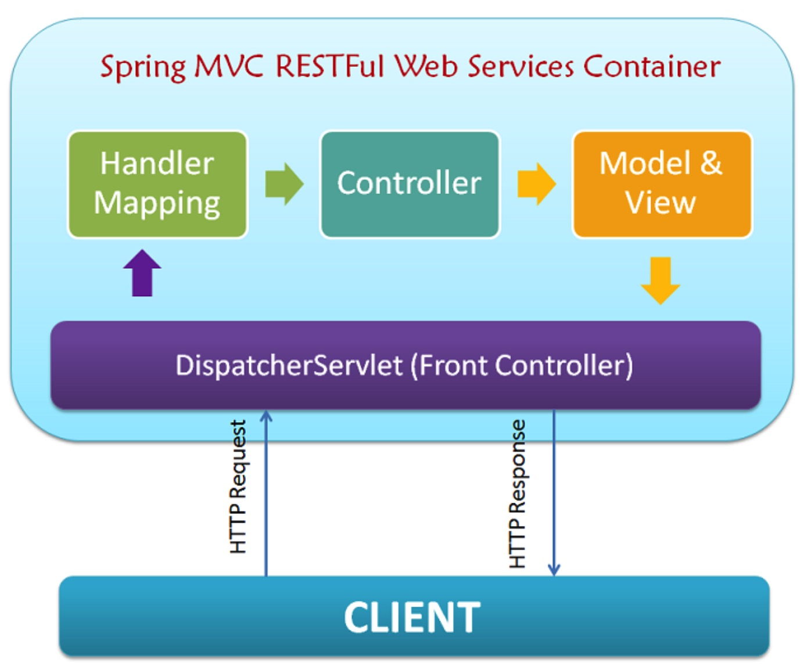

# creating spring rest services without using spring boot #

[creating spring rest services without using spring boot](https://stackoverflow.com/questions/29416804/creating-spring-rest-services-without-using-spring-boot)

[Spring MVC 4.0 RESTFul Web Service Simple Example](http://www.programming-free.com/2014/01/spring-mvc-40-restful-web-services.html)

> REST(Representational State Transfer) is an architectural style with which Web Services can be designed that serves resources based on the request from client. A Web Service is a unit of managed code, that can be invoked using HTTP requests. Let me put it simple for those who are new to Web Service.You develop the core functionality of your application, deploy it in a server and expose to the network. Once it is exposed, it can be accessed using URI's through HTTP requests from a variety of client applications. Instead of repeating the same functionality in multiple client (web, desktop and mobile) applications, you write it once and access it in all the applications. 

网络服务器：一段能够通过`HTTP`请求调用的代码（这也算是理解网络服务器的一种新颖的角度吧）

##  Spring MVC & REST ##

> Spring MVC supports REST from version 3.0. It is easier to build restful web services with spring with it's annotation based MVC Framework. In this post, I am going to explain how to build a simple RESTFul web service using Spring MVC 4.0, that would return plain text.

>  Now, take a look at the architecture diagram above to understand how spring mvc restful web service handles requests from client. The request process flow is as follows,

让我们看一个完整的调用过程：

1. 客户端发出一个请求，通过某个`URI`请求资源
2. 所有的`HTTP`请求都被`DispatcherServlet`拦截
3. `DispatcherServlet`分发请求
4. `Controller`处理请求并且把响应返回给`DispatcherServlet`
5. `DispatcherServlet`把响应返回给客户端




## 创建一个没有Spring Boot的服务器 #


```shell
mvn package
java -jar target/createASimpleSpringSecurity-0.0.1-SNAPSHOT.jar
curl localhost:8080/hello
curl localhost:8080/hello/demons
```


# 替换Spring Security #

