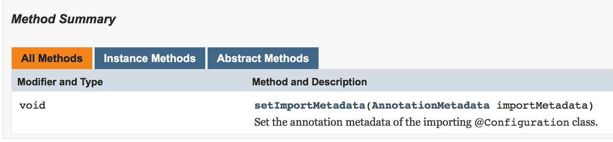
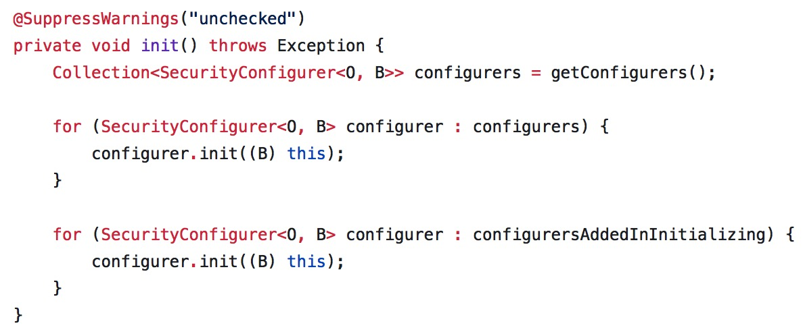
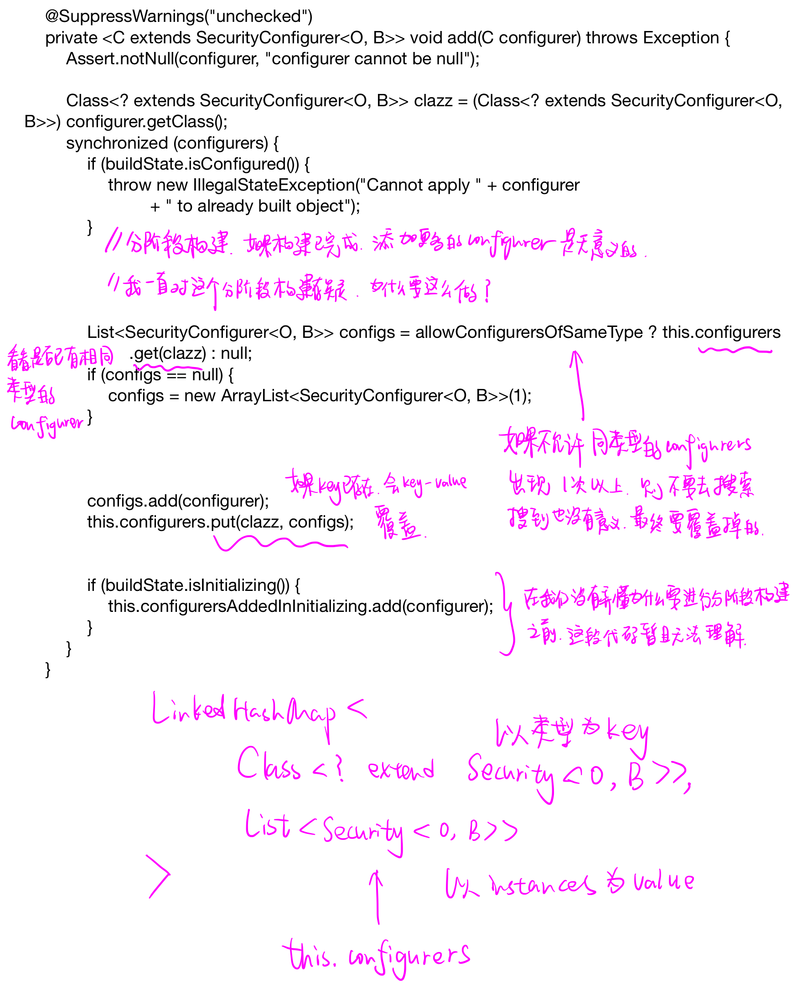
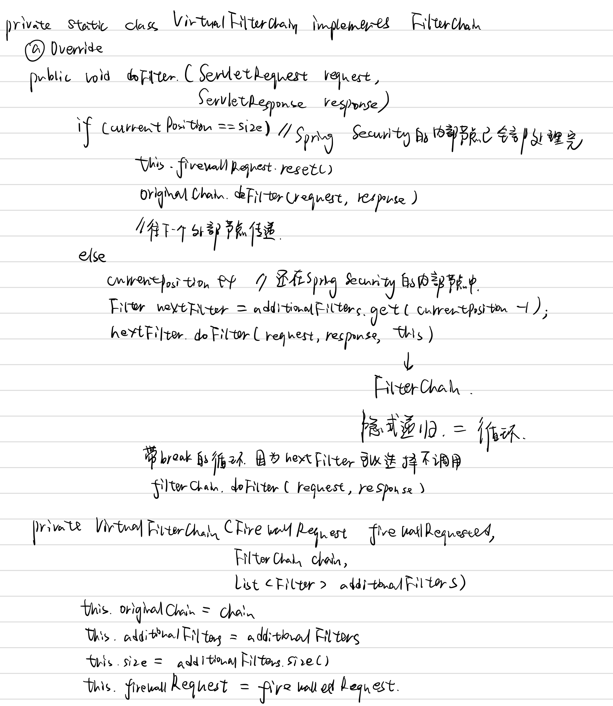

# 开始旅行 #

让我们开始用`Spring Security`吧！

1. 到[Spring Initializer](https://start.spring.io)下载一个初始项目

   

2. 使用`IntellJ`打开该项目

3. 编辑`pom.xml`添加依赖项

   ```xml
   <dependency>
       <groupId>org.springframework.boot</groupId>
       <artifactId>spring-boot-starter-security</artifactId>
   </dependency>
   ```

   ```xml
   <dependency>
       <!-- Setup Spring MVC & REST, use Embedded Tomcat -->
       <groupId>org.springframework.boot</groupId>
       <artifactId>spring-boot-starter-web</artifactId>
   </dependency>
   ```

4. 新建`LoveuController.java`文件

   ```java
   package com.viviansj.loveu;

   import org.springframework.web.bind.annotation.GetMapping;
   import org.springframework.web.bind.annotation.ResponseBody;
   import org.springframework.web.bind.annotation.RestController;

   @RestController
   public class LoveuController {

       @GetMapping("/")
       @ResponseBody
       public String sayLoveu() {
           return "Loveu!";
       }
   }
   ```

   用浏览器访问`http://localhost:8000/`可以看到对应的输出，接下来我们会对该网页添加权限限制

5. 添加`WebSecurityConfig.java`文件

   ```java
   package com.viviansj.loveu;

   import org.springframework.beans.factory.annotation.Autowired;
   import org.springframework.context.annotation.Configuration;
   import org.springframework.security.config.annotation.authentication.builders.AuthenticationManagerBuilder;
   import org.springframework.security.config.annotation.web.builders.HttpSecurity;
   import org.springframework.security.config.annotation.web.configuration.EnableWebSecurity;
   import org.springframework.security.config.annotation.web.configuration.WebSecurityConfigurerAdapter;

   @Configuration
   @EnableWebSecurity
   public class WebSecurityConfig extends WebSecurityConfigurerAdapter {

       @Override
       protected void configure(HttpSecurity http) throws Exception {
           http
                   .authorizeRequests()
                   .antMatchers("/").denyAll();
       }
   }
   ```

   这时我们再访问同样的网站会看到：

   

6. 添加用户

   

   ```shell
   curl -d username=user -d password=password --cookie-jar ./cookiefile -L http://localhost:8080/login
   curl --cookie ./cookiefile http://localhost:8080/
   ```

   

7. 缩减代码

   


至此，我们已经有一个非常简单的带有用户验证功能的网站

可以作为课程报告的分析点有很多：

1. 我们可以看到`cookie`在权限验证中起到了作用，那么`Spring Security`在服务器端为`cookie`做了什么准备呢？比如说生成`cookie`的代码？
2. 在登陆后，可以看到一个很明显的网页跳转，这在服务器端是怎么实现的呢？
3. 分析`configure`函数？
4. 分析`WebSecurityConfig`类是被谁调用的？

随便选一点讲清楚即可，我们会尝试在接下来的过程中讲清楚这么一件事：从用户发出请求到服务端请求，整个流程是怎么样进行的

# 初探源代码 #

[WebSecurityConfigurerAdapter](https://github.com/spring-projects/spring-security/blob/master/config/src/main/java/org/springframework/security/config/annotation/web/configuration/WebSecurityConfigurerAdapter.java)

```java
protected void configure(HttpSecurity http) throws Exception {
    logger.debug("Using default configure(HttpSecurity). If subclassed this will potentially override subclass configure(HttpSecurity).");
    
    http
        .authorizeRequests()
            .anyRequest().authenticated()
            .and()
        .formLogin().and()
        .httpBasic();
}
```

这是默认设置：放通所有的请求

那么在`WebSecurityConfigurerAdapter`类中，谁去调用了这个受保护（因为受保护所以不可能是其他非继承类去调用）的函数呢？

```java
protected final HttpSecurity getHttp() throws Exception {
    ...
    configure(http);
    return http;
}
```

```java
public void init(final WebSecurity web) throws Exception {
    final HttpSecurity http = getHttp();
    web.addSecurityFilterChainBuilder(http).postBuildAction(new Runnable() {
        public void run() {
            FilterSecurityInterceptor securityInterceptor = http
                .getSharedObject(FilterSecurityInterceptor.class);
            web.securityInterceptor(securityInterceptor);
        }
    });
}
```

这样跟起来太慢了，我们决定把调用栈打印出来


让我们来猜`Spring Security`的实现方式：

1. 可以检查权限，甚至可以检查`IP`地址
2. 对业务逻辑没有侵入性

基于以上两点，我认为`Spring Security`在正式把请求发送给`Controller`之前，应该通过拦截器把请求拦截下来分析，所以我决定要打印一下`Controller`的调用栈





调用栈印证了我们的观点：在`org.springframework.web.servlet.FrameworkServlet.doGet`之前果然有`org.springframework.security.web.access.intercept.FilterSecurityInterceptor.invoke`

那么这个大的逻辑就很清晰了：我们写一些规则，然后拦截器把请求拦截下来，交给我们写的规则

如果我们的规则说可以，则把这个请求分发给对应的`COntroller`；如果我们的规则说不可以，那么进入错误处理流程

# 阅读旅行指南 #

[Spring Security Architecture](https://spring.io/guides/topicals/spring-security-architecture/)

> This guide is a primer for Spring Security, offering insight into the design and basic building blocks of the framework. We only cover the very basics of application security but in doing so we can clear up some of the confusion experienced by developers using Spring Security. To do this we take a look at the way security is applied in web applications using filters and more generally using method annotations. Use this guide when you need to understand at a high level how a secure application works, and how it can be customized, or if you just need to learn how to think about application security.

这个指南是`Spring Security`的入门指南，指引我们如何观看架构的基本构成块；通过观看这些基本构成块，可以消除在使用`Spring Security`时的一些玄学问题

> This guide is not intended as a manual or recipe for solving more than the most basic problems (there are other sources for those), but it could be useful for beginners and experts alike. Spring Boot is also referred to a lot because it provides some default behaviour for a secure application and it can be useful to understand how that fits in with the overall architecture. All of the principles apply equally well to applications that do not use Spring Boot.

## Authentication and Access Control ##

> Application security boils down to two more or less independent problems: authentication (who are you?) and authorization (what are you allowed to do?). Sometimes people say "access control" instead of "authorization" which can get confusing, but it can be helpful to think of it that way because "authorization" is overloaded in other places. Spring Security has an architecture that is designed to separate authentication from authorization, and has strategies and extension points for both.

应用安全可以拆解为两个大的方面：

1. 认证：解决你是谁的问题
2. 鉴权：你可以进行什么操作的问题

### Authentication ###

> The main strategy interface for authentication is AuthenticationManager which only has one method:

```java
public interface AuthenticationManager {

  Authentication authenticate(Authentication authentication)
    throws AuthenticationException;

}
```

> An AuthenticationManager can do one of 3 things in its authenticate() method:
>
> 1. return an Authentication (normally with authenticated=true) if it can verify that the input represents a valid principal.
> 2. throw an AuthenticationException if it believes that the input represents an invalid principal.
> 3. return null if it can’t decide.

`AuthenicationManager`的`authenticate()`方法可以返回三个值：

1. 输入合法，即我知道他是谁
2. 抛出一个异常，即我知道他肯定不是一个合法的用户
3. 空值：我不知道他是谁，可以让别人来试试看

既然可以返回空值来表达：我没办法给出一个确定的判断，那么我们可以很自然地推理：存在一个`AuthenticationManager`链，如果上一个`AuthenticationManager`没办法判断一个输入是否合法，则按照链把该用户传给下一个`AuthenticationManager`去判断；如果直到链结束，都不能判断输入是否合法，则返回一个默认值（应该是判断为不合法），如下图所示：


> AuthenticationException is a runtime exception. It is usually handled by an application in a generic way, depending on the style or purpose of the application. In other words user code is not normally expected to catch and handle it. For example, a web UI will render a page that says that the authentication failed, and a backend HTTP service will send a 401 response, with or without a WWW-Authenticate header depending on the context.

框架的使用者在正常情况下不应该去捕获`AuthenticationException`，如何处理这个异常应该交给框架

> The most commonly used implementation of AuthenticationManager is ProviderManager, which delegates to a chain of AuthenticationProvider instances. An AuthenticationProvider is a bit like an AuthenticationManager but it has an extra method to allow the caller to query if it supports a given Authentication type:

```java
public interface AuthenticationProvider {

	Authentication authenticate(Authentication authentication)
			throws AuthenticationException;

	boolean supports(Class<?> authentication);

}
```

三者之间的关系如下图（伪`UML`）所示：


我们猜想的实现方式如下图（伪代码）：


> The Class<?> argument in the supports() method is really Class<? extends Authentication> (it will only ever be asked if it supports something that will be passed into the authenticate() method). A ProviderManager can support multiple different authentication mechanisms in the same application by delegating to a chain of AuthenticationProviders. If a ProviderManager doesn’t recognise a particular Authentication instance type it will be skipped.

> A ProviderManager has an optional parent, which it can consult if all providers return null. If the parent is not available then a null Authentication results in an AuthenticationException.

一个`ProviderManager`还具备一个可选的父亲节点，作为最后的询问对象，如下图所示：


对应地，实现方式也会有一些改变：


`Spring Security`的[实现](https://github.com/spring-projects/spring-security/blob/master/core/src/main/java/org/springframework/security/authentication/ProviderManager.java)与我们猜的差不多，以下展示一些关键代码：


> Sometimes an application has logical groups of protected resources (e.g. all web resources that match a path pattern /api/**), and each group can have its own dedicated AuthenticationManager. Often, each of those is a ProviderManager, and they share a parent. The parent is then a kind of "global" resource, acting as a fallback for all providers.


所以准确地来说，`AuthenicationManager`组成的不是链表，而是树

### Customizing Authentication Managers ###

> Spring Security provides some configuration helpers to quickly get common authentication manager features set up in your application. The most commonly used helper is the AuthenticationManagerBuilder which is great for setting up in-memory, JDBC or LDAP user details, or for adding a custom UserDetailsService. Here’s an example of an application configuring the global (parent) AuthenticationManager:

那么请问如何去定制认证策略呢？

+ 一种比较直接的回答就是修改`AuthenticationManager`，即修改其中的`AuthenticationProvider instance`
+ 另一种回答是从头开始构建`AuthenticationManager`，常见的做法就是使用对应的`builder`

```java
@Configuration
public class ApplicationSecurity extends WebSecurityConfigurerAdapter {

   ... // web stuff here

  @Autowired
  public initialize(AuthenticationManagerBuilder builder, DataSource dataSource) {
    builder.jdbcAuthentication().dataSource(dataSource).withUser("dave")
      .password("secret").roles("USER");
  }

}
```

通过以上代码修改的是全局`AuthenticationManager`，也就是`AuthenticationManager`树的根节点

让我们在`Loveu`项目中亲手实践一下吧！



> This example relates to a web application, but the usage of AuthenticationManagerBuilder is more widely applicable (see below for more detail on how web application security is implemented). Note that the AuthenticationManagerBuilder is @Autowired into a method in a @Bean - that is what makes it build the global (parent) AuthenticationManager. In contrast if we had done it this way:

额外提一句的是：`@Autowired`注解使得通过这个`builder`生成的`AuthenticationManager`是全局`AuthenticationManager`，是整棵`AuthenticationManager`树的根节点

如果想生成一个局部的`AuthenticationManager`，可以使用`Override`注解：


两个疑问：

1. 如何决定非全局节点在`AuthenticationManager`树上的位置
2. 如何为某个子资源配置认证节点

两个问题实际上是一个问题：目前为止，没有告诉我们控制整棵`AuthenticationManager`的方法，尤其是控制子节点的位置的方法

### 控制整棵验证树 ###

```shell
curl -d username=demons -d password=password --cookie-jar ./cookiefile -L http://localhost:8080/login
// 期望访问成功
curl --cookie ./cookiefile http://localhost:8080/hello
// 期望访问失败
curl --cookie ./cookiefile http://localhost:8080/hi
curl -d username=vivian -d password=password --cookie-jar ./cookiefile -L http://localhost:8080/login
// 期望访问成功
curl --cookie ./cookiefile http://localhost:8080/hi
// 期望访问失败
curl --cookie ./cookiefile http://localhost:8080/hello
```

### Authorization or Access Control ###

> Once authentication is successful, we can move on to authorization, and the core strategy here is AccessDecisionManager. There are three implementations provided by the framework and all three delegate to a chain of AccessDecisionVoter, a bit like the ProviderManager delegates to AuthenticationProviders.

一旦验证通过，就会迎来权限验证；权限验证的核心策略是：`AccessDecisionManager`



> An AccessDecisionVoter considers an Authentication (representing a principal) and a secure Object which as been decorated with ConfigAttributes:


那么，`ConfigAttribute`是什么呢？


#### SimpleAccessDecisionVoter ####

```java
public class WebSecurityConfig extends WebSecurityConfigurerAdapter {

    @Bean
    public AccessDecisionManager accessDecisionManager() {
        List<AccessDecisionVoter<? extends Object>> decisionVoters
                = Arrays.asList(
                new SimpleAccessDecisionVoter());
        return new UnanimousBased(decisionVoters);
    }

    @Override
    protected void configure(HttpSecurity http) throws Exception {
        http
                .csrf().disable()
                .authorizeRequests()
                .antMatchers("/hello").authenticated().accessDecisionManager(accessDecisionManager())
                .and()
                .formLogin().permitAll();
    }

    @Override
    public void configure(AuthenticationManagerBuilder builder) throws Exception {
        builder.inMemoryAuthentication()
                .withUser("user")
                .password("{noop}password")
                .roles("USER");
    }
}
```

```java
public class SimpleAccessDecisionVoter implements AccessDecisionVoter {

    int ACCESS_GRANTED = 1;
    int ACCESS_ABSTAIN = 0;
    int ACCESS_DENIED = 1;

    public boolean supports(ConfigAttribute configAttribute) {
        return true;
    }

    public int vote(Authentication authentication, Object o, Collection collection) {
        System.out.println(o.getClass());
        System.out.println(o);
        for (Object attribute : attributes) {
            System.out.println(attribute.getClass());
            System.out.println(attribute);
        }
        return ACCESS_GRANTED;
    }

    public boolean supports(Class aClass) {
        return true;
    }
}
```

向`Loveu`项目添加以上代码，然后把项目运行起来

```shell
// 期望成功
curl -d username=user -d password=password --cookie-jar ./cookiefile -L http://localhost:8080/login
// 期望成功
curl --cookie ./cookiefile http://localhost:8080/hello
rm cookiefile

// 期望失败，因为没通过验证
curl -d username=wrongusername -d password=wrongpassword --cookie-jar ./cookiefile -L http://localhost:8080/login
// 期望成功，因为授权是全通过的
curl --cookie ./cookiefile http://localhost:8080/hello
rm cookiefile
```


运行结果完美符合我们的期望

在`Loveu`项目的控制台的输出如图：


以上输出告诉我们两件事：

1. 如何把一个`url`路径表达成`Object o`？
2. `COnfigAttribute`的其中一个实现是：`WebExpressionConfigAttribute`

#### WebExpressionVoter ####

如果我们稍微改动一下`Loveu`项目的代码：

```java
.antMatchers("/hello/*", "/hello").authenticated().accessDecisionManager(accessDecisionManager())
```

并用`curl`工具做两次测试：

```shell
curl --cookie ./cookiefile http://localhost:8080/hello
curl --cookie ./cookiefile http://localhost:8080/hello/testing
```


在`Loveu`项目的控制台可以看到以下输出：


再来看一下两个`supports`方法：

```java
public boolean supports(ConfigAttribute attribute) {
    return attribute instanceof WebExpressionConfigAttribute;
}

public boolean supports(Class<?> clazz) {
    return FilterInvocation.class.isAssignableFrom(clazz);
}
```

#### WebExpressionConfigAttribute ####

```java
class WebExpressionConfigAttribute implements ConfigAttribute,
		EvaluationContextPostProcessor<FilterInvocation> {
	private final Expression authorizeExpression;
	private final EvaluationContextPostProcessor<FilterInvocation> postProcessor;

	public WebExpressionConfigAttribute(Expression authorizeExpression,
			EvaluationContextPostProcessor<FilterInvocation> postProcessor) {
		this.authorizeExpression = authorizeExpression;
		this.postProcessor = postProcessor;
	}

	Expression getAuthorizeExpression() {
		return this.authorizeExpression;
	}

	@Override
	public EvaluationContext postProcess(EvaluationContext context, FilterInvocation fi) {
		return this.postProcessor == null ? context
				: this.postProcessor.postProcess(context, fi);
	}

	@Override
	public String getAttribute() {
		return null;
	}

	@Override
	public String toString() {
		return this.authorizeExpression.getExpressionString();
	}
}
```

#### 小结 ####


上面这张图概略地描述了`vote`方法的三个参数的意义（或作用）

### Authorization or Access Control (2) ###

> An AccessDecisionVoter considers an Authentication (representing a principal) and a secure Object which as been decorated with ConfigAttributes:

```java
boolean supports(ConfigAttribute attribute);

boolean supports(Class<?> clazz);

int vote(Authentication authentication, S object,
        Collection<ConfigAttribute> attributes);
```

> The Object is completely generic in the signatures of the AccessDecisionManager and AccessDecisionVoter - it represents anything that a user might want to access (a web resource or a method in a Java class are the two most common cases). The ConfigAttributes are also fairly generic, representing a decoration of the secure Object with some metadata that determine the level of permission required to access it. ConfigAttribute is an interface but it only has one method which is quite generic and returns a String, so these strings encode in some way the intention of the owner of the resource, expressing rules about who is allowed to access it. A typical ConfigAttribute is the name of a user role (like ROLE_ADMIN or ROLE_AUDIT), and they often have special formats (like the ROLE_ prefix) or represent expressions that need to be evaluated.

关于这三个参数，我们在`Authorization or Access Control`中有过详细的说明，在此不再赘述

> Most people just use the default AccessDecisionManager which is AffirmativeBased (if no voters decline then access is granted). Any customization tends to happen in the voters, either adding new ones, or modifying the way that the existing ones work.

> It is very common to use ConfigAttributes that are Spring Expression Language (SpEL) expressions, for example isFullyAuthenticated() && hasRole('FOO'). This is supported by an AccessDecisionVoter that can handle the expressions and create a context for them. To extend the range of expressions that can be handled requires a custom implementation of SecurityExpressionRoot and sometimes also SecurityExpressionHandler.

类似于正则表达式的一种语言 + 解析器

## Web Security ##

> Spring Security in the web tier (for UIs and HTTP back ends) is based on Servlet Filters, so it is helpful to look at the role of Filters generally first. The picture below shows the typical layering of the handlers for a single HTTP request.

`Spring Security`的实现方式果然是过滤器（或者说是请求拦截器？）


> The client sends a request to the app, and the container decides which filters and which servlet apply to it based on the path of the request URI. At most one servlet can handle a single request, but filters form a chain, so they are ordered, and in fact a filter can veto the rest of the chain if it wants to handle the request itself. A filter can also modify the request and/or the response used in the downstream filters and servlet.

当客户发起一个请求，容器（此容器非`Docker`容器，而应该指的是`Tomcat`容器）会去决定用什么样的过滤器和什么样的`servlet`；过滤器和`servlet`往往会组成一条链表，位于前面的节点可以彻底拦截或者修改请求，所以过滤器的顺序相当重要

> The order of the filter chain is very important, and Spring Boot manages it through 2 mechanisms: one is that @Beans of type Filter can have an @Order or implement Ordered, and the other is that they can be part of a FilterRegistrationBean that itself has an order as part of its API. Some off-the-shelf filters define their own constants to help signal what order they like to be in relative to each other (e.g. the SessionRepositoryFilter from Spring Session has a DEFAULT_ORDER of Integer.MIN_VALUE + 50, which tells us it likes to be early in the chain, but it doesn’t rule out other filters coming before it).


一般而言，每一个过滤器都会给定一个优先级；一个很较高的优先级会告诉我们这个过滤器会出现在链表的前部，但它无法阻止其它节点排在它的前面

> Spring Security is installed as a single Filter in the chain, and its concerete type is FilterChainProxy, for reasons that will become apparent soon. In a Spring Boot app the security filter is a @Bean in the ApplicationContext, and it is installed by default so that it is applied to every request.

`Spring Security`在链表中是一个（强调一下这个“一个”）单独的节点，具体的类型是`FilterChainProxy`

> It is installed at a position defined by SecurityProperties.DEFAULT_FILTER_ORDER, which in turn is anchored by FilterRegistrationBean.REQUEST_WRAPPER_FILTER_MAX_ORDER (the maximum order that a Spring Boot app expects filters to have if they wrap the request, modifying its behaviour). 

对于代表`Spring Security`的节点具体被安装在链表的什么位置，我们就不太管了（放弃这些细节吧）

> There’s more to it than that though: from the point of view of the container Spring Security is a single filter, but inside it there are additional filters, each playing a special role. Here’s a picture:

从容器的视角看，整个`Spring Security`是作为一个节点（再次强调一下这个“一个”）被安装进链表的；但是从`Spring Security`的角度看，这个节点由更多的节点构成（我们都可以猜到是用委托来实现的）


> Spring Security is a single physical Filter but delegates processing to a chain of internal filters.

果然是通过委托来实现的（`Spring Security`还真是特别喜欢这种设计模式啊）

> In fact there is even one more layer of indirection in the security filter: it is usually installed in the container as a DelegatingFilterProxy, which does not have to be a Spring @Bean. The proxy delegates to a FilterChainProxy which is always a @Bean, usually with a fixed name of springSecurityFilterChain. It is the FilterChainProxy which contains all the security logic arranged internally as a chain (or chains) of filters. All the filters have the same API (they all implement the Filter interface from the Servlet Spec) and they all have the opportunity to veto the rest of the chain.

这段话翻译起来太麻烦，看图吧：


### DelegatingFilterProxy ###


+ `FilterChain filterChain`应该是后续的`filters`，对本次过滤没有影响
+ 为什么会有`ServletResponse response`这种奇怪的参数传进来？讲道理`response`应该和过滤没关系啊？有可能是方便过滤器在截断请求（即不把请求往后传）之后立马返回一个响应


### FilterChainProxy ###


### VirtualFilterChain ###



这段代码写得非常棒！是一段很优雅的代码！

如果是我来写，实现相同的功能，可能就是一个带`break`的循环：破坏与调用链的相似性

## Web Security (2) ##

>  There can be multiple filter chains all managed by Spring Security in the same top level FilterChainProxy and all unknown to the container. The Spring Security filter contains a list of filter chains, and dispatches a request to the first chain that matches it. The picture below shows the dispatch happening based on matching the request path (/foo/\*\* matches before /\*\*). This is very common but not the only way to match a request. The most important feature of this dispatch process is that only one chain ever handles a request.

前面没有提到的一个关键点是：`FilterChainProxy`可以管理非常多的`FilterChain`，把不同的请求分发给不同的`FilterChain`；`FilterChain`按照一定的规则排序，然后把请求分发给第一个匹配上的`FilterChain`


> A vanilla Spring Boot application with no custom security configuration has a several (call it n) filter chains, where usually n=6. The first (n-1) chains are there just to ignore static resource patterns, like /css/\*\* and /images/\*\*, and the error view /error (the paths can be controlled by the user with security.ignored from the SecurityProperties configuration bean). The last chain matches the catch all path /\*\* and is more active, containing logic for authentication, authorization, exception handling, session handling, header writing, etc. There are a total of 11 filters in this chain by default, but normally it is not necessary for users to concern themselves with which filters are used and when.


> The fact that all filters internal to Spring Security are unknown to the container is important, especially in a Spring Boot application, where all @Beans of type Filter are registered automatically with the container by default. So if you want to add a custom filter to the security chain, you need to either not make it a @Bean or wrap it in a FilterRegistrationBean that explicitly disables the container registration.

以上所说的过滤器都是不为容器所感知的，且容器被我们以一定的形式覆盖掉（所以要小心）

### 默认的filterChains ###

稍微改动一下`Loveu`项目，配合我们的实验需要


```shell
Request received for GET '/':

org.apache.catalina.connector.RequestFacade@57731ea7

servletPath:/
pathInfo:null
headers: 
host: localhost:8080
user-agent: curl/7.54.0
accept: */*
cookie: JSESSIONID=7AA03B11A625E0197A762F11DCA94F32


Security filter chain: [
  WebAsyncManagerIntegrationFilter
  SecurityContextPersistenceFilter
  HeaderWriterFilter
  LogoutFilter
  UsernamePasswordAuthenticationFilter
  DefaultLoginPageGeneratingFilter
  RequestCacheAwareFilter
  SecurityContextHolderAwareRequestFilter
  AnonymousAuthenticationFilter
  SessionManagementFilter
  ExceptionTranslationFilter
  FilterSecurityInterceptor
]
```

我们得到了一个默认的`filterChain`，但这还不够，我们需要知道这个`filterChain`是如何被配置起来的

换言之，`Spring Boot`为我们做了什么呢？

#### 不使用Spring-Boot黑魔法 ####

```xml
<dependency>
    <groupId>org.springframework.security</groupId>
    <artifactId>spring-security-config</artifactId>
</dependency>

<dependency>
    <groupId>org.springframework.security</groupId>
    <artifactId>spring-security-web</artifactId>
</dependency>
```

以上两个依赖项可以完全替代`spring-boot-starter-security`的作用

#### DefaultSecurityFilterChain ####


代码与我们看到的输出是吻合的（说明这段日志很可能是上面一段代码打印出来的）

那么，问题就变成了：谁在调用`DefaultSecurityFilterChain`？

```shell
./config/src/main/java/org/springframework/security/config/annotation/web/builders/HttpSecurity.java:119:implements SecurityBuilder<DefaultSecurityFilterChain>,
./config/src/main/java/org/springframework/security/config/annotation/web/builders/HttpSecurity.java:1078:protected DefaultSecurityFilterChain performBuild() throws Exception {
./config/src/main/java/org/springframework/security/config/annotation/web/builders/HttpSecurity.java:1080:return new DefaultSecurityFilterChain(requestMatcher, filters);
```

```shell
./config/src/main/java/org/springframework/security/config/annotation/web/builders/WebSecurity.java:288:securityFilterChains.add(new DefaultSecurityFilterChain(ignoredRequest));
```

#### Debug ####

在跟踪源代码的时候面临了一个非常大的问题：只用搜索不用调试非常不方便

所以搭建调试环境是非常必要的（建议使用国外服务器，体验直线上升）

```shell
docker pull maven
docker run -t -i --name springsecurity -v ~/spring-security/:/spring-security -v ~/loveu:/loveu maven /bin/bash
cd /springsecurity
./gradlew build -x test
./gradlew mavenBom
./gradlew install
cd /loveu
mvn spring-boot:run

ls ~/.m2/repository/org/springframework/security/spring-security-web/
// 5.0.3.RELEASE  5.1.0.BUILD-SNAPSHOT  maven-metadata-local.xml
```

根据编译环境的输出，我们需要修改`Loveu`项目的`pom.xml`文件：


同时，为了验证`Loveu`项目确实使用的是我们编译出来的依赖性，我们稍微修改了几个地方：

```shell
vim spring-security/web/src/main/java/org/springframework/security/web/DefaultSecurityFilterChain.java
```


```java
vim spring-security/config/src/main/java/org/springframework/security/config/annotation/web/builders/WebSecurity.java
```


输出如下：


至此，我们终于有调试环境

#### 打印函数栈 ####


#### WebSecurityConfiguration ####


```shell
cd /spring-security
./gradlew :spring-security-config:build -x test -x integrationTest
./gradlew :spring-security-config:install
cd /loveu
mvn spring-boot:run
```


结果非常地让我感到意外：唯一注入的一个`bean`竟然是我自己写的（也许因为配置了`WebSecurityConfig`从而破坏了默认设置）

如果我们删除掉`WebSecurityConfig.java`，再试一次，会看到以下输出：


#### SpringBootWebSecurityConfiguration ####


追到最后，竟然是什么都没有，还真是让人哭笑不得

问题是，这样一个空的实现是怎么变出一大串“filterChains”来的呢？


默认设置会不会“藏”在`WebSecurityConfigurerAdapter`里面呢？

#### WebSecurityConfigurerAdapter ####


果然是把默认配置“藏”在类`WebSecurityConfigurerAdapter`

#### 小结 ####


### Creating and Customizing Filter Chains ###

> The default fallback filter chain in a Spring Boot app (the one with the /** request matcher) has a predefined order of SecurityProperties.BASIC_AUTH_ORDER. You can switch it off completely by setting security.basic.enabled=false, or you can use it as a fallback and just define other rules with a lower order. To do that just add a @Bean of type WebSecurityConfigurerAdapter (or WebSecurityConfigurer) and decorate the class with @Order. Example:


> This bean will cause Spring Security to add a new filter chain and order it before the fallback.

> Many applications have completely different access rules for one set of resources compared to another. For example an application that hosts a UI and a backing API might support cookie-based authentication with a redirect to a login page for the UI parts, and token-based authentication with a 401 response to unauthenticated requests for the API parts. Each set of resources has its own WebSecurityConfigurerAdapter with a unique order and a its own request matcher. If the matching rules overlap the earliest ordered filter chain will win.

在开发应用时，会碰到这么一个情况：不同的资源有不同的授权规则，那么我们可以为这些资源分别配置`WebSecurityConfigurerAdapter`


注意两个`WebSecurityCOnfigurerAdapter`的`Order`一定不能相同，否则报错

#### Request Matching for Dispatch and Authorization ####

> A security filter chain (or equivalently a WebSecurityConfigurerAdapter) has a request matcher that is used for deciding whether to apply it to an HTTP request. Once the decision is made to apply a particular filter chain, no others are applied. But within a filter chain you can have more fine grained control of authorization by setting additional matchers in the HttpSecurity configurer. Example:

我们前面已经说过，每一个请求至多只有一个`filterChain`会起作用

但是，在这个`filterChain`内部，还是可以“开衩”的（即变成一棵树），如以下代码所示：


我猜想这种所谓的分叉，内部的实现应该也是`delegate`

> One of the easiest mistakes to make with configuring Spring Security is to forget that these matchers apply to different processes, one is a request matcher for the whole filter chain, and the other is only to choose the access rule to apply.

当然，两个选择器的作用是不一样的：

+ 选择使用哪个`filterChain`
+ 选择使用哪个鉴权规则

#### Combining Application Security Rules with Actuator Rules ####

> If you are using the Spring Boot Actuator for management endpoints, you probably want them to be secure, and by default they will be.

很好，`Spring boot Actuator`是什么？一脸懵逼 x 5

`actuator`是一个用来做系统健康检测的模块，可以将系统运行过程中的磁盘空间、线程数、以及程序连接的数据库情况通过`json`返回，然后再结合预警、监控模块进行实时系统监控

（我决定忽略这一小节）

## Working with Threads ##

> Spring Security is fundamentally thread bound because it needs to make the current authenticated principal available to a wide variety of downstream consumers. The basic building block is the SecurityContext which may contain an Authentication (and when a user is logged in it will be an Authentication that is explicitly authenticated). You can always access and manipulate the SecurityContext via static convenience methods in SecurityContextHolder which in turn simply manipulate a TheadLocal, e.g.

`Spring Security`基本上线程绑定的，也就是说：`Spring Security`创建的变量等都是在线程专属的内存中

`Spring Security`提供一个返回线程局部变量的静态方法：让我们获取该变量

```java
SecurityContext context = SecurityContextHolder.getContext();
Authentication authentication = context.getAuthentication();
assert(authentication.isAuthenticated);
```

```java
@RequestMapping("/foo")
public String foo(@AuthenticationPrincipal User user) {
  ... // do stuff with user
}
```

# 参考材料 #

[Spring Security Architecture](https://spring.io/guides/topicals/spring-security-architecture)

[](https://juejin.im/post/5a434de6f265da43333eae7d)

[](https://zhuanlan.zhihu.com/p/32952727)

[](http://blog.leapoahead.com/2015/09/06/understanding-jwt/)

[](https://zhuanlan.zhihu.com/p/31230829)

[](http://www.roncoo.com/article/detail/128454)
