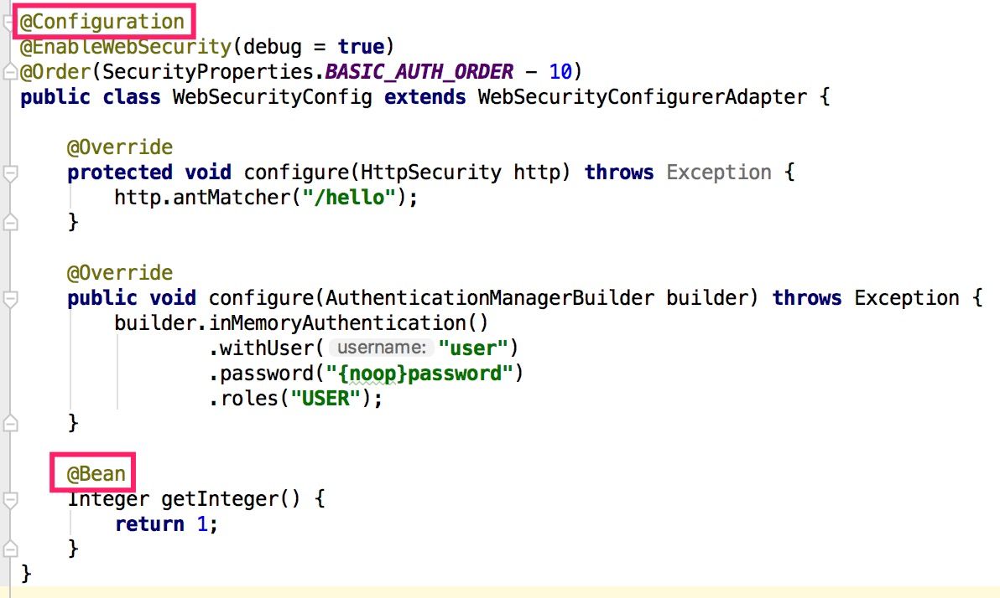
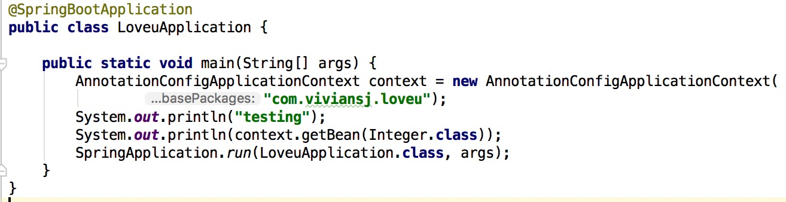

让我们开始用`Spring Security`吧！

1. 到[Spring Initializer](https://start.spring.io)下载一个初始项目

   

2. 使用`IntellJ`打开该项目

3. 编辑`pom.xml`添加依赖项

   ```xml
   <dependency>
       <groupId>org.springframework.boot</groupId>
       <artifactId>spring-boot-starter-security</artifactId>
   </dependency>
   ```

   ```xml
   <dependency>
       <!-- Setup Spring MVC & REST, use Embedded Tomcat -->
       <groupId>org.springframework.boot</groupId>
       <artifactId>spring-boot-starter-web</artifactId>
   </dependency>
   ```

4. 新建`LoveuController.java`文件

   ```java
   package com.viviansj.loveu;

   import org.springframework.web.bind.annotation.GetMapping;
   import org.springframework.web.bind.annotation.ResponseBody;
   import org.springframework.web.bind.annotation.RestController;

   @RestController
   public class LoveuController {

       @GetMapping("/")
       @ResponseBody
       public String sayLoveu() {
           return "Loveu!";
       }
   }
   ```

   用浏览器访问`http://localhost:8000/`可以看到对应的输出，接下来我们会对该网页添加权限限制

5. 添加`WebSecurityConfig.java`文件

   ```java
   package com.viviansj.loveu;

   import org.springframework.beans.factory.annotation.Autowired;
   import org.springframework.context.annotation.Configuration;
   import org.springframework.security.config.annotation.authentication.builders.AuthenticationManagerBuilder;
   import org.springframework.security.config.annotation.web.builders.HttpSecurity;
   import org.springframework.security.config.annotation.web.configuration.EnableWebSecurity;
   import org.springframework.security.config.annotation.web.configuration.WebSecurityConfigurerAdapter;

   @Configuration
   @EnableWebSecurity
   public class WebSecurityConfig extends WebSecurityConfigurerAdapter {

       @Override
       protected void configure(HttpSecurity http) throws Exception {
           http
                   .authorizeRequests()
                   .antMatchers("/").denyAll();
       }
   }
   ```

   这时我们再访问同样的网站会看到：

   

6. 添加用户

   

   ```shell
   curl -d username=user -d password=password --cookie-jar ./cookiefile -L http://localhost:8080/login
   curl --cookie ./cookiefile http://localhost:8080/
   ```

   

7. 缩减代码

   


至此，我们已经有一个非常简单的带有用户验证功能的网站

可以作为课程报告的分析点有很多：

1. 我们可以看到`cookie`在权限验证中起到了作用，那么`Spring Security`在服务器端为`cookie`做了什么准备呢？比如说生成`cookie`的代码？
2. 在登陆后，可以看到一个很明显的网页跳转，这在服务器端是怎么实现的呢？
3. 分析`configure`函数？
4. 分析`WebSecurityConfig`类是被谁调用的？

随便选一点讲清楚即可，我们会尝试在接下来的过程中讲清楚这么一件事：从用户发出请求到服务端请求，整个流程是怎么样进行的


[WebSecurityConfigurerAdapter](https://github.com/spring-projects/spring-security/blob/master/config/src/main/java/org/springframework/security/config/annotation/web/configuration/WebSecurityConfigurerAdapter.java)

```java
protected void configure(HttpSecurity http) throws Exception {
    logger.debug("Using default configure(HttpSecurity). If subclassed this will potentially override subclass configure(HttpSecurity).");
    
    http
        .authorizeRequests()
            .anyRequest().authenticated()
            .and()
        .formLogin().and()
        .httpBasic();
}
```

这是默认设置：放通所有的请求

那么在`WebSecurityConfigurerAdapter`类中，谁去调用了这个受保护（因为受保护所以不可能是其他非继承类去调用）的函数呢？

```java
protected final HttpSecurity getHttp() throws Exception {
    ...
    configure(http);
    return http;
}
```

```java
public void init(final WebSecurity web) throws Exception {
    final HttpSecurity http = getHttp();
    web.addSecurityFilterChainBuilder(http).postBuildAction(new Runnable() {
        public void run() {
            FilterSecurityInterceptor securityInterceptor = http
                .getSharedObject(FilterSecurityInterceptor.class);
            web.securityInterceptor(securityInterceptor);
        }
    });
}
```

这样跟起来太慢了，我们决定把调用栈打印出来





让我们来猜`Spring Security`的实现方式：

1. 可以检查权限，甚至可以检查`IP`地址
2. 对业务逻辑没有侵入性

基于以上两点，我认为`Spring Security`在正式把请求发送给`Controller`之前，应该通过拦截器把请求拦截下来分析，所以我决定要打印一下`Controller`的调用栈


调用栈印证了我们的观点：在`org.springframework.web.servlet.FrameworkServlet.doGet`之前果然有`org.springframework.security.web.access.intercept.FilterSecurityInterceptor.invoke`

那么这个大的逻辑就很清晰了：我们写一些规则，然后拦截器把请求拦截下来，交给我们写的规则

如果我们的规则说可以，则把这个请求分发给对应的`COntroller`；如果我们的规则说不可以，那么进入错误处理流程

