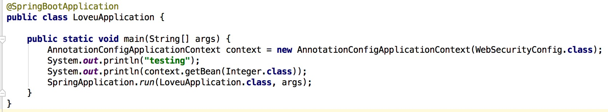
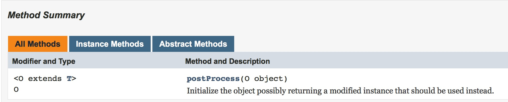
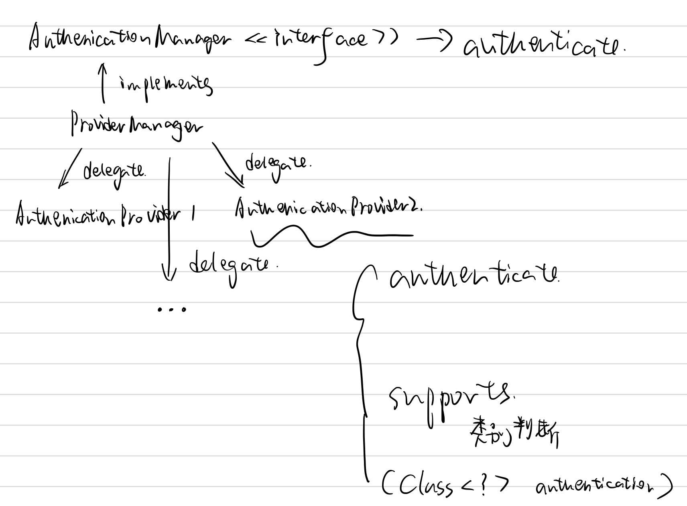

# 开始旅行 #

让我们开始用`Spring Security`吧！

1. 到[Spring Initializer](https://start.spring.io)下载一个初始项目

   

2. 使用`IntellJ`打开该项目

3. 编辑`pom.xml`添加依赖项

   ```xml
   <dependency>
       <groupId>org.springframework.boot</groupId>
       <artifactId>spring-boot-starter-security</artifactId>
   </dependency>
   ```

   ```xml
   <dependency>
       <!-- Setup Spring MVC & REST, use Embedded Tomcat -->
       <groupId>org.springframework.boot</groupId>
       <artifactId>spring-boot-starter-web</artifactId>
   </dependency>
   ```

4. 新建`LoveuController.java`文件

   ```java
   package com.viviansj.loveu;

   import org.springframework.web.bind.annotation.GetMapping;
   import org.springframework.web.bind.annotation.ResponseBody;
   import org.springframework.web.bind.annotation.RestController;

   @RestController
   public class LoveuController {

       @GetMapping("/")
       @ResponseBody
       public String sayLoveu() {
           return "Loveu!";
       }
   }
   ```

   用浏览器访问`http://localhost:8000/`可以看到对应的输出，接下来我们会对该网页添加权限限制

5. 添加`WebSecurityConfig.java`文件

   ```java
   package com.viviansj.loveu;

   import org.springframework.beans.factory.annotation.Autowired;
   import org.springframework.context.annotation.Configuration;
   import org.springframework.security.config.annotation.authentication.builders.AuthenticationManagerBuilder;
   import org.springframework.security.config.annotation.web.builders.HttpSecurity;
   import org.springframework.security.config.annotation.web.configuration.EnableWebSecurity;
   import org.springframework.security.config.annotation.web.configuration.WebSecurityConfigurerAdapter;

   @Configuration
   @EnableWebSecurity
   public class WebSecurityConfig extends WebSecurityConfigurerAdapter {

       @Override
       protected void configure(HttpSecurity http) throws Exception {
           http
                   .authorizeRequests()
                   .antMatchers("/").denyAll();
       }
   }
   ```

   这时我们再访问同样的网站会看到：

   

6. 添加用户

   

   ```shell
   curl -d username=user -d password=password --cookie-jar ./cookiefile -L http://localhost:8080/login
   curl --cookie ./cookiefile http://localhost:8080/
   ```

   

7. 缩减代码

   


至此，我们已经有一个非常简单的带有用户验证功能的网站

可以作为课程报告的分析点有很多：

1. 我们可以看到`cookie`在权限验证中起到了作用，那么`Spring Security`在服务器端为`cookie`做了什么准备呢？比如说生成`cookie`的代码？
2. 在登陆后，可以看到一个很明显的网页跳转，这在服务器端是怎么实现的呢？
3. 分析`configure`函数？
4. 分析`WebSecurityConfig`类是被谁调用的？

随便选一点讲清楚即可，我们会尝试在接下来的过程中讲清楚这么一件事：从用户发出请求到服务端请求，整个流程是怎么样进行的

# 初探源代码 #

[WebSecurityConfigurerAdapter](https://github.com/spring-projects/spring-security/blob/master/config/src/main/java/org/springframework/security/config/annotation/web/configuration/WebSecurityConfigurerAdapter.java)

```java
protected void configure(HttpSecurity http) throws Exception {
    logger.debug("Using default configure(HttpSecurity). If subclassed this will potentially override subclass configure(HttpSecurity).");
    
    http
        .authorizeRequests()
            .anyRequest().authenticated()
            .and()
        .formLogin().and()
        .httpBasic();
}
```

这是默认设置：放通所有的请求

那么在`WebSecurityConfigurerAdapter`类中，谁去调用了这个受保护（因为受保护所以不可能是其他非继承类去调用）的函数呢？

```java
protected final HttpSecurity getHttp() throws Exception {
    ...
    configure(http);
    return http;
}
```

```java
public void init(final WebSecurity web) throws Exception {
    final HttpSecurity http = getHttp();
    web.addSecurityFilterChainBuilder(http).postBuildAction(new Runnable() {
        public void run() {
            FilterSecurityInterceptor securityInterceptor = http
                .getSharedObject(FilterSecurityInterceptor.class);
            web.securityInterceptor(securityInterceptor);
        }
    });
}
```

这样跟起来太慢了，我们决定把调用栈打印出来


让我们来猜`Spring Security`的实现方式：

1. 可以检查权限，甚至可以检查`IP`地址
2. 对业务逻辑没有侵入性

基于以上两点，我认为`Spring Security`在正式把请求发送给`Controller`之前，应该通过拦截器把请求拦截下来分析，所以我决定要打印一下`Controller`的调用栈




调用栈印证了我们的观点：在`org.springframework.web.servlet.FrameworkServlet.doGet`之前果然有`org.springframework.security.web.access.intercept.FilterSecurityInterceptor.invoke`

那么这个大的逻辑就很清晰了：我们写一些规则，然后拦截器把请求拦截下来，交给我们写的规则

如果我们的规则说可以，则把这个请求分发给对应的`COntroller`；如果我们的规则说不可以，那么进入错误处理流程

# 阅读旅行指南 #

[Spring Security Architecture](https://spring.io/guides/topicals/spring-security-architecture/)

> This guide is a primer for Spring Security, offering insight into the design and basic building blocks of the framework. We only cover the very basics of application security but in doing so we can clear up some of the confusion experienced by developers using Spring Security. To do this we take a look at the way security is applied in web applications using filters and more generally using method annotations. Use this guide when you need to understand at a high level how a secure application works, and how it can be customized, or if you just need to learn how to think about application security.

这个指南是`Spring Security`的入门指南，指引我们如何观看架构的基本构成块；通过观看这些基本构成块，可以消除在使用`Spring Security`时的一些玄学问题

> This guide is not intended as a manual or recipe for solving more than the most basic problems (there are other sources for those), but it could be useful for beginners and experts alike. Spring Boot is also referred to a lot because it provides some default behaviour for a secure application and it can be useful to understand how that fits in with the overall architecture. All of the principles apply equally well to applications that do not use Spring Boot.

## Authentication and Access Control ##

> Application security boils down to two more or less independent problems: authentication (who are you?) and authorization (what are you allowed to do?). Sometimes people say "access control" instead of "authorization" which can get confusing, but it can be helpful to think of it that way because "authorization" is overloaded in other places. Spring Security has an architecture that is designed to separate authentication from authorization, and has strategies and extension points for both.

应用安全可以拆解为两个大的方面：

1. 认证：解决你是谁的问题
2. 鉴权：你可以进行什么操作的问题

### Authentication ###

> The main strategy interface for authentication is AuthenticationManager which only has one method:

```java
public interface AuthenticationManager {

  Authentication authenticate(Authentication authentication)
    throws AuthenticationException;

}
```

> An AuthenticationManager can do one of 3 things in its authenticate() method:
>
> 1. return an Authentication (normally with authenticated=true) if it can verify that the input represents a valid principal.
> 2. throw an AuthenticationException if it believes that the input represents an invalid principal.
> 3. return null if it can’t decide.

`AuthenicationManager`的`authenticate()`方法可以返回三个值：

1. 输入合法，即我知道他是谁
2. 抛出一个异常，即我知道他肯定不是一个合法的用户
3. 空值：我不知道他是谁，可以让别人来试试看

既然可以返回空值来表达：我没办法给出一个确定的判断，那么我们可以很自然地推理：存在一个`AuthenticationManager`链，如果上一个`AuthenticationManager`没办法判断一个输入是否合法，则按照链把该用户传给下一个`AuthenticationManager`去判断；如果直到链结束，都不能判断输入是否合法，则返回一个默认值（应该是判断为不合法），如下图所示：


> AuthenticationException is a runtime exception. It is usually handled by an application in a generic way, depending on the style or purpose of the application. In other words user code is not normally expected to catch and handle it. For example, a web UI will render a page that says that the authentication failed, and a backend HTTP service will send a 401 response, with or without a WWW-Authenticate header depending on the context.

框架的使用者在正常情况下不应该去捕获`AuthenticationException`，如何处理这个异常应该交给框架

> The most commonly used implementation of AuthenticationManager is ProviderManager, which delegates to a chain of AuthenticationProvider instances. An AuthenticationProvider is a bit like an AuthenticationManager but it has an extra method to allow the caller to query if it supports a given Authentication type:

```java
public interface AuthenticationProvider {

	Authentication authenticate(Authentication authentication)
			throws AuthenticationException;

	boolean supports(Class<?> authentication);

}
```

三者之间的关系如下图（伪`UML`）所示：



我们猜想的实现方式如下图（伪代码）：


> The Class<?> argument in the supports() method is really Class<? extends Authentication> (it will only ever be asked if it supports something that will be passed into the authenticate() method). A ProviderManager can support multiple different authentication mechanisms in the same application by delegating to a chain of AuthenticationProviders. If a ProviderManager doesn’t recognise a particular Authentication instance type it will be skipped.

> A ProviderManager has an optional parent, which it can consult if all providers return null. If the parent is not available then a null Authentication results in an AuthenticationException.

一个`ProviderManager`还具备一个可选的父亲节点，作为最后的询问对象，如下图所示：


对应地，实现方式也会有一些改变：


> Sometimes an application has logical groups of protected resources (e.g. all web resources that match a path pattern /api/**), and each group can have its own dedicated AuthenticationManager. Often, each of those is a ProviderManager, and they share a parent. The parent is then a kind of "global" resource, acting as a fallback for all providers.


所以准确地来说，`AuthenicationManager`组成的不是链表，而是树

### Customizing Authentication Managers ###

> Spring Security provides some configuration helpers to quickly get common authentication manager features set up in your application. The most commonly used helper is the AuthenticationManagerBuilder which is great for setting up in-memory, JDBC or LDAP user details, or for adding a custom UserDetailsService. Here’s an example of an application configuring the global (parent) AuthenticationManager:

那么请问如何去定制认证策略呢？

+ 一种比较直接的回答就是修改`AuthenticationManager`，即修改其中的`AuthenticationProvider instance`
+ 另一种回答是从头开始构建`AuthenticationManager`，常见的做法就是使用对应的`builder`

```java
@Configuration
public class ApplicationSecurity extends WebSecurityConfigurerAdapter {

   ... // web stuff here

  @Autowired
  public initialize(AuthenticationManagerBuilder builder, DataSource dataSource) {
    builder.jdbcAuthentication().dataSource(dataSource).withUser("dave")
      .password("secret").roles("USER");
  }

}
```

通过以上代码修改的是全局`AuthenticationManager`，也就是`AuthenticationManager`树的根节点

让我们在`Loveu`项目中亲手实践一下吧！


> This example relates to a web application, but the usage of AuthenticationManagerBuilder is more widely applicable (see below for more detail on how web application security is implemented). Note that the AuthenticationManagerBuilder is @Autowired into a method in a @Bean - that is what makes it build the global (parent) AuthenticationManager. In contrast if we had done it this way:

额外提一句的是：`@Autowired`注解使得通过这个`builder`生成的`AuthenticationManager`是全局`AuthenticationManager`，是整棵`AuthenticationManager`树的根节点

如果想生成一个局部的`AuthenticationManager`，可以使用`Override`注解：


两个疑问：

1. 如何决定非全局节点在`AuthenticationManager`树上的位置
2. 如何为某个子资源配置认证节点

两个问题实际上是一个问题：目前为止，没有告诉我们控制整棵`AuthenticationManager`的方法，尤其是控制子节点的位置的方法

### 控制整棵验证树 ###

```shell
curl -d username=demons -d password=password --cookie-jar ./cookiefile -L http://localhost:8080/login
// 期望访问成功
curl --cookie ./cookiefile http://localhost:8080/hello
// 期望访问失败
curl --cookie ./cookiefile http://localhost:8080/hi
curl -d username=vivian -d password=password --cookie-jar ./cookiefile -L http://localhost:8080/login
// 期望访问成功
curl --cookie ./cookiefile http://localhost:8080/hi
// 期望访问失败
curl --cookie ./cookiefile http://localhost:8080/hello
```


[](https://zhuanlan.zhihu.com/p/32952727)

[](http://blog.leapoahead.com/2015/09/06/understanding-jwt/)

[](https://zhuanlan.zhihu.com/p/31230829)

[](http://www.roncoo.com/article/detail/128454)