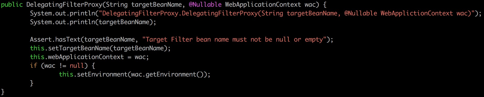

在文章`MakeFilterChains`中，我们分析了：如何从`Filter`构建到`FilterChainProxy`

但是我们没有分析：如何从`FilterChainProxy`构建到容器可接受的一个`Filter`（也就是`DelegatingFilterProxy`），然后把这个`Filter`插到容器的`Filter`链里（本篇文章的目标）


问题变成了：谁在索取这个`bean`呢？

# 建立调试环境 #

从`pom.xml`中删除掉`spring-boot-starter-web`，然后添加`spring-web`和`tomcat-embed-core`，如下图所示：


然后把`spring-security-config`和`spring-security-web`的版本后都去掉（即使用默认版本），使得这两个依赖都直接从`maven`仓库下载，然后我们会开一个新的`Docker`容器进行本次实验：

```shell
docker run -t -i -v ~/spring-framework:/spring-framework -v ~/loveu:/loveu --name springweb maven /bin/bash
cd /spring-framework
./gradlew :spring-web:build -x test -x javadoc
./gradlew :spring-web:install
cd /loveu
mvn spring-boot:run
```

在`Docker`容器运行的过程中，我们得知当前`spring-web`的版本是`5.0.5.BUILD-SNAPSHOT`：


所以我们把`loveu`项目的`pom.xml`稍微改动一下：


# DelegatingFilterProxy #





为什么同一个构造函数被调用了两次？这个暂时不管，我们知道`targetBeanName == "springSecurityFilterChain"`（这是个非常重要的信息）

我们现在想知道：`AbstractSecurityWebApplicationInitializer.DEFAULT_FILTER_NAME`是什么？


很好，符合我们的预期，现在我们可以确信这样一个流程：

1. `DelegatingFilterProxy`和`Spring`容器沟通，给我一个名字叫`springSecurityFilterChain`的`bean`好不好哇？
2. `Spring`容器去尝试获取名为`springSecurityFilterChain`的`bean`，之后引起了在`MakeFilterChain`一文中描述的各种复杂的行为

所以，通过调用栈是看不出来`DelegatingFilterProxy`在调用`WebSecurityConfiguration.springSecurityFilterChain`的

## initDelegate ##


代码段`if (isTargetFilterLifecycle()) xxx`是不太可能被执行到的


`bean`的生命周期一般交给`Spring`容器管理就好了，所以`targetFilterLifecycle`默认是`false`

也就是说，`bean`的初始化函数以及销毁函数都会交给`Spring`容器来调用，不需要我们手动管理

所以简化后的代码如下：

```java
protected Filter initDelegate(WebApplicationContext wac) throws ServletException {
    Filter delegate = wac.getBean(targetBeanName, Filter.class);
    return delegate;
}
```

## doFilter ##


所以，`doFilter`函数可以简化成：

```java
public void doFilter(ServletRequest request, ServletResponse response, FilterChain filterChain) throws ServletException, IOException {
    // Lazily initialize the delegate if necessary.
    ...;
    delegate.doFilter(request, response, filterChain);
}
```

## 谁在调用DelegatingFilterProxy的构造函数？ ##


看调用栈，跟下去的可能性不是很大（到`servlet`和`tomcat`就没有什么跟踪的价值了）

所以怎么办呢？

> Spring Security is installed as a single Filter in the chain, and its concerete type is FilterChainProxy, for reasons that will become apparent soon. In a Spring Boot app the security filter is a @Bean in the ApplicationContext, and it is installed by default so that it is applied to every request.

来自教程[Spring Security Architecture](https://spring.io/guides/topicals/spring-security-architecture)中的这段话告诉我们：`DelegatingFilterProxy`是作为一个`bean`被安装到容器中去的，所以没有人显式地在调用`DelegatingFilterProxy`类的构造函数（原文说是`FilterChainProxy`类是一种简化的说法，原文在后面有解释）


很像是这么回事，但是涉及到太多`Spring`框架的底层代码，不想分析下去

# How to register a servlet filter #

## plan A ##


## plan B ##


