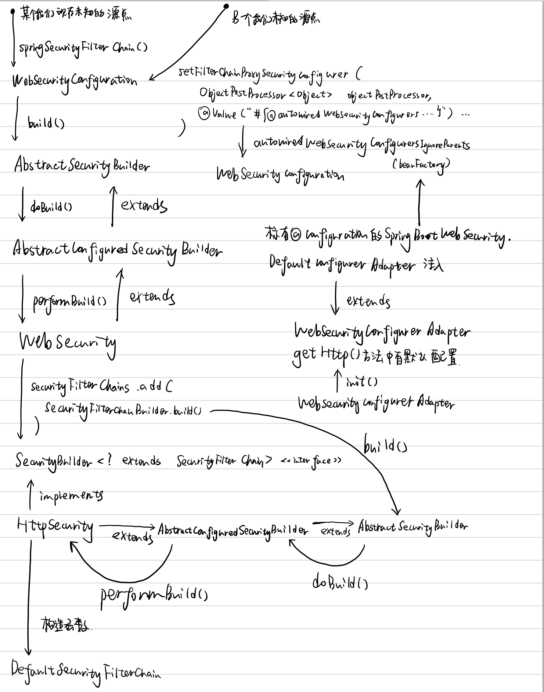

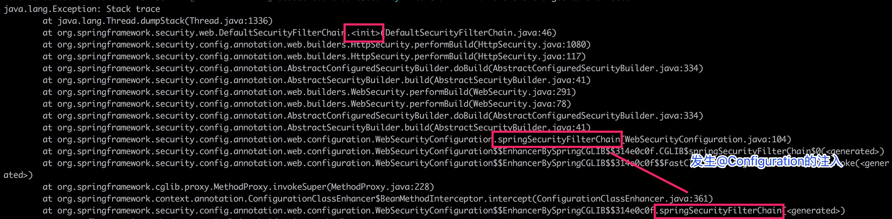

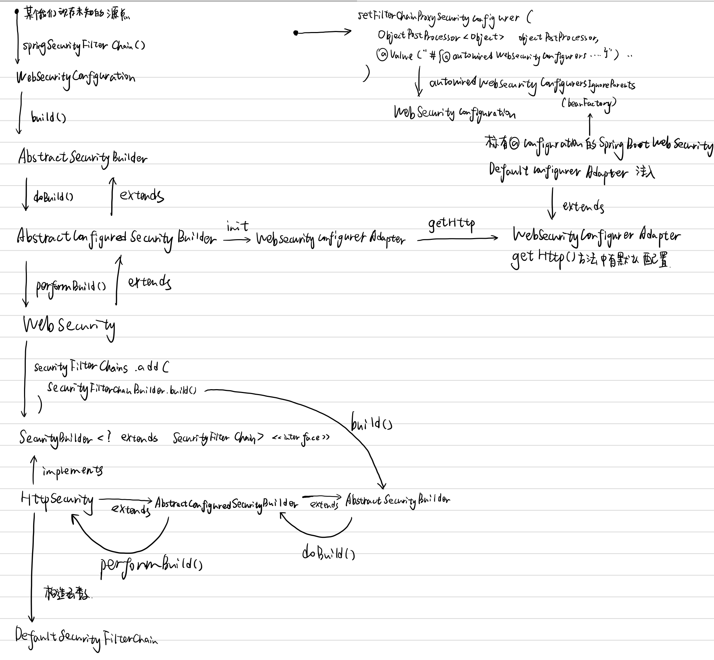

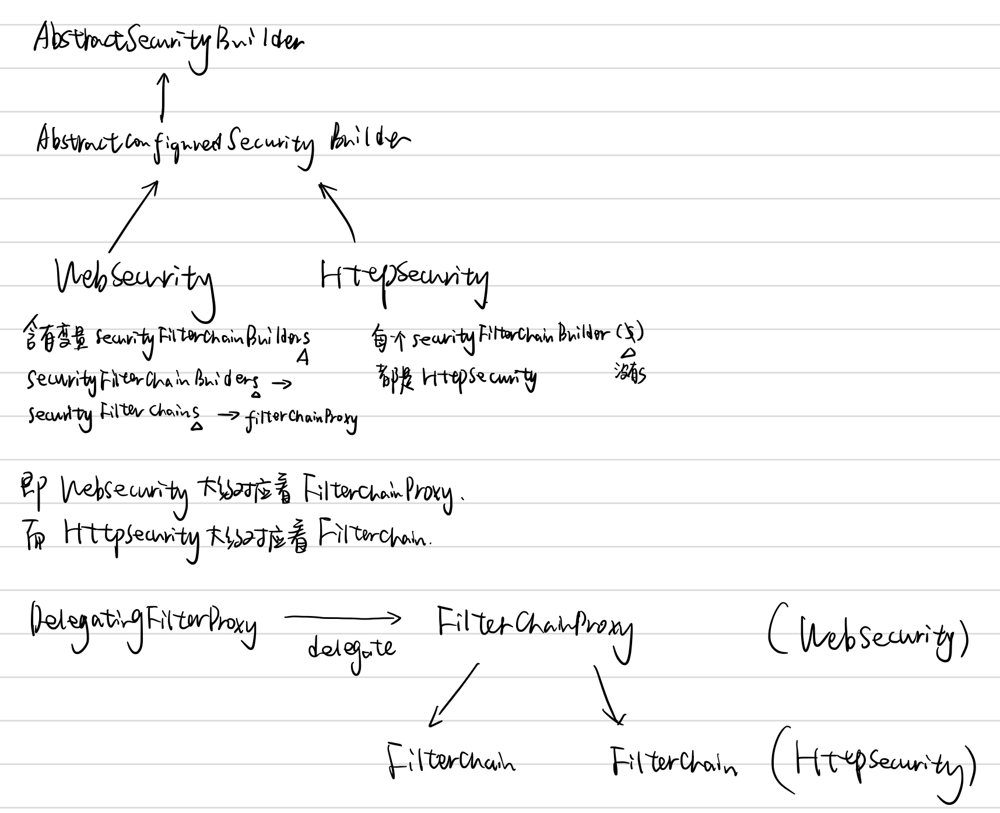

# 预备知识 #

## @Configuration ##

+ `@Configuration`约等于`xml`文件内的`<beans></beans>`标签
+ `@Bean`约等于`xml`文件内的`<bean></bean>`标签

`@Configuration`用于定义配置类，可替换`xm`l配置文件，被注解的类内部包含有一个或多个被`@Bean`注解的方法，这些方法将会被`AnnotationConfigApplicationContext`或`AnnotationConfigWebApplicationContext`类进行扫描，并用于构建`bean`定义和初始化`Spring`容器

### Construction by class literal ###

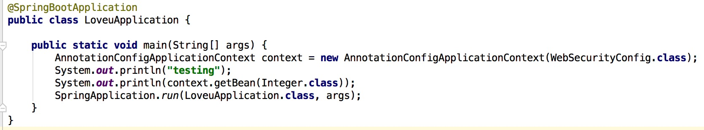

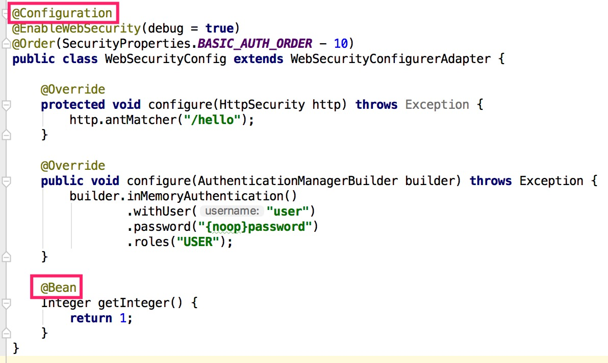

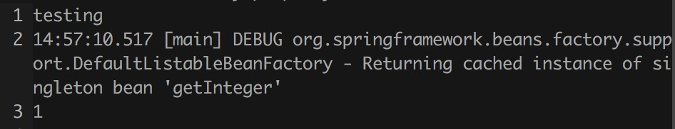

### Construction by base package ###

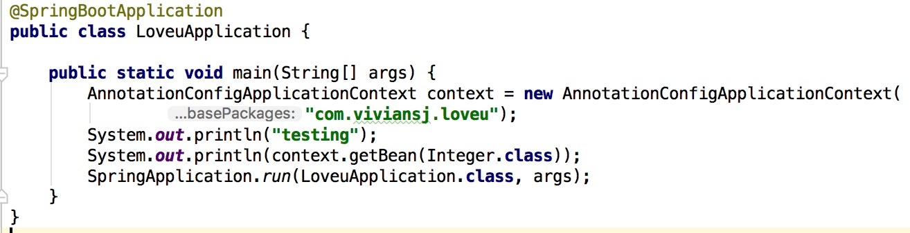

```java
JavaConfigApplicationContext context = new JavaConfigApplicationContext(
    "**/configuration/**/*.class", 
    "**/other/*Config.class"
);
Service service = context.getBean(Service.class);
```

### Post-construction configuration ###

```java
JavaConfigApplicationContext context = new JavaConfigApplicationContext();
context.setParent(otherConfig);
context.setConfigClasses(AppConfig.class, DataConfig.class);
context.setBasePackages("com.acme.configuration");
context.refresh();
Service service = (Service) context.getBean("serviceA");
```

用于解决环境依赖的问题

## ImportAware ##

> Interface to be implemented by any @Configuration class that wishes to be injected with the AnnotationMetadata of the @Configuration class that imported it. Useful in conjunction with annotations that use @Import as a meta-annotation.

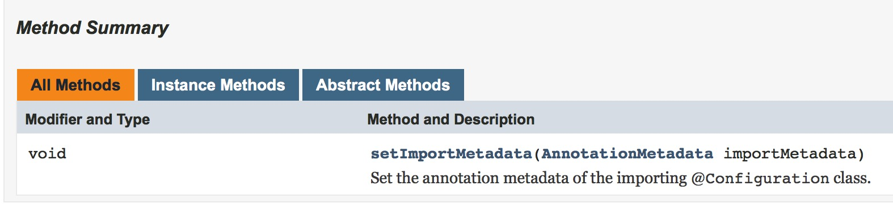

## BeanClassLoaderAware ##

> If a bean in spring implements BeanClassLoaderAware then that bean has to implement a method that is setBeanClassLoader. And when that bean is loaded in spring container, the setBeanClassLoader is called. BeanClassLoaderAware belongs to the package org.springframework.beans.factory. BeanClassLoaderAware awares the bean for its ClassLoader. 

如果一个`bean`实现`BeanClassLoaderAware`接口，那么当这个`bean`被载入到`Spring`容器中的时候，`setBeanClassLoader`方法会被调用

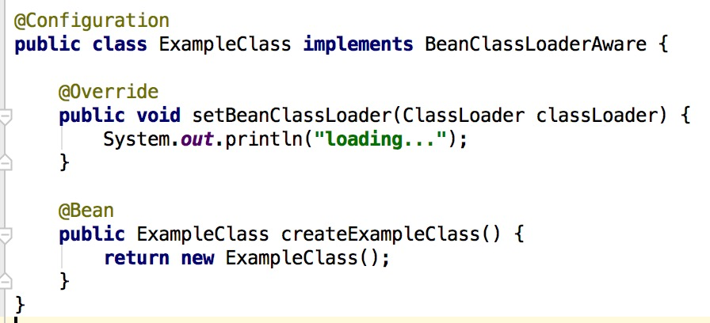

如果按照这段代码，开头那段话就有一点问题，更正如下：如果一个`beans`实现`BeanClassLoaderAware`接口，那么在它之中的`bean`被加载到`Spring`容器中时，框架会调用`setBeanClassLoader`方法

## ObjectPostProcessor ##

> Allows initialization of Objects. Typically this is used to call the Aware methods, InitializingBean.afterPropertiesSet(), and ensure that DisposableBean.destroy() has been invoked.


## synchronized ##

+ 一个线程访问一个对象中的`synchronized(this)`同步代码块时，其它试图访问该对象的线程将被阻塞
+ 当一个线程访问对象的一个`synchronized(this)`同步代码块时，另一个线程仍然可以访问该对象中的非`synchronized(this)`同步代码块

# WebSecurityConfiguration #

## setFilterChainProxySecurityConfigurer ##

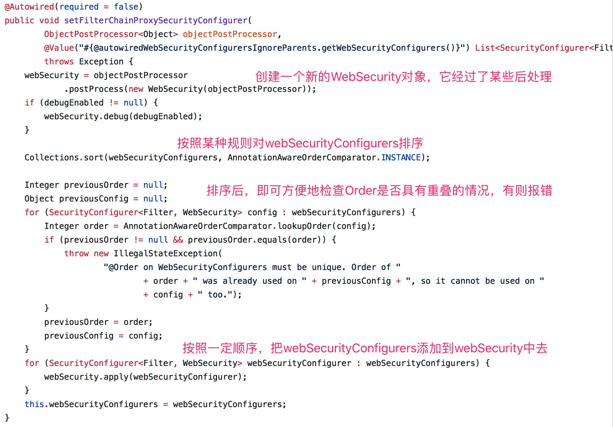

```java
@Value("#{@autowiredWebSecurityConfigurersIgnoreParents.getWebSecurityConfigurers()}") List<SecurityConfigurer<Filter, WebSecurity>> webSecurityConfigurers
```

```java
webSecurity.apply(webSecurityConfigurer);
```

以上两段代码值得重点关注，第一段代码负责注入`beans`，第二段代码需要参考其它类才能得出结论

## AutowiredWebSecurityConfigurersIgnoreParents ##

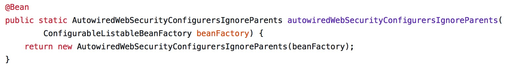

`beanFactory`是由容器负责注入的，我们不去追根溯源

在前面的实验中，我们注意到这样的一个输出：


```shell
DEBUG org.springframework.beans.factory.support.DefaultListablebeanfactory
```

我们只不过是要求获得某一个类型的`bean`：`context.getBean(Integer.class)`

可以想象，框架中肯定有一个地方在帮我们获取`beanFactory`，然后交给`autowiredWebSecurityConfigurersIgnoreParents`方法作为参数

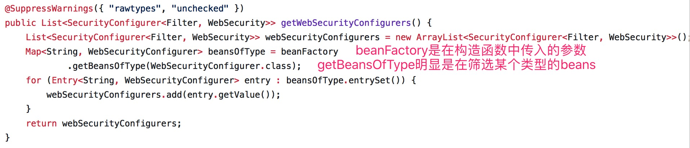

```java
@Value("#{@autowiredWebSecurityConfigurersIgnoreParents.getWebSecurityConfigurers()}") List<SecurityConfigurer<Filter, WebSecurity>> webSecurityConfigurers
```

那么，以上代码显然是在把`WebSecurityConfigurer`类型的`beans`选出来，作为参数

## springSecurityFilterChain ##

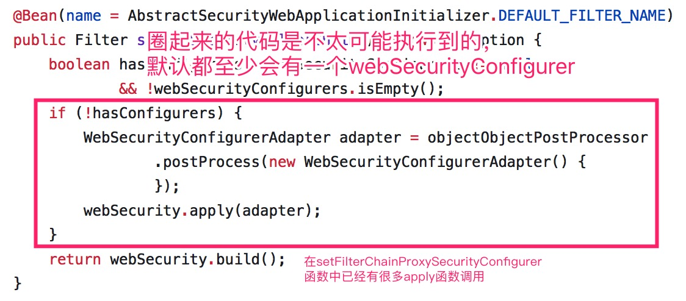

也就是说，`springSecurityFilterChain`函数中最有可能执行的就是：`webSecurity.build()`

## setBeanClassLoader ##

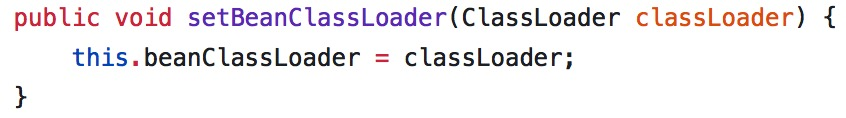

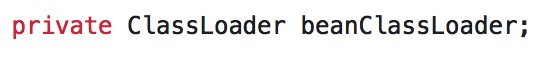

然而这个私有变量并没有在该类的其它地方被用到，那为什么要把`classLoader`保留起来呢？

# AbstractSecurityBuilder #

```java
public abstract class AbstractSecurityBuilder<O> implements SecurityBuilder<O> {
	private AtomicBoolean building = new AtomicBoolean();

	private O object;

	public final O build() throws Exception {
		if (this.building.compareAndSet(false, true)) {
			this.object = doBuild();
			return this.object;
		}
		throw new AlreadyBuiltException("This object has already been built");
	}

	public final O getObject() {
		if (!this.building.get()) {
			throw new IllegalStateException("This object has not been built");
		}
		return this.object;
	}

	protected abstract O doBuild() throws Exception;
}
```

简单来说，这个类的目的就是高效地解决锁相关的问题（采用一种很简单的思路解决“读写锁”，因为这种“读写锁”具有一种很特殊的性质：先写再读，且只写一次，故可用一个简单的原子变量解决之）

该类具有一个泛型参数`O`，代表着需要构建的对象

# AbstractConfiguredSecurityBuilder #

+ @param \<O\> The object that this builder returns
+ @param \<B\> The type of this builder (that is returned by the base class)

## doBuild ##

在`AbstractSecurityBuilder`中的`build`方法中：`this.object = doBuild();`

`doBuild`是`AbstractSecurityBuilder`的纯虚函数

```java
@Override
protected final O doBuild() throws Exception {
    synchronized (configurers) {
        buildState = BuildState.INITIALIZING;
        beforeInit();
        init();
        
        buildState = BuildState.CONFIGURING;
        
        beforeConfigure();
        configure();
        
        buildState = BuildState.BUILDING;
        
        O result = performBuild();
        
        buildState = BuildState.BUILT;
        
        return result;
    }
}
```

类似于“分阶段构建”？需要特别关注的是：`init`函数 + `performBuild`函数

### init ###

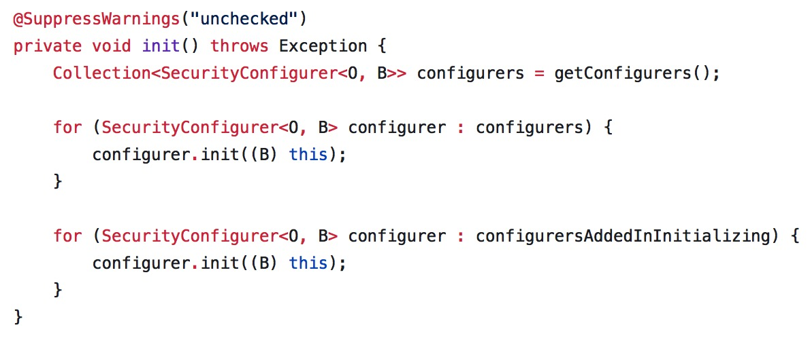

还记得我们曾疑惑：`WebSecurityConfigurerAdapter`中的`init`方法是被谁调用的？


`configurer`的类型是`SecurityConfigurer<O, B>`，而`WebSecurityConfigurerAdapter`的完整签名是`abstract class WebSecurityConfigurerAdapter implements WebSecurityConfigurer<WebSecurity>`，且`WebSecurityConfigurer`的完整签名是`public interface WebSecurityConfigurer<T extends SecurityBuilder<Filter>> extends SecurityConfigurer<Filter, T>`

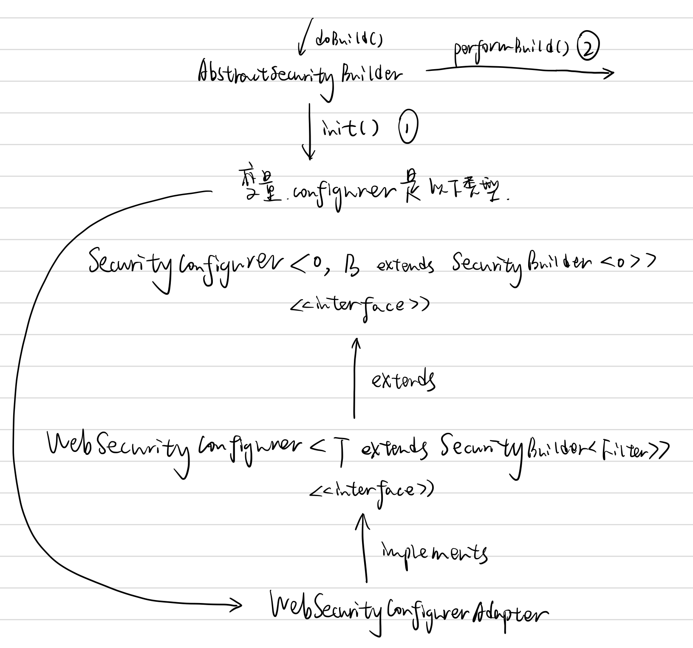

### configure ###

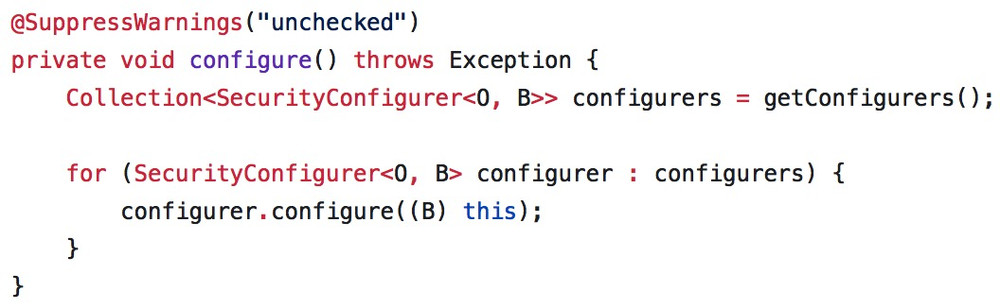

### performBuild ###

纯虚函数，交给继承它的类去实现，所以我们会稍后再看该函数

## add ##

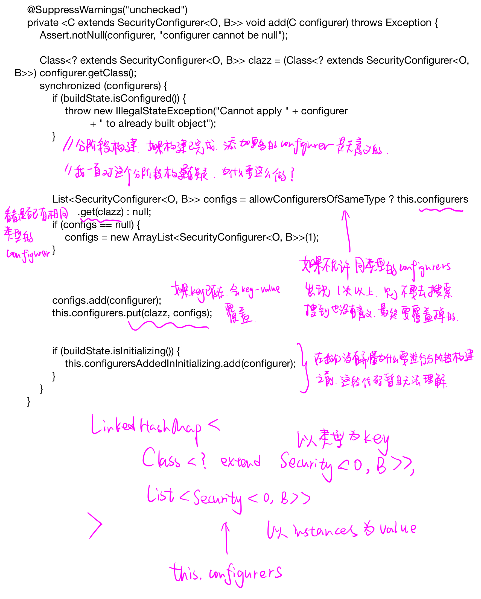

这个函数的作用用一句话概括就是：按照一定的规则，把`configuer`放到`this.configurers`中去

## apply ##

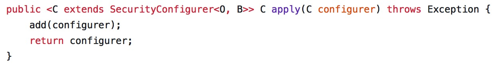

简单的调用`add`函数

我们可以猜想：`performBuild`函数需要用到`this.configurers`变量，但是目前为止，没有看到一个`public`或者`protected`函数把这个私有变量暴露出去，这是非常让人困惑的

# WebSecurity #

## configures的传递 ##

```java
Assert.state(
				!securityFilterChainBuilders.isEmpty(),
				"At least one SecurityBuilder<? extends SecurityFilterChain> needs to be specified. Typically this done by adding a @Configuration that extends WebSecurityConfigurerAdapter. More advanced users can invoke "
						+ WebSecurity.class.getSimpleName()
						+ ".addSecurityFilterChainBuilder directly");
```

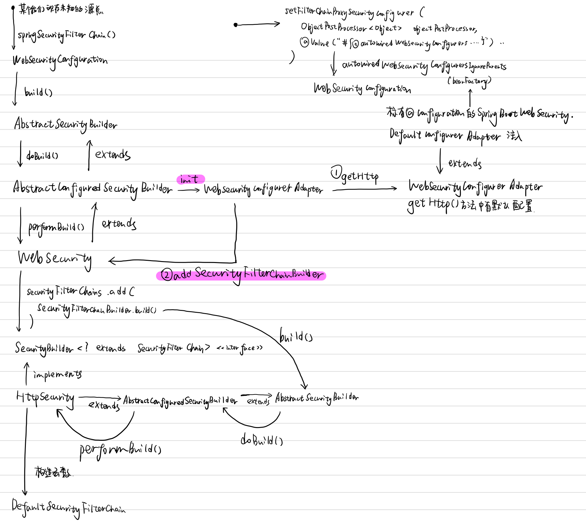

但这样的设计是有一定问题的，因为：

1. 使用强制转换
2. 转折较多，较难理解

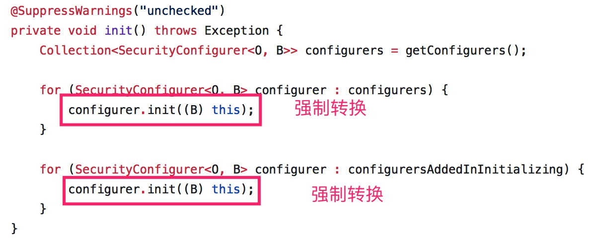

## addSecurityFilterChainBuilder ##

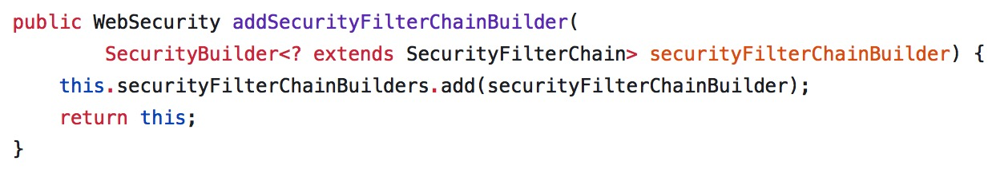

`List<SecurityBuilder<? extends SecurityFilterChain>> securityFilterChainBuilders`

## performBuild ##

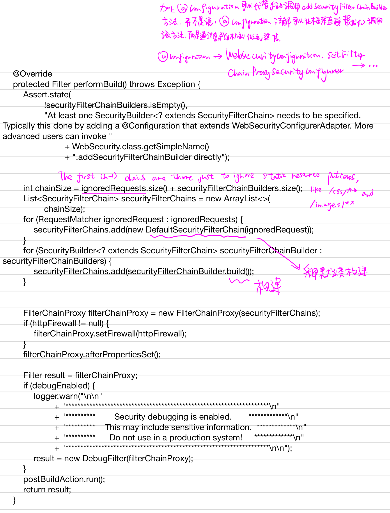

# WebSecurityConfigurerAdapter #

## getHttp ##

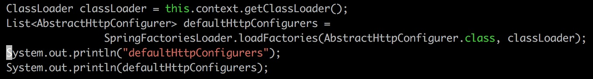

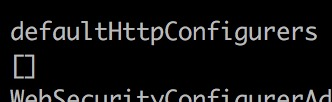

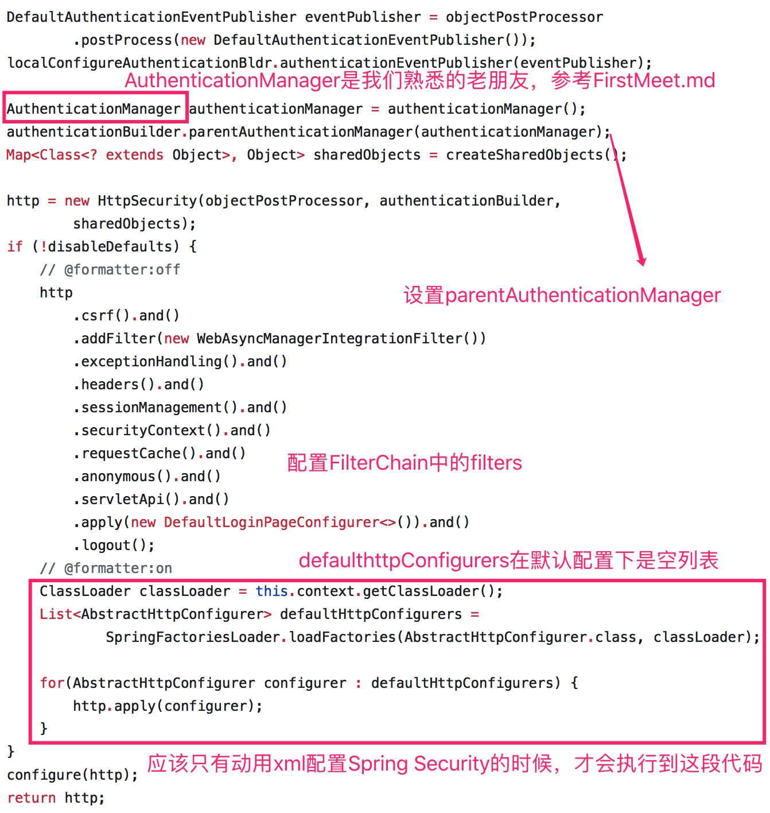

## init ##

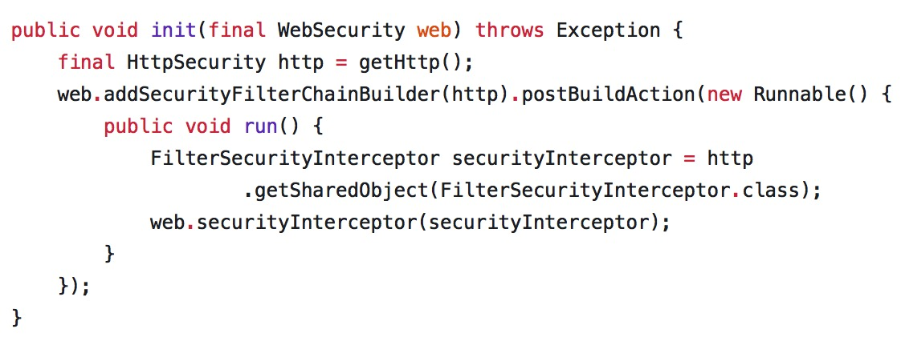

# HttpSecurity #


来看一下局部的调用链（核心类是`WebSecurity` / `HttpSecurity` / `WebSecurityConfigurerAdapter`），注意两个`AbstractSecurityBuilder`实例不是同一个实例，两个`AbstractConfiguredSecurityBuilder`也不是同一个实例，两个`HttpSecurity`实例却是同一个实例（分开画只是为了方便）：

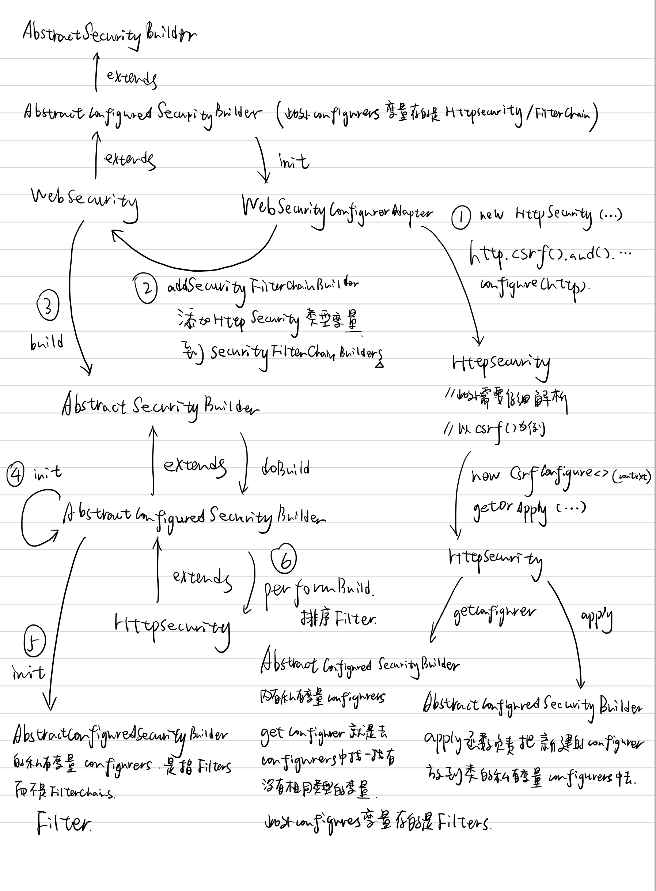

升级版的示意图：

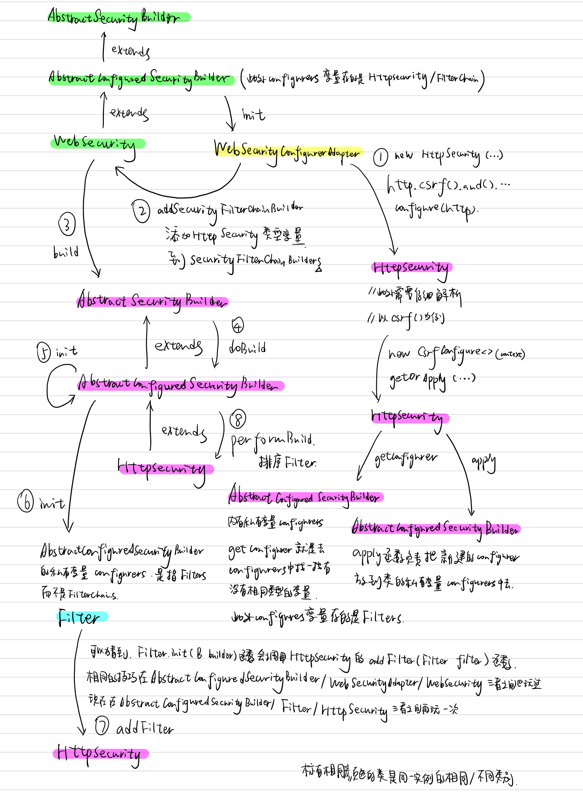

尤其需要注意的是两个圈：

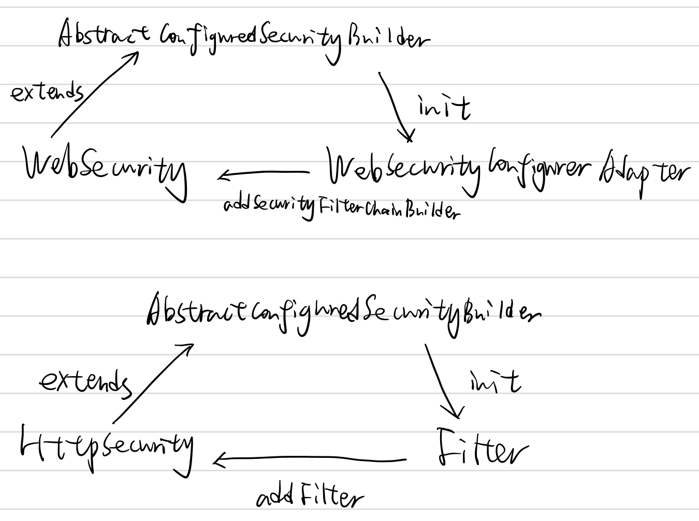

## 私有变量 ##

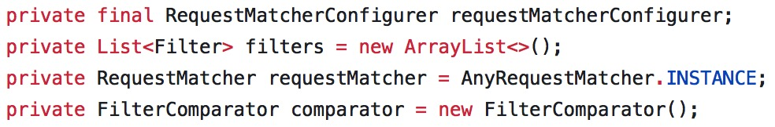

这四个变量显然在告诉我们：一个`HttpSecurity`对应着一个`FilterChain`

## getOrApply ##

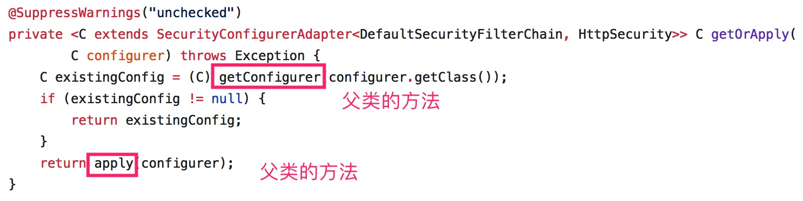

一句话概括这个函数：把`configurer`添加到父类的私有变量`configurers`中去

## performBuild ##

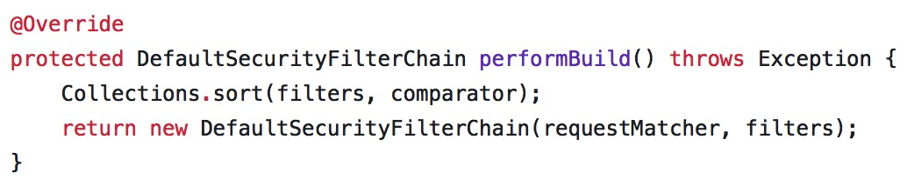

简单的排序操作，至于`filters`怎么来的在前面有介绍（看图）

要说明的是，我们一直说把`filters`连成一个链表，但这个是概念上的“链表”，在实现中用数组也是可以的

所以不要因为找不到构建链表的代码而觉得代码没看完

# DefaultSecurityFilterChain #

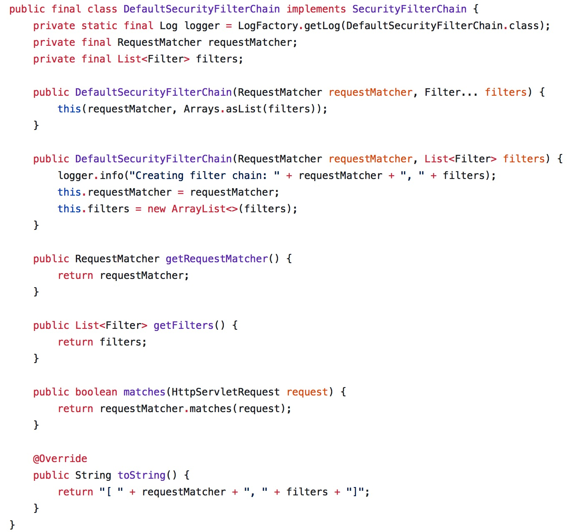
