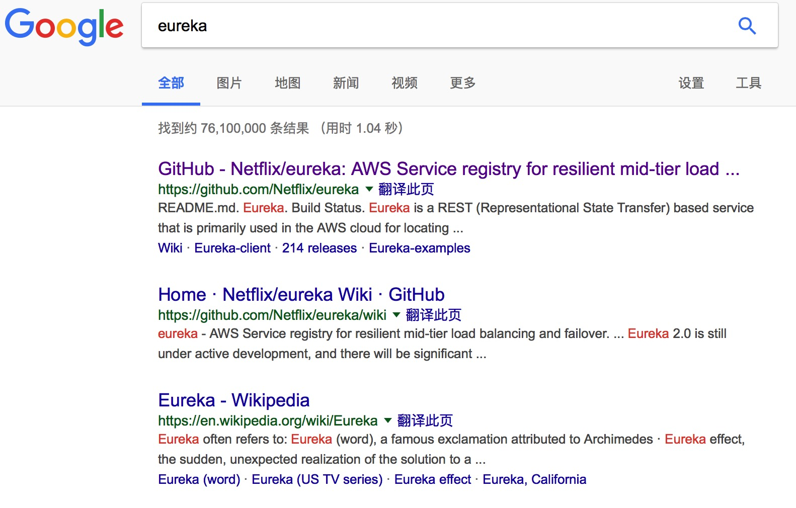
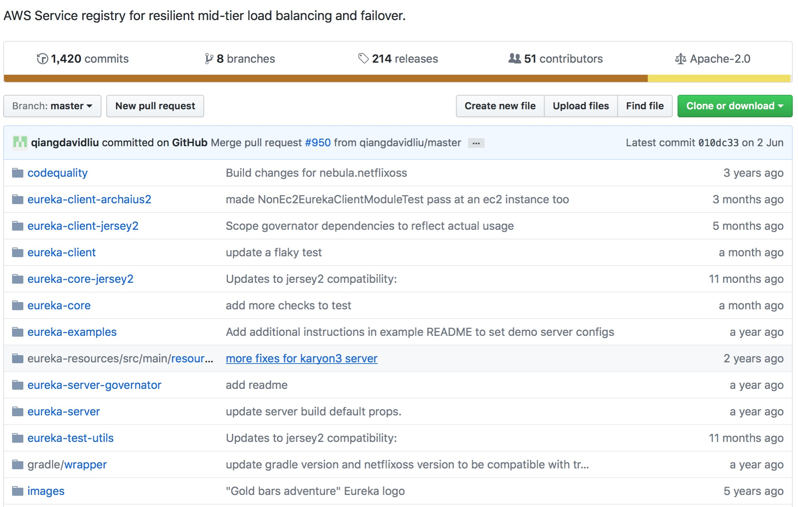
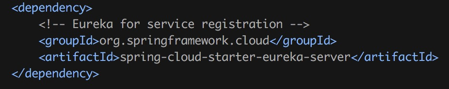
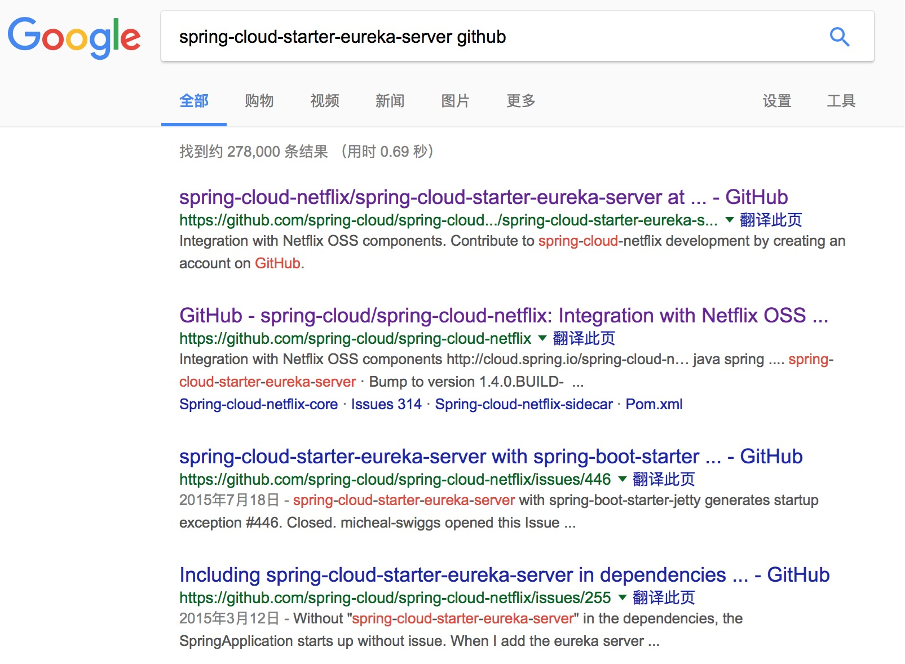
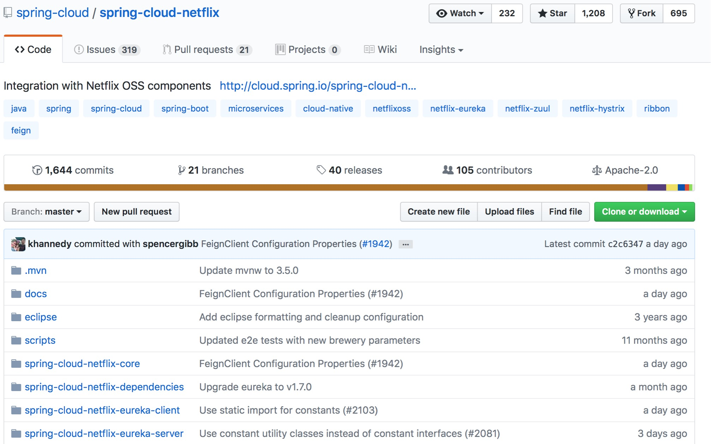
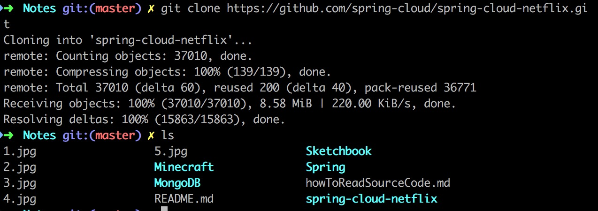
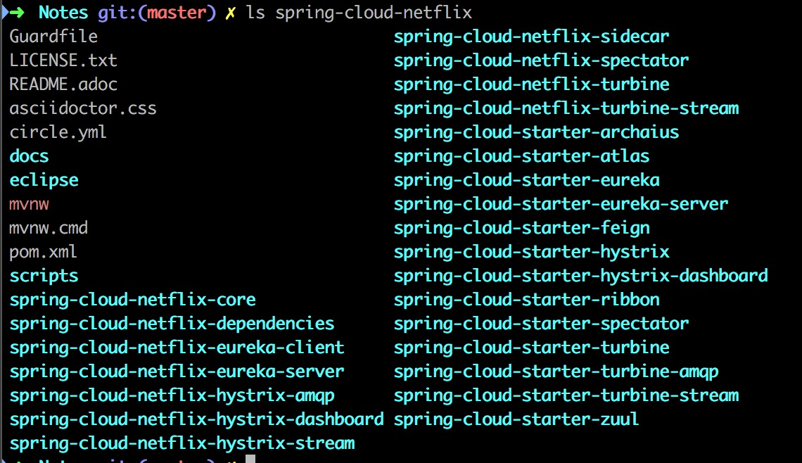
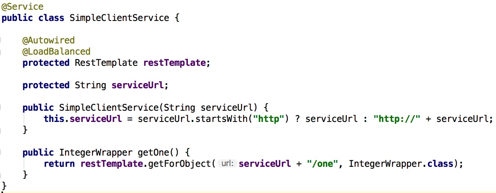

# 如何阅读源代码——以Eureka为例 #

背景：

接到一个任务，需要改写Eureka-Server以达到以下两个效果：

+ 提供一个接口，让Server以`JSON`的形式返回所有登记的实例
+ 在负载均衡时记录下微服务之间的调用关系

## 下载正确的源代码 ##

直接在Google搜索会看到第一项是：

如果选用这个仓库进行分析，那么久恭喜你了，因为你会发现里面的东西都不是你想要的

所以，正确的选择源代码是很重要的一步

仔细看看依赖项，根据依赖项进行搜索：

这个才是正确的仓库，我们把它下载下来：

## 找到入口点 ##

显然，我们只关注spring-cloud-netflix-core／spring-cloud-netflix-eureka-client／spring-cloud-netflix-eureak-server三个仓库，但这三个仓库还是太多了，此时我们需要找到入口点

### 分析自己的项目在什么地方使用Eureka ###

这是MicroServiceDemo/complicatedClient的其中一段代码，这段代码负责解析http://simple-client-service并做负载均衡

我们可以判断这是Eureka对外提供的接口，RestTemplate是关键

