# 第一步：写一个合适的例子 #


首先，要明确不是所有的阻塞操作都被hook过，都能表现出自动切换协程的特性（比如std::cin对应的系统调用就肯定没有，所以这不是一个好的例子）


无论你在输入3之前等多久，"Hello, libgo!"一定会在"i = 3"之后才输出


这才是一个优秀的例子，因为sleep对应的操作系统调用是被hook过的


libgo的作者告诉我们以下这些系统调用是hook过的：

```c++
connect   
read      
readv     
recv      
recvfrom  
recvmsg   
write     
writev    
send      
sendto    
sendmsg   
poll      
select    
accept    
sleep     
usleep    
nanosleep
gethostbyaddr_r
```

# 第二步：Let’s Hook a Library Function #

If you are a developer, and want to change the way a library function works, this article will give you a basic idea of how to get started — just enough knowledge to be able to experiment with your library functions. All code here is in C, and tested with GCC on Linux.

> 学习如何hook：改变库函数的功能
>
> 在库函数入口点和出口点做一些事情？

According to Wikipedia, “In computer programming, the term hooking covers a range of techniques used to alter or augment the behaviour of an operating system, applications, or other software components, by intercepting function calls or messages or events passed between software components. Code that handles such intercepted function calls, events or messages is called a hook.”

> 什么是kook？
>
> 打断函数调用／消息传递／事件传递

Intercepting a library call, and calling your own wrapper code, is also called Function Interposition.

> 术语：Function Interposition

Hooking has two benefits:

+ You don’t have to search for the function definition in the library, such as `libc` (`glibc` is the GNU C Library, and `libc` is almost half of the size of `glibc`) and change it. Seriously, this is a very nasty technical task (at least for me!).

  > 无需动源代码，无需重新编译

+ You don’t need to recompile the library’s source code.


## Library functions and system calls ##

Please look at Figures 1 and 2 for a graphical representation of what happens when a library function is hooked.


Now let’s look at hooking a library function. The simple `prog1.c` program below just allocates 10 bytes of memory from the heap, and frees it:

```c++
#include <stdio.h>
#include <malloc.h>
#include <stdlib.h>
int main(void)
{
    int *p;
    printf("calling from main...\n");
    p = (int *)malloc(10);
    if (!p)
    {
        printf("Got allocation error...\n");
        exit(1);
    }
    printf("returning to main...\n");
    free(p);/* freeing memory from heap */
    printf("freeing memory...\n");
    return 0;
}
```

When we compile and run the above program, the output is as shown below:


The next program, called `prog2.c`, is a simple hook for the `malloc()` function:


Compiling and running the above, goes like this:

（我把prog1.c改名成test.cpp，把prog2.c改名成hook.c）

```shell
gcc -shared -ldl -fPIC hook.c -o libhook.so
g++ test.cpp -o test.out
LD_PRELOAD=/root/libhook.so ./test.out
```

不过我自己做不出来结果：coredump


So, let’s take a closer look at our first hook. The `dlsym()` function takes two parameters: the first is a handle returned by `dlopen()`. Here, we must use `RTLD_NEXT` for function interposition.

> `dlsym()`函数用于动态加载函数

This tells the dynamic linker to find the next reference to the specified function, not the one that is calling `dlsym()`. The second parameter is the symbol name (`malloc`, in this case), as a character string. `dlsym()`returns the address of the symbol specified as the second parameter. While compiling, `fPIC` is used to create a position-independent object.

> 解释一下`dlsym()`函数的用法

The `LD_PRELOAD` environment variable gives the loader a list of libraries to load before anything else. Our use of it will load `libprog2.so` and dynamically link it with the `prog1` binary. Don’t forget to provide an absolute path to the `.so`, in `LD_PRELOAD`. And, of course, include `_GNU_SOURCE` if you want to use certain extensions while using the GNU C library, because some extensions may not be available on other non-GNU systems and adding this `#define` will increase portability.

> 一种hook的方法就是替换掉动态链接库

## Can we hook every function with *dlsym()*? ##

The above hook method will not work if you want to wrap `dlsym()` itself, or wrap any library functions that internally call `dlsym()`.

> 上面的方法不能用于hook`dlsym()`函数本身
>
> 上面的方法不能用于hook内部调用过`dlsym()`函数的函数

So, is there any way to interpose `dlsym()`? Yes, but you can’t use the same hook procedure — check the output if you try that.

> 可以hook这些函数，但是不能用相同的方法

First, create a shared object `libfile.so` from `file1.c` and `file2.c` (below). Then compile it with `gcc -rdynamic -o dl_prog1 dl_prog1.c -ldl`. Yes, the output is obvious:

```c++
/* file1.c */
void file1(int *i)
{
    *i=100;
}
/* file2.c  */
void file2(int *i)
{
    *i=200;
}
```

The following `dl_prog1.c` is a simple program to show the functionality of `dlopen()` and `dlsym()`. The functions `file1()` and `file2()` are defined in `file1.c` and `file2.c`.

```c++
#include<stdio.h>
#include<dlfcn.h>
#include<stdlib.h>
 
void file1(int *i);
void file2(int *i);
int main(void)
{
    void *handler;
    int (*fn) (int *);
    int x;
    char *error;
    handler = dlopen("/home/dibyendu/dlsym_hook/libfile.so", RTLD_LAZY);
    if (!handler)
    {
        fprintf(stderr,"%s\n", dlerror());
        exit(1);
    }
    fn = dlsym(handler,"file1");     /* getting the handle of file1 through dlsym() */
    if ((error = dlerror()) != NULL) /* checking error through dlerror() */
    {
        fprintf(stderr,"%s\n", error);
        exit(1);
    }
    (*fn)(&x);                            /* Calling file1() to resolve x */
    printf("The value of x is %d\n", x);
    dlclose(handler);                 /* closing the file handle */
    return 0;
}
```


在这里要说两句：

+ file1.c & file2.c 用于提供静态链接库
+ d1_prog1.c 是主函数所在的文件，负责测试动态链接库及其配套函数

Now try to hook `dlsym()`, and you will get a segmentation fault, due to recursive calls (`dlsym()` will call itself). The following `dl_prog2.c` will be a recursive `dlsym()` call to itself, which causes a stack overflow and segmentation fault:

```c++
#define _GNU_SOURCE
#include <stdio.h>
#include <stdint.h>
#include <dlfcn.h>
 
void *dlsym(void *handle, const char *name)
{
    void *(*dlsym_fn)(void *, const char *)=NULL;
    printf("inside shared object::before dlsym()...\n");
    dlsym_fn=dlsym(RTLD_NEXT, "dlsym"); /* this will call itself again and again */
    printf("inside shared object::after dlsym()...\n");
    return (*dlsym_fn)(handle, name);
}
```


> 无限递归

Here is the code (`dl_prog3.c`) that successfully interposes `dlsym()`:

```c++
#define __USE_GNU
#include <stdio.h>
#include <stdlib.h>
#include <dlfcn.h>
 
extern void *__libc_dlsym (void *, const char *);
void *dlsym(void *handle, const char *symbol)
{
    printf("Ha Ha...dlsym() Hooked\n");
    void* result = __libc_dlsym(handle, symbol); /* now, this will call dlsym() library function */
    return result;
}
```


> 根本的问题：如何不递归？

## What else can we do? ##

I have already interposed other functions like `getaddrinfo()`, `open()`, etc, so you can intercept any function you want. But there are a few limitations:

+ Do beware of functions that themselves call dlsym(), when you need to call __libc_dlsym (handle, symbol) in the hook.
+ Ensure that the SUID bit is not set, otherwise you can’t use `LD_PRELOAD`.
+ Also, internal library function calls are resolved before runtime — say, if some function in `libc` calls `getaddrinfo()` or `malloc()`, it will never call the hook from a different library.

## References ##

+ Tutorial: [Function Interposition in Linux](http://www.jayconrod.com/cgi/view_post.py?23) by Jay Conrod
+ Linux man pages: `dlopen()`, `dlsym()`, `dlerror()`, `dlclose()`

本小节来自[DIBYENDU ROY](http://opensourceforu.com/author/dibyendu-roy/)同名文章[Let’s Hook a Library Function](http://opensourceforu.com/2011/08/lets-hook-a-library-function/)


# 第三步：跟踪其中一个被hook过的系统调用 #


进入到Run函数内，不过还没有真正开始运行协程／Continuation／Task


看到了变量tk：根据打印出来的信息，我们可以判断这正是我们用`go`原语提交的第一个任务

在这个任务的执行中，会碰到sleep系统调用


不过一波操作失误，没有跟进去（呜呜呜～），只看到SwapIn函数返回之后，continuation／协程／Task的状态变成了`co::TaskState::sleep`，确实是我们期待的行为

然后我们又重来一遍（呵呵呵～）

```shell
gdb a.out
b libgo/libgo/processer.cpp:42
start
c
shell clear
list
```


我们发现：不得不跟进去，到boost.context里才能看到sleep函数的调用


> fn封装到ctx_里
>
> 只能呼叫ctx_()才能把它召唤出来

但是我们现在还没看过boost.context的源代码，还不想跟进去（这就很蛋疼了不是）

所以我们用一个奇招（碰一碰运气）：


你别说，还真行！

我们顺利找到了hook的入口点？（问号脸？它在停下来之前有没有做点别的什么？？？）

# 第四步：静态分析linux_glic_hook.cpp #

## connect ##

下面的分析会以`connect`函数作为例子


这是在静态“链接”系统调用（“链接”用的不准确，准确的来说只是提供一个函数声明，等待编译器的静态链接）


这是在动态“链接”系统调用（“链接”用的不准确，准确来说是通过API提出链接的要求，然后等待编译器的动态链接）

至此为止：connect_f 把静态“链接”和动态“链接”的函数统一了起来


`coroutine_hook_init()`函数就做了一件很简单的事情：

统一静态链接和动态链接的函数 + 检查一下是不是所有的函数都存在

（其实就是为真正的hook做准备）

重头戏马上就要来了啊（激动不激动啊！！！）

——————**这是重头戏的分界线**——————


如果不是在协程内，直接阻塞式调用


`typedef std::shared_ptr<FileDescriptorCtx> FdCtxPtr`   ::diamond_shape_with_a_dot_inside:

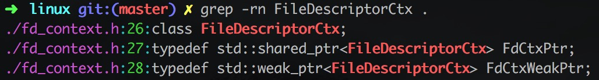

所以把fd_ctx看成是一个自带环境的文件描述符就可以了

之前的代码处理了一下文件描述符不合法的一些情况

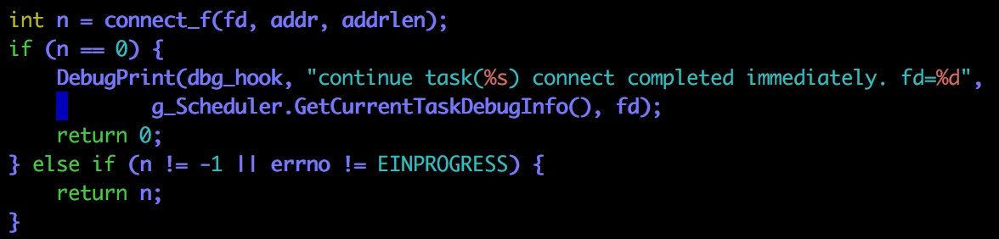

`connect_f` 是一个非阻塞的操作（否则这样简单的hook就没有意义了）

非阻塞connect有三种基本的情况：

+ 立即完成且成功
+ 立即完成且失败
+ 连接还在进行中，请继续等待：返回-1并且错误码设置为EINPROGRESS，后续通过select／epoll来检查是否可读可写


这段代码在处理连接尚未完成的情况，显然使用了epoll来进行检测

```c++
struct pollfd {
　　int fd;          //文件描述符
　　short events;    //请求的事件
　　short revents;   //返回的事件
};
```

poll(&pfd, 1, s_connect_timeout = -1)：监测文件描述符为fd的文件，事件是普通数据可写，永不超时

问题来了：poll操作是线程阻塞的还是线程非阻塞的？

我感觉是会阻塞线程的，立即返回的话有一点说不通；但如果poll操作是阻塞的话，hook connect还有什么意义？不是该堵的还是堵吗？

我猜测connect应该这样做：

+ poll操作询问一下数据准备好了没有
+ 如果准备好了，则立即返回
+ 如果数据没有准备好，则调用`(*(this->yield_))()`，返回到调度协程

有一点不能理解connect的这个代码

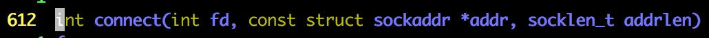


## sleep ##

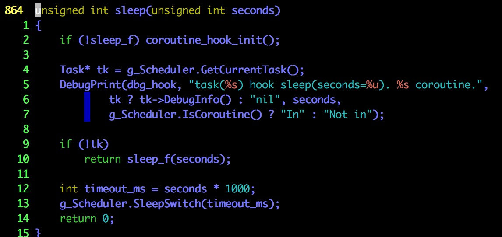

sleep的实现和connect有一定不一样，会利用一个集中的控制器

connect为什么不利用一个集中的控制器，统一epoll？

## libgo_poll ##

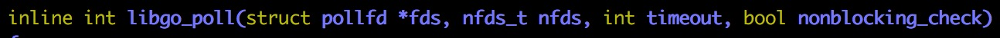

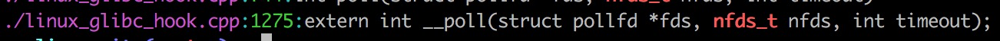

`nfds_t`应该是库内置的类型，不是libgo开发的类型

`nfds`用于标记`fds`数组中的`struct pollfd`结构元素的总数量

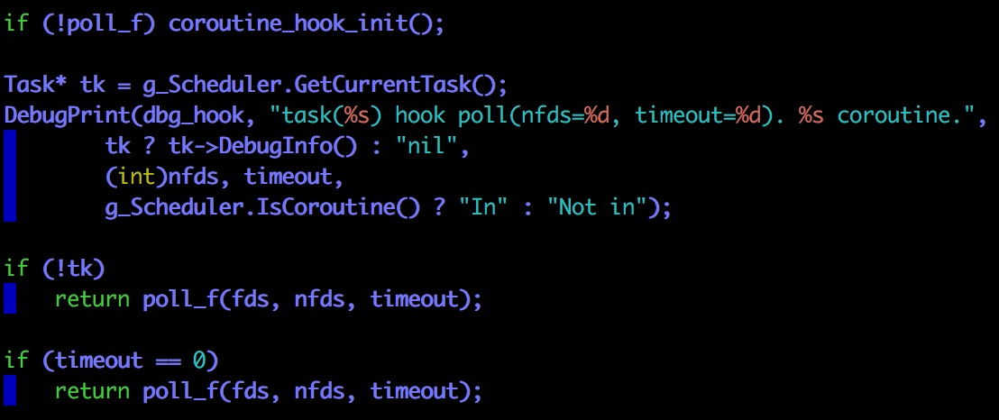

到这里为止，都是一些特殊情况的处理（比如说不是一个任务发出的请求／已经超时）

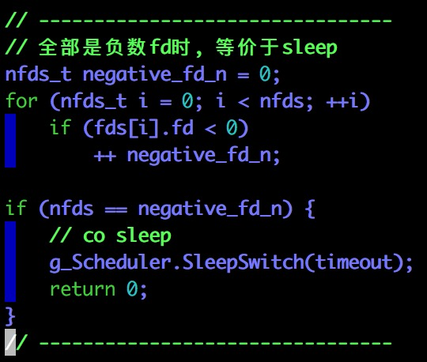

前面一个循环是去找：fds数组内有多少个元素的fd是负数？

如果fds数组内的所有元素的fd都是负数，那么沉睡一段时间（调用特殊的管理器来沉睡，使得线程能继续执行）

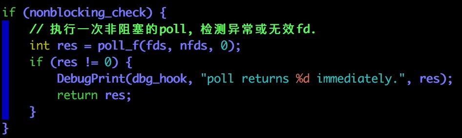

此次poll是非阻塞的，不用担心

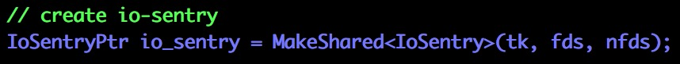

不知道io-sentry是什么东西？

只搜索到sentry是一款日志收集软件


创建一个带环境信息的文件描述符并检查合法性


这段代码应该是在把poll的一些事件和日志收集组件进行关联


在这里，我们终于看到了协程的切换


否则表明已经有文件描述符对应的文件可读或者可写了？

因为对原生的网络编程本来就不熟悉，所以上面的分析有很多粗糙和错误的地方

## poll ##


这一小段代码就解释了我们在`connect`函数分析中遇到的困惑，`connect`调用的`poll`函数不是原生的`poll`函数，它调用的`poll`函数要么不阻塞，要么会切换协程（同时调用libgo自己的定时器）

# 第五步：收第四步的烂账 #

## man poll ##

poll() performs a similar task to select(2): it waits for one of a set of file descriptors to become ready to perform I/O.

The set of file descriptors to be monitored is specified in the fds argument, which is an array of structures of the following form:

```c++
struct pollfd {
    int   fd;         /* file descriptor */
    short events;     /* requested events */
    short revents;    /* returned events */
};
```

The caller should specify the number of items in the fds array in nfds.

The field fd contains a file descriptor for an open file.  If this field is negative, then the corresponding events field is ignored and the revents field returns zero.  (This provides an easy way of ignoring a file descriptor for a single poll() call: simply negate the fd field.  Note, however, that this technique can't be used to ignore
file descriptor 0.)

上面这几段话告诉我们几个有用的信息：

+ poll()函数需要fds数组和nfds（指定数组元素的个数）
+ 如果pollfd结构内的fd字段为负数，events字段将被忽略，revents字段会被填上0并返回（何时返回没有说明）

The field events is an input parameter, a bit mask specifying the events the application is interested in for the file descriptor fd. This field may be specified as zero, in which case the only events that can be returned in revents are POLLHUP, POLLERR, and POLLNVAL (see below).

The field revents is an output parameter, filled by the kernel with the events that actually occurred.  The bits returned in revents can include any of those specified in events, or one of the values POLLERR, POLLHUP, or POLLNVAL.  (These three bits are meaningless in the events field, and will be set in the revents field whenever the corresponding condition is true.)

有三个事件很特殊，events不需要指定它们（指定了也没用），revents也有可能会返回，它们分别是：

+ POLLHUP
+ POLLERR
+ POLLNVAL

If none of the events requested (and no error) has occurred for any of the file descriptors, then poll() blocks until one of the events occurs.

如果没有事件发生，poll会导致当前线程阻塞直到某一事件发生

非常重要的信息：poll调用是会导致线程阻塞的

The timeout argument specifies the number of milliseconds that poll() should block waiting for a file descriptor to become ready.  The call will block until either:

+ a file descriptor becomes ready;
+ the call is interrupted by a signal handler; or
+ the timeout expires.

也就是说timeout指定了最多阻塞多久

Note that the timeout interval will be rounded up to the system clock granularity, and kernel scheduling delays mean that the blocking interval may overrun by a small amount.  Specifying a negative value in timeout means an infinite timeout.  Specifying a timeout of zero causes poll() to return immediately, even if no file descriptors are ready.

又是两个很重要的信息：

+ timeout == -1：永远等待
+ timeout == 0：立马返回

接下来要介绍三位特殊的嘉宾（它们之前出场过）：

+ POLLERR

  Error condition (only returned in revents; ignored in events). This bit is also set for a file descriptor referring to the write end of a pipe when the read end has been closed.

  错误发生（有可能是管道关闭等）

+ POLLHUP

  Hang up (only returned in revents; ignored in events).  Note that when reading from a channel such as a pipe or a stream socket, this event merely indicates that the peer closed its end of the channel.  Subsequent reads from the channel will return 0 (end of file) only after all outstanding data in the channel has been consumed.

+ POLLNVAL

  Invalid request: fd not open (only returned in revents; ignored in events).

  文件描述符对应的文件没有打开

以上内容参考自[man poll](http://man7.org/linux/man-pages/man2/poll.2.html)

## add_into_reactor ##

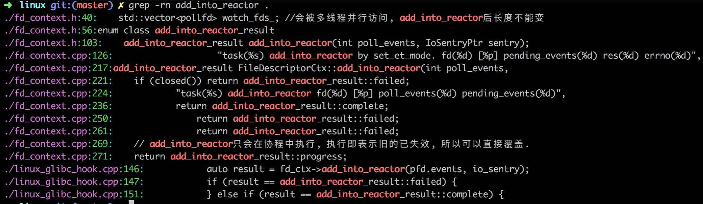

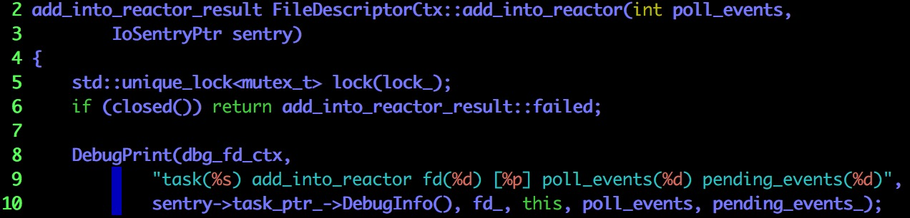

我们来到了FileDescriptor::add_into_reactor成员函数

从类的名字上也不难看出一个文件描述符对应一个该类的对象，所以该类会保留与文件描述符有关的状态

上面一段代码就是对文件描述符对应的文件未打开的处理

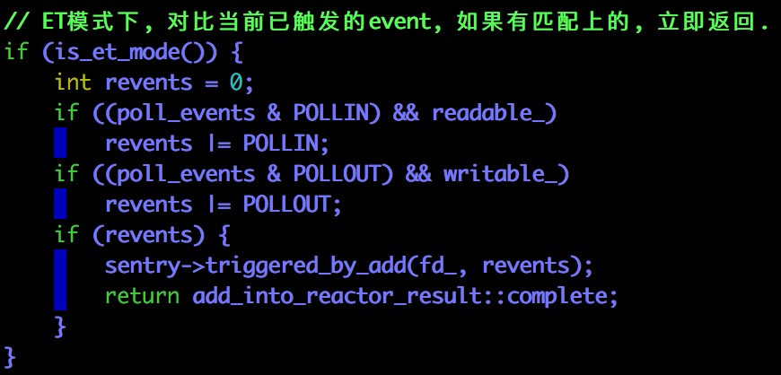

如果用户要求读文件且文件当前可读（或者要求写文件且当前文件可写），则直接返回

并且在返回之前向io-sentry登记有关的事件

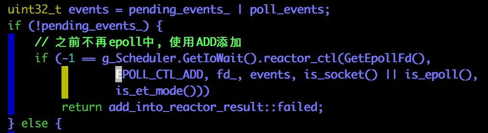

在这里，我们终于看到了对IO事件的全局管理器

如果文件描述符不在epoll之中，则把它添加进去（注意此处是不阻塞的）

当然如果添加失败，要返回failed

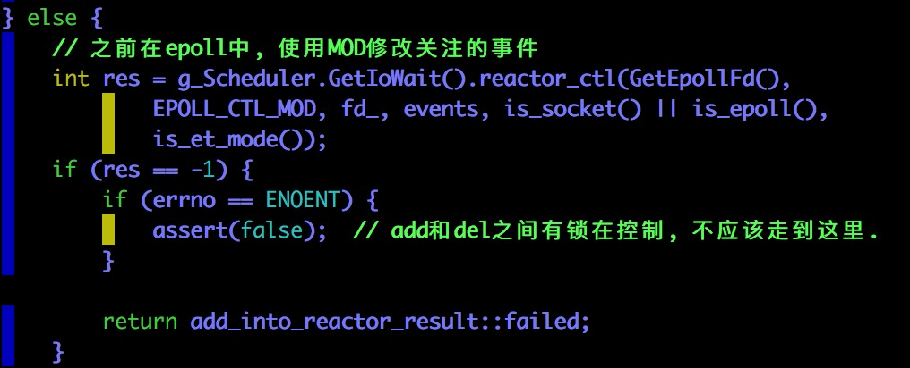

如果文件描述符在epoll之中，则修改需要等地的事件

同样，如果失败，要返回failed

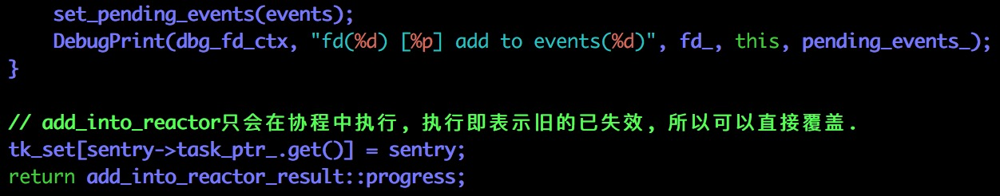

一些比较平凡的处理（比如返回progress）

add_into_reactor告诉我们什么呢？

+ 对于IO，libgo也建立了全局的管理器或者处理器
+ add_into_reactor负责把IO事件提交给epoll，不会阻塞当前线程
+ 很有可能全局的管理器负责唤醒对应的协程
+ io-sentry很可能负责IO相关事件的收集与记录

## libgo_poll ##


libgo_poll比原生的poll多一个参数：nonblocking_check（接下来我们会看到这个参数怎么用）

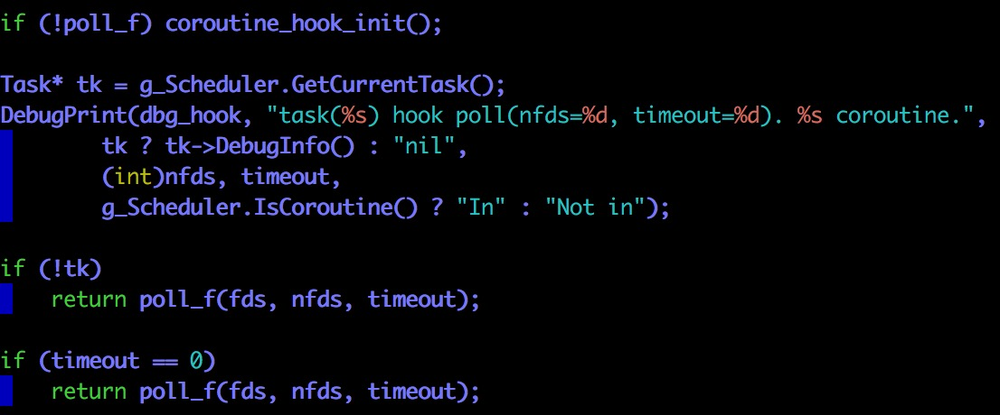

这里都是对特殊情况的处理（比如说不在协程中调用系统调用），没有值得关注的地方

除了timeout == 0的处理，直接调用poll_f

但是此次调用poll_f并不会导致线程阻塞，因为timeout == 0；外面的协程这样调用poll也不过是为了检查一下文件描述符是否合法（或者是为了撞大运？），所以直接把结果给它就好

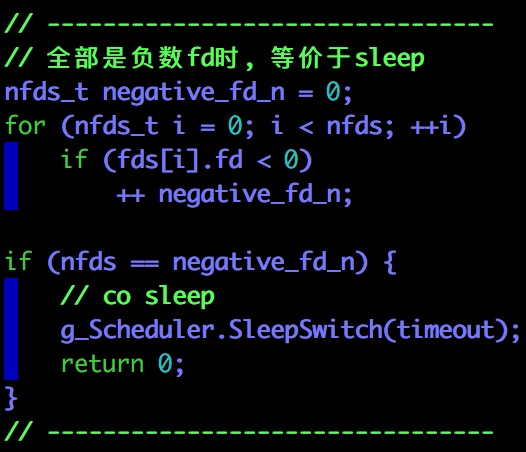

还记得在man poll小节里面说过：如果文件描述符为负数，可以把revents设置为0然后返回

不过没有说是立即返回还是延时返回，所以在这里我们做了延时返回的处理（让发出调用的协程沉睡，给其它协程以执行的机会）

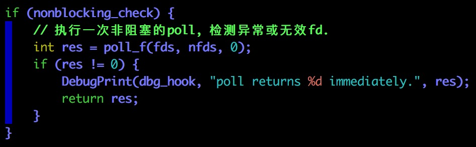

nonblocking_check参数在这里唯一一次用上了，告诉我们要不要对文件描述符的合法性进行检查

（会不会出现刚好有文件准备好读或者写的情况？如果有，怎么处理？）

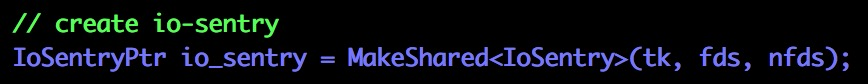

创建一个IO sentry，我对这个IO sentry需要做的事情存在两种猜测：

+ 记录有关事件 + 接受epoll发出的事件并唤醒当前协程
+ 只记录有关事件，接受epoll发出的事件并唤醒当前协程由调度器来做

我现在更加倾向于第二种猜测

io_sentry含有fds的信息（下面的代码会从io_sentry中提取相关信息）

在这个时候，可以把io_sentry看成是为记录信息而做的抽象层

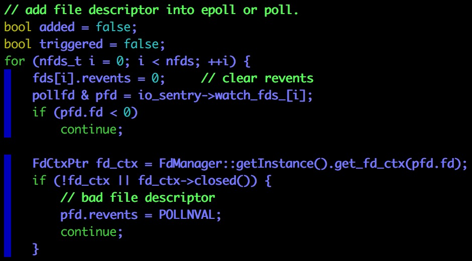

处理文件描述符为-1和对应文件已经关闭的情况

注意返回POLLNVAL是符合man poll的规范的

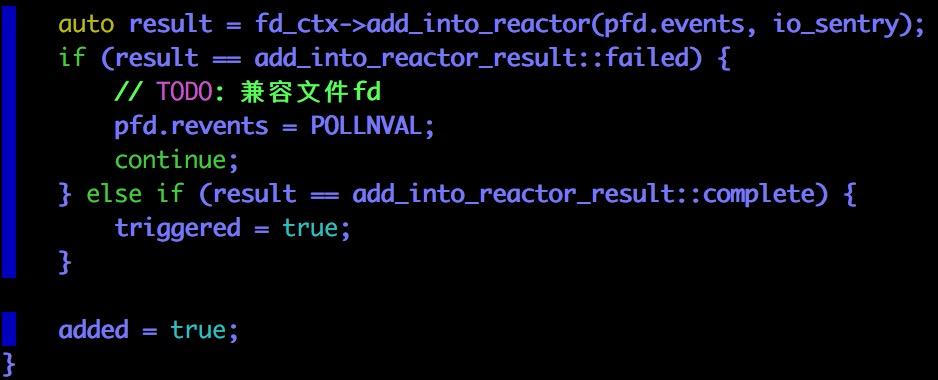

通过调用add_into_reactor成员函数把文件描述符及相应事件添加到epoll中

整个过程是不阻塞的（参考我们对add_into_reactor的解析）

`triggered`表达是否至少有一个文件描述符对应的文件已经准备好

`added`表达是否至少有一个文件描述符添加到epoll中

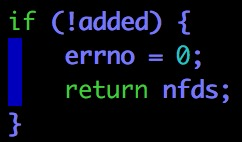

所有的添加操作都失败了，直接返回吧（失败原因写在各自的revents中）


如果没有任何一个文件已经准备好，则挂起整个协程

超过等待时间后，g_Scheduler会唤醒该协程

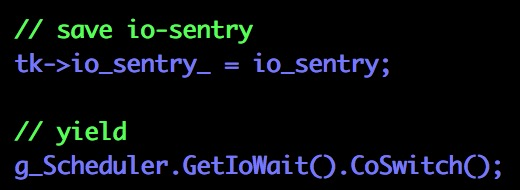

设置好定时器之后（设置定时器对于线程／协程来说都是非阻塞的），切换协程

有一个非常重要的点要提一下（在代码里看不出来）：

+ 当前协程除了因为时间到达而被唤醒，也会被epoll发出的事件而唤醒
+ 只不过被epoll唤醒会比较曲折，很有可能要通过全局的IO管理器或者调度器

注意，至此为止，协程已经被挂起，下面的代码都是协程被唤醒之后执行的

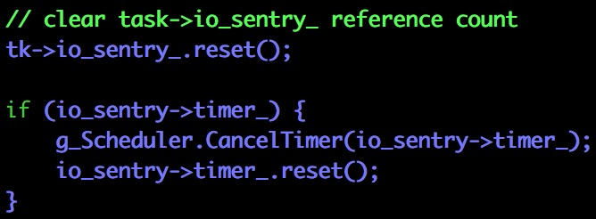

既然协程已经被唤醒，就要清除掉一些引用计数（io_sentry／timer）

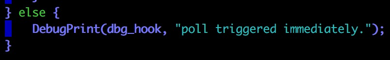

如果triggered == true，那说明：巧了！调用poll的时候刚好有文件已经准备好，可以直接返回

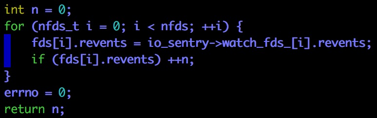

返回之前干两件事情：

+ 设置每一个revents
+ 告诉调用者：此次返回有多少个文件已经准备好，可以用了

## poll ##

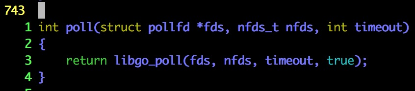

因为libgo_poll是非阻塞的，所以poll也是非阻塞的

## connect ##

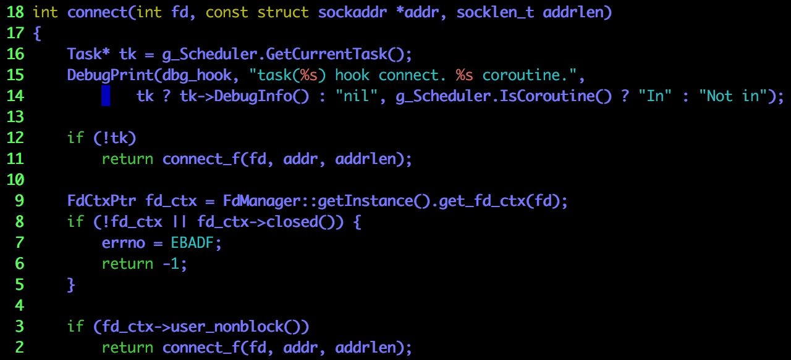

一些特殊情况的处理


connect_f是非阻塞的，所以不会导致线程沉睡，也不会导致协程切换

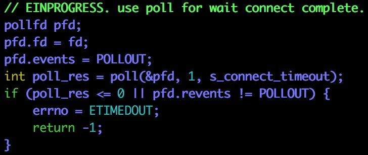

`s_connect_timeout`好像是一个全局的const变量（好像是-1）

`poll`要么立即返回，要么导致协程切换（不会阻塞线程）

到这里，我们终于看懂了`connect`（噢耶😯✌️）（玄机在其它地方，怪不得第一次看的时候没头没脑）

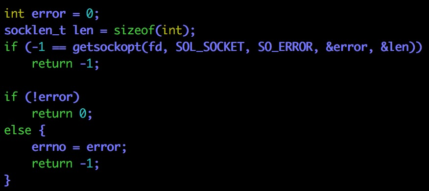

做一些平凡的处理（不分析了，也不是本文关心的重点）


这篇文章结束后，我们还要干什么：

+ 看sleep／IO的全局管理器（着重看看epoll什么时候会唤醒协程）
+ io-sentry
+ 看看GetCurrentTask是怎么做的
+ 调度器是每个线程一个还是所有线程共享一个