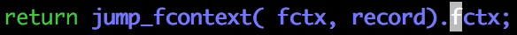

# 第一步：找到入口点 #


/usr/local/include/boost/context/continuation_fcontext.hpp:335


std::forward对应着完美转发：保留左值或者右值的属性

When used according to the following recipe in a function template, forwards the argument to another function with the value category it had when passed to the calling function.

我们发现它调用了另外一个重载的callcc函数：


意外发现一个事情：在构造出continuation之后，会调用一次resume方法

符合我们在之前的实验结果

接下来我们要关注两件事：

+ continuation的构造函数
+ detail::create_context1

# 第二步：detail::create_context1 #


看到了我们熟悉的老朋友，我们需要复习之前的知识：[boost.context](http://www.boost.org/doc/libs/1_65_1/libs/context/doc/html/context/ecv2.html)

Allocating control structures on top of the stack requires to allocated the *stack_context* and create the control structure with placement new before *execution_context* is created.

```c++
// stack-allocator used for (de-)allocating stack
fixedsize_stack salloc(4048);
// allocate stack space
stack_context sctx(salloc.allocate());
// reserve space for control structure on top of the stack
void * sp=static_cast<char*>(sctx.sp)-sizeof(my_control_structure);
std::size_t size=sctx.size-sizeof(my_control_structure);
// placement new creates control structure on reserved space
my_control_structure * cs=new(sp)my_control_structure(sp,size,sctx,salloc);
...
// destructing the control structure
cs->~my_control_structure();
...
struct my_control_structure  {
    // captured context
    execution_context cctx;

    template< typename StackAllocator >
    my_control_structure(void * sp,std::size_t size,stack_context sctx,StackAllocator salloc) :
        // create captured context
        cctx(std::allocator_arg,preallocated(sp,size,sctx),salloc,entry_func) {
    }
    ...
};
```


create_contex1申请的内存被这样分配：

1. 一个可能的因为对齐而留下的空白（0～7bits）
2. 一个固定的留白（64bytes）
3. Record
4. fctx

我们还可以知道以下事实：

+ 控制结构（record）知道：分配的空间（sctx）／分配器（salloc）／需要执行的函数
+ make_fcontext用于创建fcontext

接下来我们需要关心：

+ Record类，尤其是它的构造函数和重载的new操作符
+ make_fcontext函数

# 第三步：make_fcontext #


很明显：同jump_fcontext函数一样，这个函数也找不到实现

我们去boost_test.s文件找找看：


lea指令是取地址指令，可以当作减法指令来用

当运行到某一行代码的时候，$pc（也就是rip寄存器）是已知的，即当前代码的首地址

所以：`rcx = rip - 0x5`的值是可以在编译期计算出来的，在这里是finish函数的首地址


如上图所示（可能看起来脖子会难受），make_fcontex函数负责：

+ 申请一块栈空间（在fctx的基础上）
+ 用两个地址填充16字节
+ 留下48字节的空白

我们需要强调一下：make_fcontext申请的栈不是它自己利用的栈（我们在这里并不关心make_fcontext自身所在的栈）

还有一点小猜测，我们看到make_fcontext在申请的栈空间内留有48个字节，一共可以填充6个寄存器：


巧了，jump_fcontext也只保存6个寄存器

这是不是有什么关联呢？（嘻嘻嘻）

make_fcontext的返回值是申请的栈的栈顶指针

# 第四步：make_fcontext之后 #


在调用make_fcontext函数之后，立马调用jump_fcontext函数


rdi寄存器保存第一个参数，也就是fctx

切换栈帧并恢复寄存器，但问题是我们之前没有把这些寄存器压栈啊（回想一下make_fcontex函数）

暂且认为`salloc.allocate()`把整个分配的空间都设为0，那么这六个寄存器对应的48个字节也是0（因为到现在为止，lambda函数还没有运行，所以它对应的环境的寄存器是0也可以接受）


r8寄存器指向make_fcontext函数的fn参数，在这里就是&context_entry\<Record\>

控制流跳到context_entry函数：

+ 第一个参数是rdi，也就是切换栈帧之前的栈顶指针（jump_fcontext前半部分的栈顶指针）
+ 第二个参数是rsi，也是jump_fcontex函数的第二个参数（record）
+ 第三个参数是rdx，也就是jump_fcontex函数的第二个参数（record）

（record是指向控制结构的指针）

# 第五步：context_entry #


嗯……context_entry函数看起来只接受一个参数……

我们需要看看transfer_t是一个什么东西：


好像在哪里见过这个小家伙::raised_hand_with_fingers_splayed:

显然，一个16字节的对象是不可能只通过一个寄存器直接传递的（要么传递指针，要么分为两个寄存器）

所以我想看看对应的汇编代码（context_entry\<detail::record\<continuation, StackAlloc, Fn\>\>）：

+ 不知道mangle之后函数名变成什么样子
+ 随便找一个context_entry函数，太长了啊朋友（朋友，我怎么看啊……）

所以我们将会接受一个看起来非常合理的推测：

+ transfer_t.data是通过寄存器rsi／rdx进行传递的
+ transfer_t.fctx是通过寄存器rdi进行传递的

寄存器rdi保留了一个栈顶指针，问题是：这个栈顶指针指向谁的栈呢？

有这么一个时刻：create_context函数调用jump_fcontext函数，jump_fcontext把6个寄存器压入栈帧但没有切换栈帧（如下图）


寄存器rdi保存的栈顶指针就是指向此时的栈顶

所以jump_fcontext(t.fctx, nullptr)会：

+ 保存当前的环境到当前的栈中（请问当前栈是谁的栈？context_entry）
+ 切换到寄存器rdi指向的栈（create_context -> jump_fcontext前半部分）
+ 弹出6个寄存器 + 弹出返回地址
+ 跳转到返回地址（也就是create_context函数）

那么，执行完jump_fcontext(t.fctx, nullptr)之后：

+ 栈是create_context的栈（jump_fcontext前半部分的栈已经被清空了）
+ 控制流转移到create_context函数

所以，注释是：// jump back to `create_context()`

因为控制流转移到`create_context()`，我们也回到`create_context()`（跟着控制流走）

可以猜测：`resume()`函数的调用会让控制流再次回到`context_entry()`

# 第六步：从context_entry到create_context #



实际上，我们知道jump_fcontext并不是通过ret指令来返回的（人工恢复栈 + 跳转指令）

并且，这里实际上是context_entry函数执行到一半就“返回”的，我们很难推断出返回值（也就是rax寄存器）是多少

只能去看汇编代码了（哎）：

+ 前面说过我们不想静态地看boost_test.s文件
+ 那不就只能动态跟踪？

（我的内心是抗拒的）

再找找办法？


返回值是谁？rsp寄存器的值

rsp寄存器的值是什么？栈顶指针

谁的栈顶指针？谁调用jump_fcontext函数就是谁的栈顶指针

谁调用jump_fcontext函数？context_entry函数

所以返回值是：一个栈顶指针，指向context_entry -> jump_fcontext前半部分的栈顶

更准确来说：

+ 存在这么一个时刻：context_entry函数调用jump_fcontext函数，jump_fcontext把6个寄存器入栈，但还没有进行栈切换
+ 返回值就是这个时刻的栈顶指针

所以：create_context1函数的返回值是，context_entry -> jump_fcontext前半部分的栈顶指针

# 第七步：create_context1返回之后呢？ #


1. 调用构造函数
2. 调用resume函数


构造函数本身非常trivial


在libgo系列前面的文章中，我们分析过resume函数，在这里只是简单地展示一下

这个函数的作用也不过是调用我们非常熟悉的jump_fcontext函数

这次jump_fcontext将会把控制流转移到什么地方呢？取决于栈顶指针指向哪里

栈顶指针（fctx\_）指向哪里呢？fctx\_等于create\_context1的返回值

create\_context1的返回值是什么呢？context_entry -> jump_fcontext前半部分的栈顶指针

所以jump_fcontext函数会把控制流转移到什么地方呢？context_entry函数

jump_fcontext函数会把控制流转移到context_entry函数的什么地方呢？我们上一次离开的地方


也就是从`jump_fcontext()`这句话之后开始执行

我们需要留意一下`jump_fcontext()`函数的返回值，也就是变量`t`的值

（好了，该去吃晚饭了）