# 第一步：写一个合适的例子 #

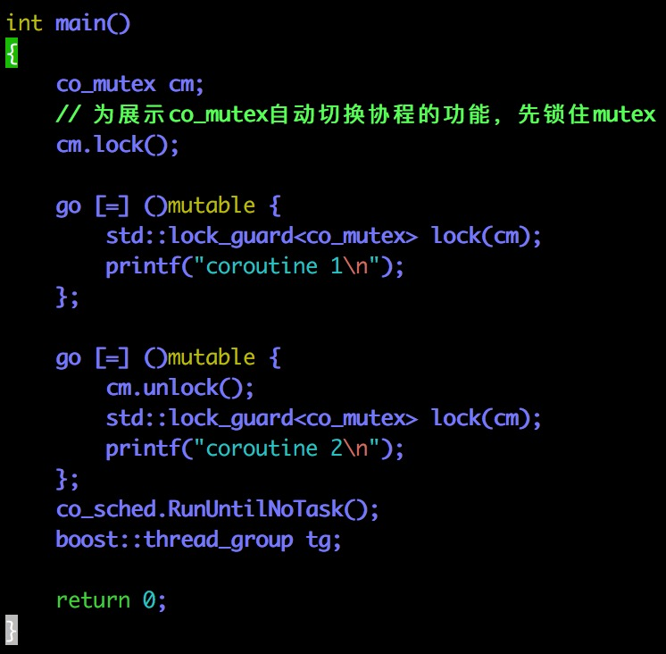

（我们可以省去用gdb跟踪的阶段，很容易找到锁的入口点）

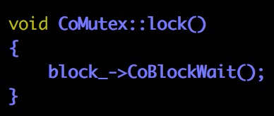

# 第二步：spinlock #

## LIBGO_SINGLE_THREAD ##

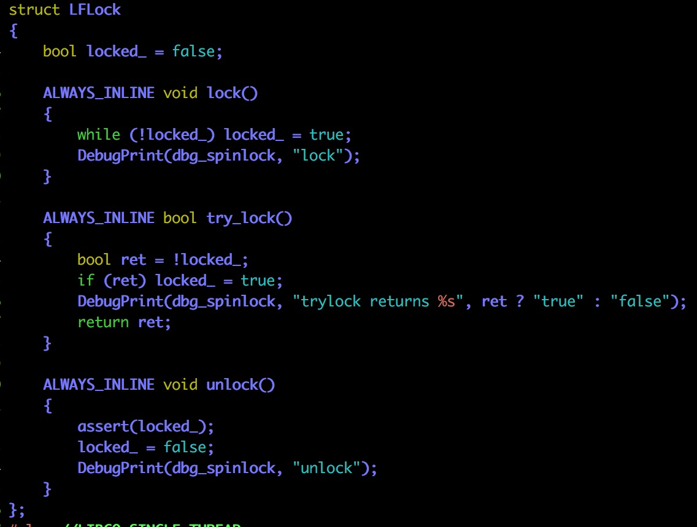

单线程要什么自旋锁（要什么自行车🚲哈？）

你会发现无论locked_是什么，调用lock()函数都会把它变成ture并直接返回（根本没有等待的过程）

+ `locked_ == true`：进不去循环，直接返回
+ `locked_ == false`：循环一次，同上面情况，直接返回

或许只是一个接口而已

不懂不懂？！（看完其它代码再来看吧）

## else ##

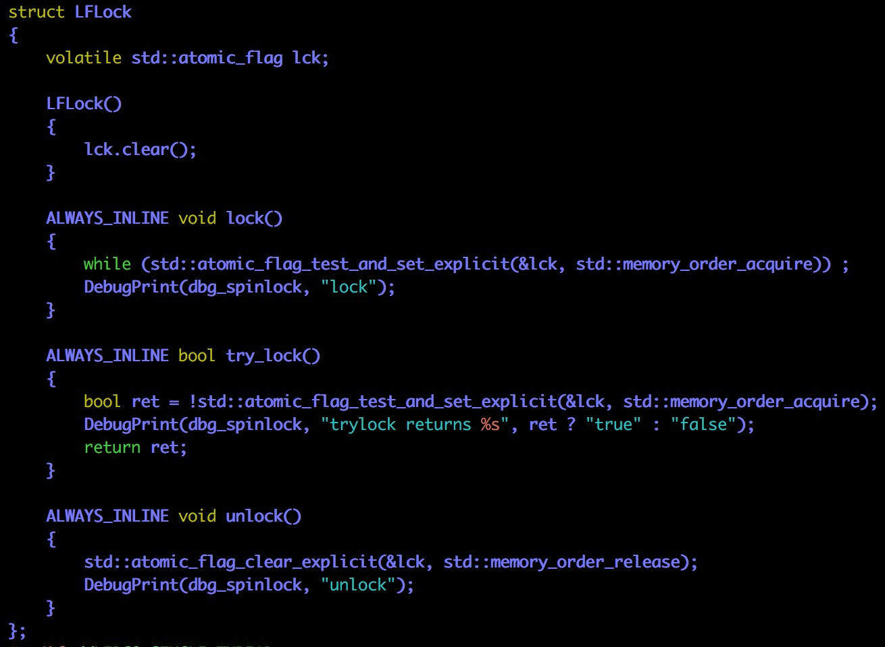

给多线程准备的自旋锁

`volatile`防止编译器把这条指令优化掉，并且要求每次直接读值

`lck.clear()` atomically sets flag to false

`lck.test_and_set()` atomically sets the flag to true and obtains its previous value.

利用flag做自旋锁让我想起《操作系统》描述过的一种锁：测试并反转

## 什么是spinlock ##

When you use regular locks (mutexes, critical sections etc), operating system puts your thread in the WAIT state and preempts it by scheduling other threads on the same core. This has a performance penalty if the wait time is really short, because your thread now has to wait for a preemption to receive CPU time again.

Besides, kernel objects are not available in every state of the kernel, such as in an interrupt handler or when paging is not available etc.

Spinlocks don't cause preemption but wait in a loop ("spin") till the other core releases the lock. This prevents the thread from losing its quantum and continue as soon as the lock gets released. The simple mechanism of spinlocks allow a kernel to utilize it in almost any state.

That's why on a single core machine a spinlock is simply a "disable interrupts" or "raise IRQL" which prevents thread scheduling completely.

Spinlocks ultimately allow kernels to avoid "Big Kernel Lock"s (a lock acquired when core enters kernel and released at the exit) and have granular locking over kernel primitives, causing better multi-processing on multi-core machines thus better performance.

EDIT: A question came up: "Does that mean I should use spinlocks wherever possible?" and I'll try to answer it:

As I mentioned Spinlocks are only useful in places where anticipated waiting time is shorter than a quantum (read: milliseconds) and preemption doesn't make much sense (e.g. kernel objects aren't available).

If waiting time is unknown, or if you're in user mode Spinlocks aren't efficient. You consume 100% CPU time on the waiting core while checking if a spinlock is available. You prevent other threads from running on that core till your quantum expires. This scenario is only feasible for short bursts at kernel level and unlikely an option for a user-mode application.

[[What exactly are “spin-locks”?](https://stackoverflow.com/questions/1957398/what-exactly-are-spin-locks)](https://stackoverflow.com/questions/1957398/what-exactly-are-spin-locks)

# 第三步：BlockObject #

## CoBlockWait ##

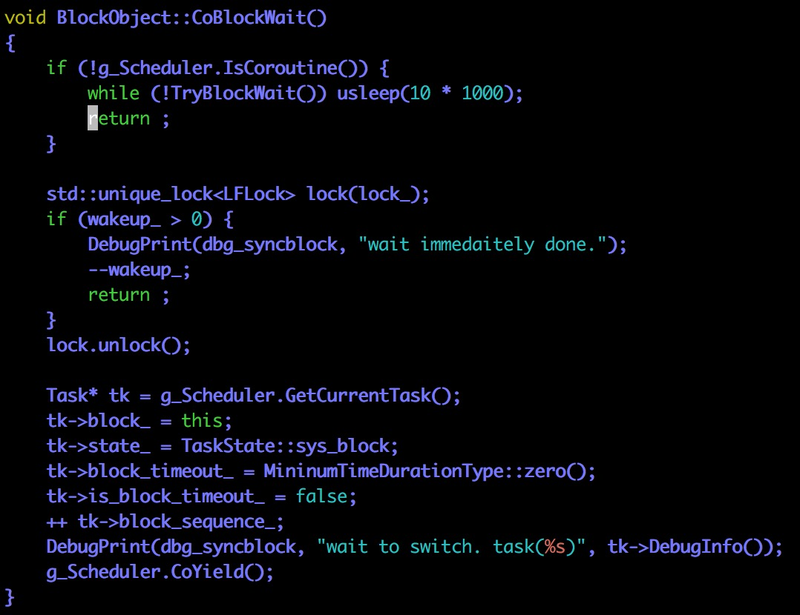

+ 如果不是在协程内调用该函数，会导致不断地沉睡 + 轮询（使用不当可能导致整个线程死锁，待会我们会演示这个事情）
+ unique_lock是一个进阶版本的lock_guard，除了保证离开作用域的时候必定释放锁，也可以在其它地方释放锁（更加灵活，相比unique_lock也会想办法避免多次释放锁）
+ wakeup_代表了现在可使用的资源数
+ 如果在协程内调用该函数且刚好没有资源，会导致协程状态的改变并通过调用CoYield把控制权返回给主协程／调度协程
+ 有意思的是两个字段：blobk_timeout\_／block\_sequence\_

## CoBlockWaitTimed ##

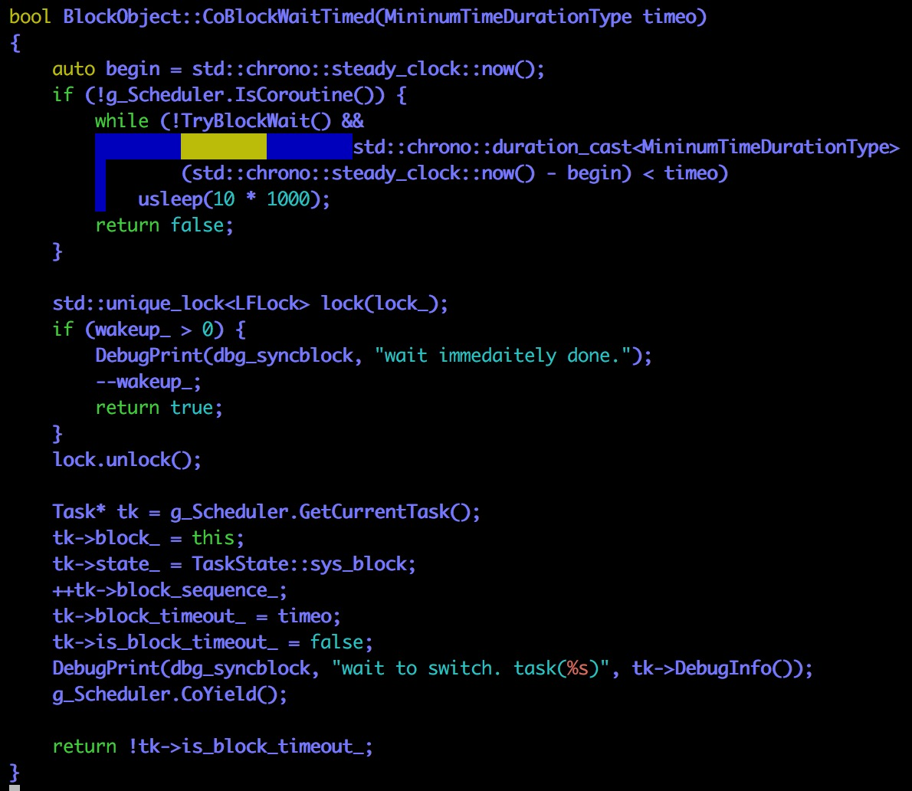

这个函数与CoBlockWait是差不多的，除了这几个地方：

+ 不在协程中调用CoBlockWaitTimed函数，如果没有资源，设定了等待上限（timeo）
+ block_timeout_设定为timeo
+ 这个函数具备返回值：告诉调用者，我是因为拿到资源所以醒过来还是因为时间到了醒过来

注意`return tk->is_block_timeout_`：这句话告诉我们`is_blobk_timeout`字段是用来干嘛的

## TryBlockWait ##

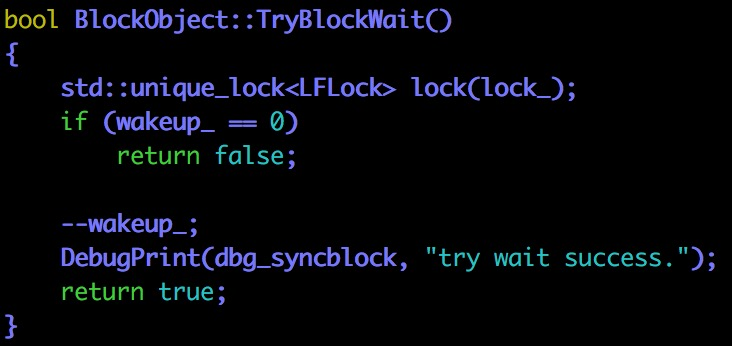

这个函数就比较简单了（::airplane:)

不过提示了我们很重要的一个信息：wakeup_ >= 0

永远不会出现wakeup\_小于0的情况（没有资源则直接挂起该协程而不是对wakeup\_做自减操作）

## Wakeup ##

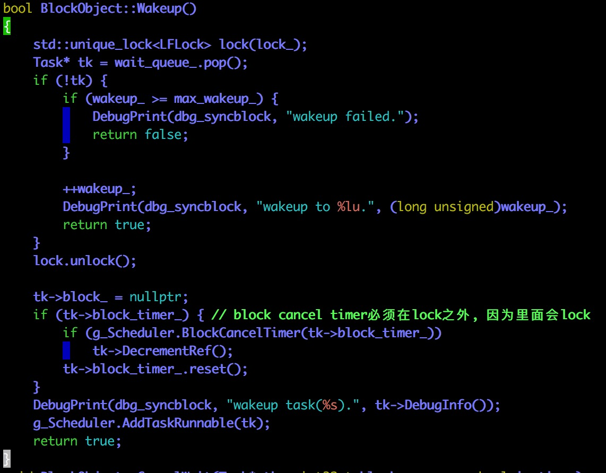

从等待队列（wait_queue_）中取出一个任务，不过我们没有看到什么地方把任务／协程放到这个队列中去啊？

估计又是在`Scheduler::Run`函数中对协程状态进行检测，如果是`sys_block`，则放倒队列中去

接着，把任务／协程的一些字段清空（比如说`block_`）

如果`block_timer_`不为空，还要把定时器关闭

最后，对于引用计数做一些额外的工作（方便内存释放）

最后的最后（😜），把协程／任务加到可运行列表中去

注意：Wakeup函数中没有切换环境的语句（比如说`CoYield()`），所以释放锁不会导致协程切换

## CancelWait ##

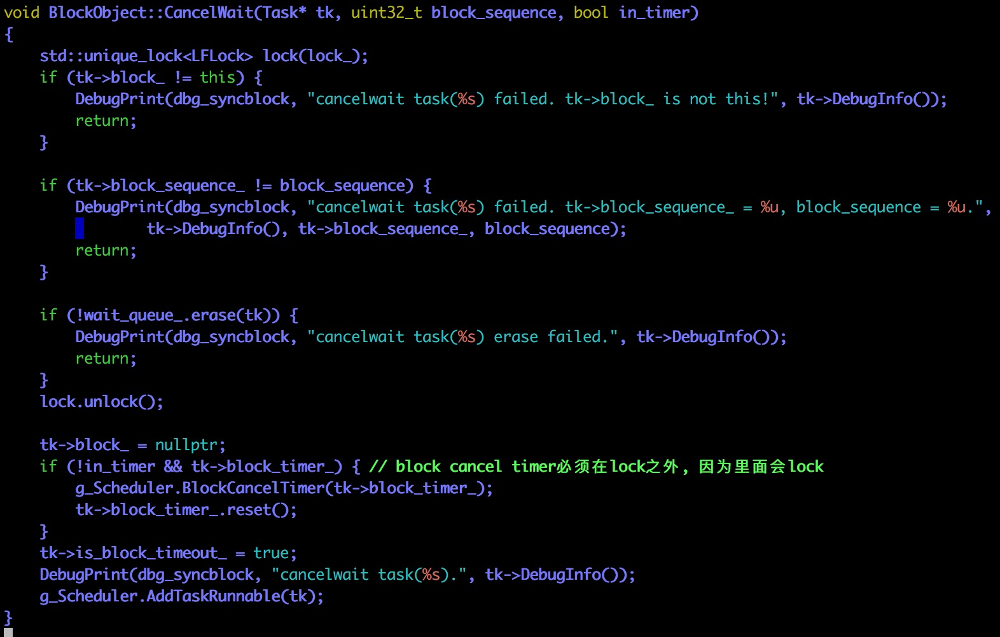

Wakeup -> 锁释放

CancelWait -> 非锁释放（比如定时器释放／其它协程强制释放）

基本和Wakeup的实现一样，除了多一些校验

## IsWakeup ##

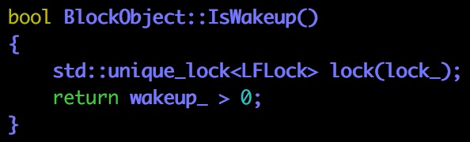

## AddWaitTask ##

这个函数估计是留给Scheduler调用的，也就是`Scheduler::Run`函数

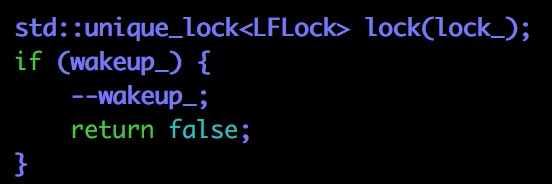

前面我们说过，wakeup_ >= 0

所以不可能出现wakeup\_小于0的情况（所以可以使用`if (wakeup_)`这样的判断语句）

我们刚刚是不是还说没有人负责把任务／协程放入wait_queue_来着？

谁调用AddWaitTask就是谁负责把任务／协程放倒队列（wait_queue_）中去

我觉得是`Scheduler::Run`

# 第四步：co_mutex #

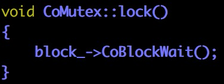

我们已经知道：如果是协程调用锁且没有资源的话，BlockObject会设置协程状态并切换到调度协程

所以完美地做到了不堵塞线程（这里很容易理解，核心都在BlockObject里）

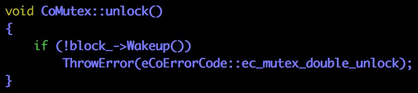

这也比较简单，无非就是把其中一个等待的任务放到可运行队列中去

# 第五步：谁在调用AddWaitTask #

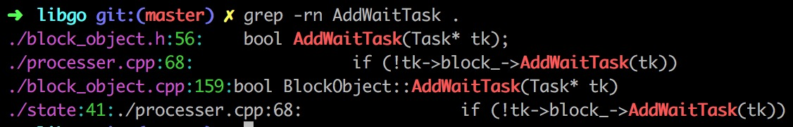

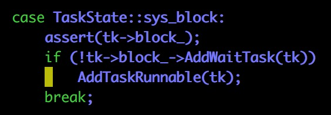

第一个调用者是`Processer::Run`

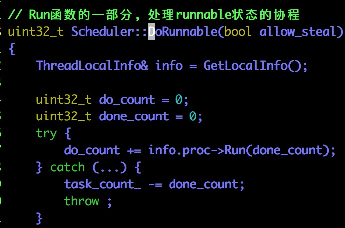

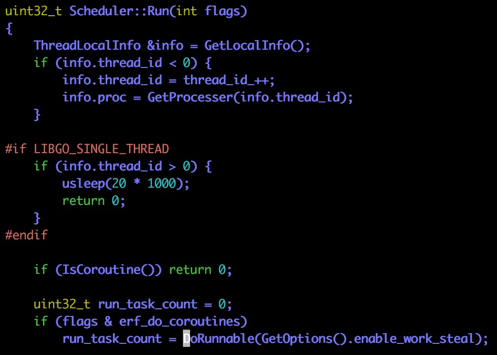

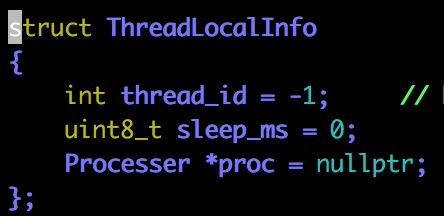

第二个调用者是`Scheduler::DoRunnable`

第三个调用者是`Scheduler::Run`

（和我猜的一样！😯✌️哦耶😯✌️）

和`sleep`／阻塞IO导致的协程挂起不一样，`mutex`不需要通过一个全局的管理器来节省计算资源：

+ `sleep`结束之后谁负责把协程唤醒：操作系统 -> 全局的管理器
+ `epoll`结束之后谁负责把协程唤醒：操作系统 -> 全局的管理器
+ `mutex`结束之后谁负责把协程唤醒：其它协程（也就是用户自己）

所以`mutex`不需要一个全局的管理器，在代码的处理方式上也和`sleep`／`epoll`不一样

流程：

+ 协程A调用`lock`
+ 协程A的状态被修改，控制流转移回主协程／调度协程
+ `Scheduler::Run`把被锁阻塞住的协程放到对应的等待队列中去
+ 协程B调用`unlock`，把协程A从等待队列转移到可运行队列中去
+ 下一轮Run，协程A即可执行

# 第六步：带有定时器的协程怎么用 #

最关心的问题：定时器附加的回调函数是什么？

`CoBlockWaitTimed` vs `CancelWait`

在对`AddWaitTask`的分析上，我们漏过了一段很重要的代码：

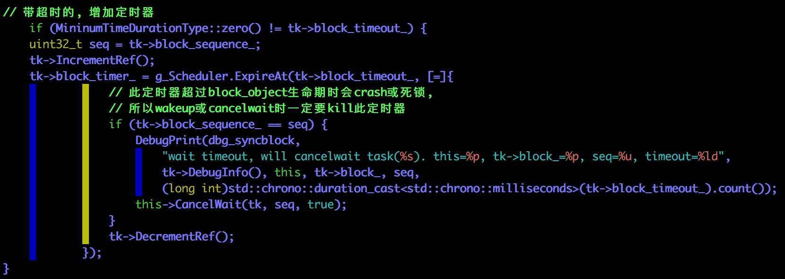

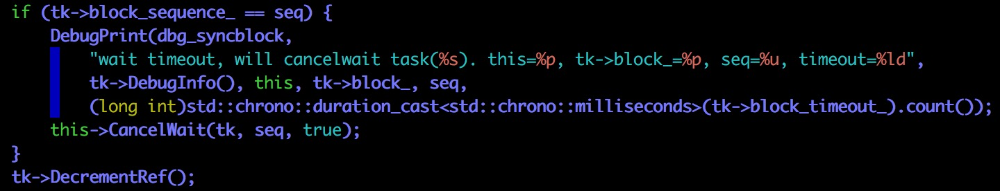

所以回调函数也简单的可怕：

+ 调用`CancelWait`函数
+ 减少引用计数

使用带定时器的锁也没有什么特别的，只不过它会返回一个值告诉你：到底是因为拿到资源而醒来还是定时器到时而醒来？

其它的东西都被`BlockObject`承包了