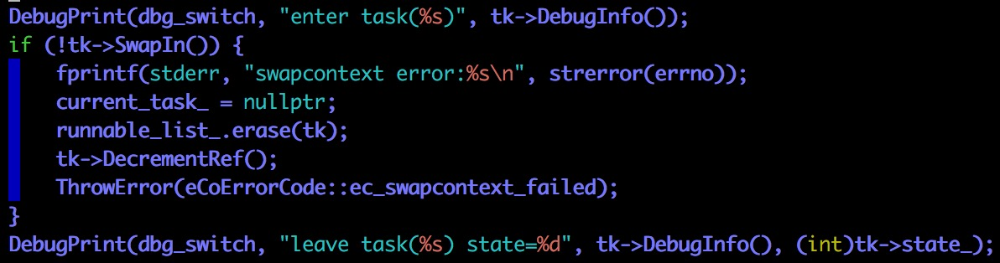
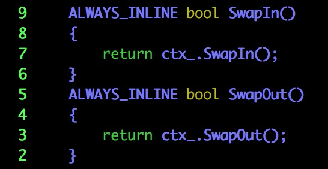
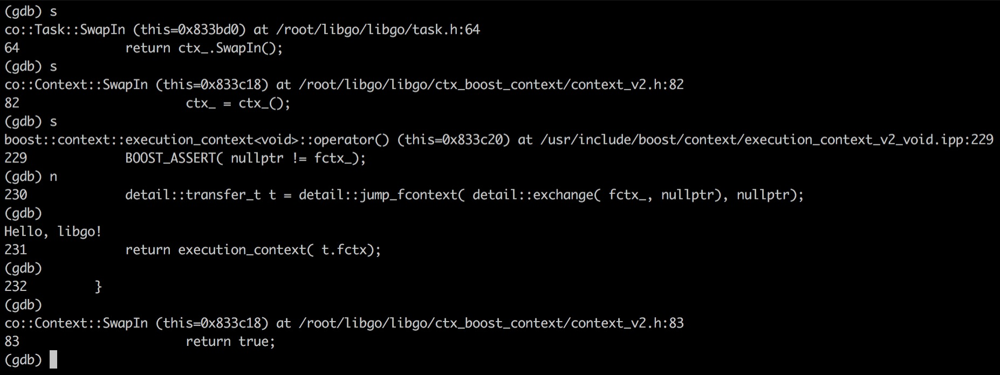
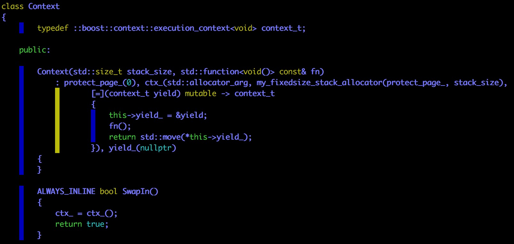
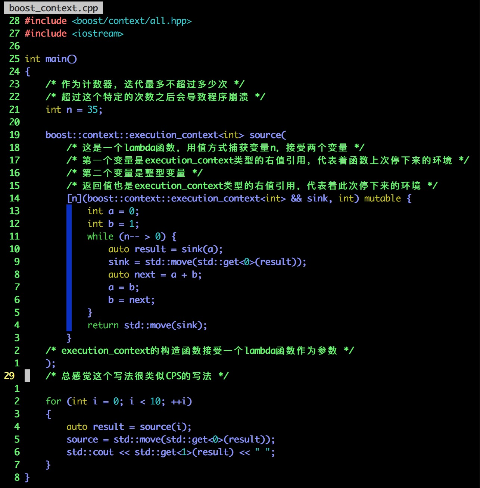
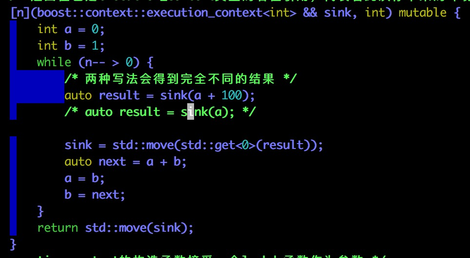
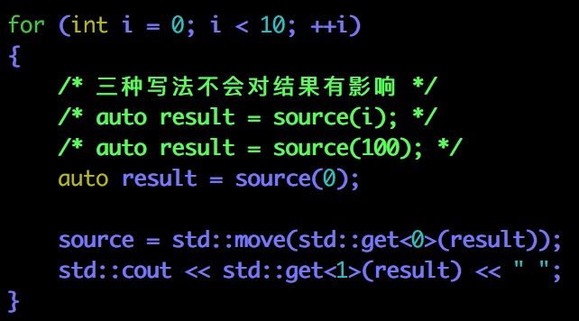
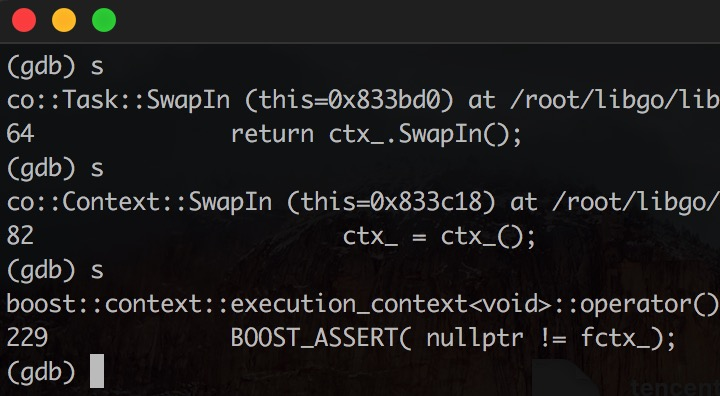
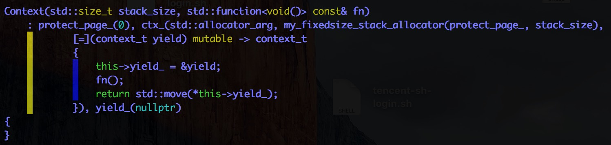
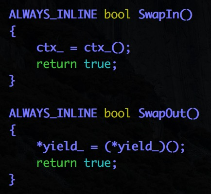

本文会接着Trace A Simple libgo App，解读有关线程切换的代码

# 第一步 #

processer.cpp



tk->SwapIn()是我们跟踪的重点

我们之前判断，这个函数调用不仅仅切换了环境，还把协程运行起来了

# 第二步 #

task.h



也仅仅是另一个调用


# 第三步 #

但是在context.h中我们搜索不到SwapIn函数，只好用gdb来找一下：

```shell
gdb a.out
b libgo/libgo/task.h:64
start
c
shell clear
```



所以我们要找的函数在ctx_boost_context/context_v2.h里



然后我们就发现：哎呀妈呀，我还不会用boost/context/all.hpp呢！

## 简单使用boost-context ##

### 简介 ###

> **Boost.Context **is a foundational library that provides a sort of cooperative multitasking on a single thread. By providing an abstraction of the current execution state in the current thread, including the stack (with local variables) and stack pointer, all registers and CPU flags, and the instruction pointer, afcontext_t instance represents a specific point in the application's execution path. This is useful for building higher-level abstractions, like coroutines,cooperative threads (userland threads) or an aquivalent to [C# keyword yield ](http://msdn.microsoft.com/en-us/library/9k7k7cf0%28v=vs.80%29.aspx)in C++.

如果想深究协程的实现，Boost.Context也是必须研读的（不过眼下还是只关心怎么用的好）

Boost.Context会帮我们保存栈／寄存器（当然也包括栈顶栈底寄存器）／代码执行到何处的指针

afcontext_t instance是一个什么鬼？程序的执行路径？

> *execution_context* provides the means to suspend the current execution path and to transfer execution control, thereby permitting another context to run on the current thread. This state full transfer mechanism enables a context to suspend execution from within nested functions and, later, to resume from where it was suspended. While the execution path represented by a *execution_context* only runs on a single thread, it can be migrated to another thread at any given time.

执行环境的保存为stackfule coroutine的实现提供了非常重要的基础！

> A context switch between threads requires system calls (involving the OS kernel), which can cost more than thousand CPU cycles on x86 CPUs. By contrast, transferring control among them requires only few CPU cycles because it does not involve system calls as it is done within a single thread.

协程环境的切换当然消耗会比较小，整个都在用户态完成

### Class execution_context (version 2) ###

> Class *execution_context* encapsulates context switching and manages the associated context' stack (allocation/deallocation).

execution_context封装了context切换／context空间申请与归还的操作

> *execution_context* allocates the context stack (using its [*StackAllocator*](http://www.boost.org/doc/libs/1_62_0/libs/context/doc/html/context/stack.html#stack) argument) and creates a control structure on top of it. This structure is responsible for managing context' stack. The address of the control structure is stored in the first frame of context' stack (e.g. it can not directly accessed from within *execution_context*). In contrast to [*execution_context* (v1)](http://www.boost.org/doc/libs/1_62_0/libs/context/doc/html/context/ecv1.html#ecv1) the ownership of the control structure is not shared (no member variable to control structure in *execution_context*). *execution_context* keeps internally a state that is moved by a call of *execution_context::operator()* (`*this` will be invalidated), e.g. after a calling *execution_context::operator()*, `*this` can not be used for an additional context switch.

execution_context分配context堆（所以是用malloc／new向堆要内存？），然后在此的基础上创建一个控制结构（control structure是一个什么样的概念？和context有什么不同？）

控制结构（control structure）负责管理context堆

控制结构的地址存储在context堆的第一帧（frame）（frame是一个什么样的概念？），所以控制结构不能够从execution_context中直接访问（这岂不是类似于闭包的作用？）

在这一个版本中中，控制结构的所有权是不能共享的；比如说你通过成员函数把它移动出去之后，this就不再有效

> *execution_context* is only move-constructible and move-assignable.

移动语义？只移动语义？

> The moved state is assigned to a new instance of *execution_context*. This object becomes the first argument of the context-function, if the context was resumed the first time, or the first element in a tuple returned by *execution_context::operator()* that has been called in the resumed context. In contrast to [*execution_context* (v1)](http://www.boost.org/doc/libs/1_65_1/libs/context/doc/html/context/ecv1.html#ecv1), the context switch is faster because no global pointer etc. is involved.

> Segmented stacks are not supported by *execution_context* (v2).

> On return the context-function of the current context has to specify an *execution_context* to which the execution control is transferred after termination of the current context.

在控制流转移的时候必然需要指定execution_context，告诉程序需要转移到何处

> execution_context* expects a *context-function* with signature `execution_context(execution_context ctx, Args ... args)`. The parameter `ctx` represents the context from which this context was resumed (e.g. that has called *execution_context::operator()* on `*this`) and `args` are the data passed to *execution_context::operator()*. The return value represents the execution_context that has to be resumed, after termiantion of this context.

#### usage of execution_context ####



什么是CPS(Continuation-passing style)？

CPS是将控制流显式表示为continuation的一种编程风格，简单来理解就是显式使用函数表示函数返回的后续操作

```c++
// direct style
(lambda : add(x,y) = x + y)
output(add(1, 2))

// continuation-passing style
(lambda:add(x, y, cont) = cont(x + y))
add(1, 2, (lambda : v1 -> output(v1)))
```

这里的cont便是continuation function，接收一个参数表示被调用函数的返回值，函数表示的是被调用函数返回后所需要继续的操作；与direct style不同的是，函数执行后并不直接返回值，而是将值传入continuation function，由continuation function执行获得返回值后的操作

```c++
// direct style
(lambda : fib(n)=
	| n < 1 : 1
	| : fib(n-1) + fib(n-2)
)
output(fib(5))

// continuation-passing style
(lambda :
	fib(n, cont)=
		| n < 1: cont(1)
		| : fib(
			n - 1,
			(lambda : v0->
				fib(n - 2, (lambda : v1 -> cont(v0 + v1)))
			)
		)
)
fib(5, (lambda : v1 -> output(v1)))
```

再来看看原代码：





> This simple example demonstrates the basic usage of *execution_context* as a generator.

generator啊哈哈哈！！！（这就触及到我的知识盲区了，怎么感觉和python扯上了一丝关系）

> This simple example demonstrates the basic usage of *execution_context* as a generator. The context `sink` represents the *main*-context (function *main()* running). `sink` is generated by the framework (first element of lambda's parameter list). Because the state is invalidated (== changed) by each call of *execution_context::operator()*, the new state of the *execution_context*, returned by *execution_context::operator()*, needs to be assigned to `sink` after each call.

首先，我们要明确：

+ 上一段程序中存在两个context（sink／source）
+ lambda所利用的context是sink，与source没有发生任何的关系
+ lambda每次调用sink的重载过的()操作符函数，都会使得控制结构失效，所以需要为sink重新赋值

> The lambda that calculates the Fibonacci numbers is executed inside the context represented by `source`.

哪尼？？？（喵喵喵？？？）

> Calculated Fibonacci numbers are transferred between the two context' via expression *sink(a)* (and returned by *source()*). Note that this example represents a *generator* thus the value transferred into the lambda via *source()* is not used. Using *boost::optional<>* as transferred type, might also appropriate to express this fact.

> The locale variables `a`, `b` and `next` remain their values during each context switch (*yield(a)*). This is possible due `source` has its own stack and the stack is exchanged by each context switch.

这个例子真的很难理解啊！！！

（不行，我要去专门开一章学习boost.context）

——————**这是一条结束boost-context学习的分界线（去看How To Use Boost.Context?）**——————

# 第四步 #

先说说我对execution_context的理解（不保证完全准确）：

+ execution_context是一个可以更方便传递参数的continuation
+ 所以，execution_context是在continuation的基础上实现的

```shell
gdb a.out
b libgo/libgo/task.h:64
start
c
shell clear
```



看来ctx\_是一个execution_context类型的对象，ctx\_()就是在调用该对象的operator()成员函数

ctx\_ = ctx\_() 是为ctx\_()赋一个新的值，因为旧的ctx\_已经因为operator()的调用而失效

并且，我们还可以知道ctx\_()的类型是execution_context\<void\>，既不接受参数，也不向其它context传递参数

（话说，如果不需要向其它continuation传递参数的话，为什么不直接用continuation？）

boost.context帮我们恢复协程环境并且切换到对应的continutation（源代码就不要追下去了，另开一章分析boost.context的实现）（在这里只要知道调用ctx_()就会自动切换到对应的continuation就可以了）




所以yield是什么？？？

yield是调度协程（很可能就是main函数）的环境啊！！！同学们，这是一个多么重要的发现啊！！！

lambda函数做了几件事：

+ 用一个指针指向yield（为什么不使用移动语义把yield的所有权抢过来？）
+ 调用fn函数

我们还不知道一件很重要的事情：

+ 如果fn函数内部有一个阻塞式的操作，如何让fn把控制权交出来？
+ 也就是：fn内部在碰到阻塞式操作的时候怎么自动生成调用yield()？

同时也解答了我们的一个疑问，为什么要捕获yield的一个指针？

因为fn内部才能调用`*(this->yield_) = (*(this->yield_))()`啊！



以上两个函数也说明了this->yield_为什么需要存在