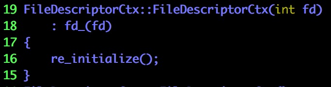

# 第一步：确定目标 #

从AnalyseBlockOperationHook开始，接着分析add_into_reactor函数


ET和LT两个术语其实不仅仅应用与epoll（甚至应用于很多其它领域），它们的含义是：

+ ET表达在状态变化时触发
+ LT表达在条件满足时（特定状态下）触发

比如：在 ET 下，当出现数据可读，那么会通知逻辑层一次，如果逻辑层这次通知时没有完全读取完数据，那么不会再得到底层通知；在LT 下，逻辑层会一直得到底层通知，直到文件描述符状态为不可读


这两个代码片段就是这篇文章要深究的对象，在这之前，我们需要：

+ 对g\_Scheduler有一个基本的了解
+ 对FileDescriptorCtx有一个基本的了解

# 第二步：FileDescriptorCtx #


`std::enable_shared_from_this` allows an object `t` that is currently managed by a [std::shared_ptr](http://en.cppreference.com/w/cpp/memory/shared_ptr) named `pt` to safely generate additional [std::shared_ptr](http://en.cppreference.com/w/cpp/memory/shared_ptr) instances `pt1, pt2, ...` that all share ownership of `t` with `pt`.

Publicly inheriting from `std::enable_shared_from_this<T>` provides the type `T` with a member function `shared_from_this`. If an object `t` of type `T` is managed by a [std::shared_ptr](http://en.cppreference.com/w/cpp/memory/shared_ptr)<T> named `pt`, then calling `T::shared_from_this` will return a new [std::shared_ptr](http://en.cppreference.com/w/cpp/memory/shared_ptr)<T> that shares ownership of `t` with `pt`.

> 我们之前见过make_share之类的用法，这个继承就是为使得共享该对象安全


姑且认为io-sentry只负责收集IO相关的事件（在这一小节结束之后我们会去看io-sentry）


explicit指定符指定构造函数或转换函数 (C++11 起)不允许隐式转换或复制初始化（更多请Google）


负责报告一些状态／关闭文件，没有特别值得注意的地方（可以关心一下实现）


等等：这个标志位我们好像在哪里见过？

linux_glibc_hook.cpp


如果这个标志位被设置成true，就会直接调用阻塞的connect函数

还有一些其它的状态报告函数，此处不再一一列举：

+ readable()
+ writable()
+ set_readable(bool b)
+ set_writable(bool b)
+ ……


## 初始化 ##

### 复习操作系统的文件管理 + stat + fstat ##

文件有逻辑结构和物理结构：

+ 从逻辑结构上划分：有结构文件／无结构文件
+ 从物理结构上划分：索引文件／顺序文件／直接文件／哈希文件／……

在Linux下，文件占用的磁盘盘块采用多级混合索引的方式进行分配


需要一个结构管理文件，方便用户对文件的搜索等操作：文件控制块（FCB）

包括文件占用了哪些磁盘块这样的信息都是放在FCB中的

文件控制块含有很多与控制无关的信息（比如说文件创建的事件，最后访问的事件），为了减少文件控制块占用的空间（这部分内容很有可能是要放到内存中的，甚至是需要快速查找的），linux将文件控制块一分为二，第一部分是文件名，第二部分是其他信息；其他信息被组织成定长的数据结构，称为索引节点，每个索引节点都有一个编号，称为索引号；文件目录的每一个表项是：文件名 + inode号


索引节点存放在外存中，对某个节点的访问会经常利用到它的索引节点（抢答：所以能做什么来提高效率？）

操作系统会在内存中开辟一张内存索引节点表：该表共有100个表项，每个表项就是一个索引节点，称为内存索引节点；需要使用文件信息时，先到内存索引节点表中去找，找不到再去磁盘中找


内存索引节点表又被称为活动索引节点表，内存索引节点又被称为活动索引节点

系统打开文件表／用户打开文件表（每个进程一张）

硬链接／软链接


`int fstat(int fd, struct stat *statbuf);`函数用于获取stat信息

### re_initialize ###


获取文件描述符相关的信息，进而判断是否是socket相关的文件描述符


如果是socket的话，把它设置成非阻塞的（以后对这个文件描述符的操作都是非阻塞的？）


一些字段的初始化

### is_initialize & FileDescriptorCtx(int fd) ###




## set_et_mode() ##


（pendind的中文意思是延迟）

把提交到epoll的延迟事件的选项改一下

## 关闭文件 ##


平凡的操作


关闭一个文件需要通知相关的协程：你们等待的IO事件出问题啦！别等了！

通知过程：

+ 从每一个任务中取出io-sentry
+ 从io-sentry取出它监视的文件的pfd
+ 把对应的pfd的revents设置为POLLNVAL
+ 切换到对应的协程


上把锁会更安全


fclose_f是系统调用

## reactor ##

### add_into_reactor ###


在AnalyseBlockOperationHook中分析过该函数，里面的两个调用会是本章的重点

有几个猜测，在下面的分析中会用到：

+ pending_events／poll_events／events不是计数器，而是标志位的组合
+ i\_tasks\_是等待输入事件的任务，o\_tasks\_是等待输出事件的任务，io_tasks_是等待输入输出的任务

### ChooseSet ###


ChooseSet函数完成的事情很简单，不过是从i\_tasks\_／o\_tasks\_／io\_tasks\_中选一个任务集出来

### trigger_task_list


+ 每一个任务／协程都有一个对应的io-sentry
+ 每一个io-sentry可能对应着不止一个文件

如果其中某一个文件的描述符等于当前FileDescriptorCtx对应的文件的描述符，则填充对应的revents

`!(events & (POLLIN | POLLOUT)) == true`意味着等待的不是输入输出事件，所以把对应的标志位屏蔽掉（也就是按位取反的由来），其它类似（不再赘述）

注意在这个地方，并没有调度对应的已有IO事件的协程

### reactor_trigger ###


很明显，这个函数是epoll告诉我们哪些文件描述符的什么IO事件好了的时候调用的

所做的处理也很简单，修改两个标志位


如果`poll_events & ~(POLLIN | POLLOUT)`为真，说明poll_events不仅仅有读写事件

除了读写事件，剩下的就是表征错误的事件了


总体来说，读写事件的处理和其它事件（可能包括读写事件，但不止读写事件）的处理没有太大的差别：

+ 调用trigger_task_list函数
+ 删除一些事件？

只不过是输出的调试信息不一样

### del_events ###


`new_pending_event == pending_events_ & ~poll_events`在计算：如果不监听传入的那些事件，还需要监听什么事件

如果`new_pending_event == pending_events_`为真，说明原来我们就没有监听`poll_events`的那些事件（那当然不需要特别处理，直接返回就好）

如果处在边缘触发（edge-triggered）模式，可以直接返回（当前没有检测到状态变化）？

接下来分别处理两种情况：删除一些事件之后仍然还有一些事件等待 + 没有任何事件等待，处理的套路都差不多


改变一下相应的字段

### del_from_reactor ###


如果文件关闭／对应的任务集里根本没有这个任务／现阶段不等待任何IO事件，都可以直接返回


如果任务集内不含其它事件，要继续往下走；否则可以直接返回

这样写有一点绕弯弯，所以我们写代码的时候要把条件和动作直接绑在一起

```c++
if (tk_set.empty())
{
    ...
}
else
{
    return;
}
```


很简单的判断：

+ 如果当前输入任务集为空，看看输入输出任务集是否为空，如果是的话，不妨不监听输入事件
+ 如果当前输出任务集为空，看看输入输出任务集是否为空，如果是的话，不妨不监听输出事件
+ 如果当前输入输出任务集为空，看看输入／输出任务集是否为空，如果是的话，不妨不监听输入／输出事件


### 总结 ###

对外暴露的应该是这三个函数（看看头文件谁是public属性 + 函数作用猜测）：

+ add_into_reactor
+ reactor_trigger
+ del_from_trigger

可以重点关注一下（比如说谁在使用它们）

## GetEpollFd ##


暂时不知道epoll_fd_字段是用来干嘛的，与普通的文件描述符有什么区别（先摆在这里吧，有需要了回来看）

# 第三步：IoSentry #


果然是一个任务／协程对应一个IoSentry，一个IoSentry对应多个等待的IO事件


唯一值得说的就是vector的便捷初始化（别看不懂`fds + ndfs`在干嘛就好～）


如果io-sentry被注销，需要把对应的任务／协程删掉

这段代码也展现了一个很有意思的设计：

+ io-sentry可以认为是以任务／协程为key，文件为value的multimap
+ FdManager可以认为是以文件为key，任务／协程为value的multimap？
+ 两者是相互协作的，方便从不同的角度查找？


else部分是在多线程情况下，不得不进行的原子操作

它做的事情和单线程情况下要做的事情是一样的，都是：

+ 看看之前的状态是不是pending，确定返回值
+ 确保`io_state_ == triggered`为真（如果不是就改）


这个地方也不过是把revents修改一下，没做什么切换协程的事（有一点奇怪，协程切换到底在什么地方做呢？）

# 第四步：FdManager #


有几点想说的：

+ 之前的猜测是错的，FdManager不是一个以文件为key，以任务／协程为value的multikey
+ FdManager是文件描述符管理器（管理者所有的文件描述符？）
+ 为什么既要有队列又要有map？
+ deque\_lock\_是为整个队列准备的锁，map\_lock\_是为整个map准备的锁

至于成员函数的实现，就不细看了（好的代码看起来就是爽，看成员函数名字就知道在干嘛）

# 第五步：g\_Scheduler #


## GetCurrentTask ##


有且只有thread_local关键字修饰的变量具有线程周期（thread duration），这些变量（或者说对象）在线程开始的时候被生成（allocated），在线程结束的时候被销毁（deallocated）；并且每一个线程都拥有一个独立的变量实例（Each thread has its own instance of the object）；thread_local可以和static与extern关键字联合使用，这将影响变量的链接属性（to adjust linkage）

所以info是每个线程唯一的变量（这就可以解释为什么Scheduler是单例类却可以维护多个线程的协程信息）


这是整个scheduler.cpp中唯一初始化info的地方

也就是说，info是在Run之后初始化的（是不是不Run就没有初始化的必要？节省资源？）

（Run函数在之前的文章里分析过？）

## ThreadLocalInfo & Processer ##


## GetIOWait ##


## IoWait::reactor_ctl ##


`is_support == is_socket() || is_epoll()`

`int epoll_ctl(int epfd, int op, int fd, struct epoll_event *event)`


`epfd`是`epoll instance`的代号，`fd`是文件的代号

一个`epoll instance`可以对应多个文件，所以一个`epfd`可以对应多个`fd`

`epoll_ctl`支持三种操作：增加／修改／删除


`reactor_ctl`只不过是对`epoll_ctl`的一个封装

注意IoWait的实例与epfd不是一一对应的关系（我猜的，因为调用`reactor_ctl`还需要指定`epfd`）

## IoWait::IOBlockTriggered ##


代码很容易懂

也不是直接切换到等到对应IO事件的任务／协程，而是把它们加到可运行列表

# 第六步：谁在调用IOBlockTriggered #


linux_glibc_hook.cpp


定时器结束后触发（之前已经分析过这段代码）

fd_context.cpp


关闭文件描述符的时候顺便触发一下IO事件（之前也已经分析过这段代码）

io_wait.cpp


`epoll_wait`是会导致当前线程阻塞的

所以这还是一个类似于轮询（只不过这个轮询会阻塞，不会使得CPU空转）的方式


最终，我们还是看到了：谁在“等待”（更准确的说法是阻塞式地轮询）epoll并调用IOBlockTriggered

那么，谁在调用这个函数呢？


scheduler.cpp


如果是我，我会怎么去设置wait_milliseconds呢？

+ 正常情况下设置为0（即不阻塞，不建议设置为一个很小的值，不然导致线程切换，消耗更大）
+ 如果所有的协程都至少沉睡x ms，则把wait_millseconds设置为x ms


至此为止，我们已经把：

+ 如何hook阻塞的系统调用
+ 如何监听epoll事件并唤醒协程

都弄明白了，对这部分有一个不错的认识

我们还需要做什么：

+ 重新阅读一下这个系列的文章，看看有没有什么错别字
+ 画一个运行时图和一个静态的模块图，总结这几篇文章