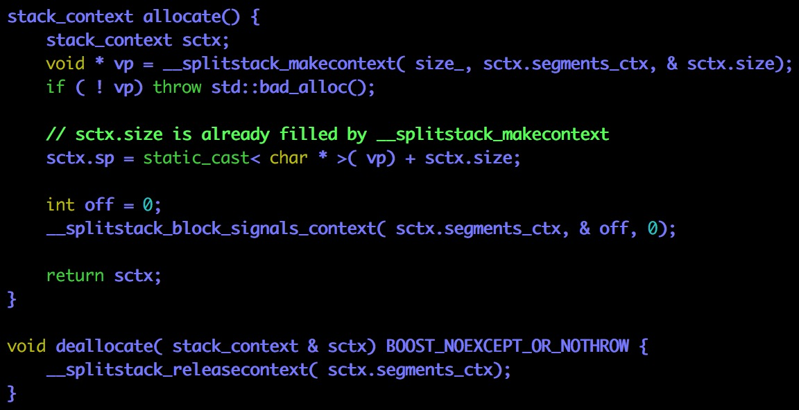

# fixedsize_stack #

分配器（Stack Allocation）有很多个，为什么关心这一个呢？

因为默认用的是这一个分配器

`fixedsize_stack()`

构造器提供了默认参数（推荐需要分配的内存的大小）

同我们之前预测的一致，sp指针指向更大的地址（遵循栈由高地址向低地址增长的约定）

内存去配（记住堆内存分配／去配的规则和栈约定刚好相反，指针指向较小的地址）

fixed_stack告诉我们的最重要的信息是：协程的“栈”是建立在堆内存上的

# segmented_stack #

这个类需要[gcc特性](http://gcc.gnu.org/wiki/SplitStacks)支持

The goal of split stacks is to permit a discontiguous stack which is grown automatically as needed. This means that you can run multiple threads, each starting with a small stack, and have the stack grow and shrink as required by the program. It is then no longer necessary to think about stack requirements when writing a multi-threaded program. The memory usage of a typical multi-threaded program can decrease significantly, as each thread does not require a worst-case stack size. It becomes possible to run millions of threads (either full NPTL threads or co-routines) in a 32-bit address space.

In order to use a *segmented_stack* **Boost.Context** must be built with property `segmented-stacks`, e.g. **toolset=gcc segmented-stacks=on** and applying `BOOST_USE_SEGMENTED_STACKS` at b2/bjam command line.

分配函数以及去配函数使用了特殊的API

这个实现的局限性还是比较大，不打算深究

可以按照STL::vector拷贝内存的实现写一个自动增长的栈帧

# protected_fixedsize #

It appends a guard page at the end of each stack to protect against exceeding the stack. If the guard page is accessed (read or write operation) a segmentation fault/access violation is generated by the operating system.

首先，这是一个平台相关的实现

其次，原理也十分简单：设置一个保护页

不细说了（我们可以考虑降低效率来自己实现越界检查，更好地方法是实现一个自动增长的栈）

# stack_context #

不是特别关心这个事情

# stack_traits #

traits在STL里耶多次出现（是一个很有意思的词）