# A Curious Course on Coroutines and Concurrency #

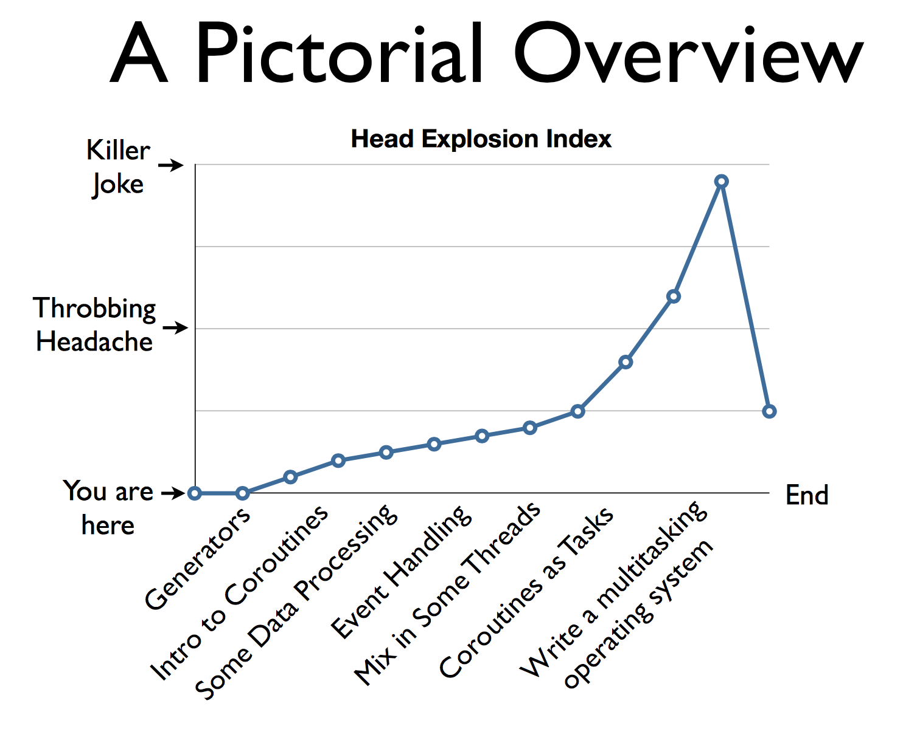

## Introduction to Generators and Coroutines ##

+ In Python 2.5, generators picked up some new features to allow "coroutines" (PEP-342).

  > Python 2.5的生成器引入了一个新特性，在某种程度上支持协程

+ Most notably: a new send() method

### Generators ###

A generator is a function that produces a sequence of results instead of a single value.

> 生成器是一个返回一系列结果的函数（一系列的意思是，结果的个数是不定的）
>
> 如果仅仅能够返回固定个数的结果，和元组等技术没有什么区别

```python
def countdown(n):
  while n > 0:
    yield n
    n -= 1
```

**yield n**

```python
for i in countdown(5):
  print i
```

Instead of returning a value, you generate a series of values (using the **yield** statement).

> 用**yield**关键字产生一系列的值

Typically, you hook it up to a for-loop.

> 普遍来说，生成器会和循环结合在一起

Calling a generator function creates an generator object. However, it does not start running the function.

> 调用一个生成器函数会得到一个生成器对象
>
> 但是生成器对象却不会立马开始运行函数

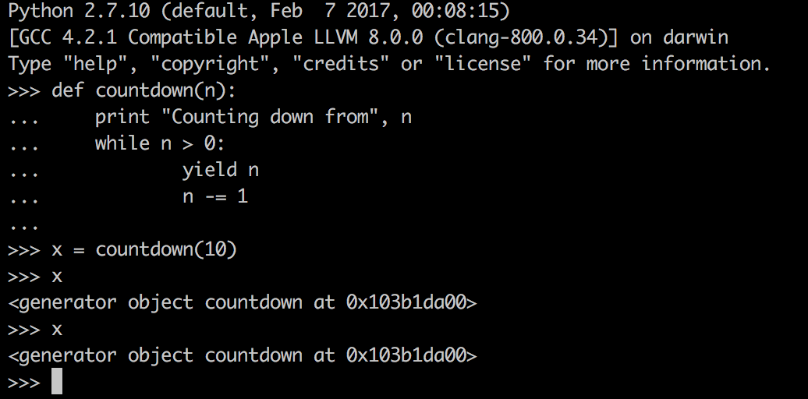

The function only executes on **next**().

> 对这个对象调用**next**方法的时候，它才开始执行

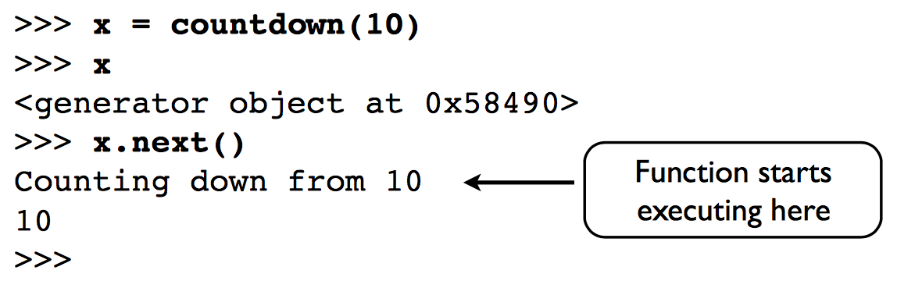

**yield** produces a value, but suspends the function.

> **yield**会产生一个值，但是会导致函数挂起

Function resumes on next call to **next**().

> **next**关键字催促一次执行，知道碰到下一个**yield**关键字

When the generator returns, iteration stops.

> 如果生成的一系列值的个数是有限的，必然会有停止的点
>
> 这个停止的点是生成器真正返回值的时候
>
> 如果在这个时间点之后接着调用**next**方法会导致异常抛出

### Generators as Pipelines ###

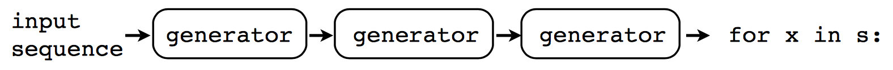

### Yield as an Expression ###

In Python 2.5, a slight modification to the yield statement was introduced (PEP-342).

You could now use yield as an expression.

> expression与statement是由区别的（有没有值）
>
> **yield**语句变成**yield**表达式，那么这个关键字的语义都会有变化

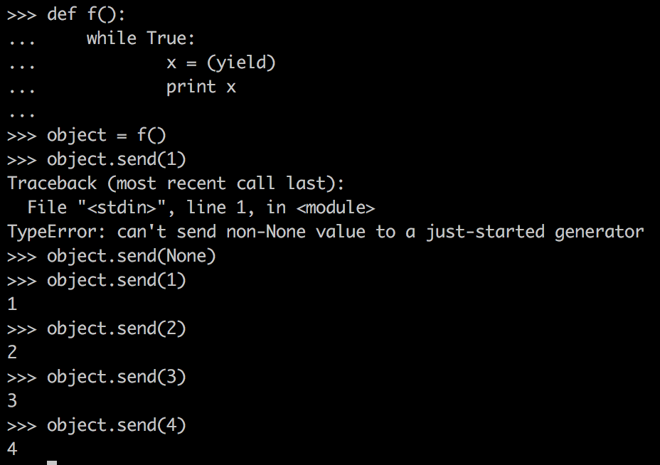

有没有发现，**yield**的语义发生了明显的变化：

+ **yield** -> **next** : **yield** 是生产者
+ **yield** <- **send** : **yield**是消费者

### Coroutines ###

If you use **yield** more generally, you get a coroutine.

> 在`python`这门语言中，你只要使用**yield**关键字，就得到了一个协程

These do more than just generate values.

> 协程当然做的比生成一系列值要多得多

### Coroutine Priming ###

All coroutines must be "primed" by first calling .next() (or send(None)).

一个消费者的例子：

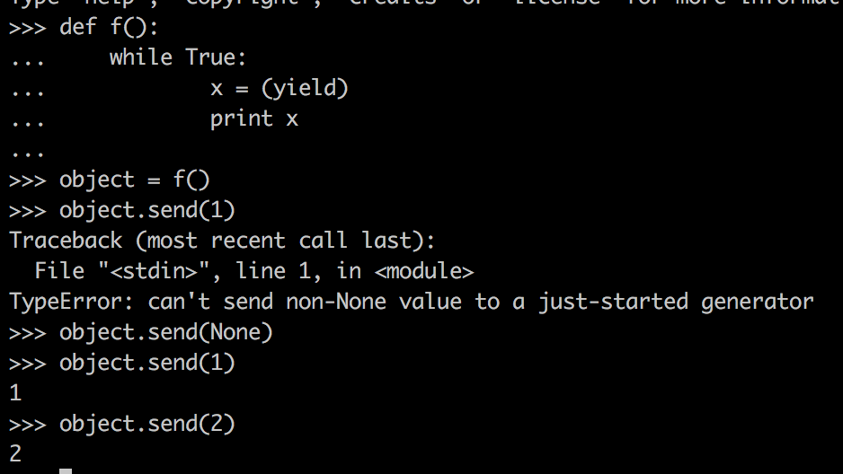

一个生产者的例子：

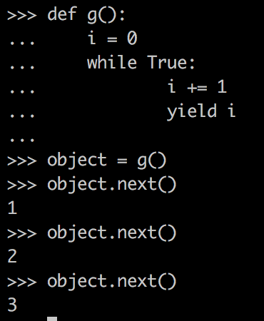

不难看出，只有消费者才有Priming的说法，生产者不存在这个说法

### Closing a Coroutine ###

A coroutine might run indefinitely.

> 一个协程可能是永不停止地运行的，从某种意义上来说，协程是惰性计算的
>
> 所以即使它没有停止条件也无所谓

Use .close() to shut it down.

close() can be caught (GeneratorExit).

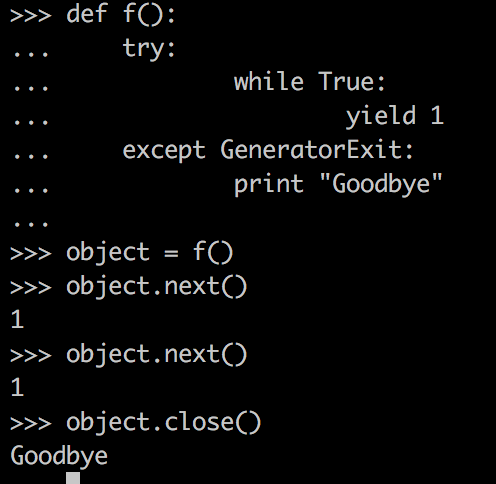

### Throwing an Exception ###

Exceptions can be thrown inside a coroutine.

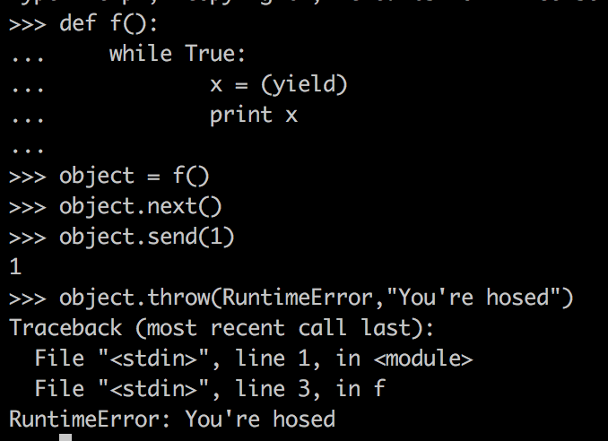

Exception originates at the yield expression.

Can be caught/handled in the usual ways.

### Interlude ###

+ Despite some similarities, Generators and coroutines are basically two different concepts.
+ Generators produce values.
+ Coroutines tend to consume values

> 说穿了，即使使用同样的关键字**yield**，生成器和协程的区别还是非常大的
>
> 就像前面提到的那样，一个是生产者，一个是消费者

+ It is easy to get sidetracked because methods meant for coroutines are sometimes described as a way to tweak generators that are in the process of producing an iteration pattern (i.e., resetting its value). This is mostly bogus.

  > 常常有人会用生成器来理解协程，这样做是错误的

### Keeping it Straight ###

再来区分一下生成器与协程：

+ Generators produce data for iteration.
+ Coroutines are consumers of data.
+ To keep your brain from exploding, you don't mix the two concepts together.
+ Coroutines are not related to iteration.
+ Note :There is a use of having yield produce a value in a coroutine, but it's not tied to iteration.

## Coroutines, Pipelines, and Dataflow ##

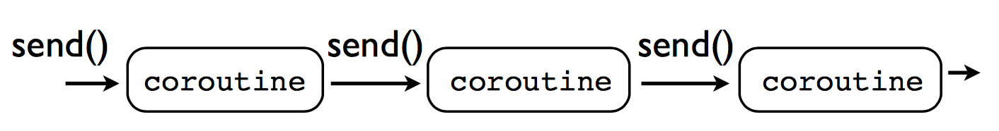

source 管道需要一个数据来源，这个数据来源往往不是协程

sink 管道需要一个收集所有数据的地方并且做综合的计算

filter

### Interlude ###

生成器堆成的管道和协程堆成的管道有什么区别呢？

Generators **pull** data through the pipe with iteration. Coroutines **push** data into the pipeline with **send**().

协程可以生成分支，协程可以合并分支（表达能力比生成器堆栈要强）

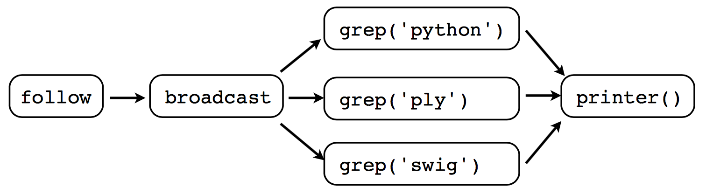

### Coroutines vs. Objects ###

这里又谈到了对协程的另一种理解，协程可以隐式地利用变量来保存状态

这种看法实际上是把协程作为状态机的一种形式

```python
class GrepHandler(object):
    def __init__(self,pattern, target):
        self.pattern = pattern
        self.target = target

    def send(self,line):
    if self.pattern in line:
        self.target.send(line)
```

```python
@coroutine
    def grep(pattern,target):
        while True:
            line = (yield)
            if pattern in line:
                target.send(line)
```

handler class

Essentially you're stripping the idea down to the bare essentials (like a generator vs. iterator).

> 如果使用对象来代替协程，很可能会落入细节的陷阱中去
>
> 这是一种语法糖的理解，协程提供给我们更强的表现能力，使得代码更加接近人的思维

## Coroutines and Event Dispatching ##

协程能够很好地描述状态机

## From Data Processing to Concurrent Programming ##

Coroutines naturally tie into problems involving threads and distributed systems.

> 协程天生与线程／分布式系统纠缠在一起

You can package coroutines inside threads or subprocesses by adding extra layers.

> 用线程或者进程来实现协程（这是一个很粗糙的做法）

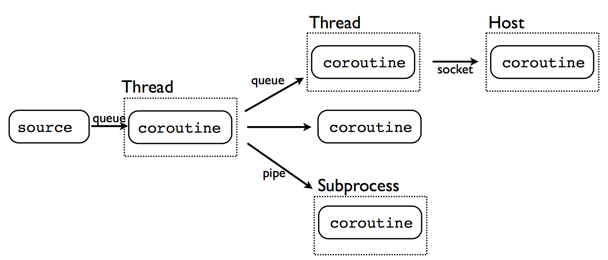

```python
def threaded(target):
    messages = Queue()
    def run_target():
        while True:
            item = messages.get()
            if item is GeneratorExit:
                target.close()
                return
            else:
                target.send(item)
    Thread(target=run_target).start()
    try:
        while True:
            item = (yield)
            messages.put(item)
    except GeneratorExit:
        messages.put(GeneratorExit)

```

上面这段代码做的事情无非是开一个线程去执行协程

threaded自身也是一个协程，因为它使用**yield**获取输入

这样导致代码不清晰，这个**yield**的作用就是往messages中塞东西，不妨把messages变成全局变量

当然，协程也可以放到子进程中去执行，然后使用管道等通信

### Implementation vs. Environ ###

+ With coroutines, you can separate the implementation of a task from its execution environment.
+ The coroutine is the implementation.
+ The environment is whatever you choose (threads, subprocesses, network, etc.).

这是作者举上面那个例子真正想告诉我们的，协程是一种分离任务的实现和执行环境的手段

如果没有协程，逻辑代码会和执行环境的代码（比如从队列中获取消息，或者和另外一个进程通信）混合在一起

协程的出现分离了逻辑代码和执行环境的代码（这是一种解耦）

## Coroutines as Tasks ##

In concurrent programming, one typically subdivides problems into "tasks".

Tasks have a few essential features:

+ Independent control flow
+ Internal state
+ Can be scheduled (suspended/resumed)
+ Can communicate with other tasks

Claim : Coroutines are tasks

## A Crash Course in Operating Systems ##

CPU不知道多任务这件事 + 程序不知道多任务这件事

那么谁知道多任务这件事？操作系统

+ When a CPU is running your program, it is notrunning the operating system.
+ Question: How does the operating system (which is not running) make an application (which is running) switch to another task?

假设是单核的CPU，应用程序的代码和操作系统的代码只能有一个在执行，请问操作系统怎么把正在运行的进程切换掉？（矛盾之处）

Interrupts and Traps

> 中断（比如时钟中断可用于时钟片轮转调度）／内陷（调用系统调用）
>
> 中断是强制的，与进程无关
>
> 内陷是自愿的，与进程有关

我们会发现协程的调度和进程的调度是具有相似性的

When a generator function hits a "yield" statement, it immediately suspends execution.

> 假设在单进程单线程中实现多协程，**yield**就可以看成是内陷（准确来说，放弃占用线程）
>
> 挂起自身的执行

Control is passed back to whatever code made the generator function run (unseen).

> 控制流跳转到使得协程运行起来的地方，这个地方对于我们来说是不可见的

If you treat yield as a trap, you can build a multitasking "operating system"--all in Python!

> 说是操作系统还有一点不准确，因为操作系统不仅仅要完成调度工作，还要完成系统调用工作
>
> 系统调用分为同步阻塞式的和异步非阻塞式的
>
> 如果协程要做系统调用，得把它们封装成看起来是同步的，实际上是非阻塞的
>
> 相对于做一个调度器而言，这项工作更加有难度

## Let's Build an Operating System ##

```python
# ------------------------------------------------------------
# pyos1.py  -  The Python Operating System
# 
# Step 1: Tasks
# ------------------------------------------------------------

# This object encapsulates a running task.

class Task(object):
    taskid = 0
    def __init__(self,target):
        Task.taskid += 1
        self.tid     = Task.taskid   # Task ID
        self.target  = target        # Target coroutine
        self.sendval = None          # Value to send

    # Run a task until it hits the next yield statement
    def run(self):
        return self.target.send(self.sendval)

# ------------------------------------------------------------
#                       == Example ==
# ------------------------------------------------------------
if __name__ == '__main__':
    
    # A simple generator/coroutine function
    def foo():
        print "Part 1"
        yield
        print "Part 2"
        yield

    t1 = Task(foo())
    print "Running foo()"
    t1.run()
    print "Resuming foo()"
    t1.run()

    # If you call t1.run() one more time, you get StopIteration.
    # Uncomment the next statement to see that.

    # t1.run()
```

```python
# ------------------------------------------------------------
# pyos3.py  -  The Python Operating System
#
# Step 3: Added handling for task termination
# ------------------------------------------------------------

# ------------------------------------------------------------
#                       === Tasks ===
# ------------------------------------------------------------
class Task(object):
    taskid = 0
    def __init__(self,target):
        Task.taskid += 1
        self.tid     = Task.taskid   # Task ID
        self.target  = target        # Target coroutine
        self.sendval = None          # Value to send

    # Run a task until it hits the next yield statement
    def run(self):
        return self.target.send(self.sendval)

# ------------------------------------------------------------
#                      === Scheduler ===
# ------------------------------------------------------------
from Queue import Queue

class Scheduler(object):
    def __init__(self):
        self.ready   = Queue()   
        self.taskmap = {}        

    def new(self,target):
        newtask = Task(target)
        self.taskmap[newtask.tid] = newtask
        self.schedule(newtask)
        return newtask.tid

    def exit(self,task):
        print "Task %d terminated" % task.tid
        del self.taskmap[task.tid]

    def schedule(self,task):
        self.ready.put(task)

    def mainloop(self):
         while self.taskmap:
            task = self.ready.get()
            try:
                result = task.run()
            except StopIteration:
                self.exit(task)
                continue
            self.schedule(task)

# ------------------------------------------------------------
#                      === Example ===
# ------------------------------------------------------------
if __name__ == '__main__':
    def foo():
        for i in xrange(10):
            print "I'm foo"
            yield

    def bar():
        for i in xrange(5):
            print "I'm bar"
            yield

    sched = Scheduler()
    sched.new(foo())
    sched.new(bar())
    sched.mainloop()
```

上面的两段代码，大致勾勒出调度器的大致形状（支持任务的开始／调度／结束）

但是没有支持任务接受外部输入，没有支持系统调用

### System Calls ###

支持系统调用需要几个步骤

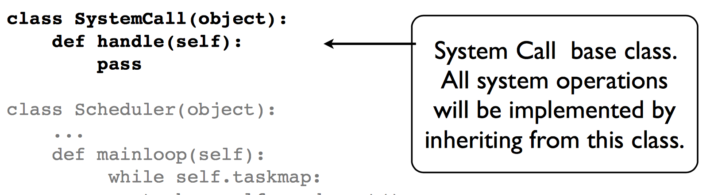

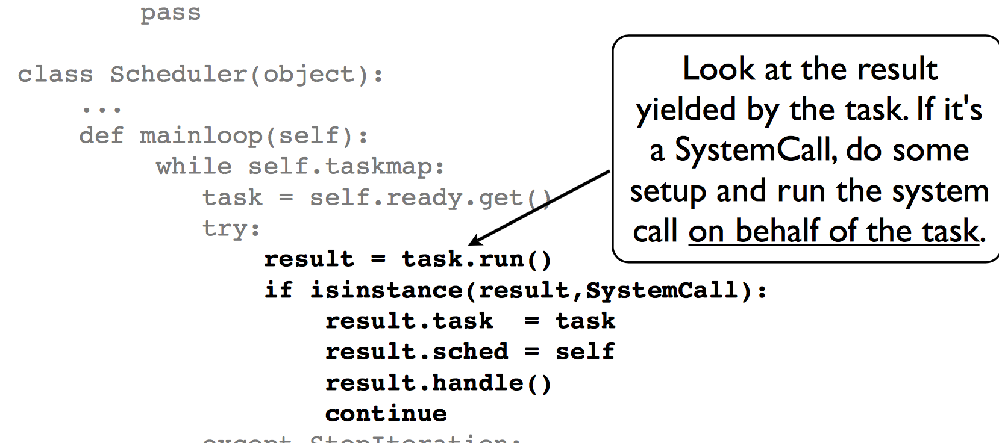

简单来说，就是检测协程每次执行之后返回的值

如果这个值是系统调用类或其子类的对象，则认为协程发起了一个系统调用

那么，我们在外面调用handle方法（这里涉及到：如果系统调用时异步非阻塞的，调度器如何充分利用线程执行机会？）

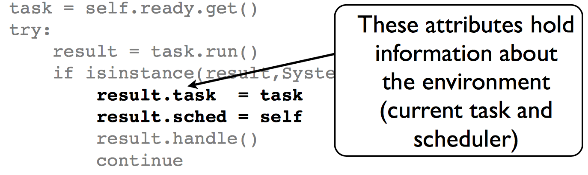

```python
class GetTid(SystemCall):
    def handle(self):
        self.task.sendval = self.task.tid
        self.sched.schedule(self.task)
```

在之前的代码中，我们找到这么一句：

```python
class Task(object):
    ...
    def run(self):
        return self.target.send(self.sendval)
```

那么，系统调用的返回值成功传递给协程

### Design Discussion ###

+ Real operating systems have a strong notion of "protection" (e.g., memory protection).
+ Application programs are not strongly linked to the OS kernel (traps are only interface).
+ For sanity, we are going to emulate this:
  + Tasks do not see the scheduler.
  + Tasks do not see other tasks.
  + yield is the only external interface.

