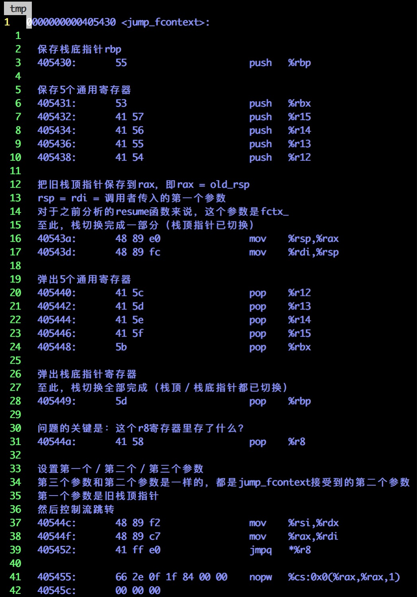
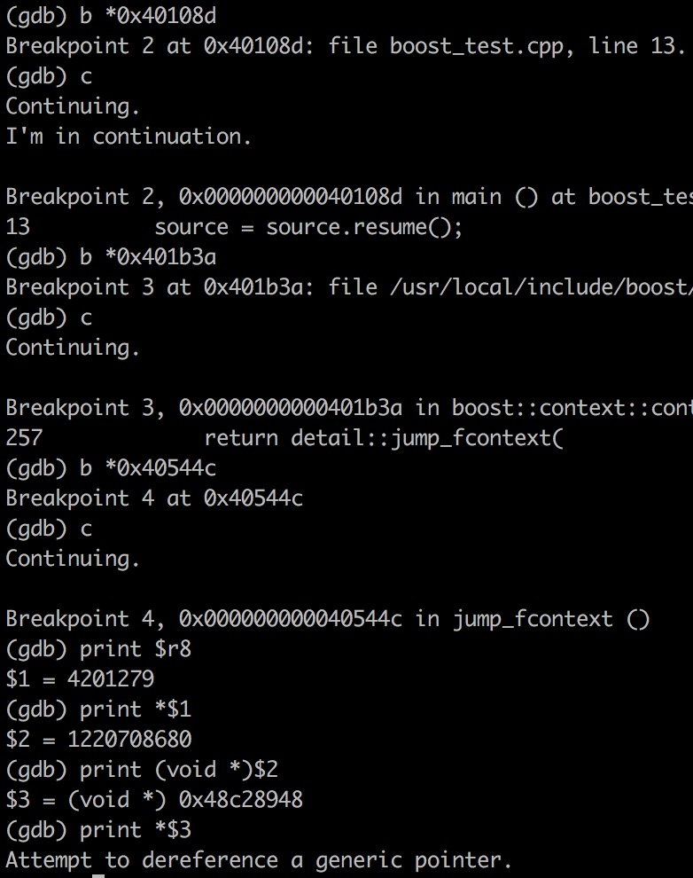
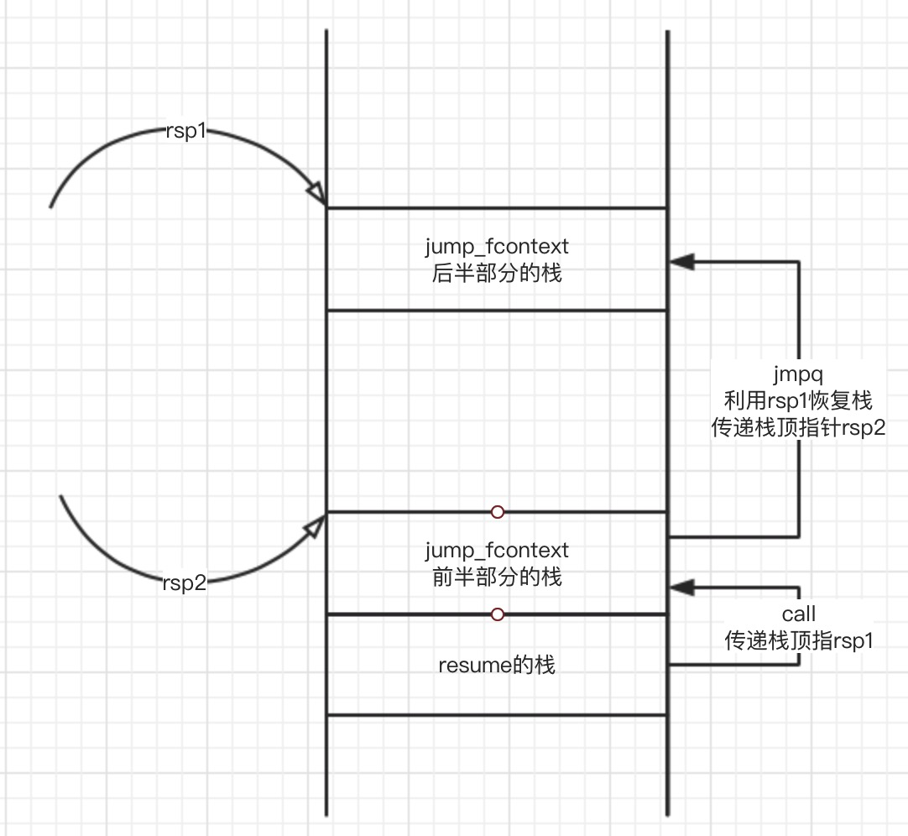

# 尝试 & 遇到的困难 #

## 静态跟踪源代码 ##


如果打开continuation_fcontext.hpp，会看到一个很关键的函数：


很激动对不对，以为自己找到了入口？！

天真啦，猜猜看你找不找得到`jump_fcontext`函数？


唯一一个看上去像是实现的文件是fcontext.hpp（猜猜看能发现什么？！）


没戏！

## 看汇编代码？ ##

### gcc ###

```shell
gcc -S boost_test.cpp -o boost_test.s
```


1602！（我怎么看！😢哭泣😢到晕厥😷）

尝试搜索jump_fcontext，就看到这个东西：


并看不到实现

### objdump ###

objdump -D a.out > boost_test.s


仿佛在逗我笑（呵呵呵）


### @plt ###

It's a way to get code fixups (adjusting addresses based on where the code sits in virtual memory) without having to maintain a separate copy of the code for each process. The PLT is the procedure linkage table, one of the structures which makes dynamic loading and linking easier to use.

> 不同进程共享代码
>
> 一份物理内存的代码被映射到不同的虚拟内存中

`printf@plt` is actually a small stub which (eventually) calls the real `printf` function.

This real function may be mapped into *any* location in a given process (virtual address space) as can the code that calls it.

So, in order to allow proper code sharing of calling code (left side below), you don't want to apply any fixups to it directly since that will restrict where it can be located in *other* processes.

The `PLT` is a smaller *process-specific* area at a reliably-calculated-at-runtime address that *isn't*shared between processes so any given process can change it however it wants to.

In other words, examine the following diagram which shows both your code and the library code mapped to different virtual addresses in two processes:

```shell
         Mapped to: 0x1234     0x9000     0x8888
        +-----------------+ +----------+ +----------+
        |                 | | Private  | |          |
ProcA   |                 | |  PLT/GOT | |          |
        |                 | |   area   | |          |
        | Shared          | +----------+ | Shared   |
========|  application    |==============|  library |==
        |   code          | +----------+ |   code   |
        |                 | | Private  | |          |
ProcB   |                 | |  PLT/GOT | |          |
        |                 | |   area   | |          |
        +-----------------+ +----------+ +----------+
         Mapped to: 0x2020     0x9000     0x6666
```

This particular example shows a simple case where the PLT maps to a fixed location. In your scenario, it's located relative to the current program counter as evidenced by your program-counter-relative lookup:

```assembly
<printf@plt+0>: jmpq  *0x2004c2(%rip)  ; 0x600860 <_GOT_+24>
```

Basically, the original way in which shared code was made meant it they had to be loaded at the same memory location in the virtual address space of every process that used it. Either that or it couldn't be shared, since the act of fixing up the *single* shared copy for one process would totally stuff up another process where it was mapped to a different location.

By using position independent code, along with the PLT and a global offset table (GOT), the *first*call to a function `printf@plt` (in the PLT) is a multi-stage operation, in which:

+ you call `printf@plt` in the PLT.
+ it calls the GOT version (via pointer) which *initially* points back to some set-up code in the PLT.
+ this set-up code loads the relevant shared library if not yet done, then *modifies* the GOT so that subsequent calls directly to the real `printf` rather than the set-up code.

On subsequent calls, because the GOT has been modified, the multi-stage approach is simplified:

+ you call `printf@plt` in the PLT.
+ it calls the GOT version (via pointer) which points to the *real* `printf`.

[What does @plt mean here?](https://stackoverflow.com/questions/5469274/what-does-plt-mean-here)

### 能不能静态链接？ ###

```shell
g++ -std=c++11 -g -Wall boost_test.cpp -lboost_coroutine -lboost_context -lboost_system -lboost_thread -lpthread -static -static-libgcc -static-libstdc++
objdump -D a.out > boost_test.s
```


搜索`jump_fcontext`出来的就是这四张图的代码

代码看上去也不是很多，可以尝试解读一波

首先，我们需要知道出现的每个寄存器的用途，还有是调用者保存寄存器还是被调用者保存寄存器：

+ rbp／rbx／r12／r13／r14／r15：通用寄存器，调用者保存寄存器
+ rsp：栈顶指针寄存器
+ rax：函数返回值寄存器
+ rdi／rsi／rdx／rcx／r8／r9：函数参数，依次对应第一个参数／第二个参数……
+ cs：代码段寄存器

还需要弄清楚mov指令的方向：从左边到右边

jmpq指令在干什么：寻址更加复杂的jmp指令（到一个表里找直接跳转的地址，类似于switch的语句会被翻译成这个指令）

nop-X指令在干什么：什么不干，负责对齐（当然执行的时候负责把程序计数器加1／2／……）


现在我们可以分析`jump_fcontext`的代码了（当然看了很久没完全看懂）

+ 保存调用者保存寄存器
+ 切换栈
+ 恢复调用者保存寄存器
+ 控制流转移

### _ZN5boost7context12continuation6resumeEv ###


```assembly
boost::context::continuation::resume成员函数的变种
成员函数可以使用对象字段，而汇编认识的函数不可能有对象这个概念
按照书本上的理论，变种函数的第一个参数是this指针
也保不齐gcc把resume成员函数使用到的字段都变成第一个／第二个／……／第n个参数
0000000000401adc <_ZN5boost7context12continuation6resumeEv>:

|		        |
|------rsp------| 低地址
|		        |
|		        |
|		        |
|------rbp------| <-- old_rsp
|		        |
|		        |
|		        |
|		        |
|----old_rbp----| 高地址
|		        |
|		        |    ^
|		        |    |
|		        |    |
|		        | 栈增长的方向（栈由高地址向低地址增长）
|		        |
|		        |

  把旧的栈底指针入栈
  401adc:	55                   	push   %rbp

  rsp -> rbp
  原来的栈顶指针变成栈底指针
  401add:	48 89 e5             	mov    %rsp,%rbp

  腾出32字节的栈空间
  401ae0:	48 83 ec 20          	sub    $0x20,%rsp

  按照调用栈约定，rdi保存第一个参数的值，rsi保存第二个参数的值
  如果按照教科书上的讲法，resume成员函数不应该有两个参数
  所以很可能是两个用到的字段都变成了参数
  401ae4:	48 89 7d e8          	mov    %rdi,-0x18(%rbp)
  401ae8:	48 89 75 e0          	mov    %rsi,-0x20(%rbp)

  rax = -0x20(%rbp) = rsi
  以rax为地址取内容，并把取出来的结果放到rax中
  401aec:	48 8b 45 e0          	mov    -0x20(%rbp),%rax
  401af0:	48 8b 00             	mov    (%rax),%rax

  TEST sets the zero flag ZF when the result of the AND operation is zero.
  If two operands are equal, their bitwise AND is zero when both are zero.
  test／jne对应于BOOST_ASSERT(nullptr != fctx_)
  所以不难猜出，rax存着fctx_的值
  那么也不难猜出，原来的rax存着fctx_的地址（在没有取内容之前）
  1. 不妨认为rax存着的是整个类／结构体的指针，也即this指针
  而恰恰fctx_是这个类的第一个字段，所以可以直接取地址，更完整的写法是：mov 0x0(%rax),%rax
  又知道rax的值就是rsi的值，所以rsi存有的是this指针
  2. 不妨认为rax存着的就是fctx_字段的地址，是整个类／结构体首地址的一个偏移量，即this+0x...
  所以可以直接取内容而不需要偏移量
  又知道rax的值就是rsi的值，所以rsi存有的是this指针加上某个偏移量之后的值，指向fctx_字段
  401af3:	48 85 c0             	test   %rax,%rax

  下面一大段代码等于__assert_fail
  是BOOST_ASSERT不通过才运行的代码，不需要太细致地进行分析
  401af6:	75 1f                	jne    401b17 <_ZN5boost7context12continuation6resumeEv+0x3b>
  401af8:	48 8d 0d 81 9b 15 00 	lea    0x159b81(%rip),%rcx        # 55b680 <_ZZN5boost7context12continuation6resumeEvE19__PRETTY_FUNCTION__>
  401aff:	ba 00 01 00 00       	mov    $0x100,%edx
  401b04:	48 8d 35 45 98 15 00 	lea    0x159845(%rip),%rsi        # 55b350 <_ZN5boost7contextL14exec_ontop_argE+0x8>
  401b0b:	48 8d 3d 79 98 15 00 	lea    0x159879(%rip),%rdi        # 55b38b <_ZN5boost7contextL14exec_ontop_argE+0x43>
  401b12:	e8 09 e3 0b 00       	callq  4bfe20 <__assert_fail>

  在64位机器上，默认移动8字节（8 * 8 = 64）
  double word = DW vs quad word = QD
  401b17:	48 c7 45 f8 00 00 00 	movq   $0x0,-0x8(%rbp)
  401b1e:	00 

  自从语句mov %rsi,-0x20(%rbp)之后，没有人改变过rsi寄存器的值（不考虑BOOST_ASSERT不通过的情况）
  rax = -0x20(%rbp) = rsi
  rsi指向fctx_字段，是否指向整个类／结构体不得而知
  401b1f:	48 8b 45 e0          	mov    -0x20(%rbp),%rax

  lea是一个取地址指令，而-0x8(%rbp)又是取内容指令，综合起来就是一个减法
  rdx = rbp - 0x8
  rdx指向刚刚填充为0的那块栈内容，也可以认为是指向某个变量
  这个变量很可能是nullptr
  401b23:	48 8d 55 f8          	lea    -0x8(%rbp),%rdx

  根据反向压栈的约定，rsi是第二个参数，rdi是第一个参数
  和前面的知识保持一致（rdi是第一个参数，rsi是第二个参数）
  401b27:	48 89 d6             	mov    %rdx,%rsi
  401b2a:	48 89 c7             	mov    %rax,%rdi

  调用boost::context::detail::exchange函数，交换两个指针指向的内容
  即交换rax指向的内容（fctx_字段）和rdx指向的内容（nullptr）
  不妨假设这个函数的行为和std::exchnage的行为一致
  那么返回值即是rax指向的旧内容，即旧的fctx_字段
  rax = old_fctx_
  401b2d:	e8 93 15 00 00       	callq  4030c5 <_ZN5boost7context6detail8exchangeIPvDnEET_RS4_OT0_>

  esi = 0x0
  这是要干嘛？esi不是调用约定里的寄存器啊
  401b32:	be 00 00 00 00       	mov    $0x0,%esi

  rdi是第一个参数，也即jump_fcontext的第一个参数
  又知道rax = old_fctx_
  所以jump_fcontext的第一个参数是old_fctx_
  401b37:	48 89 c7             	mov    %rax,%rdi
  401b3a:	e8 f1 38 00 00       	callq  405430 <jump_fcontext>

  rax理论上应该保存jump_fcontext的返回值，但jump_fonctext的返回值的类型是transfer_t
  print sizeof(boost::context::detail::transfer_t)
  sizeof(transfer_t) = 16
  一个寄存器（64位机器也就是8字节）是不可能保存这么长的一个对象的
  How do C compilers implement functions that return large structures?
  The address of the caller's Data return value is actually passed as a hidden argument to the function,
  and the callee function simply writes into the caller's stack frame.
  和我的猜测是一样的，结构体所需要的内存在原栈（调用者的栈）上分配
  当然，结构体的地址会当成一个隐式参数传递给被调用函数
  1. 一共分配了32字节的栈空间，前面只用掉8+8+4=20个字节
  如果复用nullptr所使用的4个字节，还剩下32-20+4=16个字节
  和transfer_t所需要使用的字节数一样，这是巧合吗？
  2. 但是我们在之前的代码中并没有观察到这个隐式参数的传递
  只看到一句mov $0x0,%esi
  3. 有没有esi寄存器就是用于告诉jump_fcontext函数：返回值占用空间的最低字节地址 = 旧栈底地址 -/+ 0
  这个理论既可以解释esi寄存器用来干什么，又可以解释观察不到隐式参数的问题
  如果是对的，那就完美了

  1. 假设我们接受了上面那个看起来有一点扯的理论，很自然地，rax存储着结构体的首地址
  2. 假设我们不接受上面那个理论，还可以认为编译器做了一个优化，只返回fctx
  sizeof(void *) = 8 = 64位机子上寄存器的大小
  那么rax就是返回的fctx的值
  401b3f:	48 89 c2             	mov    %rax,%rdx

  rax = -0x18(%rbp)，这里存着resume函数的第一个参数
  401b42:	48 8b 45 e8          	mov    -0x18(%rbp),%rax

  反向压栈，rsi表示第二个参数，rdi表示第一个参数
  第一个参数的值 = rdi = rax = -0x18(%ebp) = resume函数的第一个参数
  第二个参数的值 = rsi = rds = rax = jump_fcontext的返回值
  呼叫boost::context::continuation函数，即构造函数
  401b46:	48 89 d6             	mov    %rdx,%rsi
  401b49:	48 89 c7             	mov    %rax,%rdi
  401b4c:	e8 77 fe ff ff       	callq  4019c8 <_ZN5boost7context12continuationC1EPv>

  虽然resume函数return fctx，但是resume函数的返回值类型是continuation（必然存在着隐式转换）
  上面调用boost::context::continuation函数就是在做这个隐式转换
  1. sizeof(boost::context::continuation) = 8
  所以从占用的内存上来说，64位机子上的rax寄存器恰好可以返回continuation
  2. resume的调用者在它自己的栈上分配好了8个字节用于存储continuation，在此只是把这8个字节的首地址作为返回值
  401b51:	48 8b 45 e8          	mov    -0x18(%rbp),%rax
  401b55:	c9                   	leaveq 
  401b56:	c3                   	retq   
  401b57:	90                   	nop
```

这里面还有很多的猜测，待会用gdb看一看

### 解决那些猜测 ###

#### 第一个猜测：resume函数的两个参数是什么 ####


找到了调用resume函数之前的代码（这段代码在main函数中），稍微看一眼

+ resume函数的第一个参数 = rdi = rax = rbp - 0x18
+ resume函数的第二个参数 = rsi = rdx = rbp - 0x28

再回到gdb跟踪一下：


我们验证了rdx寄存器指向source，也就是this指针

所以resume函数的第二个参数就是this指针，而不是continuation类型的某个字段的地址


我们再次验证：rax寄存器 = 返回值存储地的首地址，即resume函数的第一个参数指明了返回值应该存放在什么地方

总结：

+ resume函数的第一个参数指明返回值存储地
+ resume函数的第二个参数是this指针

#### 第二个猜测：resume函数的返回值（rax寄存器）是什么 ####


这个结果我只能说一半喜一半忧：

+ 喜：\$1 == \$2（如果我们关于resume函数的第一个参数的猜测是对的，我们对resume函数的返回值的猜测也是对的）
+ 忧：\$2 != \$8（有可能我们对于resume函数的第一个参数的猜测是错的）

那么到底是怎么回事呢？


闭着眼睛我都知道这是转移构造函数／转移赋值函数（微笑微笑微笑）


说几句：

+ rax／rdi是resume函数的第一个参数，告诉resume函数应该把返回值放什么地方
+ rdx／rsi是resume函数的第二个参数，告诉resume函数this指针的值
+ 两个参数肯定是不一样的
  + 为什么不能做优化呢？让第一个参数等于第二个参数，即返回值覆盖this指针？因为赋值构造函数被禁用了，取代它的是带有转移语义的赋值构造函数
  + `$2 != $8`是非常正常的，但你最终会发现它们的内容是一样的（经过转移语义处理）
    + `$rax != &source`
    + *($rax) == source

如何证明“转移”这件事情：


总结：

+ resume函数的第一个参数：指出返回值放到什么地方
+ resume函数的第二个参数：this指针
+ resume函数的返回值：指出返回值放到什么地方（和它接受的第一个参数相等）

#### 第三个猜测：0x401b32在干嘛？jump_fcontext接受几个参数？ ####


可以看到：jump_fonctext函数接受两个参数，第二个参数是nullptr

你猜猜看：rsi寄存器和esi寄存器的区别是什么？


我们在前面学到两点知识：

+ nullptr用4字节表示：`movq   $0x0,-0x8(%rbp)`表达新建nullptr变量
+ rsi寄存器用于保存第二个参数

所以我们可以顺理成章地猜测：

+ esi寄存器用于保存第二个参数
+ 特别地，这个参数是nullptr

在其他地方，我们还找到这样一段代码：


我们的猜测基本上是对的

总结：

+ jump_fcontext接受两个参数
+ 0x401b32在设置第二个参数

#### 第四个猜测：continuation构造器接受哪几个参数？ ####


我们已经知道：

+ rsi寄存器保存第二个参数
+ rdi寄存器保存第一个参数
+ 一般而言，第一个参数会表明返回值的存储位置

所以：

+ continuation的构造器接受两个参数
  + 第一个参数指出：构造出来的对象（也就是返回值）存放在哪里
  + 第二个参数是fctx
+ continuation的构造器的返回值（rax寄存器）表明：构造出来的对象存放在哪里，因而等于第一个参数

整个代码也不长，也很容易理解

#### 第五个猜测：jump_fcontext的返回值是什么？为什么没有告诉jump_fcontext把返回值（transfer_t类型的对象）放哪里？ ####


rax -> rdx -> rdx -> rsi

rsi = fctx

所以，rax寄存器的值（也即jump_fcontext的返回值）就是fctx


如果jump_fcontext函数只返回fctx，即只返回fcontext_t

实际上就是返回void*，是一个基本类型，所以不需要按照结构体作为返回值来处理

jump_fcontext自然也不接受一个隐式参数来指定返回值的位置

总结：

+ 在这段代码中：jump_fcontext函数只返回void*而不是transfer_t结构体（不知道为什么）
+ 所以rax寄存器的值就是jump_fcontext函数的真正返回值
+ 所以jump_fcontext函数不需要一个隐式参数来指定“真正”的返回值的地址

至于为什么不返回结构体而是返回void*，很可能和这个奇怪的声明有关：


没（mo）解（jie）

```c++
#include <boost/context/detail/fcontext.hpp>
#include <boost/config.hpp>
#include <boost/cstdint.hpp>
#include <boost/context/detail/config.hpp>

#ifdef BOOST_HAS_ABI_HEADERS
# include BOOST_ABI_PREFIX
#endif

#ifdef BOOST_HAS_ABI_HEADERS
# include BOOST_ABI_SUFFIX
#endif

#include <stdio.h>

/*
 * generic helper macros
 */
#define CALL(macro, arguments) macro arguments
#define STR(...) STR_(__VA_ARGS__)
#define STR_(...) # __VA_ARGS__

/*
 * dumps a macro and its expansion to stdout
 * the second argument is optional and specifies the number of
 * arguments that macro takes: 0 means macro takes zero arguments
 * no second argument means macro is not function-like
 */
#define DUMP_MACRO(macro, ...) \
    do { \
        puts ( \
            "'" \
            # macro STR(DUMP_MACRO_ARGS_ ## __VA_ARGS__) \
            "' expands to '" \
            STR(CALL(macro, DUMP_MACRO_ARGS_ ## __VA_ARGS__)) \
            "'" \
        ); \
    } while (0)
/* helpers for DUMP_MACRO, add more if required */
#define DUMP_MACRO_ARGS_
#define DUMP_MACRO_ARGS_0 ()
#define DUMP_MACRO_ARGS_1 (<1>)
#define DUMP_MACRO_ARGS_2 (<1>, <2>)
#define DUMP_MACRO_ARGS_3 (<1>, <2>, <3>)

int  main()
{
    DUMP_MACRO(BOOST_CONTEXT_DECL);
    DUMP_MACRO(BOOST_CONTEXT_CALLDECL);
}
```

## 动态跟踪？ ##

神马？你还想看续集？

可是我要碎觉了::alarm_clock: ::sleeping: ::sleepy:

而且也没必要啦，前面已经那么那么那么（重要的事情说三遍）仔细 + 详细了

现在是2017年10月19日4点12分，晚安😴

# jump_fcontext #

## 静态分析 ##




```assembly
0000000000405430 <jump_fcontext>:

  保存栈底指针rbp
  405430:	55                   	push   %rbp

  保存5个通用寄存器
  405431:	53                   	push   %rbx
  405432:	41 57                	push   %r15
  405434:	41 56                	push   %r14
  405436:	41 55                	push   %r13
  405438:	41 54                	push   %r12

  把旧栈顶指针保存到rax，即rax = old_rsp
  rsp = rdi = 调用者传入的第一个参数
  对于之前分析的resume函数来说，这个参数是fctx_
  至此，栈切换完成一部分（栈顶指针已切换）
  40543a:	48 89 e0             	mov    %rsp,%rax
  40543d:	48 89 fc             	mov    %rdi,%rsp

  弹出5个通用寄存器
  405440:	41 5c                	pop    %r12
  405442:	41 5d                	pop    %r13
  405444:	41 5e                	pop    %r14
  405446:	41 5f                	pop    %r15
  405448:	5b                   	pop    %rbx

  弹出栈底指针寄存器
  至此，栈切换全部完成（栈顶／栈底指针都已切换）
  405449:	5d                   	pop    %rbp

  问题的关键是：这个r8寄存器里存了什么？
  40544a:	41 58                	pop    %r8

  设置第一个／第二个／第三个参数
  第三个参数和第二个参数是一样的，都是jump_fcontext接受到的第二个参数
  第一个参数是旧栈顶指针
  然后控制流跳转
  40544c:	48 89 f2             	mov    %rsi,%rdx
  40544f:	48 89 c7             	mov    %rax,%rdi
  405452:	41 ff e0             	jmpq   *%r8

  405455:	66 2e 0f 1f 84 00 00 	nopw   %cs:0x0(%rax,%rax,1)
  40545c:	00 00 00 
  40545f:	90                   	nop

1. jump_fcontext = 自主管控栈的函数调用
2. jump_fcontext的第一个参数：新函数的栈在什么地方
3. jump_fcontext做一些栈管理，同时为新函数的执行准备好环境
4. 跳转到新函数去执行
5. 很自然，新函数不能用return来返回，需要用一个自主管控栈的return
6. 所以我们得告诉新函数，你结束后把栈恢复到什么地方，这也是第一个参数的含义
7. 所以continuation中的fctx_字段存储的就是栈顶指针
8. 也不难理解，在jump_fcontext中看不到ret语句，也看不到设置返回值
9. 谁告诉jump_fcontext跳转到哪个函数去执行？r8寄存器！可以猜测，一定有一句话是push PC/ip
```

看代码能得到的信息还是十分有限的，很多猜测还不知道对错

## 动态分析 ##

第一个断点打在40108d：main函数调用resume函数

第二个断点打在401b3a：resume函数调用jump_fcontext函数（严格来说，jump_fcontext都不是函数）

第三个断点打在40544c：jump_fcontext函数刚把r8寄存器弹出来




jmpq就是简单地跳转到r8寄存器所指的地方（不需要取内容）




上面两张图展示栈的变化和控制流的转移：

1. resume函数通过call指令来进行控制流的转移，自动建栈
2. jump_fcontext的前半部分通过参数rsp1恢复一个原本就存在的栈（手动建栈）
3. jump_fcontext通过jump指令进行控制流的转移
4. jump_fcontext的后半部分执行完成之后恢复jump_fcontext前半部分的栈（手动建栈）
5. jump_fcontext通过return指令进行控制流的转移

上面的（第2步 + 第3步）才相当于一个正常的函数调用

中间很重要的一个变量（r8）在第3步使用到，可是我们没有找到它在什么地方被“初始化”（入栈）？

## r8在什么地方入栈？ ##

我们相信source.fctx_指向source的栈顶，那么也有理由相信：r8寄存器是在切换continuation的时候入栈的

即在切换下一个continuation的时候指定：如果切换回该continuation，控制流应该到什么地方去

所以，定位到lambda函数的位置就可以尝试找一找r8寄存器入栈的代码

如何定位到lambda函数呢？可以尝试定位到cout对应的系统调用

`_ZStlsISt11char_traitsIcEERSt13basic_ostreamIcT_ES5_PKc`


找不到呜呜呜

看完《十三邀》（整个人都可以学习了），然后就找到了（嘻嘻，一定是张艾嘉女神在帮我）：


是不是没看懂这个骚操作！（来，我教你！哈哈哈😄😄😄）


多说几句话来解释一下：

1. 我们认为在从continuation A切换到continuation B之前，continuation A总要想一个办法告诉continuation B一个事情：如果你结束了想返回来，控制流请跳转到什么地方
2. `pop %r8`负责把控制流的目标地址加载到r8寄存器
3. 执行`pop %r8`语句时，处在continuation A的栈（看前面的代码和分析）
4. 所以continuation A的栈一定要压入控制流的目标地址
5. jump_fcontext函数的压栈操作有：push rbp -> push rbx -> push r15 -> … -> push r12
6. jump_fcontext函数的退栈操作有：pop r12 -> … -> pop r15 -> pop rbx -> pop rbp -> pop r8
7. 很自然可以想到，在调用jump_fcontext函数之前，有一个类似于push r8的操作

（1～4是一个证据，5～7时另一个证据）

所以我们相信：在执行到0x401018之前，未来r8的值就已经在栈中了


哎（深深叹一口气），r8寄存器的值就是该函数的返回地址（怪不得什么都看不到，是call指令自动压栈的）

（不敢肯定？也就是现在还不能百分百回答“r8在什么地方入栈？”这个问题）

# 结掉前面的那些烂帐 #

## 第一个实验 ##


这个实验只想证明一件事情：如果想读取当前栈顶的第一个变量，只需要\*\$rsp，而不是\*(\$rsp + 8)

换句话来说：如果在进入子函数的第一时刻（还没有执行子函数的任何汇编指令）想要获取子函数的返回地址，只需要：*$rsp（此刻返回地址是栈顶的第一个变量）


如上图所示，我们在进入子函数的第一时刻可以用过\*\$rsp来获取返回地址

源代码十分简单：

```c++
void func()
{}

int main()
{
    func();
}
```

## 第二个实验 ##


这个实验只是想说明：call指令带来的栈变化只有一个——压入一个8字节（也就是64位）的返回地址


再强调一遍，call指令带来的栈变化只有一个——压入一个8字节的返回地址

源代码同实验一源代码

## 第三个实验 ##

实验用的源代码是boost_test.cpp（也就是这篇文章一直在用的源代码）


我们从main函数开始跟踪，跟踪到resume函数内部，最终来到jump_fcontext周围

那么：callq jump_fcontext对整个栈帧带来了什么影响呢？

答：在栈顶放入了一个返回地址


再强调一遍：callq jump_fcontext对整个栈的影响是——压入一个栈顶指针

没有其他任何额外的影响

这个实验只是为了证明jump fcontext并没有魔法，做的事情和普通的call指令一摸一样！

那么告诉我们什么事情呢？不妨结合一下jump_fonctext的汇编代码：


jump_fcontext先是保存寄存器，在切换栈帧之后，就恢复寄存器

由于顺序实在是太巧合了（刚刚好相反），我们可以假设jump_fcontext恢复的寄存器恰好是它在别的地方压入的寄存器（同一个函数在其它地方被调用）

所以，r8寄存器的值就是返回地址

从实验三的结论，我们不难推出：r8寄存器的值就是返回地址

所以，这次可以自信地回答“r8在什么地方入栈”这个问题：r8在调用call指令的时候自动入栈

