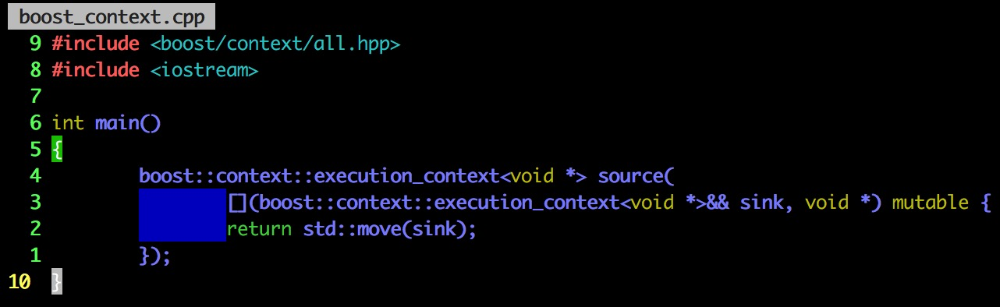
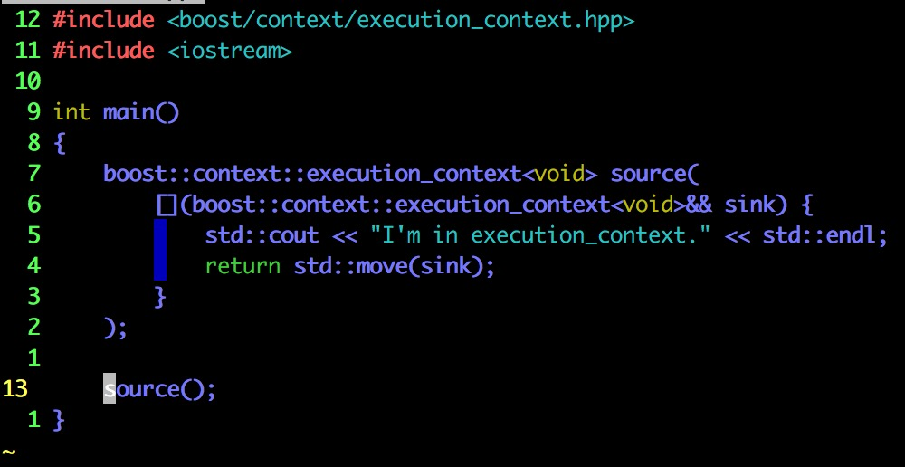
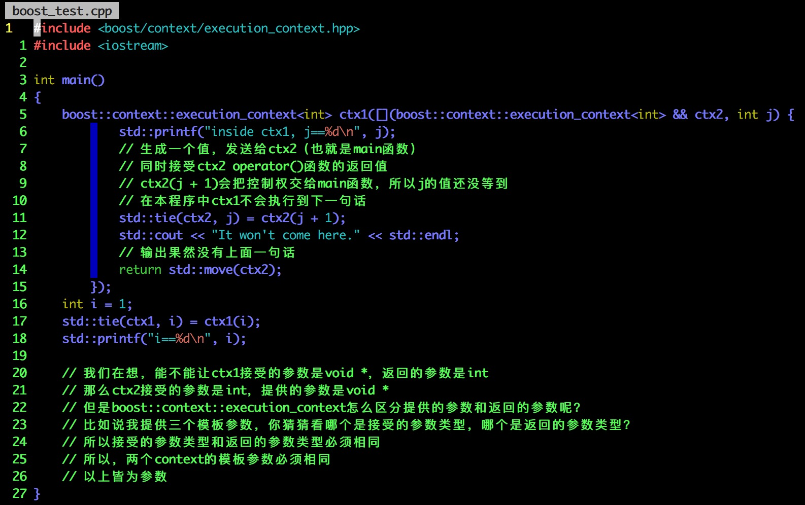
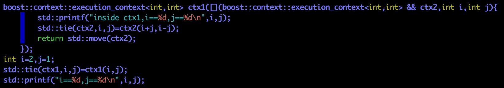
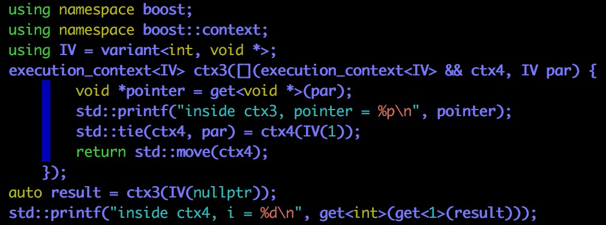
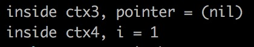
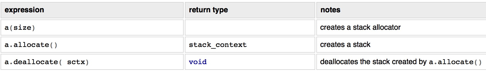

# Context #

## Overview ##

**Boost.Context** is a foundational library that provides a sort of cooperative multitasking on a single thread. 

> **Boost.Context**是协程的基础库

By providing an abstraction of the current execution state in the current thread, including the stack (with local variables) and stack pointer, all registers and CPU flags, and the instruction pointer, a execution context represents a specific point in the application's execution path.

> 这个基础库提供了哪些基础功能呢？
>
> 对线程执行环境的抽象：栈／栈指针／寄存器／CPU flags／指令寄存器
>
> 指令指针寄存器存储的是下一个时钟周期将要执行的指令所在的程序存储器地址

#### IR vs PC

程序的机器码（也就是二进制代码）存储在程序存储器（也就是内存中，对应着可执行文件的代码段）

每一个取指周期到来，CPU从指令指针指向的地址中取出一条指令，并将指令指针加1（指向下一条指令的地址）；如果遇到跳转指令，将会修改指令指针到要跳转的地址

来自StackOverflow的提问（其实我也一直不能区分PC／IR，刚好答疑）：

> Program counter holds the address of the instruction that should be executed next, while instruction register holds the actual instruction to be executed. wouldn't one of them be enough?
>
> And what is the length of each one of these registers?

> You will need both always. The program counter (PC) holds the address of the next instruction to be executed, while the instruction register (IR) holds the encoded instruction. Upon fetching the instruction, the program counter is incremented by one "address value" (to the location of the next instruction). The instruction is then decoded and executed appropriately.

PC／IR 都是需要的，它们有各自的作用；PC告诉我们下一条要执行的指令的地址；IR告诉我们“编码”过的指令

直到取指指令的到来，PC增加一条指令长度（增加的数可能是不定的，因为不同指令的长度是不一样的）；此时IP解码指令并且放到CPU中执行？

> The reason why you need both is because if you only had a program counter and used it for both purposes you would get the following troublesome system:

如果没有IR，你会遇到这些问题：

> [Beginning of program execution]
>
> + PC contains 0x00000000 (say this is start address of program in memory)
> + Encoded instruction is fetched from the memory and placed into PC.
> + The instruction is decoded and executed.
> + Now it is time to move onto the next instruction so we go back to the PC to see what the address of the next instruction is. However, we have a problem because PC's previous address was removed so we have no idea where the next instruction is.

说穿了就是一个很简单的问题，如果指令的获取和解码在PC中进行，那么会把下一条指令的地址覆盖掉

> Therefore, we need another register to hold the actual instruction fetched from memory. Once we fetch that memory, we increase PC so that we know where to fetch the next instruction.

> P.S. the width of the registers varies depending on the architecture's word size. For example, for a 32-bit processor, the word size is 32-bits. Therefore, the registers on the CPU would be 32 bits. Instruction registers are no different in dimensions. The difference is in the behavior and interpretation. Instructions are encoded in various forms, however, they still occupy a 32-bit register. For example, the Nios II processor from Altera contains 3 different instruction types, each encoded differently.

再多说一句，不同的指令集对于指令长度是否可变这个问题有不同的处理方式

对于那些具有可变长度指令的指令集，PC增加的数就不会是一个固定的数

最后，可以粗略地理解：PC = IP

——————这是一条结束**IR vs PC**的分界线——————

This is useful for building higher-level abstractions, like *coroutines*, *cooperative threads (userland threads)* or an equivalent to [C# keyword *yield*](http://msdn.microsoft.com/en-us/library/9k7k7cf0%28v=vs.80%29.aspx) in C++.

> 这种抽象对于建立一些更高层次的抽象（比如说合作式线程／协程）是很有用的

[*callcc()*](http://www.boost.org/doc/libs/1_65_1/libs/context/doc/html/context/cc.html#cc)/[*continuation*](http://www.boost.org/doc/libs/1_65_1/libs/context/doc/html/context/cc.html#cc) provides the means to suspend the current execution path and to transfer execution control, thereby permitting another context to run on the current thread.

> callcc提供了一种挂起当前执行路径并切换控制流的方法，因此它允许当前线程去执行一个完全不相关的控制流

This state full transfer mechanism enables a context to suspend execution from within nested functions and, later, to resume from where it was suspended.

> 这种“状态完全转移”的机制允许从函数内部（即函数还没有执行完退出之前）挂起，然后在某个时刻从被挂起的地方恢复

While the execution path represented by a [*continuation*](http://www.boost.org/doc/libs/1_65_1/libs/context/doc/html/context/cc.html#cc) only runs on a single thread, it can be migrated to another thread at any given time.

> 这种“状态完全转移”的机制甚至能把被挂起的执行路径／控制流转移到另一个线程去执行

A [context switch](http://en.wikipedia.org/wiki/Context_switch) between threads requires system calls (involving the OS kernel), which can cost more than thousand CPU cycles on x86 CPUs. By contrast, transferring control vias [*callcc()*](http://www.boost.org/doc/libs/1_65_1/libs/context/doc/html/context/cc.html#cc)/[*continuation*](http://www.boost.org/doc/libs/1_65_1/libs/context/doc/html/context/cc.html#cc) requires only few CPU cycles because it does not involve system calls as it is done within a single thread.

> context switch对操作系统是不可见的，不通过系统调用即可完成，所以会快很多

In order to use the classes and functions described here, you can either include the specific headers specified by the descriptions of each class or function, or include the master library header:

```c++
#include <boost/context/all.hpp>
```

which includes all the other headers in turn.

## Requirements ##

If **Boost.Context** uses fcontext_t (the default) as its implementation, it must be built for the particular compiler(s) and CPU architecture(s) being targeted. Using [*fcontext_t*](http://www.boost.org/doc/libs/1_65_1/libs/context/doc/html/context/cc/implementations__fcontext_t__ucontext_t_and_winfiber.html#implementation), **Boost.Context** includes assembly code and, therefore, requires GNU as and GNU preprocessor for supported POSIX systems, MASM for Windows/x86 systems and ARMasm for Windows/arm systems.

> Context依赖的其中一个组件是平台相关的

```shell
docker run -t -i --name boost165 vimcpp:latest /bin/bash
apt-get install wget
mkdir boost && cd boost
wget -O boost_1_65_1.tar.gz https://sourceforge.net/projects/boost/files/boost/1.65.1/boost_1_65_1.tar.gz/download
tar -zxvf boost_1_65_1.tar.gz
cd boost_1_65_1
apt-get install build-essential g++ python-dev autotools-dev libicu-dev build-essential libbz2-dev libboost-all-dev
./bootstrap.sh --prefix=/usr/local
user_configFile=`find $PWD -name user-config.jam`
echo "using mpi ;" >> $user_configFile
n=`cat /proc/cpuinfo | grep "cpu cores" | uniq | awk '{print $NF}'`
./b2 --with=all -j $n install 
sh -c 'echo "/usr/local/lib" >> /etc/ld.so.conf.d/local.conf'
ldconfig
```

## Context switching with call/cc ##

*call/cc* (call with current continuation) is a universal control operator (well-known from the programming language Scheme) that captures the current continuation as a first-class object and pass it as an argument to another continuation.

> call/cc 是一个通用的控制操作符，把当前的continuation打包成一等公民传给另一个continuation

A continuation (abstract concept of functional programming languages) represents the state of the control flow of a program at a given point in time.

> continuation代表着：任给一个时刻，一个程序的控制流的状态

Continuations can be suspended and resumed later in order to change the control flow of a program.

Modern micro-processors are registers machines; the content of processor registers represent a continuation of the executed program at a given point in time.

> 在现代微处理器的架构下，控制流状态是由寄存器状态决定的

Operating systems simulate parallel execution of programs on a single processor by switching between programs (context switch) by preserving and restoring the continuation, e.g. the content of all registers.

> 操作系统的多线程在很多年前就是通过保存／切换寄存器来做到控制流切换（线程切换）

### callcc() ###

[*callcc()*](http://www.boost.org/doc/libs/1_65_1/libs/context/doc/html/context/cc.html#cc) is the C++ equivalent to Scheme's *call/cc* operator. It captures the current continuation (the rest of the computation; code after [*callcc()*](http://www.boost.org/doc/libs/1_65_1/libs/context/doc/html/context/cc.html#cc)) and triggers a context switch.

> callcc in C++ = call/cc in Scheme
>
> 捕获当前的continuation（剩下的计算）+ 触发环境切换

The context switch is achieved by preserving certain registers (including instruction and stack pointer), defined by the calling convention of the ABI, of the current continuation and restoring those registers of the resumed continuation.

> 环境切换是通过保存寄存器来实现的（可以保留所有寄存器，也可以按照调用约定保存关键寄存器）
>
> 有一些通用寄存器是不需要保存的（从原来的内存中load进来 vs 从context中load进来）

The control flow of the resumed continuation continues. The current continuation is suspended and passed as argument to the resumed continuation.

> 挂起的continuation被打包成一个参数传递给唤醒的continuation（这样，唤醒的continuation可以再次唤醒当前continuation）
>
> 话说，你可以认为协程在实现上不过是多了一个调度器continuation，其他continuation只和这个调度器continuation交互（也就是所有的其它continuation都被调度器continuation唤醒，其它的continuation也只唤醒调度器continuation）
>
> 所以，如果语言本身支持CPS（或者说是call/cc），写一个协程都不是事！

[*callcc()*](http://www.boost.org/doc/libs/1_65_1/libs/context/doc/html/context/cc.html#cc) expects a *context-function* with signature `'continuation(continuation && c)'`. The parameter `c` represents the current continuation from which this continuation was resumed (e.g. that has called [*callcc()*](http://www.boost.org/doc/libs/1_65_1/libs/context/doc/html/context/cc.html#cc)).

> callcc期望得到一个context-function（带环境的函数？干脆翻译成函数状态机？），context-function的类型签名是continuation(continuation && c)，其中参数c代表着现在的continuation

On return the *context-function* of the current continuation has to specify an [*continuation*](http://www.boost.org/doc/libs/1_65_1/libs/context/doc/html/context/cc.html#cc) to which the execution control is transferred after termination of the current continuation.

> 从当前continuation跳转到context-function的时候，需要告诉context-function：你结束后应该往什么地方走，你自己的控制流结束后需要往什么地方跳转

If an instance with valid state goes out of scope and the *context-function* has not yet returned, the stack is traversed in order to access the control structure (address stored at the first stack frame) and continuation's stack is deallocated via the *StackAllocator*.

> 这一段我就不太懂了（喵喵喵？），我无法理解变量为什么会在context-function还没返回的时候就跑出作用域，从而需要被销毁？
>
> 不过至少得到一个有用的信息：控制结构（control structure）存储在第一个栈帧（也就是第一个压入栈帧的变量？所以对它的访问只能通过指针越界，而不能从context内部显式访问？）

### continuation ###

[*continuation*](http://www.boost.org/doc/libs/1_65_1/libs/context/doc/html/context/cc.html#cc) represents a continuation; it contains the content of preserved registers and manages the associated stack (allocation/deallocation). [*continuation*](http://www.boost.org/doc/libs/1_65_1/libs/context/doc/html/context/cc.html#cc) is a one-shot continuation - it can be used only once, after calling *continuation::resume()* or *continuation::resume_with()* it is invalidated.

> continuation（此处指一个类型或者是一个对象）代表着一个continuation（此处指控制流状态）
>
> continuation是只能使用一次的对象（否则可以对同一个控制流恢复多次，很容易出问题）
>
> 那么，continuation必然禁止拷贝复制，只能按照移动语义移动

[*continuation*](http://www.boost.org/doc/libs/1_65_1/libs/context/doc/html/context/cc.html#cc) is only move-constructible and move-assignable.

> 拷贝构造和赋值构造之类的就不要想了，不存在的（借用C++11的左值右值可以很简单禁用某些成员函数）

As a first-class object [*continuation*](http://www.boost.org/doc/libs/1_65_1/libs/context/doc/html/context/cc.html#cc) can be applied to and returned from a function, assigned to a variable or stored in a container.

> 一等公民啊！同学们！
>
> 控制流是一等公民啊！至函数后，欢迎控制流加入一等公民俱乐部！

A continuation is continued by calling `resume()`/`resume_with()`.

### Usage ###

```c++
namespace ctx=boost::context;
int a;
ctx::continuation source=ctx::callcc(
    [&a](ctx::continuation && sink){
        a=0;
        int b=1;
        for(;;){
            sink=sink.resume();
            int next=a+b;
            a=b;
            b=next;
        }
        return std::move(sink);
    });
for (int j=0;j<10;++j) {
    std::cout << a << " ";
    source=source.resume();
}
```

这段代码比AnalyseCoroutinesSwitch中的Boost.Context的代码要好理解多了

+ ctx::continuation&& 表达了continuation类型的右值（continuation是不能使用两次的，右值传递可以保证外面的程序无法对它进行操作）
+ sink代表了某一个continuation，每次到for循环里，都会让这个continuation执行一次
+ sink不会代表lambda函数在某一时刻的continuation，否则lambda函数内调用sink.resume()就没有意义了
+ sink.resume()会使得sink失效，所以需要为它赋一个新值：sink = sink.resume()
+ sink非常有可能代表着main函数在某个时刻的continuation
+ 不难猜出，source代表着lambda在某个时刻的continuation

This simple example demonstrates the basic usage of *call/cc* as a *generator*. The continuation `sink` represents the *main*-continuation (function `main()`). `sink` is captured (current-continuation) by invoking [*callcc()*](http://www.boost.org/doc/libs/1_65_1/libs/context/doc/html/context/cc.html#cc)and passed as parameter to the lambda.

> 果然越丑的代码越好理解（嘿嘿嘿），这个generator比AnalyseCoroutinesSwitch里面的那个好理解多了
>
> 因为两个continuation是通过“全局变量”来传递值的（lambda函数采取了引用捕获），这不是真正意义上的generator（所以说比AnalyseCoroutinesSwitch里面的那个generator丑多了）

Because the state is invalidated (one-shot continuation) by each call of *continuation::resume()*, the new state of the [*continuation*](http://www.boost.org/doc/libs/1_65_1/libs/context/doc/html/context/cc.html#cc), returned by *continuation::resume()*, needs to be assigned to `sink` after each call.

The lambda that calculates the Fibonacci numbers is executed inside the continuation represented by `source`. Calculated Fibonacci numbers are transferred between the two continuations via variable `a` (lambda capture reference).

> 这次倒是可以真正地理解上面两段话：lambda的环境是source，main的环境是sink

The locale variables `b` and `next` remain their values during each context switch. This is possible due `source` has its own stack and the stack is exchanged by each context switch.

> 局部变量的存在进一步证明了lambda函数具有自己的环境（尤其是栈）

### Parameter passing ###

Data can be transferred between two continuations via global pointers, calling wrappers (like `std::bind`) or lambda captures.

> 进程共享变量／线程共享变量／continuation共享变量

```c++
namespace ctx=boost::context;
int i=1;
ctx::continuation c1=callcc([&i](ctx::continuation && c2){
            std::printf("inside c1,i==%d\n",i);
            i+=1;
            return c2.resume();
        });
std::printf("i==%d\n",i);
```

`callcc(<lambda>)` enters the lambda in continuation represented by `c1` with lambda capture reference `i=1`. The expression `c2.resume()` resumes the continuation `c2`. On return of `callcc(<lambda>)`, the variable `i` has the value of `i+1`.

### Exception handling ###

If the function executed inside a *context-function* emits ans exception, the application is terminated by calling `std::terminate()`. `std::exception_ptr` can be used to transfer exceptions between different continuations.

> 一场可以在不同的continuation间传递，这个厉害了

Do not jump from inside a catch block and then re-throw the exception in another continuation.

### Executing function on top of a continuation ###

Sometimes it is useful to execute a new function on top of a resumed continuation. For this purpose *continuation::resume_with()* has to be used. The function passed as argument must accept a rvalue reference to [*continuation*](http://www.boost.org/doc/libs/1_65_1/libs/context/doc/html/context/cc.html#cc) and return `void`.

> 是不是看不懂这个在说什么？没关系！

```c++
namespace ctx=boost::context;
int data=0;
ctx::continuation c=ctx::callcc([&data](ctx::continuation && c) {
                    std::cout << "f1: entered first time: " << data << std::endl;
                    data+=1;
                    c=c.resume();
                    std::cout << "f1: entered second time: " << data << std::endl;
                    data+=1;
                    c=c.resume();
                    std::cout << "f1: entered third time: " << data << std::endl;
                    return std::move(c);
                });
std::cout << "f1: returned first time: " << data << std::endl;
data+=1;
c=c.resume();
std::cout << "f1: returned second time: " << data << std::endl;
data+=1;
c=c.resume_with([&data](ctx::continuation && c){
                    std::cout << "f2: entered: " << data << std::endl;
                    data=-1;
                    return std::move( c);
                });
std::cout << "f1: returned third time" << std::endl;

output:
    f1: entered first time: 0
    f1: returned first time: 1
    f1: entered second time: 2
    f1: returned second time: 3
    f2: entered: 4
    f1: entered third time: -1
    f1: returned third time
```

> 所谓on top of就是在恢复cotinuation之前先执行一个额外的函数，可能会在cotinuation的栈上面增加一个栈

The expression `c.resume_with(...)` executes a lambda on top of continuation `c`, e.g. an additional stack frame is allocated on top of the stack. This lambda assigns `-1` to `data` and returns to the second invocation of `c.resume()`.


Another option is to execute a function on top of the continuation that throws an exception.

```c++
namespace ctx=boost::context;
struct my_exception : public std::runtime_error {
    ctx::continuation    c;
    my_exception(ctx::continuation && c_,std::string const& what) :
        std::runtime_error{ what },
        c{ std::move( c_) } {
    }
};

ctx::continuation c=ctx::callcc([](ctx::continuation && c) {
    for (;;) {
        try {
            std::cout << "entered" << std::endl;
            c=c.resume();
        } catch (my_exception & ex) {
            std::cerr << "my_exception: " << ex.what() << std::endl;
            return std::move(ex.c);
        }
    }
    return std::move(c);
});
c = c.resume_with(
       [](ctx::continuation && c){
           throw my_exception(std::move(c),"abc");
           return std::move( c);
       });

output:
    entered
    my_exception: abc
```

n this exception `my_exception` is throw from a function invoked on-top of continuation `c` and catched inside the `for`-loop.

> 能够在for循环里捕获还是非常神奇的
>
> 关键是在continuation上面的那个函数先抛出异常，之后continuation才捕获它
>
> 这个非常神奇，应该是有异常的保存机制

### Stack unwinding ###

On construction of [*continuation*](http://www.boost.org/doc/libs/1_65_1/libs/context/doc/html/context/cc.html#cc) a stack is allocated. If the *context-function* returns the stack will be destructed. If the *context-function* has not yet returned and the destructor of an valid [*continuation*](http://www.boost.org/doc/libs/1_65_1/libs/context/doc/html/context/cc.html#cc) instance (e.g. *continuation::operator bool()* returns `true`) is called, the stack will be destructed too.

> 在continuation的构造过程中一个栈会被分配
>
> continuation的析构／context-function返回（结束）都会导致栈的回收

Code executed by *context-function* must not prevent the propagation ofs the *detail::forced_unwind* exception. Absorbing that exception will cause stack unwinding to fail. Thus, any code that catches all exceptions must re-throw any pending *detail::forced_unwind* exception.

> detail::force_unwind异常不应该被continuation捕获

### Allocating control structures on top of stack ###

Allocating control structures on top of the stack requires to allocated the *stack_context* and create the control structure with placement new before [*continuation*](http://www.boost.org/doc/libs/1_65_1/libs/context/doc/html/context/cc.html#cc) is created.

> 在栈的顶部分配控制结构需要在continuation创建之前，分配stack_context并且创建控制结构

The user is responsible for destructing the control structure at the top of the stack.

```c++
namespace ctx=boost::context;
// stack-allocator used for (de-)allocating stack
fixedsize_stack salloc(4048);
// allocate stack space
stack_context sctx(salloc.allocate());
// reserve space for control structure on top of the stack
void * sp=static_cast<char*>(sctx.sp)-sizeof(my_control_structure);
std::size_t size=sctx.size-sizeof(my_control_structure);
// placement new creates control structure on reserved space
my_control_structure * cs=new(sp)my_control_structure(sp,size,sctx,salloc);
...
// destructing the control structure
cs->~my_control_structure();
...
struct my_control_structure  {
    // captured continuation
    ctx::continuation   c;

    template< typename StackAllocator >
    my_control_structure(void * sp,std::size_t size,stack_context sctx,StackAllocator salloc) :
        // create captured continuation
        c{} {
        c=ctx::callcc(std::allocator_arg,preallocated(sp,size,sctx),salloc,entry_func);
    }
    ...
};
```

以下这些问题怕是需要看boost相关部分的源代码才能解答了：

+ 所谓的控制结构到底在干嘛？
+ 为什么要隐藏控制结构？
+ 上面那段代码在干什么？

### Inverting the control flow ###

```c++
#include <boost/context/all.hpp>
#include <iostream>
#include <sstream>

namespace ctx = boost::context;
/*
 * grammar:
 *   P ---> E '\0'
 *   E ---> T {('+'|'-') T}
 *   T ---> S {('*'|'/') S}
 *   S ---> digit | '(' E ')'
 */

class Parser
{
private:
    char next;
    std::istream& is;
    std::function<void(char)> cb;
 
    char pull()
    {
        return std::char_traits<char>::to_char_type(is.get());
    }
 
    void scan()
    {
        do
        {
	    	next = pull();
        }
        while (isspace(next));
    }

public:
    Parser(std::istream& is_, std::function<void(char)> cb_) :
		next(), is(is_), cb(cb_)
    {}
 
    void run()
    {
		scan();
        E();
    }

private:
    void E()
    {
		T();
        while (next == '+'||next == '-')
        {
	    	cb(next);
	    	scan();
	    	T();
        }
    }
 
    void T()
    {
        S();
        while (next == '*' || next ==  '/')
        {
           cb(next);
           scan();
           S();
        }
    }

    void S()
    {
        if (isdigit(next))
		{
           cb(next);
           scan();
        }
        else if (next == '(')
		{
	    	cb(next);
	    	scan();
	    	E();
	    	if (next == ')')
	    	{
				cb(next);
				scan();
            }
	    	else
	    	{
				throw std::runtime_error("parsing failed");
	    	}
        }
        else
		{
	    	throw std::runtime_error("parsing failed");
        }
    }
};

int main()
{
    std::istringstream is("1+1");
    // execute parser in new continuation
    ctx::continuation source;
    // user-code pulls parsed data from parser
    // invert control flow
    char c;
    bool done = false;
    source = ctx::callcc(
	    [&is, &c, &done](ctx::continuation&& sink) {
            // create parser with callback function
            Parser p(is,
                     [&sink, &c](char c_) {
						// resume main continuation
						c = c_;
						sink = sink.resume();
                     });
                // start recursive parsing
                p.run();
                // signal termination
                done = true;
                // resume main continuation
                return std::move(sink);
            }
	);
    while (!done)
    {
        printf("Parsed: %c\n",c);
        source = source.resume();
    }
}
```

有几点想说的：

+ 这是一个简单的词法 + 语法分析器
+ Parser的构造器接受一个回调函数作为参数，所以Parse p(...)有一个lambda函数
+ 回调函数会挂起分析器的执行流，返回到sink continuation（即main函数）
+ main函数会不断地开启分析过程（通过调用source.resume()）
+ 分析器没有明显的退出循环的地方，只有不断地暂停（程序的停止是通过挂起分析器continuation来达到的）

In this example a recursive descent parser uses a callback to emit a newly passed symbol. Using *call/cc* the control flow can be inverted, e.g. the user-code pulls parsed symbols from the parser - instead to get pushed from the parser (via callback).

The data (character) is transferred between the two continuations.

> 值得注意的是两个continuation之间的数据传递

### Implementations: fcontext_t, ucontext_t and WinFiber ###

#### fcontext_t ####

The implementation uses *fcontext_t* per default. fcontext_t is based on assembler and not available for all platforms. It provides a much better performance than *ucontext_t* (the context switch takes two magnitudes of order less CPU cycles; see section [*performance*](http://www.boost.org/doc/libs/1_65_1/libs/context/doc/html/context/performance.html#performance)) and *WinFiber*.

> 依赖汇编且平台相关
>
> 更好的性能

Because the TIB (thread information block on Windows) is not fully described in the MSDN, it might be possible that not all required TIB-parts are swapped. Using WinFiber implementation migh be an alternative.

> 好的，Windows的锅

#### ucontext_t ####

As an alternative, [*ucontext_t*](https://en.wikipedia.org/wiki/Setcontext) can be used by compiling with `BOOST_USE_UCONTEXT` and b2 property `context-impl=ucontext`. *ucontext_t* might be available on a broader range of POSIX-platforms but has some [*disadvantages*](http://www.boost.org/doc/libs/1_65_1/libs/context/doc/html/context/rationale/other_apis_.html#ucontext) (for instance deprecated since POSIX.1-2003, not C99 conform).

> 更好的通用性

[*callcc()*](http://www.boost.org/doc/libs/1_65_1/libs/context/doc/html/context/cc.html#cc) supports [*Segmented stacks*](http://www.boost.org/doc/libs/1_65_1/libs/context/doc/html/context/stack/segmented.html#segmented) only with *ucontext_t* as its implementation.

#### WinFiber ####

With `BOOST_USE_WINFIB` and b2 property `context-impl=winfib` Win32-Fibers are used as implementation for [*callcc()*](http://www.boost.org/doc/libs/1_65_1/libs/context/doc/html/context/cc.html#cc).

The first call of [*callcc()*](http://www.boost.org/doc/libs/1_65_1/libs/context/doc/html/context/cc.html#cc) converts the thread into a Windows fiber by invoking `ConvertThreadToFiber()`. If desired, `ConvertFiberToThread()` has to be called by the user explicitly in order to release resources allocated by `ConvertThreadToFiber()` (e.g. after using boost.context).

> 这就有点难看了（没有完全屏蔽掉底层操作）

### Class continuation ###

```c++
#include <boost/context/continuation.hpp>

class continuation {
public:
    continuation() noexcept = default;

    ~continuation();

    continuation(continuation && other) noexcept;

    continuation & operator=(continuation && other) noexcept;

    continuation(continuation const& other) noexcept = delete;
    continuation & operator=(continuation const& other) noexcept = delete;

    continuation resume();

    template<typename Fn>
    continuation resume_with(Fn && fn);

    explicit operator bool() const noexcept;

    bool operator!() const noexcept;

    bool operator==(continuation const& other) const noexcept;

    bool operator!=(continuation const& other) const noexcept;

    bool operator<(continuation const& other) const noexcept;

    bool operator>(continuation const& other) const noexcept;

    bool operator<=(continuation const& other) const noexcept;

    bool operator>=(continuation const& other) const noexcept;

    template<typename charT,class traitsT>
    friend std::basic_ostream<charT,traitsT> &
    operator<<(std::basic_ostream<charT,traitsT> & os,continuation const& other) {

    void swap(continuation & other) noexcept;
};
```

## Class execution_context (version 2) ##

Class *execution_context* encapsulates context switching and manages the associated context' stack (allocation/deallocation).

> execution_context封装context切换及栈空间的分配／去配

*execution_context* allocates the context stack (using its [*StackAllocator*](http://www.boost.org/doc/libs/1_65_1/libs/context/doc/html/context/stack.html#stack) argument) and creates a control structure on top of it. This structure is responsible for managing context' stack. The address of the control structure is stored in the first frame of context' stack (e.g. it can not directly accessed from within *execution_context*). In contrast to [*execution_context* (v1)](http://www.boost.org/doc/libs/1_65_1/libs/context/doc/html/context/ecv1.html#ecv1) the ownership of the control structure is not shared (no member variable to control structure in *execution_context*). *execution_context* keeps internally a state that is moved by a call of *execution_context::operator()* (`*this` will be invalidated), e.g. after a calling *execution_context::operator()*, `*this` can not be used for an additional context switch.

> 神奇的控制结构（嘿嘿嘿～）

参见Allocation control structures on top of stack小节

```c++
namespace ctx=boost::context;
// stack-allocator used for (de-)allocating stack
fixedsize_stack salloc(4048);
// allocate stack space
stack_context sctx(salloc.allocate());
// reserve space for control structure on top of the stack
void * sp=static_cast<char*>(sctx.sp)-sizeof(my_control_structure);
std::size_t size=sctx.size-sizeof(my_control_structure);
// placement new creates control structure on reserved space
my_control_structure * cs=new(sp)my_control_structure(sp,size,sctx,salloc);
...
// destructing the control structure
cs->~my_control_structure();
...
struct my_control_structure  {
    // captured continuation
    ctx::continuation   c;

    template< typename StackAllocator >
    my_control_structure(void * sp,std::size_t size,stack_context sctx,StackAllocator salloc) :
        // create captured continuation
        c{} {
        c=ctx::callcc(std::allocator_arg,preallocated(sp,size,sctx),salloc,entry_func);
    }
    ...
};
```

> 如果没猜错，那么new操作符是重载过的：只负责初始化，不负责分配内存空间

这段代码信息量很大：

+ 控制结构在execution_context中是不能通过正常的手段访问的（虽然内存连在一起）
+ 控制结构在干什么？（利用call/cc捕获环境）
+ 所以到底是continuation支撑execution_context还是execution_context支持continuation？

*execution_context* is only move-constructible and move-assignable.

> 老话题

The moved state is assigned to a new instance of *execution_context*. This object becomes the first argument of the context-function, if the context was resumed the first time, or the first element in a tuple returned by *execution_context::operator()* that has been called in the resumed context. In contrast to [*execution_context* (v1)](http://www.boost.org/doc/libs/1_65_1/libs/context/doc/html/context/ecv1.html#ecv1), the context switch is faster because no global pointer etc. is involved.

在这里要做一个很重要的区分（因为很容易混淆）：

+ call/cc：context-function接受的参数是continuation&&类型
+ execution_context的构造器：context-function接受的参数是execution_context<...>&&类型
+ call/cc与execution_context的关系是什么？区别是什么？

On return the context-function of the current context has to specify an *execution_context* to which the execution control is transferred after termination of the current context.

> 同call/cc的函数一样，execution_context中的context-function也需要返回一个execution_context

If an instance with valid state goes out of scope and the context-function has not yet returned, the stack is traversed in order to access the control structure (address stored at the first stack frame) and context' stack is deallocated via the *StackAllocator*. The stack walking makes the destruction of *execution_context* slow and should be prevented if possible.

*execution_context* expects a *context-function* with signature `execution_context(execution_context ctx, Args ... args)`. The parameter `ctx` represents the context from which this context was resumed (e.g. that has called *execution_context::operator()* on `*this`) and `args` are the data passed to *execution_context::operator()*. The return value represents the execution_context that has to be resumed, after termiantion of this context.

Benefits of [*execution_context* (v2)](http://www.boost.org/doc/libs/1_65_1/libs/context/doc/html/context/ecv2.html#ecv2) over [*execution_context* (v1)](http://www.boost.org/doc/libs/1_65_1/libs/context/doc/html/context/ecv1.html#ecv1) are: faster context switch, type-safety of passed/returned arguments.

> 三段话在AnalyseCotoutinesSwitch那篇文章中有过理解，不再赘述

### usage of execution_context ###

```c++
int n=35;
ctx::execution_context<int> source(
    [n](ctx::execution_context<int> && sink,int) mutable {
        int a=0;
        int b=1;
        while(n-->0){
            auto result=sink(a);
            sink=std::move(std::get<0>(result));
            auto next=a+b;
            a=b;
            b=next;
        }
        return std::move(sink);
    });
for(int i=0;i<10;++i){
    auto result=source(i);
    source=std::move(std::get<0>(result));
    std::cout<<std::get<1>(result)<<" ";
}
```

有几点要说的：

+ source是lambda函数的执行环境，sink是main函数的执行环境
+ execution_context的模板参数是其它continuation要向该continuation传递的参数的类型
  + sink要向source传递int（实际上是什么都无所谓），所以是ctx::execution_context\<int\> source(...)
  + source要向sink传递斐波那契的结果，类型是int，所以是ctx::execution_context\<int\> && sink
+ sink怎么向source传递参数呢
  + source的类型要正确：ctx::execution_context\<int\> source(…)，以准备好接收参数
  + source构造器的参数是一个lambda函数，这个lambda函数的参数也要正确，第二个参数得是int类型
+ execution_context天然支持generator，相对于continuation而言（continuation之间共享变量多不优雅）

既然source的参数无所谓，我们尝试把它改成char或者其它什么奇怪的类型，看能不能正常编译运行：



这段代码是可以正常编译的，但把任何一个void *改成int都会导致类型推断失败，从而编译不成功

所以，三个类型参数都必须保持一致（虽然不知道为什么）

This simple example demonstrates the basic usage of *execution_context* as a generator. The context `sink` represents the *main*-context (function *main()* running). `sink` is generated by the framework (first element of lambda's parameter list). Because the state is invalidated (== changed) by each call of *execution_context::operator()*, the new state of the *execution_context*, returned by *execution_context::operator()*, needs to be assigned to `sink` after each call.

+ sink代表main函数执行的环境，source代表lambda函数执行的环境
+ 每次调用execution_context都会导致其失效，所以需要对其再赋值

The lambda that calculates the Fibonacci numbers is executed inside the context represented by `source`. Calculated Fibonacci numbers are transferred between the two context' via expression *sink(a)* (and returned by *source()*). Note that this example represents a *generator* thus the value transferred into the lambda via *source()* is not used. Using *boost::optional<>* as transferred type, might also appropriate to express this fact.

The locale variables `a`, `b` and `next` remain their values during each context switch (*yield(a)*). This is possible due `source` has its own stack and the stack is exchanged by each context switch.

### parameter passing ###

With `execution_context<void>` no data will be transferred, only the context switch is executed.

> 原来还可以以void作为模板参数啊，模板处理起来有点蛋疼啊（偏特化处理这种特殊的情况？）



```c++
boost::context::execution_context<void> ctx1([](boost::context::execution_context<void> && ctx2){
            std::printf("inside ctx1\n");
            return ctx2();
        });
ctx1();
```

`ctx1()` resumes `ctx1`, e.g. the lambda passed at the constructor of `ctx1` is entered. Argument `ctx2` represents the context that has been suspended with the invocation of `ctx1()`. When the lambda returns `ctx2`, context `ctx1` will be terminated while the context represented by `ctx2` is resumed, hence the control of execution returns from `ctx1()`.

> ctx1()这个函数调用会恢复ctx1这个continuation，ctx2是被挂起的continuation

The arguments passed to *execution_context::operator()*, in one context, is passed as the last arguments of the *context-function* if the context is started for the first time. In all following invocations of *execution_context::operator()* the arguments passed to *execution_context::operator()*, in one context, is returned by *execution_context::operator()* in the other context.

> 这个指代关系真的不能再乱了好吗？你们可以考虑一下代号／编号什么的嘛？
>
> 从一个context调用operator()函数传过去的参数会给到context-function
>
> （下面一句话我就看不懂了呜呜呜）

```c++
boost::context::execution_context<int> ctx1([](boost::context::execution_context<int> && ctx2,int j){
            std::printf("inside ctx1,j==%d\n",j);
            std::tie(ctx2,j)=ctx2(j+1);
            return std::move(ctx2);
        });
int i=1;
std::tie(ctx1,i)=ctx1(i);
std::printf("i==%d\n",i);
```

`ctx1(i)` enters the lambda in context `ctx1` with argument `j=1`. The expression `ctx2(j+1)` resumes the context represented by `ctx2` and transfers back an integer of `j+1`. On return of `ctx1(i)`, the variable `i`contains the value of `j+1`.

> emmm….你说的都对，请问和上面那一段话有什么关系呢？



以上皆为猜想（…😳）

所以：execution_context接受的参数类型和提供的参数类型必须一致（我猜的 + 验证的）

If more than one argument has to be transferred, the signature of the context-function is simply extended.



For use-cases, that require to transfer data of different type in each direction, *boost::variant<>* could be used.

> 如果两边传递的参数类型不一样怎么办？boost::variant





In the case of unidirectional transfer of data, *boost::optional<>* or a pointer are appropriate.

> 单方向数据传递的情况可以考虑用optional

### exception handling ###

If the function executed inside a *execution_context* emits ans exception, the application is terminated by calling *std::terminate()*. *std::exception_ptr* can be used to transfer exceptions between different execution contexts.

Do not jump from inside a catch block and then re-throw the exception in another execution context.

### Executing function on top of a context ###

Sometimes it is useful to execute a new function on top of a resumed context. For this purpose *execution_context::operator()* with first argument `exec_ontop_arg` has to be used. The function passed as argument must return a tuple of execution_context and arguments.

```c++
boost::context::execution_context<int> f1(boost::context::execution_context<int> && ctx,int data) {
    std::cout << "f1: entered first time: " << data << std::endl;
    std::tie(ctx,data)=ctx(data+1);
    std::cout << "f1: entered second time: " << data << std::endl;
    std::tie(ctx,data)=ctx(data+1);
    std::cout << "f1: entered third time: " << data << std::endl;
    return std::move(ctx);
}

int f2(int data) {
    std::cout << "f2: entered: " << data << std::endl;
    return -1;
}

int data=0;
boost::context::execution_context< int > ctx(f1);
std::tie(ctx,data)=ctx(data+1);
std::cout << "f1: returned first time: " << data << std::endl;
std::tie(ctx,data)=ctx(data+1);
std::cout << "f1: returned second time: " << data << std::endl;
std::tie(ctx,data)=ctx(ctx::exec_ontop_arg,f2,data+1);

output:
    f1: entered first time: 1
    f1: returned first time: 2
    f1: entered second time: 3
    f1: returned second time: 4
    f2: entered: 5
    f1: entered third time: -1
```

The expression `ctx(ctx::exec_ontop_arg,f2,data+1)` executes `f2()` on top of context `ctx`, e.g. an additional stack frame is allocated on top of the context stack (in front of `f1()`). `f2()` returns argument `-1`that will returned by the second invocation of `ctx(data+1)` in `f1()`. [/ Another option is to execute a function on top of the context that throws an exception. The thrown exception is catched and re-thrown as nested exception of *ontop_error* from *execution_context::operator()*. *ontop_error* gives access to the context that has resumed the current context.

```c++
struct my_exception : public std::runtime_error {
    my_exception( std::string const& what) :
        std::runtime_error{ what } {
    }
};

boost::context::execution_context<void> ctx([](boost::context::execution_context<void> && ctx) {
    for (;;) {
        try {
                std::cout << "entered" << std::endl;
                ctx = ctx();
            }
        } catch ( boost::context::ontop_error const& e) {
            try {
                std::rethrow_if_nested( e);
            } catch ( my_exception const& ex) {
                std::cerr << "my_exception: " << ex.what() << std::endl;
            }
            return e.get_context< void >();
        }
    }
    return std::move( ctx);
});
ctx = ctx();
ctx = ctx();
ctx = ctx( boost::context::exec_ontop_arg,[](){ throw my_exception{ "abc" }; });

output:
    entered
    entered
    my_exception: abc
```

> 第三次调用没有执行try内的语句而是直接处理异常

In this exception `my_exception` is throw from a function invoked ontop of context `ctx` and catched inside the `for`-loop.

### stack unwinding／allocating control structures on top of stack／inverting the control flow ###

已经介绍过了（😓，为什么还要再出现一遍）

### Class execution_context ###

```c++
struct exec_ontop_arg_t {};
const exec_ontop_arg_t exec_ontop_arg{};

class ontop_error {
public:
    template< typename ... Args >
    execution_context< Args ... > get_context() const noexcept;
}

template< typename ... Args >
class execution_context {
public:
    template< typename Fn, typename ... Params >
    execution_context( Fn && fn, Params && ... params);

    template< typename StackAlloc, typename Fn, typename ... Params >
    execution_context( std::allocator_arg_t, StackAlloc salloc, Fn && fn, Params && ... params);

    template< typename StackAlloc, typename Fn, typename ... Params >
    execution_context( std::allocator_arg_t, preallocated palloc, StackAlloc salloc, Fn && fn, Params && ... params);

    template< typename Fn, typename ... Params >
    execution_context( std::allocator_arg_t, segemented_stack, Fn && fn, Params && ... params) = delete;

    template< typename Fn, typename ... Params >
    execution_context( std::allocator_arg_t, preallocated palloc, segmented, Fn && fn, Params && ... params)= delete;

    ~execution_context();

    execution_context( execution_context && other) noexcept;
    execution_context & operator=( execution_context && other) noexcept;

    execution_context( execution_context const& other) noexcept = delete;
    execution_context & operator=( execution_context const& other) noexcept = delete;

    explicit operator bool() const noexcept;
    bool operator!() const noexcept;

    std::tuple< execution_context, Args ... > operator()( Args ... args);

    template< typename Fn >
    std::tuple< execution_context, Args ... > operator()( exec_ontop_arg_t, Fn && fn, Args ... args);

    bool operator==( execution_context const& other) const noexcept;

    bool operator!=( execution_context const& other) const noexcept;

    bool operator<( execution_context const& other) const noexcept;

    bool operator>( execution_context const& other) const noexcept;

    bool operator<=( execution_context const& other) const noexcept;

    bool operator>=( execution_context const& other) const noexcept;

    template< typename charT, class traitsT >
    friend std::basic_ostream< charT, traitsT > &
    operator<<( std::basic_ostream< charT, traitsT > & os, execution_context const& other);
};
```

## Stack allocation ##

The memory used by the stack is allocated/deallocated via a *StackAllocator* which is required to model a *stack-allocator concept*.

> model a concept
>
> 听起来很像函数式语言的说法？
>
> 模板实现的话会有conceptes／requirements／SFIAE吧？

A *StackAllocator* must satisfy the *stack-allocator concept* requirements shown in the following table, in which `a` is an object of a *StackAllocator* type, `sctx` is a `stack_context`, and `size` is a `std::size_t`:



### Class protected_fixedsize ###

It appends a guard page at the end of each stack to protect against exceeding the stack. If the guard page is accessed (read or write operation) a segmentation fault/access violation is generated by the operating system.

> 保护页
>
> 越界不再是无定义行为

Using *protected_fixedsize_stack* is expensive. That is, launching a new coroutine with a new stack is expensive; the allocated stack is just as efficient to use as any other stack.

> 创建这样的栈代价比较昂贵

### Class pooled_fixedsize_stack ###

In contrast to *protected_fixedsize_stack* it does not append a guard page at the end of each stack. The memory is managed internally by [`boost::pool<>`](http://www.boost.org/doc/libs/release/libs/pool/doc/html/boost/pool.html).

### Class fixedsize_stack ###

In contrast to *protected_fixedsize_stack* it does not append a guard page at the end of each stack. The memory is simply managed by `std::malloc()` and `std::free()`.

> 无保护
>
> 简单的实现

### Class segmented_stack ###

**Boost.Context** supports usage of a [*segmented_stack*](http://www.boost.org/doc/libs/1_65_1/libs/context/doc/html/context/stack/segmented.html#segmented), e. g. the size of the stack grows on demand. The coroutine is created with a minimal stack size and will be increased as required. Class [*segmented_stack*](http://www.boost.org/doc/libs/1_65_1/libs/context/doc/html/context/stack/segmented.html#segmented) models the *stack-allocator concept*. In contrast to *protected_fixedsize_stack* and *fixedsize_stack* it creates a stack which grows on demand.

> 栈大小可调整，不过好像局限性蛮大的（不是所有平台都支持，不是所有组件都支持）
>
> 特殊的编译选项：toolset=gcc segmented-stacks=on／BOOST_USE_SEGMENTED_STACKS

### Class stack_traits ###

*stack_traits* models a *stack-traits* providing a way to access certain properites defined by the enironment. Stack allocators use *stack-traits* to allocate stacks.

> 萃取器
>
> 型别萃取器（哈哈哈，好老的知识了）

```c++
#include <boost/context/stack_traits.hpp>

struct stack_traits {
    static bool is_unbounded() noexcept;

    static std::size_t page_size() noexcept;

    static std::size_t default_size() noexcept;

    static std::size_t minimum_size() noexcept;

    static std::size_t maximum_size() noexcept;
}
```

### Class stack_context ###

**Boost.Context** provides the class *stack_context* which will contain the stack pointer and the size of the stack. In case of a [*segmented_stack*](http://www.boost.org/doc/libs/1_65_1/libs/context/doc/html/context/stack/segmented.html#segmented), *stack_context* contains some extra control structures.

> 控制结构是为了适配segmented stack而产生的

```c++
struct stack_context {
    void    *   sp;
    std::size_t size;

    // might contain additional control structures
    // for segmented stacks
}
```

保留了stack pinter／栈大小

### Support for valgrind ###

Running programs that switch stacks under valgrind causes problems. Property (b2 command-line) `valgrind=on` let valgrind treat the memory regions as stack space which suppresses the errors. Users must define `BOOST_USE_VALGRIND` before including any Boost.Context headers when linking against Boost binaries compiled with `valgrind=on`.

## Struct preallocated ##

```c++
struct preallocated {
    void        *   sp;
    std::size_t     size;
    stack_context   sctx;

    preallocated( void * sp, std:size_t size, stack_allocator sctx) noexcept;
};
```

```c++
preallocated( void * sp, std:size_t size, stack_allocator sctx) noexcept;
```