### 准备工作 ###

gdb在调试时需要阻止地址随机化，这项工作需要一定的权限

```shell
docker commit libgo libgo
docker rm -f libgo
docker run -t -i --privileged --name libgo libgo /bin/bash
zsh
```

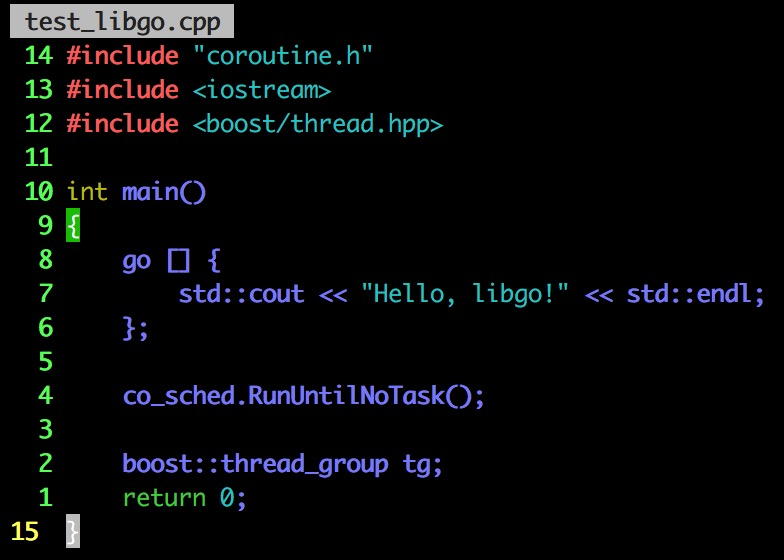

编译test_libgo.cpp

```shell
g++ -std=c++11 -g -Wall test_libgo.cpp -Ilibgo/libgo/ -Ilibgo/libgo/linux -llibgo -llibgo_main -lboost_coroutine -lboost_context -lboost_system -lboost_thread -lpthread -static -static-libgcc -static-libstdc++
```

### 跟踪 ###

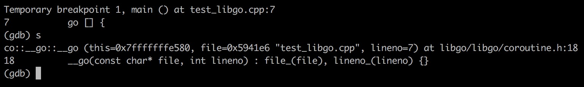

用start命令使得程序停在main函数入口点

#### 小插曲 ####

由于要一边看代码一边调试（docker container不支持多terminal，或者说通过多个terminal连入不能起到分屏的效果），所以需要服务端安装screen软件

```shell
apt-get install screen
screen -S ReadSourceCode
Ctrl + a + d
screen -ls
```

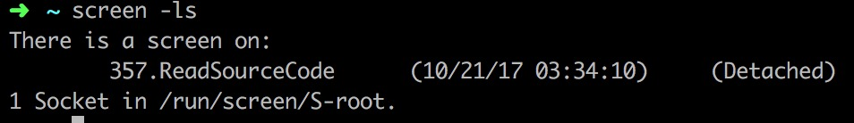

```shell
screen -r 357
```

再创建一个screen：

```shell
screen -S Debug
Ctrl + a + d
screen -ls
```

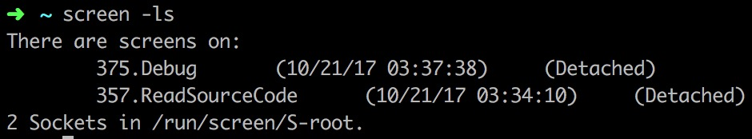

随便进入一个session（比如说screen -r Debug)，在该session中执行screen -r readSourceCode

注意：不要尝试在原界面（即没有运行session的主界面）中恢复两个session

然后在两个session中切换只需要 Ctrl + a + a

（在session中读源代码并不愉快，还是在主界面中读源代码吧）

（在gdb中执行shell clear以达到清屏效果）

#### 第一步 ####


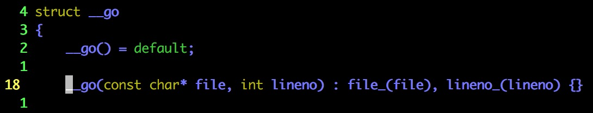

__go结构体以及它的一个构造函数

> In C++11, defaulted and deleted functions give you explicit control over whether the special member functions are automatically generated.
>
> “=default” instructs the compiler to generate the default implementation for the function. Defaulted functions have two advantages: They are more efficient than manual implementations, and they rid the programmer from the chore of defining those functions manually.

不过很有意思的是，我们写的是go + lambda，怎么就变成了file + lineno？

来看看预编译的结果（把模板和宏都展开）：

```shell
g++ -E test_libgo.cpp -Ilibgo/libgo/ -Ilibgo/libgo/linux > test_libgo.E
```

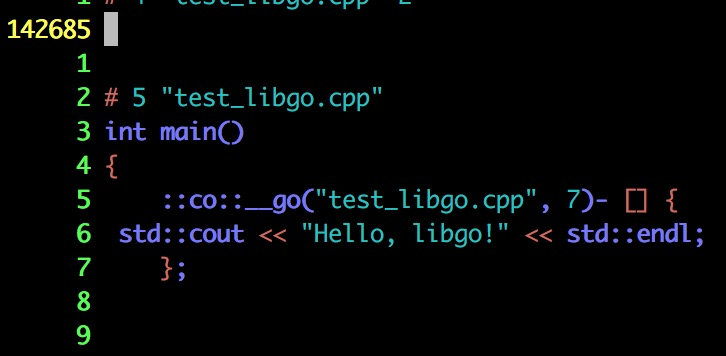

不出所料，预编译的结果就是直接调用__go结构体的构造函数

我们还可以用奇技淫巧来查看宏展开之后的结果：

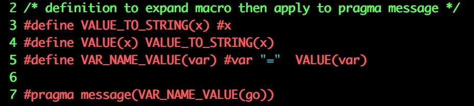


在coroutine.h中我们找到了go的宏定义：

```c++
#define go ::co::__go(__FILE__, __LINE__)-
```

比较奇怪的是那个**-**，属于特殊字符（难不成是操作符重载？）

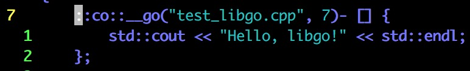

这样是可以正常编译的，如果我们吧**-**去掉会发生什么呢？

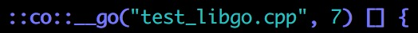

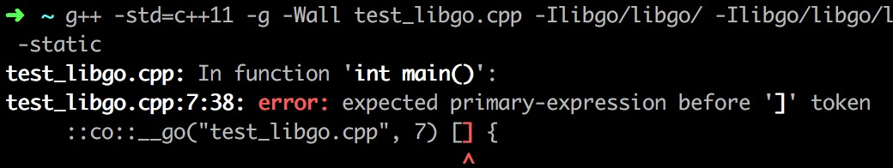

**-**的左边是一个__go类型对象，右边是一个匿名函数结构体对象

有理由相信，**-**是一个操作符（重载过的减号操作符）

那么，我们在__go类型中应该能找到相关的重载函数？

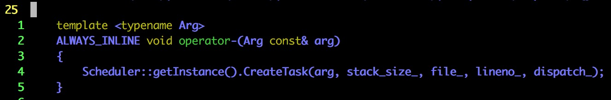

如果没有猜错的话，Scheduler是一个单例类

总体来说，go“操作符”做的事情无非是创建一个任务并且扔到调度器里

#### 第二步 ####

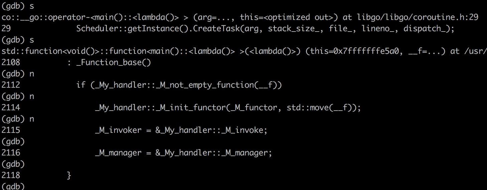


scheduler.h & scheduler.cpp

```c++
static Scheduler& getInstance();
```

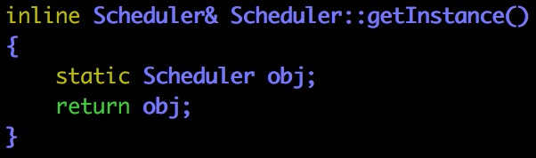

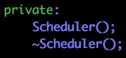

Scheduler果然是单例类

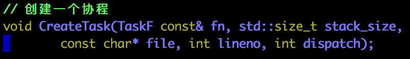

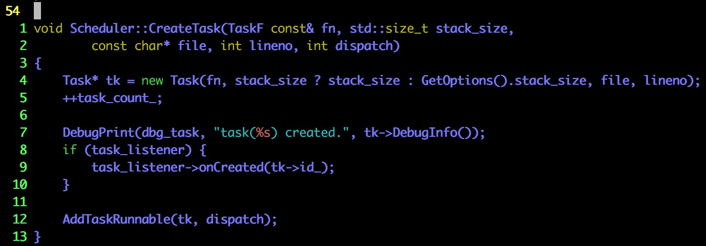

TaskF类型能够匹配lambda函数／函数指针／bind产生的对象／function产生的对象

TaskF类型接收的对象是一个协程即将要做的事情

dispatch指明分派任务的模式（怎么分派任务，是分配到主线程上还是随意分配？）

接下来我们要弄清楚这几件事情：

+ TaskF是模板参数吗？如果不是，它是怎么做到兼容多类型的对象的？
+ Task是如何定义的？作用是什么？（是不是相对于普通函数，多出了状态的概念？）
+ task_listener是执行调度的调度器吗？如果不是，暂时可以略过
+ AddTaskRunnable是如何定义的？作用是什么？（把任务分配到调度器／线程上？）

#### 第三步 ####

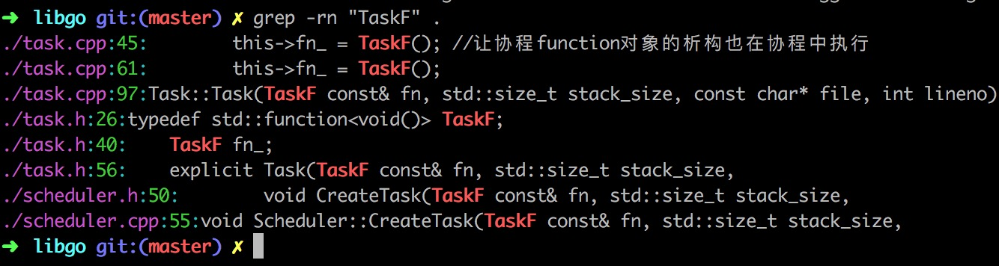

```c++
typedef std::function<void()> TaskF;
```

std::function是C++库为我们提供的万能可调用对象类型，内部也使用了模板技术

#### 第四步 ####

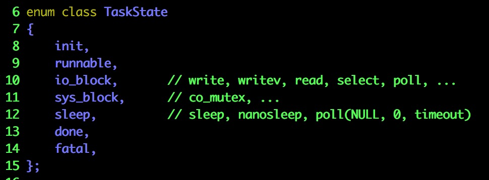

这个协程／任务状态有一点类似于线程的状态（三态模型／五态模型／七态模型）

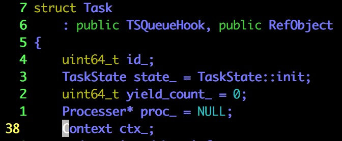

这个Context类型的字段很有意思，应该是用于函数执行过程中状态的保存

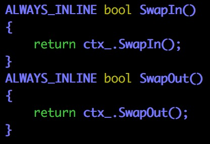

这两个函数应该是用于函数切换时的状态保存和状态恢复（类比于线程状态的保存和恢复）

突然发现：libgo的教程少介绍了一个功能！协程内创建协程 + 协程等待

#### 第五步 ####

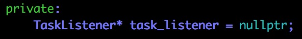

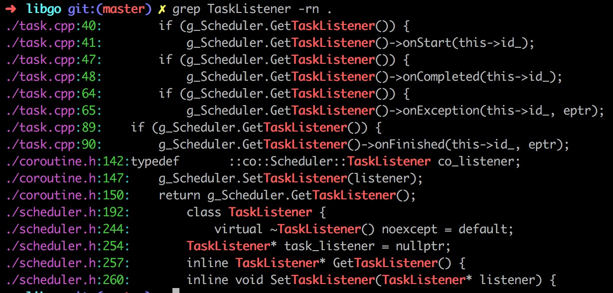

TaskListener是协程事件监听器，负责把协程相关的事件（协程创建／协程开始运行／协程抛出未被捕获的异常／协程运行完成等）报告给用户（用户写回调函数，回调函数不允许抛出异常）

总的来说，不是一个特别重要的组件，暂时先不看

#### 第六步 ####

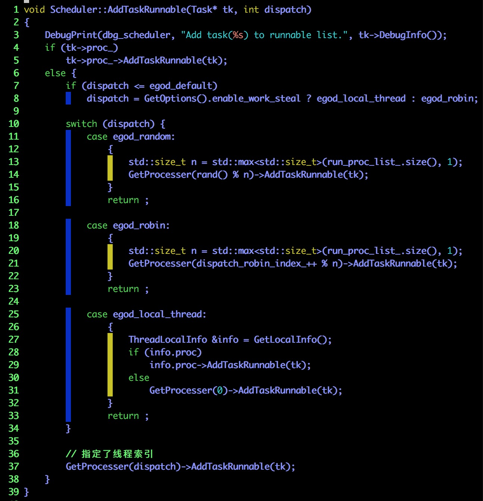

基本上可以猜测出：

+ libgo把线程抽象成Processer，然后为每一个线程准备了任务队列；然后把任务按照一定的策略进行分配
+ 如果任务自带Processer，把任务加到相应的Processer中去
+ 如果是某个小于等于egod_default的值，都按照egod_default去处理（看看是否允许任务偷取），指定三种处理策略之一
+ 三种基本的策略
+ 如果不在以上所有情况，认为用户指定了执行协程的线程的索引
+ tk->proc_的类型和GetProcesser的返回值的类型应该是一致的

接下来我们要：

+ 确认tk->proc_的类型和GetProcesser的返回值类型是否一致？
+ 看看GetProcesser的返回值的类型

#### 第七步 ####

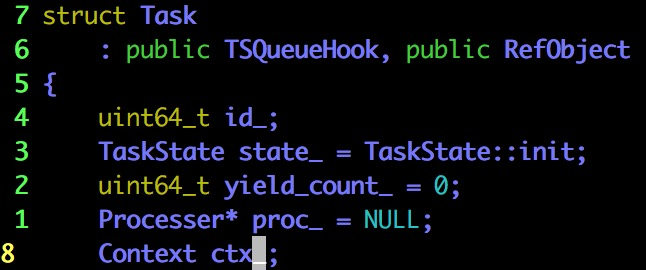

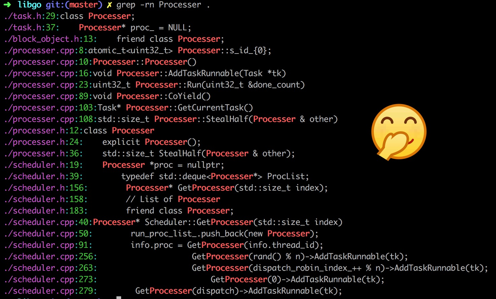

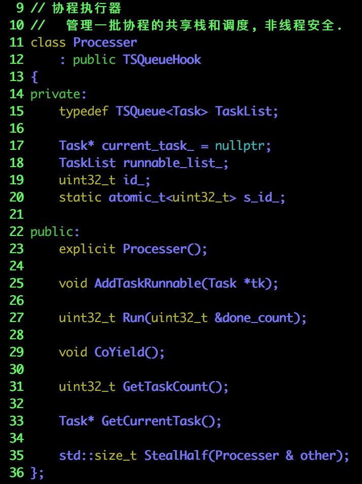

可以看到果然存在可运行的任务的队列：`runnable_list_`

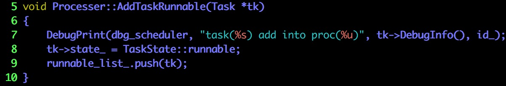

那么，所谓的AddTaskRunnable也就是把一个任务添加到列表里

（Processer更多的内容之后再看，其它内容对于我们现在的分析不是特别重要）

tk->proc_的类型和GetProcesser的返回值类型一致：

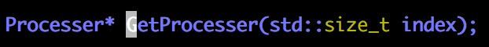

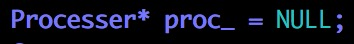

#### 小总结 ####

+ 宏替换 + 减号操作符重载
+ 调用调度器：调度器帮我们把函数转换成Task，Task有自己的状态
+ 调度器把创建的Task对象放到Processer的可执行任务队列中去
+ Processer是对协程执行器（调度器？）的一个抽象，很有可能一个Processer对应于一个线程

我们终于把一个go做了什么给弄清楚了

#### 第八步 ####

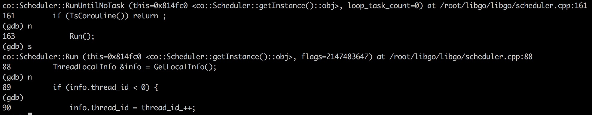

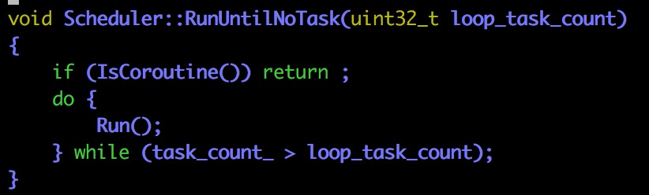

如果在协程中调用这个函数，是没有任何作用的

（协程不能作为执行协程的基本单位）

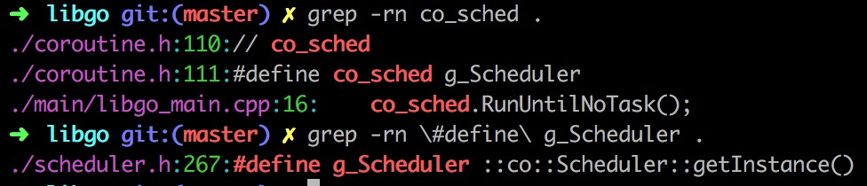

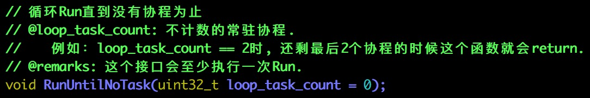

（几张图的顺序稍微有一些错乱，喵喵喵）

所谓RunUntilNoTask真的就和字面意思一样，跑到没有任务为止（没有任务指参与计数的协程没有了）

