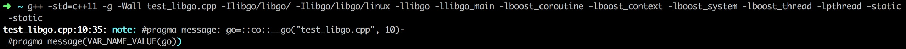

### 准备工作 ###

gdb在调试时需要阻止地址随机化，这项工作需要一定的权限

```shell
docker commit libgo libgo
docker rm -f libgo
docker run -t -i --privileged --name libgo libgo /bin/bash
zsh
```


编译test_libgo.cpp

```shell
g++ -std=c++11 -g -Wall test_libgo.cpp -Ilibgo/libgo/ -Ilibgo/libgo/linux -llibgo -llibgo_main -lboost_coroutine -lboost_context -lboost_system -lboost_thread -lpthread -static -static-libgcc -static-libstdc++
```

### 跟踪 ###


用start命令使得程序停在main函数入口点

#### 小插曲 ####

由于要一边看代码一边调试（docker container不支持多terminal，或者说通过多个terminal连入不能起到分屏的效果），所以需要服务端安装screen软件

```shell
apt-get install screen
screen -S ReadSourceCode
Ctrl + a + d
screen -ls
```


```shell
screen -r 357
```

再创建一个screen：

```shell
screen -S Debug
Ctrl + a + d
screen -ls
```


随便进入一个session（比如说screen -r Debug)，在该session中执行screen -r readSourceCode

注意：不要尝试在原界面（即没有运行session的主界面）中恢复两个session

然后在两个session中切换只需要 Ctrl + a + a

（在session中读源代码并不愉快，还是在主界面中读源代码吧）

（在gdb中执行shell clear以达到清屏效果）

#### 第一步 ####


__go结构体以及它的一个构造函数

> In C++11, defaulted and deleted functions give you explicit control over whether the special member functions are automatically generated.
>
> “=default” instructs the compiler to generate the default implementation for the function. Defaulted functions have two advantages: They are more efficient than manual implementations, and they rid the programmer from the chore of defining those functions manually.

不过很有意思的是，我们写的是go + lambda，怎么就变成了file + lineno？

来看看预编译的结果（把模板和宏都展开）：

```shell
g++ -E test_libgo.cpp -Ilibgo/libgo/ -Ilibgo/libgo/linux > test_libgo.E
```


不出所料，预编译的结果就是直接调用__go结构体的构造函数

我们还可以用奇技淫巧来查看宏展开之后的结果：




在coroutine.h中我们找到了go的宏定义：

```c++
#define go ::co::__go(__FILE__, __LINE__)-
```

比较奇怪的是那个**-**，属于特殊字符（难不成是操作符重载？）


这样是可以正常编译的，如果我们吧**-**去掉会发生什么呢？


**-**的左边是一个__go类型对象，右边是一个匿名函数结构体对象

有理由相信，**-**是一个操作符（重载过的减号操作符）

那么，我们在__go类型中应该能找到相关的重载函数？


如果没有猜错的话，Scheduler是一个单例类

总体来说，go“操作符”做的事情无非是创建一个任务并且扔到调度器里

#### 第二步 ####


scheduler.h & scheduler.cpp

```c++
static Scheduler& getInstance();
```


Scheduler果然是单例类


TaskF类型能够匹配lambda函数／函数指针／bind产生的对象／function产生的对象

TaskF类型接收的对象是一个协程即将要做的事情

dispatch指明分派任务的模式（怎么分派任务，是分配到主线程上还是随意分配？）

接下来我们要弄清楚这几件事情：

+ TaskF是模板参数吗？如果不是，它是怎么做到兼容多类型的对象的？
+ Task是如何定义的？作用是什么？（是不是相对于普通函数，多出了状态的概念？）
+ task_listener是执行调度的调度器吗？如果不是，暂时可以略过
+ AddTaskRunnable是如何定义的？作用是什么？（把任务分配到调度器／线程上？）

#### 第三步 ####


```c++
typedef std::function<void()> TaskF;
```

std::function是C++库为我们提供的万能可调用对象类型，内部也使用了模板技术

#### 第四步 ####


这个协程／任务状态有一点类似于线程的状态（三态模型／五态模型／七态模型）


这个Context类型的字段很有意思，应该是用于函数执行过程中状态的保存


这两个函数应该是用于函数切换时的状态保存和状态恢复（类比于线程状态的保存和恢复）

突然发现：libgo的教程少介绍了一个功能！协程内创建协程 + 协程等待

#### 第五步 ####


TaskListener是协程事件监听器，负责把协程相关的事件（协程创建／协程开始运行／协程抛出未被捕获的异常／协程运行完成等）报告给用户（用户写回调函数，回调函数不允许抛出异常）

总的来说，不是一个特别重要的组件，暂时先不看

#### 第六步 ####


基本上可以猜测出：

+ libgo把线程抽象成Processer，然后为每一个线程准备了任务队列；然后把任务按照一定的策略进行分配
+ 如果任务自带Processer，把任务加到相应的Processer中去
+ 如果是某个小于等于egod_default的值，都按照egod_default去处理（看看是否允许任务偷取），指定三种处理策略之一
+ 三种基本的策略
+ 如果不在以上所有情况，认为用户指定了执行协程的线程的索引
+ tk->proc_的类型和GetProcesser的返回值的类型应该是一致的

接下来我们要：

+ 确认tk->proc_的类型和GetProcesser的返回值类型是否一致？
+ 看看GetProcesser的返回值的类型

#### 第七步 ####


可以看到果然存在可运行的任务的队列：`runnable_list_`


那么，所谓的AddTaskRunnable也就是把一个任务添加到列表里

（Processer更多的内容之后再看，其它内容对于我们现在的分析不是特别重要）

tk->proc_的类型和GetProcesser的返回值类型一致：


#### 小总结 ####

+ 宏替换 + 减号操作符重载
+ 调用调度器：调度器帮我们把函数转换成Task，Task有自己的状态
+ 调度器把创建的Task对象放到Processer的可执行任务队列中去
+ Processer是对协程执行器（调度器？）的一个抽象，很有可能一个Processer对应于一个线程

我们终于把一个go做了什么给弄清楚了

#### 第八步 ####


如果在协程中调用这个函数，是没有任何作用的

（协程不能作为执行协程的基本单位）


（几张图的顺序稍微有一些错乱，喵喵喵）

所谓RunUntilNoTask真的就和字面意思一样，跑到没有任务为止（没有任务指参与计数的协程没有了）

那么Run函数在做什么呢？


至此为止，代码做了以下几件事：

+ 如果通过GetLocalInfo得到的info存在无效字段，则填充之
+ thread_id_很可能是一个全局的计数器
+ GetProcesser(info.thread_id)得到的是一个Processer（对协程执行器的一个抽象）
+ 调用DoRunnable函数


可以看到，具体任务的执行是在DoRunnable函数中完成

我们可以猜测，DoRunnable函数把可执行列表里的函数都跑一遍，直到所有的函数都碰到“系统调用”／co_yield主动让渡执行权／结束


两个导致协程挂起的事件的处理，都交给了专门的函数去做

epoll & idle都需要单独开一小节去探索

接下来，我们需要做：

+ 阅读DoRunnable函数，看看我们猜的准不准？
+ 阅读DoTimer函数和DoSleep函数，重点看看它们是怎么hook以做到异步的
+ 了解什么是epoll，阅读DoEpoll函数
+ 分析协程的执行体如何让渡CPU避免空转（需要让渡CPU的情况包括：当前所有的协程都在沉睡／当前所有协程都已执行完毕等）

#### 第九步 ####


几乎可以肯定，done_count是以引用的形式传递进去的（实际上承担了返回值的功能）

不使用pair／tuple是因为该函数是有可能抛出异常的，返回值不一定能及时传递出来

不过，如何执行一个函数（怎么为函数切换状态）这个最关键的事情在这里还是看不到，还得深入到Processer的成员函数Run里去看


整段代码还是比较容易读懂的，不过注意以下几点：

+ run_proc_list_应该是Processer的列表
+ 窃取协程的关键代码应该在StealHalf函数中
+ 该函数返回的条件是，至少一次窃取协程没有成功（为什么不使用更加合理的负载均衡算法而采用随机性这么大的算法？）

#### 第十步 ####


说明几点：

+ GetOptions.timer_handle_every_cycle应该是每一次循环最多可以执行的定时器的数量（如果为0表达没有次数限制）
+ timer_mgr_是全局的定时器管理器，所有的定时器都交给它管理
+ timer_mgr_.GetExpired(timers, 128)应该是取出到期128毫秒以内的定时器，timers不出意外的话应该是按引用传递
+ CoTimerPtr重载过()操作符，使得它本身成为一个函数对象


这个信息少得可怜，很难得出有价值的结论（有一点为难我了）

（有可能这种会导致整个线程沉睡的操作都特殊处理过，在这里只是调用其接口）

#### 第十一步 ####

> 一个流可以是文件，socket，pipe等等可以进行I/O操作的内核对象；通过read，我们可以从流中读入数据；通过write，我们可以往流写入数据
>
> 现在假定一个情形，我们需要从流中读数据，但是流中还没有数据，（典型的例子为，客户端要从socket读如数据，但是服务器还没有把数据传回来），这时候该怎么办？
>
> 阻塞／忙轮询（也就是所谓的空转）
>
> 为了了解阻塞是如何进行的，我们来讨论缓冲区以及内核缓冲区
>
> 缓冲区的引入是为了减少频繁I/O操作而引起频繁的系统调用（你知道它很慢的），当你操作一个流时，更多的是以缓冲区为单位进行操作，这是相对于用户空间而言；对于内核来说，也需要缓冲区
>
> 缓冲区满，缓冲区空，缓冲区非空，缓冲区非满
>
> 阻塞I/O模式下，一个线程只能处理一个流的I/O事件
>
> 为了避免CPU空转，引进一个代理（一开始有一位叫做select的代理，后来又有一位叫做poll的代理，不过两者的本质是一样的），这个代理可以同时观察许多流的I/O事件，在空闲的时候会把当前线程阻塞掉，当有至少一个流可用时，就从阻塞态中醒过来

```c++
while true {
  	// 有可能阻塞
	select(streams[])
      
    // 有数据醒过来
	for i in streams[] {
		if i has data
			read until unavailable
	}
}
```

> select虽然很厉害，但还是不能避免对所有流的遍历
>
> 如果有一个更厉害的代理，可以告诉我们哪些流可用才把我们唤醒，那就很好了

```c++
while true {
	active_stream[] = epoll_wait(epollfd)
	for i in active_stream[] {
		read or write till unavailable
	}
}
```

> 这个很厉害的代理，就是epoll

[蓝形参回答epoll或者kqueue的原理是什么？](https://www.zhihu.com/question/20122137)


+ 但凡有可以执行的协程，我们就不等（应该是这个意思吧？我也是猜的）
+ 否则等待一定时间，看看有没有流可以操作
+ 和沉睡（sleep等）的处理一样，IO事件应该也是有一个全局的管控器，这里只是调用其接口
+ 如何把同步阻塞变成异步不阻塞，也是值得看的一点（换句话说，这些全局的管控器也是libgo的核心之一）

#### 第十二步 ####


逻辑主体还是比较好理解的（特别是有注释的情况下），不过几个选项比较费解

在有一点远的未来，还是要弄懂run_task_count／ep_count／tm_count／sl_count／next_ms等几个变量的含义的，不过现在不需要（不影响我们理解大部分代码）

#### 第十三步 ####

在第九步，我们提到：

> 不过，如何执行一个函数（怎么为函数切换状态）这个最关键的事情在这里还是看不到，还得深入到Processer的成员函数Run里去看


这是其中一段比较关键的代码，看样子，SwapIn()函数不仅仅负责切换函数执行的环境，还负责让函数执行下去

所以，在这个层次上还是看不到我们想看的比较关键的东西：环境／状态是如何切换的


这是另外的一段代码，果然是存在IO／sleep／定时器的集中调度器之类的东西的

（验证了我们之前的想法）

#### 小总结 ####

+ 知道Run的大致流程，对test_libgo.cpp这个很简单的小程序如何运行起来心中有数
+ 后面需要看：
  + 阻塞操作怎么被集中管理
  + 函数状态的切换／保存机制
+ libgo是否支持协程内创建协程／协程互相等待（如果没有，练手的机会就来了）
