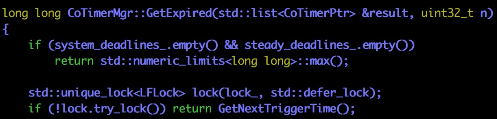

# 第一步：写一个例子 #


在之前的文章中，我们已经知道libgo会hook这个系统调用


最关键的一句话是：`g_Scheduler.SleepSwitch(timeout_ms)`


接下来那就是分别去看这个函数的实现咯：

+ CoYield()
+ CoSwitch

# 第二步：CoSwitch #


CoSwitch函数出乎意料地简单，只是把任务／协程的一些状态更改一下，然后调用CoYield()

我们当然关心沉睡的协程什么时候醒来啦！

# 第三步：协程如何被唤醒 #

scheduler.cpp


sleep_wait.cpp


取出超时的任务／协程，调用它们注册的回调函数？

话说`(*sp_timer)()`是什么东西，好像之前没有见到过？

关键在于理解`timer_mgr`以及`GetExpired`返回的类型

## timer_mgr ##


## GetExpired ##



如果已过期队列没有任何任务／协程，则返回一个最大数

上锁不成功也可以直接返回


`system_deadlines_`／`steady_deadlines_`应该是两颗红黑树，所以在用迭代器遍历它们的时候，是有大小顺序的（这一点非常重要）

所以，如果某一个遍历到的节点的时间超过了当前时间，以后的每一个节点也会超过当前的时间（直接break）

参数`n`：最多取出的任务／协程数


非常非常类似的代码

`SystemTime`与`SteadyTime`的区别：

+ If you're holding a `system_clock` in your hand, you would call it a *watch*, and it would tell you what time it is.
+ If you're holding a `steady_clock` in your hand, you would call it a *stopwatch*, and it would tell you how fast someone ran a lap, but it would not tell you what time it is.

其实两者选一个就好了，不是很懂为什么libgo同时选择两者

## std::list\<CoTimerPtr\> & CoTimerPtr & CoTimer ##


重点看一下重载的operator()函数


上一个锁，调用一下构造时传入的函数

到这里，我们知道这么几件事：

+ 调用被hook过的sleep函数相当于调用SleepWait::CoSwitch成员函数


+ Scheduler::DoSleep最终会调用某个传给CoTimer构造器作为初始化参数的函数
+ 但是CoSwitch成员函数并没有创建一个CoTimer并给它一个函数，这是怎么肥事？？？
+ 那么就是g_Scheduler.CoYield()在搞事咯？

# 第四步：g_Scheduler.CoYield() #


又是Processer在搞事？！


最关键的一句话是：`tk->SwapOut()`


跟到ctx_boost_context/context_v2.h里：


`yield_`变量代表外界的执行环境（好像就是主协程／调度协程的执行环境？）

那这就非常奇怪了，本来就在主协程环境里，再调用`(*yield_)()`干嘛呢？

# 第五步：动态跟踪 #


```shell
gdb a.out
b libgo/libgo/timer.cpp:11
start
c
shell clear
print fn
```


从结果来看，肯定是有人调用CoTimer的构造函数并且也确实给它传递了一个回调函数

但是我们找不到谁在哪里构造了这个CoTimer（场面一度十分尴尬）


看来在之前的静态分析中，我们错过了一些什么

再继续跟下去，我们会看到：


原来是在`Run`函数里会进一步对标记为沉睡的线程做处理

## SleepWait::SchedulerSwitch ##


把对应的任务／协程放到等待队列中

接下来我们需要看一看ExpireAt函数

## ExpireAt ##


创建我们心心念念的CoTimer，然后把它放到容器里（没什么很特别的值得讲的）

我们比较关心那个fn，也就是`this->Wakeup`

## SleepWait::Wakeup ##


+ 从等待任务列表里删除对应的任务
+ 把该任务加到可运行任务列表中去

终于真相大白！！！举杯欢庆！


总结一下：

+ 某个协程得到了执行机会，在跑啊跑，突然调用了sleep(1)
+ 然而这个sleep函数被hook过，所以sleep修改一下发起系统调用的协程的状态，再调用Scheduler::CoYield，把控制权交还给调度协程
+ 调度协程Run啊Run，突然看到一个协程的状态是sleep
+ 于是，它好心地为这个处于sleep状态的协程创建一个CoTimer（传入一个到期时间和一个回调函数），并且把相应的CoTimer塞到容器（非常可能是红黑树作为低层实现）里
+ 调度协程继续Run啊Run，在某个阶段（处理完可执行任务／协程之后）会调用DoSleep函数
+ DoSleep函数会到时间管理器那里取出最多128个（或者是其它个数）到期定时器，对应每个取出的定时器，都会调用一个回调函数
+ 回调函数会把任务从等待队列中删除掉，并加入到可执行协程／任务队列中
+ Bingo！协程／任务在到期后又得到了运行的机会


还可以回答在第四步最后提出的那个问题：那这就非常奇怪了，本来就在主协程环境里，再调用(*yield_)()干嘛呢？

答：本来不在主协程环境里，本来在发起sleep系统调用的协程里，再调用(*yield_)()可以回到调度协程


我们对于一些细节的掌控还是不够的：

+ `(*yield\_)()`确实切换了`execution_context`，把控制流交还给调度协程，但控制流转移到具体的那一句代码呢？（这个事情还是很模糊）
+ 定时器相关的一些问题
  + 怎么把时间间隔转换成一个时间点（调用CoTimer的构造器时）？
  + 两种计时器最后怎么选择？如果两个都选，会不会冲突？


时间间隔转换成时间点（代码具体位置）