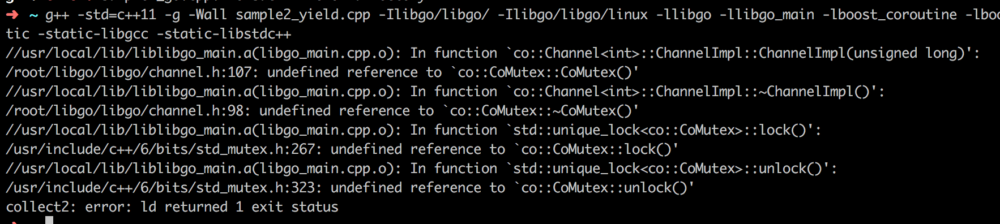

### sample1_go.cpp ###

#### 编译 ####

```shell
cp libgo/tutorial/sample1_go.cpp .
```

```c++
/************************************************
 * libgo sample1
*************************************************/
#include "coroutine.h"
#include "win_exit.h"
#include <stdio.h>
#include <boost/thread.hpp>

void foo()
{
    printf("function pointer\n");
}

struct A {
    void fA() { printf("std::bind\n"); }
    void fB() { printf("std::function\n"); }
};

int main()
{
    // 使用关键字go创建协程, go后面可以使用:
    //     1.void(*)()函数指针, 比如:foo.
    //     2.也可以使用无参数的lambda, std::bind对象, function对象, 
    //     3.以及一切可以无参调用的仿函数对象
    //   注意不要忘记句尾的分号";".
    go foo;

    go []{
        printf("lambda\n");
    };

    go std::bind(&A::fA, A());

    std::function<void()> fn(std::bind(&A::fB, A()));
    go fn;

    // 也可以使用go_stack创建指定栈大小的协程
    //   创建拥有10MB大栈的协程
    go_stack(10 * 1024 * 1024) []{
        printf("large stack\n");
    };

    // 协程创建以后不会立即执行，而是暂存至可执行列表中，等待调度器调度。
    // co_sched是全局唯一的协程调度器，有以下接口可以调度协程：
    //   1.Run 执行单次调度, 返回本次执行的协程数量
    //   2.RunLoop 无限循环执行Run, 不会返回
    //   3.RunUntilNoTask 循环执行Run, 直至协程数量为零.
    //
    // 当仅使用一个线程进行协程调度时, 协程地执行会严格地遵循其创建顺序.
    co_sched.RunUntilNoTask();

    // 多线程模式下, libgo还支持指定协程初始运行于哪个线程
    // 使用go_dispatch关键字来创建协程, 可以分派协程执行的线程.
    // 支持多种分派模式
    // 1.指定线程索引分派 (线程索引从0起, 按照调用Run的顺序决定线程索引)
    go_dispatch(2) []{
        printf("dispatch to thread[2] run\n");
    };
    // 2.随机 (调用过Run的线程才会参与随机指派)
    go_dispatch(egod_random) []{
        printf("random run\n");
    };
    // 3.robin算法 (调用过Run的线程, 或强制执行线程索引分派过协程的线程, 才会参与随机指派)
    go_dispatch(egod_robin) []{
        printf("robin run\n");
    };
    // 4.尽量置于当前线程 (只有当当前线程已经调用过Run后才生效)
    go_dispatch(egod_local_thread) []{
        printf("local thread run\n");
    };

    // 启动额外两个线程和主线程一起调度
    boost::thread_group tg;
    for (int i = 0; i < 2; ++i)
        tg.create_thread([]{ co_sched.RunUntilNoTask(); });
    co_sched.RunUntilNoTask();
    tg.join_all();

    // 默认配置下, 多线程调度时会采用worksteal算法做负载均衡, dispatch指定的协程也可能被其他
    // 线程偷走, 如果不希望被偷走, 可以关闭worksteal算法.
    co_sched.GetOptions().enable_work_steal = false;    // 关闭worksteal负载均衡算法

    return 0;
}
```

```shell
g++ -std=c++11 -g -Wall sample1_go.cpp -Ilibgo/libgo/ -Ilibgo/libgo/linux -llibgo -llibgo_main -lboost_coroutine -lboost_context -lboost_system -lboost_thread -lpthread -static -static-libgcc -static-libstdc++
```

#### 运行结果 ####


#### 代码解读 ####

+ 需要调度的函数可以以函数指针／函数对象／函数对象的变种（匿名表达式／bind表达式／function表达式）
+ 指示需要参与调度的函数可以用`go`／`go_stack`／`go_dispatch`
+ 启动两个线程与主线程一起调度的代码比较难懂，涉及到boost thread

```C++
tg.create_thread([]{ co_sched.RunUntilNoTask(); });
```

这行代码看上去只不过是开启一个线程，然后让调度器在该线程中运行

调度器也许使用了类似于全局变量 + 锁 + 队列的方式来控制并发问题

```c++
tg.join_all();
```

这行代码的功能是让主线程等待两个线程，否则可能出现还有线程在运行而整个进程退出的情况

sample1_go.cpp展现的东西十分有限，没有告诉我们怎么显式让渡出线程的执行权（yield）

### sample2_yield.cpp ###

#### 编译 ####

```shell
cp libgo/tutorial/sample2_yield.cpp .
// 修改sample2_yield.cpp
// 原版文件不能正常运行
g++ -std=c++11 -g -Wall sample2_yield.cpp -Ilibgo/libgo/ -Ilibgo/libgo/linux -llibgo -llibgo_main -lboost_coroutine -lboost_context -lboost_system -lboost_thread -lpthread -static -static-libgcc -static-libstdc++
```

#### 运行结果 ####


#### 代码解读 ####

```c++
#include  <iostream>
#include "coroutine.h"
#include "win_exit.h"
#include <boost/thread.hpp>

int main()
{
    go [] {
	std::cout << "1" << std::endl;
	co_yield;
	std::cout << "2" << std::endl;
    };

    go [] {
	std::cout << "3" << std::endl;
	co_yield;
	std::cout << "4" << std::endl;
    };

    boost::thread_group tg;
    co_sched.RunUntilNoTask();
    tg.join_all();
}
```

+ `co_yield`相当于`python`中的`yield`，具有让渡执行权的功能
+ `co_yield`还应当具有以下功能：
  + 返回一个值
  + 从外界获取一个值

#### TODO ####

原版的sample2_yield.cpp以`co_main`作为主函数，省去调度器的配置工作

不能够通过编译（链接时发现缺少函数）

进入libgo/tutorial文件夹，执行以下命令：

```shell
mkdir build && cd build
cmake ..
make sample2_yield.t
./sample2_yield.t
```

能够产生和前面一模一样的结果，证明原版文件本身是没有问题的，只不过编译选项不对

不过，如果我们用docker cp命令把可执行文件拷贝出来，其在主机是不能执行的（说明采用动态链接）

于是，在libgo容器的~文件夹内执行以下命令：

```shell
cp libgo/tutorial/sample2_yield.cpp .
g++ -std=c++11 -g -Wall sample2_yield.cpp -Ilibgo/libgo/ -Ilibgo/libgo/linux -llibgo -llibgo_main -lboost_coroutine -lboost_context -lboost_system -lboost_thread -lpthread
LD_LIBRARY_PATH=/usr/local/lib
export LD_LIBRARY_PATH
./a.out
```

可以看到正常输出的结果

问题是：为什么一旦使用静态链接就会出现问题？



很有可能这些依赖项之间存在环（互相依赖），所以我们把依赖项重复一遍（简单粗暴）：

```shell
g++ -std=c++11 -g -Wall sample2_yield.cpp -Ilibgo/libgo/ -Ilibgo/libgo/linux -llibgo -llibgo_main -lboost_coroutine -lboost_context -lboost_system -lboost_thread -lpthread -llibgo -llibgo_main -lboost_coroutine -lboost_context -lboost_system -lboost_thread -lpthread -static -static-libgcc -static-libstdc++
```

好了，编译不存在问题了（果然是依赖项顺序不对或者依赖项存在环形依赖）

你以为这就结束了吗？（太天真了！！！哈哈哈～）

运行时又出现了问题：


我们使用libgo的可调试版本来判断问题出现在什么地方（编译sample2_yield.cpp时记得加上-ggdb选项）

```shell
warning: Error disabling address space randomization: Operation not permitted
terminate called after throwing an instance of 'std::system_error'
  what():  Unknown error -1
During startup program terminated with signal SIGABRT, Aborted.
```

gdb都没办法停在main函数的入口点（所以怎么调试）

向维护团队提问：


