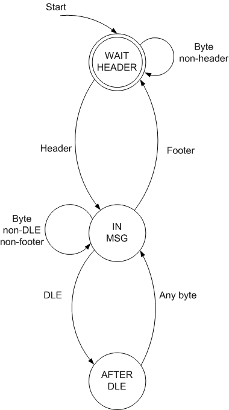

# 协程是什么？ #

协程是什么？不同的程序员从不同的角度切入，会有完全不一样的答案

在尝试使用协程或者实现协程之前，先从不同的角度理解一下协程

## 协程是轻量级的线程 ##

线程的调度是需要陷入内核的，需要用户态和内核态的频繁切换，消耗较多资源

协程采用主动让出CPU的方式（可能由库或者语言本身实现一个调度器）来调度，避免用户态和内核态的切换，相较于线程消耗的时间和资源更少

1. 省去CPU线程切换的开销
2. 降低内存消耗
3. 提升CPU缓存命中率（避免线程切换带来的内存冷不命中，不过还好，毕竟不是进程切换）
4. 提升系统的负载能力

## 协程是对异步的封装 ##

单线程如何做到不阻塞？

比较流行的解决方案是回调函数（JavaScript／Swift都采用该形式）

回调把逻辑上联通的代码切断并放到不同的地方

协程只不过是一颗语法糖，让我们把逻辑上联通的代码写到一起，然后用一个关键字表达“回调”的需求

## 协程是状态机的另一种表现形式 ##

Co-routines as an alternative to state machines

Co-routines are to state machines what recursion is to stacks

递归允许我们隐式地利用栈结构（比如深度优先遍历二叉树，递归使得我们不需要维护一个栈去记住我们当前的位置）；协程允许我们隐式地利用状态机，而不需要专门设置类的成员或者全局变量去记住当前状态

### Co-routines as an alternative to state machines ###

When you have to traverse some sort of a nested data structure (say, a binary tree), one approach is to create a stack that remembers where in the tree you are. Another, much more elegant approach, is to write the function recursively. A recursive function employs the machine stack used to implicitly implement function calls - you get the benefits of the stack without paying the cost of reduced readability.

> 当你遍历嵌套的数据结构（比如二叉树）的时候，一种方法是用堆栈记录当前位置
>
> 另一种更加优雅的方式是递归处理，递归借用机器栈去隐式实现记录堆栈
>
> 这样做的好处是：不但享受到栈的好处，还不需要在代码可读性上为之付出代价

In this article I'll try to show, using a simple, yet very realistic example why co-routines do the same to state machines.



> 如上图所示，这是一个状态机

```python
class ProtocolWrapper(object):
    def __init__(self,
            header='\x61',
            footer='\x62',
            dle='\xAB',
            after_dle_func=lambda x: x):
        self.header = header
        self.footer = footer
        self.dle = dle
        self.after_dle_func = after_dle_func

        self.state = self.WAIT_HEADER
        self.frame = ''

    # internal state
    (WAIT_HEADER, IN_MSG, AFTER_DLE) = range(3)

    def input(self, byte):
        """ Receive a byte.
            If this byte completes a frame, the
            frame is returned. Otherwise, None
            is returned.
        """
        if self.state == self.WAIT_HEADER:
            if byte == self.header:
                self.state = self.IN_MSG
                self.frame = ''

            return None
        elif self.state == self.IN_MSG:
            if byte == self.footer:
                self.state = self.WAIT_HEADER
                return self.frame
            elif byte == self.dle:
                self.state = self.AFTER_DLE
            else:
                self.frame += byte
            return None
        elif self.state == self.AFTER_DLE:
            self.frame += self.after_dle_func(byte)
            self.state = self.IN_MSG
            return None
        else:
            raise AssertionError()
```

在上面那段`python`代码里，我们用self.state去保存当前的状态

```python
@coroutine
def unwrap_protocol(header='\x61',
                    footer='\x62',
                    dle='\xAB',
                    after_dle_func=lambda x: x,
                    target=None):
    """ Simplified framing (protocol unwrapping)
        co-routine.
    """
    # Outer loop looking for a frame header
    #
    while True:
        byte = (yield)
        frame = ''

        if byte == header:
            # Capture the full frame
            #
            while True:
                byte = (yield)
                if byte == footer:
                    target.send(frame)
                    break
                elif byte == dle:
                    byte = (yield)
                    frame += after_dle_func(byte)
                else:
                    frame += byte
```

如果使用协程，代码变得简单易读（没有使用协程的代码，如果没有与之对应的状态转换图你能够读懂吗？）

We loop over frames. A frame starts with a header byte. After a header byte has been received, we accumulate the bytes of the frame until a footer is encountered. The (yield) calls is where the magic is. The function suspends at these points until it is called again. Then, the value passed in the new call is returned from (yield) and the co-routine proceeds from the same place.

Note how the state machine is implicitly embedded in this code. It's there, but you don't see it - it's hiding in the control structures (the IFs, ELSEs and the WHILEs) of the function.

> 状态机被我们隐藏到代码的控制结构里

Similarly, co-routines help solve problems involving state, without using explicit state machines. The resulting code is not centered on the states, but rather on the logic of the tasks, which makes it much simpler to understand.

[文章来源](http://eli.thegreenplace.net/2009/08/29/co-routines-as-an-alternative-to-state-machines/)

## 协程是一个允许多入多出的子例程 ##

Coroutines are generalizations of the normal "subroutines". The main difference is that each invocation of a subroutine has the same starting point and the same end point all the time, while a coroutine has multiple entry points and multiple pathways. The rigurous definitions are not easy to understand, so, to put it simple, a coroutine is a function that works as a state machine, and for each state the coroutine behaves differently. You can see the coroutine as a collection of multiple routines that share the same code, and are linked by a state machine.

> 这种理解本质上和状态机的理解是一致的
>
> 不过它是函数版本的，它认为，有状态的不限于单一入口点和出口点的函数就是协程
